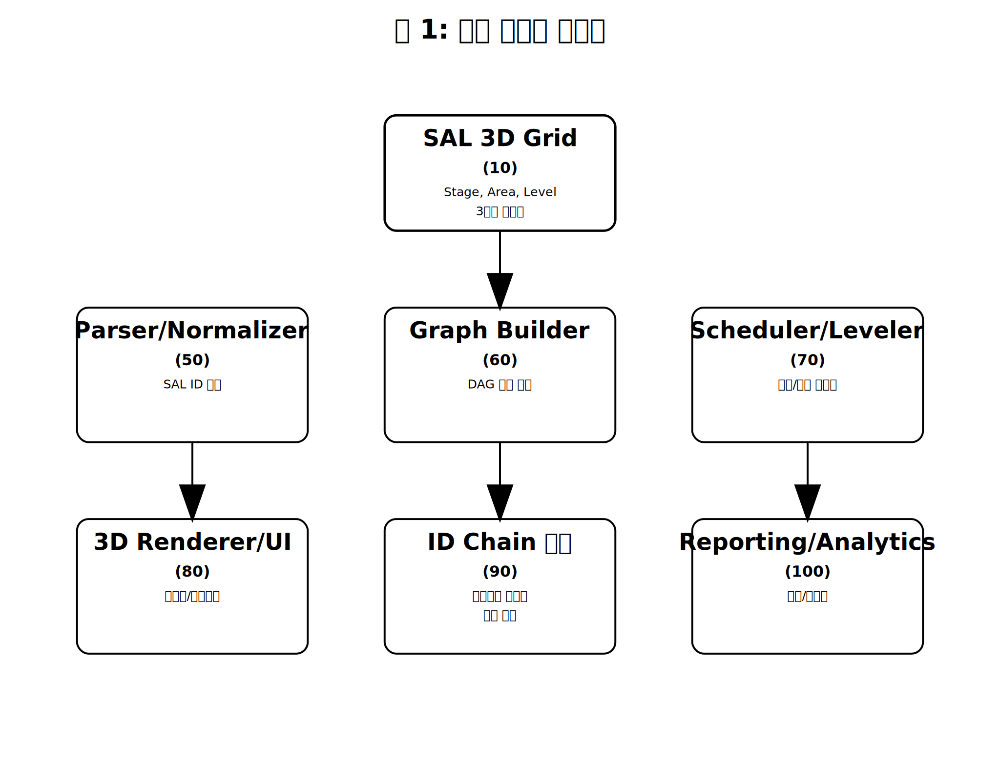
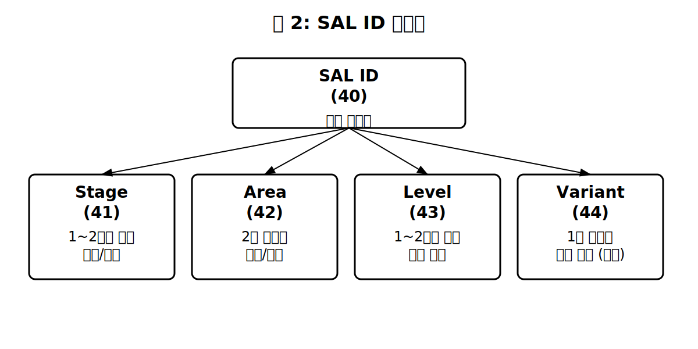
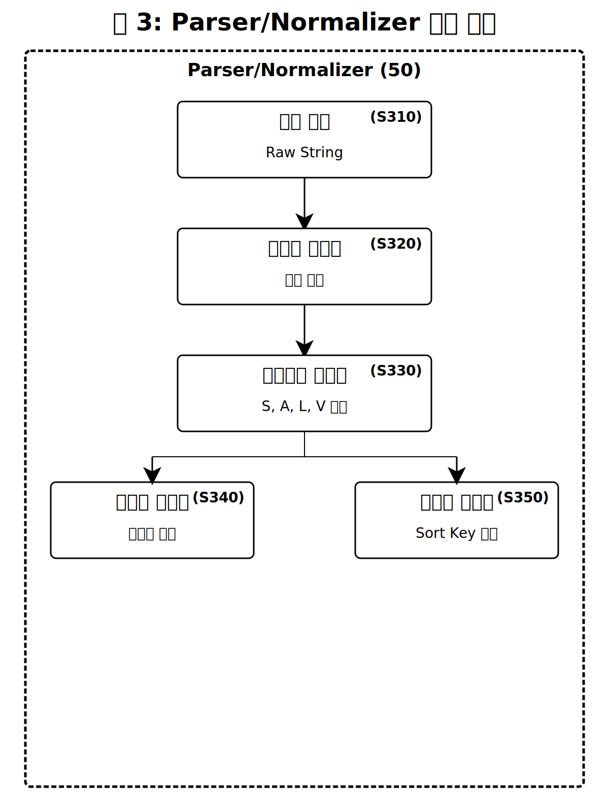
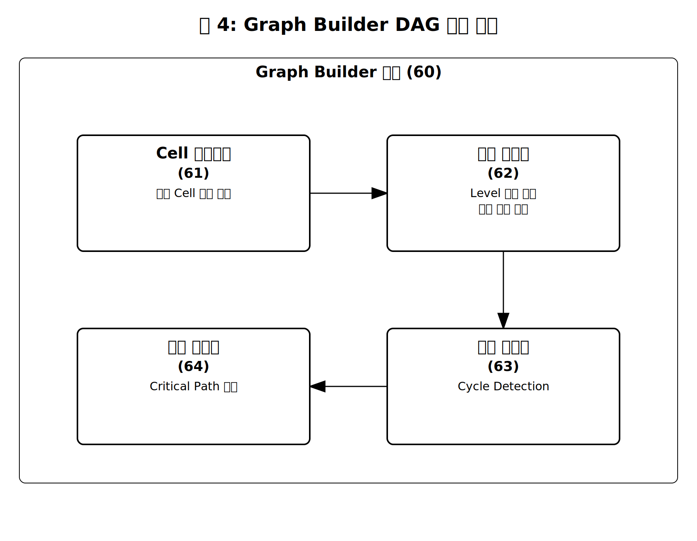
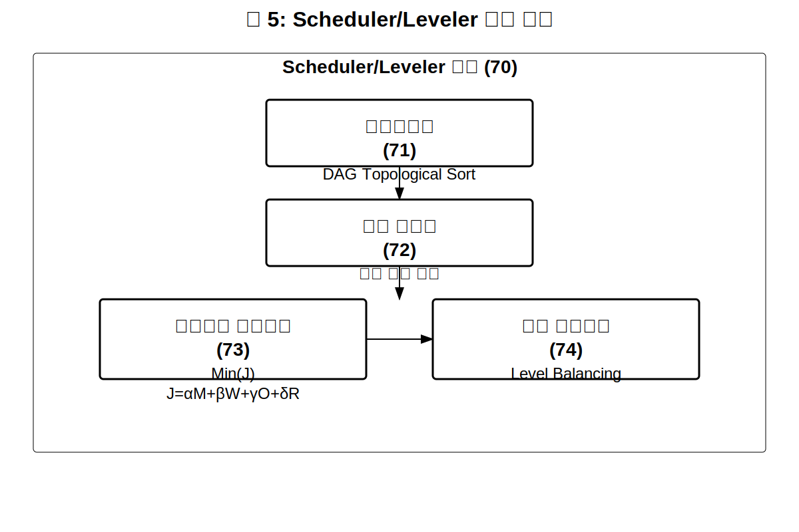
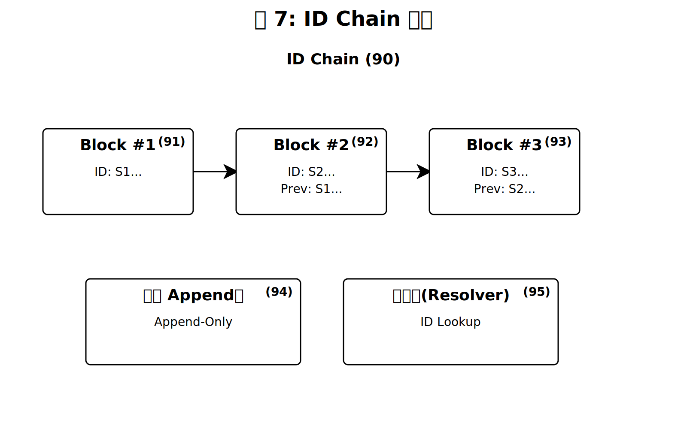
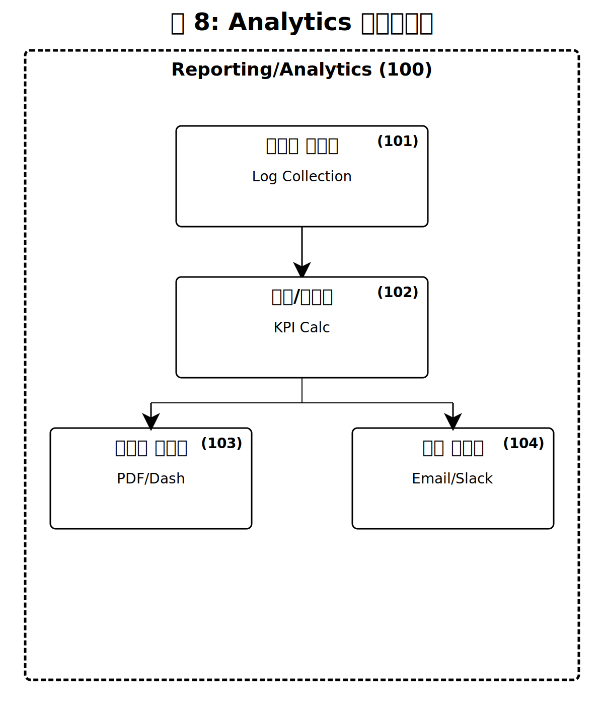
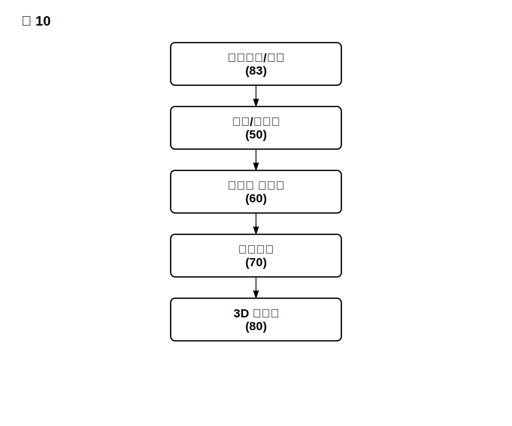

【서류명】 특허출원서
【출원구분】 특허출원
【출원인】
   【성명(명칭)】 [출원인 성명 입력]
   【주소(영업소)】 [출원인 주소 입력]
【발명자】
   【성명】 [발명자 성명 입력]
   【주소】 [발명자 주소 입력]
【출원서류 목록】
   【명세서】 1통
   【도면】 1통
   【요약서】 1통

【서류명】 명세서


## 【발명의 명칭】

### 【국문명칭】
SAL 3D Grid 기반 식별자 인코딩·해석 및 블록체인 스타일 ID 체인을 이용한 작업 오케스트레이션 시스템, 방법, 및 저장매체

### 【영문명칭】
{SAL 3D Grid-based Identifier Encoding/Interpretation and Blockchain-style ID Chain for Task Orchestration System, Method, and Storage Medium}


## 【기술분야】

본 발명은 **Stage(단계), Area(영역), Level(계층)**의 3축으로 정의된 **SAL 3D Grid** 상에서 간결한 **SAL ID**로 좌표·의존성·병렬성·인접성을 인코딩하고, SAL ID 파싱만으로 **DAG(Directed Acyclic Graph) 자동 생성·스케줄링·3D 매핑·시각화·보고**를 수행하며, 작업 이동/변경 이력을 **"블록체인 스타일 ID 체인(Blockchain-style ID chain)"**으로 불변하게 보존하는 시스템·방법·저장매체에 관한 것이다.

본 발명은 국제특허분류(IPC) 기준으로 데이터 처리(G06F), 비즈니스 방법(G06Q), 워크플로우 오케스트레이션 분야에 속한다. 보다 구체적으로, G06F 9/46(다중 프로그래밍 배열), G06F 9/48(프로그램 실행 제어), G06Q 10/06(자원, 워크플로우, 인적자원 또는 프로젝트 관리) 분야와 관련된다.

본 발명의 기술적 사상은 복잡한 작업 흐름(워크플로우)을 관리하는 데 있어서, 종래의 "그래프를 입력으로 하는 방식"에서 탈피하여 "식별자(ID)를 입력으로 하는 방식"으로 패러다임을 전환함으로써, 입력 모델의 단순화, 자동화 수준의 향상, 이력 추적의 완전성을 동시에 달성하는 것을 목표로 한다.


## 【발명의 배경이 되는 기술】

### 1. 종래 기술의 개요

#### 1.1 워크플로우 오케스트레이션 시스템의 발전

워크플로우 오케스트레이션(Workflow Orchestration)은 복수의 작업(Task)들을 정의하고, 이들 간의 의존 관계와 실행 순서를 관리하며, 자원을 할당하고, 실행 상태를 모니터링하는 기술 분야이다. 이 분야는 소프트웨어 개발, 데이터 파이프라인, 제조 공정, 비즈니스 프로세스 등 다양한 산업에서 핵심적인 역할을 수행한다.

전통적인 워크플로우 오케스트레이션 시스템으로는 Apache Airflow, Prefect, Argo Workflows, Luigi, Dagster, Apache NiFi 등이 있다. 이러한 시스템들은 공통적으로 DAG(Directed Acyclic Graph, 방향성 비순환 그래프)를 핵심 데이터 구조로 사용한다. DAG에서 각 노드(Node)는 개별 작업을 나타내고, 엣지(Edge)는 작업 간의 의존 관계를 나타낸다.

#### 1.2 DAG 기반 시스템의 구조

기존 DAG 기반 워크플로우 시스템의 일반적인 구조는 다음과 같다:

**입력 단계:**
사용자가 코드 또는 설정 파일을 통해 DAG를 정의한다. 예를 들어, Apache Airflow에서는 Python 코드로 Operator 객체들을 정의하고, `>>` 연산자 또는 `set_downstream()` 메서드로 의존 관계를 명시한다.

**파싱/검증 단계:**
시스템이 입력된 DAG 정의를 파싱하고, 순환(Cycle) 존재 여부, 노드 유효성, 의존 관계 정합성 등을 검증한다.

**스케줄링 단계:**
검증된 DAG를 기반으로 실행 순서를 결정한다. 위상정렬(Topological Sort)을 수행하고, 자원 가용성, 우선순위, 시간 제약 등을 고려하여 각 작업의 실행 시점을 결정한다.

**실행 단계:**
스케줄에 따라 작업을 실행한다. 각 작업의 상태(대기, 실행 중, 완료, 실패 등)를 추적하고, 선행 작업 완료 시 후행 작업을 트리거한다.

**모니터링/보고 단계:**
실행 상태를 실시간으로 모니터링하고, 진행 현황, 성능 지표, 오류 로그 등을 리포트로 생성한다.

#### 1.3 관련 선행 기술

**미국특허 US 10,248,442 B2 (Airbnb)**
워크플로우 관리 시스템에서 DAG를 동적으로 생성하고 실행하는 방법을 개시한다. 그러나 DAG 정의를 사용자가 직접 작성해야 하며, 작업 이동 시 이력 관리 메커니즘이 부재하다.

**미국특허 US 10,521,270 B2 (Google)**
분산 데이터 처리 파이프라인에서 DAG 기반 워크플로우를 관리하는 시스템을 개시한다. 대규모 병렬 처리에 초점을 맞추고 있으나, 식별자 기반 자동 DAG 생성 개념은 포함하지 않는다.

**미국특허 US 11,132,233 B2 (Microsoft)**
클라우드 환경에서 워크플로우 오케스트레이션을 수행하는 시스템을 개시한다. 작업 간 의존성을 시각화하는 기능을 포함하나, 3차원 좌표 기반 매핑이나 ID 체인 기반 이력 관리는 포함하지 않는다.

**유럽특허 EP 3,432,165 A1**
비즈니스 프로세스 관리에서 작업 상태를 추적하는 방법을 개시한다. 상태 전이를 기록하나, 불변(Immutable) 체인 구조로 이력을 보존하는 개념은 포함하지 않는다.

### 2. 종래 기술의 문제점

#### 2.1 DAG 입력 작성의 복잡성

**문제점 상세:**

종래의 워크플로우 시스템에서 DAG를 정의하려면 사용자가 모든 노드(작업)와 엣지(의존 관계)를 명시적으로 선언해야 한다. 예를 들어, Apache Airflow에서 100개의 작업과 200개의 의존 관계를 가진 워크플로우를 정의하려면, 각 작업을 개별 Operator로 정의하고, 200개의 의존 관계를 코드로 작성해야 한다.

이러한 방식의 문제점은 다음과 같다:

첫째, **입력 작성 비용이 높다.** 대규모 프로젝트에서는 수백~수천 개의 작업이 존재할 수 있으며, 이들 간의 의존 관계를 수동으로 정의하고 유지하는 것은 상당한 시간과 노력을 요구한다.

둘째, **오류 발생 가능성이 높다.** 수동 입력 과정에서 의존 관계 누락, 잘못된 연결, 순환 의존성 발생 등의 오류가 빈번하게 발생한다.

셋째, **유지보수가 어렵다.** 프로젝트 구조가 변경되거나 새로운 작업이 추가될 때마다 DAG 정의를 수정해야 하며, 이 과정에서 기존 구조와의 일관성을 유지하기 어렵다.

넷째, **조직/도메인 간 비일관성이 발생한다.** 각 팀이나 도메인에서 독자적인 방식으로 DAG를 정의하면, 조직 전체에서 일관된 식별체계를 유지하기 어렵다.

**정량적 영향:**
실무 조사에 따르면, 중규모(50~200개 작업) 프로젝트에서 DAG 정의 및 유지보수에 전체 개발 시간의 15~25%가 소요되는 것으로 나타났다. 대규모(500개 이상 작업) 프로젝트에서는 이 비율이 30%를 초과하는 경우도 있다.

#### 2.2 이력 단절 문제

**문제점 상세:**

종래 시스템에서 작업의 위치(단계, 영역, 우선순위 등)가 변경되면, 이전 위치와 현재 위치 사이의 연결 고리가 끊어진다. 이로 인해 다음과 같은 문제가 발생한다:

첫째, **추적성(Traceability) 상실.** 특정 작업이 어떤 경로를 거쳐 현재 위치에 도달했는지 파악하기 어렵다. 감사(Audit) 상황에서 "왜 이 작업이 지금 이 상태인가?"에 대한 질문에 답하기 어렵다.

둘째, **참조 무효화.** 다른 문서, 이슈 트래커, 커뮤니케이션 등에서 이전 위치(이전 식별자)를 참조하고 있을 경우, 해당 참조가 무효화된다.

셋째, **책임 소재 불명확.** 누가, 언제, 왜 작업을 이동시켰는지에 대한 기록이 체계적으로 관리되지 않아, 문제 발생 시 책임 소재를 파악하기 어렵다.

넷째, **복원 불가능.** 과거 특정 시점의 프로젝트 상태로 복원하거나, 당시 상태를 재현하는 것이 불가능하거나 매우 어렵다.

**실무 영향:**
장기 제조 프로젝트(선박, 항공기 등)에서는 수년에 걸쳐 수천 건의 작업 이동/재배치가 발생한다. 이력이 단절되면 품질 이슈 발생 시 원인 추적에 수주~수개월이 소요될 수 있으며, 규제 기관의 감사 요청에 적절히 대응하기 어렵다.

#### 2.3 시각화의 한계

**문제점 상세:**

기존 워크플로우 시각화 도구는 주로 2차원 표현에 의존한다:

**2D 간트 차트(Gantt Chart):** 시간 축과 작업 목록을 표현하지만, 의존 관계와 병렬성을 직관적으로 파악하기 어렵다. 특히 복잡한 의존 구조에서는 선이 교차하여 가독성이 크게 저하된다.

**2D 네트워크 다이어그램:** 노드와 엣지로 의존 관계를 표현하지만, 대규모 그래프에서는 노드가 중첩되고 엣지가 교차하여 구조 파악이 어렵다.

**트리 뷰(Tree View):** 계층 구조를 표현할 수 있으나, 동일 레벨의 병렬 작업이나 교차 의존성을 표현하기 어렵다.

이러한 2D 시각화의 근본적 한계는 **다차원 정보의 평면 투영 손실**에 있다. 실제 프로젝트 구조는 다음과 같은 다차원 속성을 갖는다:

- **시간/단계 차원:** 프로젝트가 어떤 단계(기획, 설계, 개발 등)에 있는가
- **영역/모듈 차원:** 어떤 팀, 부서, 기능 영역에 속하는가
- **의존 계층 차원:** 선행/후행 관계에서 어떤 깊이에 있는가

이 세 가지 차원을 2D 평면에 투영하면 필연적으로 정보 손실이 발생하고, 사용자는 전체 구조를 직관적으로 파악하기 어렵다.

#### 2.4 도메인 간 비일관성

**문제점 상세:**

다양한 도메인(소프트웨어 개발, 제조, 감사, 데이터 파이프라인, 프로젝트 관리 등)에서 작업 관리가 필요하지만, 각 도메인은 서로 다른 도구와 표준을 사용한다:

| 도메인 | 주로 사용하는 도구 | 식별 체계 |
|--|-|--|
| 소프트웨어 개발 | Jira, GitHub Issues, Airflow | 이슈 번호, 커밋 해시 |
| 제조 | MES, ERP, PLM | 공정 코드, 부품 번호 |
| 감사 | 전용 감사 소프트웨어, 스프레드시트 | 감사 항목 코드 |
| 데이터 파이프라인 | Airflow, Prefect, dbt | DAG ID, 노드 이름 |
| 프로젝트 관리 | MS Project, Asana, Monday | 작업 ID, WBS 코드 |

이러한 비일관성으로 인해:

첫째, **도구 간 데이터 이동 시 매핑 비용이 발생한다.** A 시스템의 식별자를 B 시스템의 식별자로 변환하는 과정에서 오류와 누락이 발생할 수 있다.

둘째, **조직 전체의 통합 뷰를 구성하기 어렵다.** 경영진이나 PMO에서 전체 포트폴리오 현황을 파악하려면 여러 시스템의 데이터를 수동으로 취합해야 한다.

셋째, **병목 현상을 탐지하기 어렵다.** 서로 다른 도메인에서 발생하는 의존성(예: 개발팀의 작업이 제조팀의 작업에 영향을 미치는 경우)을 추적하고 관리하기 어렵다.

### 3. 선행기술과의 차별점 요약

본 발명은 상기 종래 기술의 문제점들을 해결하기 위해, 다음과 같은 차별화된 접근 방식을 제시한다:

| 구분 | 종래 기술 | 본 발명 |
||-||
| 입력 방식 | DAG (그래프 직접 정의) | SAL ID (식별자 기반 자동 생성) |
| 그래프 생성 | 수동 정의 필요 | ID 파싱으로 규칙 기반 자동 생성 |
| 이력 관리 | 별도 시스템 또는 단절 | 블록체인 스타일 ID 체인으로 불변 보존 |
| 시각화 | 2D 간트/네트워크 다이어그램 | 3D Grid (Stage×Area×Level) |
| 도메인 적용 | 도메인별 별도 도구/표준 | 범용 프레임워크 |
| 참조 해석 | 고정 (변경 시 무효화) | 리졸버를 통한 자동 해석 |


## 【발명의 내용】

### 【해결하려는 과제】

본 발명은 상기 종래 기술의 문제점을 해결하기 위해 안출된 것으로, 다음과 같은 기술적 과제를 해결하고자 한다.

#### 과제 1: SAL ID 인코딩에 의한 입력 단순화

첫 번째 과제는 복잡한 DAG 정의 과정을 단순화하는 것이다. 본 발명은 SAL ID라는 간결한 식별자에 좌표(Stage, Area, Level), 의존성, 병렬성, 인접성 정보를 규칙에 따라 인코딩하고, 이 식별자를 파싱하는 것만으로 DAG 자동 생성, 스케줄링, 3D 매핑, 시각화, 보고서 생성까지 일괄 수행할 수 있도록 한다.

이를 통해 "그래프를 입력으로"가 아니라 "ID를 입력으로" 하는 비정형→정형 변환 파이프라인을 제시하여 입력 모델 자체를 혁신하고, 시스템 복잡도를 낮추는 것을 목표로 한다.

#### 과제 2: 이력 불변 보존

두 번째 과제는 작업 이동/변경 시 이력 단절 문제를 해결하는 것이다. 본 발명은 작업의 위치 이동, 분할, 병합 등 모든 변경이 발생할 때 "블록체인 스타일 ID 체인"으로 전체 이력을 불변(append-only)하게 보존한다. 최신 실행은 체인의 마지막 SAL ID만을 현재 노드로 일관되게 취급하면서도, 과거 참조의 유효성을 유지한다.

#### 과제 3: 도메인 범용성

세 번째 과제는 다양한 도메인에서 일관되게 사용할 수 있는 범용 프레임워크를 제공하는 것이다. 본 발명은 소프트웨어 개발, 제조, 감사, 데이터 파이프라인, PMO 등 도메인 전반에 동일한 프레임을 적용할 수 있도록 모듈화·표준화된 구조를 제공한다.

#### 과제 4: 직관적 3D 시각화

네 번째 과제는 복잡한 프로젝트 구조를 직관적으로 파악할 수 있게 하는 것이다. 본 발명은 Stage(단계), Area(영역), Level(계층)의 3축을 활용한 3D Grid 시각화로 병렬성, 인접성, 의존 구조를 한눈에 파악할 수 있게 한다.

#### 과제 5: 실시간 상호작용과 증분 재계산

다섯 번째 과제는 사용자 조작에 대한 실시간 반응성을 제공하는 것이다. 본 발명은 사용자가 UI에서 작업을 이동하거나 속성을 변경할 때, 증분 재계산(Incremental Computation)을 통해 전체를 재계산하지 않고 변경된 부분만 빠르게 갱신하여 실시간 반영을 가능하게 한다.


### 【과제의 해결 수단】

본 발명은 상기 과제를 해결하기 위해 다음과 같은 기술적 수단을 제공한다. 본 발명의 시스템은 크게 8개의 핵심 구성요소로 이루어진다: (A) SAL 3D Grid 좌표계, (B) SAL ID 스키마, (C) Parser/Normalizer, (D) Graph Builder, (E) Scheduler/Leveler, (F) 3D Renderer/UI, (G) Blockchain-style ID Chain, (H) Reporting/Analytics.


#### A. SAL 3D Grid 좌표계

##### A.1 좌표계의 정의

본 발명의 SAL 3D Grid는 3개의 직교 축으로 구성되는 3차원 좌표계이다. 각 축의 정의는 다음과 같다:

**Stage (X축) - 단계/시점:**
Stage는 프로젝트의 시간적 진행 또는 절차적 단계를 나타내는 축이다. 정수 1~99 범위의 값을 가지며, 낮은 숫자가 프로젝트 초기 단계를, 높은 숫자가 후기 단계를 나타낸다.

Stage의 예시적 구성:
- S1: 기획(Planning) - 요구사항 정의, 범위 설정
- S2: 설계(Design) - 아키텍처 설계, 상세 설계
- S3: 개발(Development) - 구현, 코딩
- S4: 테스트(Testing) - 단위 테스트, 통합 테스트
- S5: 배포(Deployment) - 스테이징, 프로덕션 배포
- S6: 운영(Operation) - 모니터링, 유지보수

Stage 값은 도메인에 따라 유연하게 재정의할 수 있다. 예를 들어, 제조 도메인에서는 S1=설계, S2=조달, S3=조립, S4=검수, S5=인도로 정의할 수 있다.

**Area (Y축) - 영역/모듈:**
Area는 프로젝트 내의 기능적 영역, 모듈, 부서, 또는 도메인을 나타내는 축이다. 2자의 대문자 알파벳 코드로 표현되며, 시스템에서 관리되는 코드표(Code Table)에 의해 유효성이 검증된다.

Area의 예시적 코드:
- FE: Frontend - 사용자 인터페이스
- BE: Backend - 서버 로직
- DE: Design - UI/UX 디자인
- QA: Quality Assurance - 품질 보증
- INF: Infrastructure - 인프라, DevOps
- DA: Data/Analytics - 데이터 처리, 분석
- SE: Security - 보안
- DO: Documentation - 문서화

Area 코드표는 프로젝트 초기에 정의되며, 필요에 따라 확장할 수 있다. 최대 26×26=676개의 고유 Area를 정의할 수 있으나, 실무적으로는 10~30개 범위가 일반적이다.

**Level (Z축) - 의존 계층:**
Level은 작업 간 의존성과 수행 순서의 계층을 나타내는 축이다. 정수 1~99 범위의 값을 가지며, 낮은 Level의 작업이 선행(Predecessor), 높은 Level의 작업이 후행(Successor)이 된다.

Level의 의미:
- Level 1: 해당 Stage와 Area에서 가장 먼저 수행되어야 하는 기초 작업
- Level 2: Level 1 작업에 의존하는 2차 작업
- Level 3: Level 2 작업에 의존하는 3차 작업
- ...이하 동일

Level은 동일한 Stage와 Area 내에서의 선후 관계를 나타낸다. 서로 다른 Area 간의 의존성은 별도의 predecessors 속성으로 명시적으로 선언한다.

##### A.2 Cell의 정의

Cell은 SAL 3D Grid에서 특정 (Stage, Area, Level) 좌표에 해당하는 공간적 단위이다. Cell의 특성은 다음과 같다:

**속성 비보유:**
Cell 자체는 어떠한 속성(이름, 설명, 담당자 등)도 갖지 않는다. Cell은 순수하게 좌표 공간을 나타내는 구조적 개념이다.

**병렬 실행 단위:**
동일 Cell 내에 배치된 복수의 Task들은 상호 간에 의존 엣지가 없으므로 병렬 실행이 가능하다. 이것은 본 발명의 핵심 규칙 중 하나이다.

**좌표 주소:**
각 Cell은 (Stage, Area, Level) 튜플로 고유하게 식별된다. 예: (3, "FE", 2)는 Stage 3, Area FE, Level 2에 해당하는 Cell을 나타낸다.

##### A.3 Task의 정의

Task는 실제 실행되는 작업 단위로서, SAL ID에 의해 고유하게 식별된다. Cell이 구조적 자리(Placeholder)라면, Task는 그 자리에 배치되는 실체(Entity)이다.

**Task의 필수 속성:**
- sal_id: SAL ID (고유 식별자)
- name: 작업명
- description: 상세 설명
- status: 상태 (Pending, In Progress, Completed, Blocked 등)

**Task의 선택 속성:**
- owner: 담당자
- start_date: 시작 예정일
- end_date: 종료 예정일
- actual_start: 실제 시작일
- actual_end: 실제 종료일
- priority: 우선순위
- estimated_hours: 예상 소요 시간
- predecessors: 외부 의존 SAL ID 목록
- tags: 태그 목록
- attachments: 첨부 파일
- comments: 코멘트

**Task와 Cell의 관계:**
하나의 Cell에는 0개 이상의 Task가 배치될 수 있다. Task는 반드시 하나의 Cell에 속하며, SAL ID의 Stage, Area, Level 값이 해당 Cell의 좌표를 결정한다.


#### B. SAL ID 스키마

##### B.1 형식 정의

SAL ID는 본 발명의 핵심 식별자로서, 다음 형식을 따른다:

```
S{stage}{AREA}{level}{variant?}
```

각 구성요소의 상세 정의:

| 구성요소 | 형식 | 범위 | 필수 여부 | 설명 |
||||-||
| 접두사 | "S" | 고정 | 필수 | SAL ID임을 나타내는 접두사 |
| stage | 1~2자리 정수 | 1~99 | 필수 | Stage 좌표 |
| AREA | 2자 대문자 | A~Z | 필수 | Area 코드 |
| level | 1~2자리 정수 | 1~99 | 필수 | Level 좌표 |
| variant | 1자 소문자 | a~z | 선택 | 동일 Cell 내 병렬 분기 식별자 |

##### B.2 SAL ID 예시

다음은 유효한 SAL ID의 예시이다:

| SAL ID | Stage | Area | Level | Variant | 의미 |
|--|-||-|||
| S1FE1 | 1 | FE | 1 | (없음) | Stage 1, Frontend, Level 1의 단일 작업 |
| S1FE1a | 1 | FE | 1 | a | Stage 1, Frontend, Level 1의 첫 번째 병렬 분기 |
| S1FE1b | 1 | FE | 1 | b | Stage 1, Frontend, Level 1의 두 번째 병렬 분기 |
| S2BE2 | 2 | BE | 2 | (없음) | Stage 2, Backend, Level 2 |
| S3QA1 | 3 | QA | 1 | (없음) | Stage 3, QA, Level 1 |
| S10DA5c | 10 | DA | 5 | c | Stage 10, Data, Level 5의 세 번째 병렬 분기 |

##### B.3 정규식(Regular Expression)

SAL ID의 유효성을 검증하기 위한 정규식은 다음과 같다:

```regex
^S(\d{1,2})([A-Z]{2})(\d{1,2})([a-z])?$
```

정규식 구성요소 설명:
- `^` : 문자열 시작
- `S` : 리터럴 "S"
- `(\d{1,2})` : 1~2자리 숫자 (캡처 그룹 1: stage)
- `([A-Z]{2})` : 2자 대문자 (캡처 그룹 2: area)
- `(\d{1,2})` : 1~2자리 숫자 (캡처 그룹 3: level)
- `([a-z])?` : 선택적 1자 소문자 (캡처 그룹 4: variant)
- `$` : 문자열 끝

##### B.4 BNF 문법(Backus-Naur Form)

SAL ID의 형식 문법을 BNF로 표현하면 다음과 같다:

```bnf
<SALID>   ::= "S" <STAGE> <AREA> <LEVEL> <VARIANT>?
<STAGE>   ::= <digit> | <digit> <digit>
<AREA>    ::= <upper> <upper>
<LEVEL>   ::= <digit> | <digit> <digit>
<VARIANT> ::= <lower>
<digit>   ::= "0" | "1" | "2" | "3" | "4" | "5" | "6" | "7" | "8" | "9"
<upper>   ::= "A" | "B" | "C" | "D" | "E" | "F" | "G" | "H" | "I" | "J"
            | "K" | "L" | "M" | "N" | "O" | "P" | "Q" | "R" | "S" | "T"
            | "U" | "V" | "W" | "X" | "Y" | "Z"
<lower>   ::= "a" | "b" | "c" | "d" | "e" | "f" | "g" | "h" | "i" | "j"
            | "k" | "l" | "m" | "n" | "o" | "p" | "q" | "r" | "s" | "t"
            | "u" | "v" | "w" | "x" | "y" | "z"
```

##### B.5 설계 목표

SAL ID 스키마의 설계 목표는 다음과 같다:

**인간 가독성(Human Readable):**
SAL ID는 사람이 읽고 즉시 의미를 파악할 수 있도록 설계되었다. "S2FE3a"를 보면 "Stage 2, Frontend 영역, Level 3, 분기 a"임을 직관적으로 알 수 있다.

**기계 처리 용이성(Machine Processable):**
정규식과 BNF 문법이 명확하게 정의되어 있어, 파싱, 검증, 정렬, 검색, 인덱싱이 효율적으로 수행된다.

**간결성(Conciseness):**
최소 5자(예: S1FE1)에서 최대 8자(예: S99ZZ99z)로, 매우 간결한 형식을 유지한다.

**확장성(Extensibility):**
Stage 99개, Area 676개, Level 99개, Variant 26개의 조합으로 최대 99×676×99×27 ≈ 1.78억 개의 고유 SAL ID를 생성할 수 있다.

**정렬 안정성(Sort Stability):**
문자열 정렬 시 Stage → Area → Level → Variant 순으로 자연스럽게 정렬되도록 설계되었다. 필요시 패딩(S01FE01a)을 적용하여 완전한 사전식 정렬을 보장한다.


#### C. Parser/Normalizer (파서/정규화기)

##### C.1 개요

Parser/Normalizer는 SAL ID 문자열을 입력받아 파싱하고, 유효성을 검증하며, 정규화된 데이터 구조를 반환하는 모듈이다.

##### C.2 기능 상세

**기능 1: 정규식/BNF 기반 파싱**

입력된 SAL ID 문자열을 정규식과 매칭하여 각 구성요소(stage, area, level, variant)를 추출한다.

```
입력: "S2FE3a"
출력: {
    raw: "S2FE3a",
    stage: 2,
    area: "FE",
    level: 3,
    variant: "a"
}
```

**기능 2: 유효성 검사**

다음 항목을 검증한다:

- 형식 유효성: 정규식 패턴 매칭
- Stage 범위: 1 ≤ stage ≤ 99
- Area 코드표: 시스템에 등록된 유효한 Area 코드인지 확인
- Level 범위: 1 ≤ level ≤ 99
- Variant 형식: 소문자 a~z 중 하나

**기능 3: 충돌 방지**

(stage, area, level, variant) 튜플은 시스템 전체에서 고유해야 한다. 새로운 SAL ID 생성 시 기존 ID와의 충돌 여부를 검사한다.

**기능 4: 정렬키 생성**

문자열 정렬 시 올바른 순서를 보장하기 위한 정렬키를 생성한다:

```
정렬키 형식: "{stage:02d}_{area}_{level:02d}_{variant or ''}"
예시: S2FE3a → "02_FE_03_a"
```

##### C.3 의사코드

```python
def parse_sal_id(sal_id: str) -> dict:
    """
    SAL ID를 파싱하여 구성요소를 추출하고 유효성을 검증한다.

    Args:
        sal_id: SAL ID 문자열 (예: "S2FE3a")

    Returns:
        파싱된 구성요소 딕셔너리

    Raises:
        ValidationError: 유효하지 않은 SAL ID인 경우
    """
    # 1. 정규식 매칭
    pattern = r"^S(\d{1,2})([A-Z]{2})(\d{1,2})([a-z])?$"
    match = re.match(pattern, sal_id)

    if not match:
        raise ValidationError(f"Invalid SAL ID format: {sal_id}")

    # 2. 구성요소 추출
    stage = int(match.group(1))
    area = match.group(2)
    level = int(match.group(3))
    variant = match.group(4)  # None if not present

    # 3. Stage 범위 검증
    if not (1 <= stage <= 99):
        raise ValidationError(f"Stage out of range (1-99): {stage}")

    # 4. Area 코드표 검증
    if area not in AREA_CODE_TABLE:
        raise ValidationError(f"Invalid area code: {area}")

    # 5. Level 범위 검증
    if not (1 <= level <= 99):
        raise ValidationError(f"Level out of range (1-99): {level}")

    # 6. 고유키 충돌 검사
    unique_key = (stage, area, level, variant)
    if unique_key in EXISTING_KEYS:
        raise ValidationError(f"Duplicate SAL ID: {sal_id}")

    # 7. 정렬키 생성
    sort_key = f"{stage:02d}_{area}_{level:02d}_{variant or ''}"

    return {
        "raw": sal_id,
        "stage": stage,
        "area": area,
        "level": level,
        "variant": variant,
        "sort_key": sort_key,
        "cell_key": (stage, area, level),
        "unique_key": unique_key
    }
```

##### C.4 오류 처리

Parser/Normalizer는 다음과 같은 오류를 감지하고 보고한다:

| 오류 코드 | 설명 | 예시 |
|-|||
| ERR_FORMAT | 형식 불일치 | "S2fe3" (area 소문자) |
| ERR_STAGE_RANGE | Stage 범위 초과 | "S100FE1" |
| ERR_AREA_INVALID | 유효하지 않은 Area | "S2XX1" (XX가 코드표에 없음) |
| ERR_LEVEL_RANGE | Level 범위 초과 | "S2FE100" |
| ERR_DUPLICATE | 중복 SAL ID | 이미 존재하는 ID |


#### D. Graph Builder (DAG 자동 구성기)

##### D.1 개요

Graph Builder는 파싱된 SAL ID들과 Task 정보를 입력받아, 규칙 기반으로 DAG(Directed Acyclic Graph)를 자동 구성하는 모듈이다. 이것은 본 발명의 핵심 혁신 중 하나로, 종래 기술에서 수동으로 정의해야 했던 그래프를 자동으로 생성한다.

##### D.2 핵심 규칙

**규칙 1: 동일 Cell 병렬 (Same-Cell Parallelism)**

동일한 Cell(Stage, Area, Level이 모두 같음)에 속하는 Task들 사이에는 의존 엣지를 생성하지 않는다. 이 규칙에 의해 동일 Cell 내 Task들은 병렬 실행이 가능하다.

예시:
- S2FE1a, S2FE1b, S2FE1c는 모두 Cell (2, FE, 1)에 속함
- 이들 사이에는 엣지가 없으므로 동시 실행 가능

**규칙 2: Level 후행 (Level Succession)**

동일한 Stage와 Area 내에서, Level 값이 더 큰 Task는 Level 값이 더 작은 Task의 후행이 된다. 즉, Level이 낮은 작업이 완료되어야 Level이 높은 작업을 시작할 수 있다.

예시:
- S2FE1 → S2FE2 → S2FE3 (Level 1 → 2 → 3 순으로 의존)

**규칙 3: 외부 의존 병합 (External Dependency Merge)**

Task의 predecessors 속성에 명시된 외부 SAL ID를 의존 관계에 병합한다. 이를 통해 서로 다른 Area 간의 의존성, 또는 Level 규칙으로 표현되지 않는 특수한 의존성을 선언할 수 있다.

예시:
- Task S3QA1의 predecessors가 ["S2FE3", "S2BE3"]이면, S2FE3→S3QA1, S2BE3→S3QA1 엣지가 추가됨

##### D.3 DAG 구성 알고리즘

```python
def build_dag(tasks: List[Task]) -> DAG:
    """
    Task 목록으로부터 DAG를 자동 구성한다.

    Args:
        tasks: Task 객체 목록

    Returns:
        구성된 DAG 객체
    """
    dag = DAG()

    # 1. 모든 Task를 노드로 추가
    for task in tasks:
        dag.add_node(task.sal_id, task)

    # 2. Cell 기준 그룹화
    cell_groups = defaultdict(list)
    for task in tasks:
        cell_key = (task.stage, task.area, task.level)
        cell_groups[cell_key].append(task)

    # 3. 규칙 1 적용: 동일 Cell 내부는 엣지 없음 (병렬)
    # → 별도 처리 불필요 (엣지를 추가하지 않음으로써 자동 적용)

    # 4. 규칙 2 적용: Level 후행 연결
    for task in tasks:
        # 같은 Stage, Area에서 Level이 낮은 Task들 찾기
        same_stage_area_tasks = [
            t for t in tasks
            if t.stage == task.stage
            and t.area == task.area
            and t.level < task.level
        ]

        if same_stage_area_tasks:
            # 가장 높은 Level의 Task들만 직접 연결 (중간 Level은 이미 연결됨)
            max_lower_level = max(t.level for t in same_stage_area_tasks)
            direct_predecessors = [
                t for t in same_stage_area_tasks
                if t.level == max_lower_level
            ]

            for pred in direct_predecessors:
                dag.add_edge(pred.sal_id, task.sal_id)

    # 5. 규칙 3 적용: 외부 의존 병합
    for task in tasks:
        for pred_id in (task.predecessors or []):
            if dag.has_node(pred_id):
                dag.add_edge(pred_id, task.sal_id)
            else:
                # 경고: 참조된 predecessor가 존재하지 않음
                log_warning(f"Missing predecessor {pred_id} for {task.sal_id}")

    # 6. 순환 검출
    cycles = dag.detect_cycles()
    if cycles:
        raise GraphError(f"Cycles detected: {cycles}")

    # 7. 병목 후보 마킹
    for node_id in dag.nodes():
        in_degree = dag.in_degree(node_id)
        out_degree = dag.out_degree(node_id)

        # 진입 차수가 높은 노드: 많은 작업이 완료되어야 시작 가능
        if in_degree >= BOTTLENECK_THRESHOLD:
            dag.mark_as_potential_bottleneck(node_id, "high_in_degree")

        # 진출 차수가 높은 노드: 많은 후행 작업에 영향
        if out_degree >= CRITICAL_THRESHOLD:
            dag.mark_as_critical(node_id, "high_out_degree")

    # 8. Critical Path 계산
    dag.compute_critical_path()

    return dag
```

##### D.4 차별점

본 발명의 Graph Builder가 종래 기술과 차별화되는 핵심 포인트는 **"ID를 입력으로"** 하여 **그래프를 출력으로** 생성한다는 것이다.

종래 기술에서는:
1. 사용자가 노드(Task)를 정의하고
2. 사용자가 엣지(의존 관계)를 명시적으로 정의하고
3. 시스템이 이를 파싱하여 그래프를 구성

본 발명에서는:
1. 사용자가 SAL ID를 포함한 Task를 정의하고
2. 시스템이 SAL ID를 파싱하고
3. 규칙(동일 Cell 병렬, Level 후행, 외부 의존 병합)에 따라 자동으로 그래프 구성

이로써 사용자는 수백 개의 의존 관계를 수동으로 정의하는 대신, 각 Task에 적절한 SAL ID만 부여하면 된다.


#### E. Scheduler/Leveler (스케줄러/레벨러)

##### E.1 개요

Scheduler/Leveler는 Graph Builder가 생성한 DAG를 입력받아, 실행 순서를 결정하고, 자원 제약을 고려하여 최적의 스케줄을 산출하는 모듈이다.

##### E.2 용어 정의

**스케줄링(Scheduling):**
생성된 그래프를 바탕으로 작업 실행 순서를 정하고, 동시에 자원 제약(인력, 장비, 시간)을 고려하여 어떤 작업을 언제 병렬로 배치할지 결정하는 최적화 과정이다.

**레벨링(Leveling):**
자원 제약이나 기타 조건에 의해 Level 값을 재조정하는 과정이다. SAL ID의 Level은 논리적 의존 계층을 나타내지만, 실제 실행에서는 자원 가용성 등에 의해 조정이 필요할 수 있다.

##### E.3 기능 상세

**기능 1: 위상정렬(Topological Sort)**

DAG의 노드들을 의존 관계를 만족하는 순서로 정렬한다. 본 발명에서는 Kahn's Algorithm 또는 DFS(Depth-First Search) 기반 알고리즘을 사용한다.

Kahn's Algorithm 개요:
1. 진입 차수(in-degree)가 0인 노드를 큐에 추가
2. 큐에서 노드를 꺼내 결과 리스트에 추가
3. 해당 노드의 모든 후행 노드의 진입 차수를 1 감소
4. 진입 차수가 0이 된 노드를 큐에 추가
5. 큐가 빌 때까지 반복

**기능 2: 자원 제약 고려**

다음과 같은 자원 제약을 모델링하고 고려한다:

| 자원 유형 | 설명 | 제약 조건 예시 |
|-||--|
| 인력 | 담당자별 동시 작업 수 | 한 사람이 동시에 3개 이상 작업 불가 |
| 장비 | 공유 자원 제약 | 테스트 서버는 동시에 2개 작업만 가능 |
| 시간 슬롯 | 동시 실행 수 제한 | 전체 시스템에서 동시 10개 작업 제한 |
| 예산 | 비용 제약 | 일일 외주 비용 상한 |

**기능 3: 우선순위/마감(Deadline) 고려**

각 Task의 우선순위와 마감 기한을 고려하여 스케줄을 조정한다:
- 높은 우선순위 Task는 먼저 자원 할당
- 마감이 임박한 Task에 우선권 부여
- Critical Path 상의 Task 우선 처리

**기능 4: 병렬 슬롯팅(Parallel Slotting)**

자원 제약 내에서 병렬 실행 가능한 Task들을 그룹화하고, 각 시간 슬롯에 배치한다.

**기능 5: 충돌/교착 회피**

자원 경합으로 인한 충돌이나 교착 상태(Deadlock)를 탐지하고 회피한다.

**기능 6: 레벨 자동 재배치**

자원 제약이나 최적화 결과에 따라 Task의 실행 레벨을 재배치한다. 이때 SAL ID 자체는 변경하지 않고, 내부적으로 "실행 레벨"을 별도 관리하거나, 필요시 ID Chain을 통해 이동을 기록한다.

**기능 7: 병목(Critical Cell/Task) 탐지**

스케줄 분석을 통해 병목 후보를 탐지하고 표시한다:
- 진입 차수가 높은 노드 (많은 선행 작업에 의존)
- 진출 차수가 높은 노드 (많은 후행 작업에 영향)
- Critical Path 상의 노드
- 자원 사용률이 높은 시간대

**기능 8: KPI/위험점수 산출**

스케줄 분석 결과로 다음과 같은 KPI와 위험 점수를 산출한다:
- Makespan: 전체 완료까지 소요 시간
- 자원 사용률: 각 자원의 활용도
- 대기 시간: Task들의 평균 대기 시간
- 위험 점수: 마감 미준수 가능성

##### E.4 비용함수

스케줄 최적화를 위한 비용함수는 다음과 같이 정의된다:

```
J = α·makespan + β·대기시간 + γ·자원과부하 + δ·리스크
```

| 파라미터 | 의미 | 범위 |
||||
| α | Makespan(전체 완료 시간) 가중치 | 0~1 |
| β | 대기시간 가중치 | 0~1 |
| γ | 자원 과부하 가중치 | 0~1 |
| δ | 리스크 가중치 | 0~1 |

이 파라미터들은 도메인과 프로젝트 특성에 따라 조정할 수 있다. 예를 들어:
- 납기가 중요한 프로젝트: α를 높게 설정
- 인력 부담을 줄여야 하는 경우: γ를 높게 설정
- 리스크 회피가 중요한 경우: δ를 높게 설정

##### E.5 스케줄링 알고리즘 의사코드

```python
def schedule(dag: DAG, resources: ResourcePool) -> Schedule:
    """
    DAG와 자원 풀을 입력받아 최적 스케줄을 산출한다.

    Args:
        dag: 작업 의존 관계 그래프
        resources: 사용 가능한 자원 풀

    Returns:
        최적화된 스케줄 객체
    """
    schedule = Schedule()

    # 1. 위상정렬
    topo_order = topological_sort(dag)

    # 2. 초기 슬롯 할당
    for task_id in topo_order:
        task = dag.get_node(task_id)

        # 선행 작업 완료 시점 계산
        earliest_start = 0
        for pred_id in dag.predecessors(task_id):
            pred_end = schedule.get_end_time(pred_id)
            earliest_start = max(earliest_start, pred_end)

        # 자원 가용성 확인
        available_slot = resources.find_available_slot(
            task=task,
            after=earliest_start,
            required_resources=task.resource_requirements
        )

        # 슬롯 할당
        schedule.assign(task_id, available_slot)
        resources.reserve(task, available_slot)

    # 3. 비용함수 계산
    current_cost = calculate_cost(schedule)

    # 4. 최적화 반복
    max_iterations = 1000
    for i in range(max_iterations):
        # 개선 가능한 이동 탐색
        best_move = find_best_improvement(schedule, dag, resources)

        if best_move is None:
            break  # 더 이상 개선 불가

        # 이동 적용
        schedule.apply_move(best_move)

        # 비용 재계산
        new_cost = calculate_cost(schedule)

        if new_cost >= current_cost:
            schedule.revert_move(best_move)
            break

        current_cost = new_cost

    # 5. 레벨 재배치 (필요시)
    if has_constraint_violation(schedule):
        schedule = adjust_levels(schedule, dag)

    # 6. Critical Path 표시
    schedule.mark_critical_path(dag.get_critical_path())

    return schedule


def calculate_cost(schedule: Schedule) -> float:
    """비용함수 J를 계산한다."""
    alpha, beta, gamma, delta = get_hyperparameters()

    makespan = schedule.get_makespan()
    wait_time = schedule.get_total_wait_time()
    overload = schedule.get_resource_overload()
    risk = schedule.get_risk_score()

    return alpha * makespan + beta * wait_time + gamma * overload + delta * risk
```

##### E.6 증분 재계산(Incremental Computation)

입력의 일부만 변경되었을 때 전체를 다시 계산하지 않고, 변경된 부분과 그 영향을 받는 부분만 선택적으로 재계산하는 기법이다.

```python
def incremental_update(schedule: Schedule, dag: DAG, changed_task: Task):
    """
    특정 Task가 변경되었을 때 증분적으로 스케줄을 갱신한다.

    Args:
        schedule: 기존 스케줄
        dag: 작업 그래프
        changed_task: 변경된 Task
    """
    # 1. 변경 감지 및 마킹
    changed_nodes = {changed_task.sal_id}

    # 2. 영향 범위 추적 (DAG 상에서 후속 노드들)
    affected_nodes = set()
    queue = [changed_task.sal_id]

    while queue:
        node_id = queue.pop(0)
        for successor_id in dag.successors(node_id):
            if successor_id not in affected_nodes:
                affected_nodes.add(successor_id)
                queue.append(successor_id)

    # 3. 영향받는 노드들만 재계산
    for node_id in topological_sort_subset(dag, affected_nodes):
        task = dag.get_node(node_id)

        # 기존 할당 해제
        schedule.unassign(node_id)

        # 새로운 earliest_start 계산
        earliest_start = 0
        for pred_id in dag.predecessors(node_id):
            pred_end = schedule.get_end_time(pred_id)
            earliest_start = max(earliest_start, pred_end)

        # 재할당
        new_slot = find_available_slot(task, earliest_start)
        schedule.assign(node_id, new_slot)

    # 4. 영향받지 않은 노드들은 이전 결과 유지
    # (별도 처리 불필요 - 이미 유지되어 있음)
```

증분 재계산의 이점:
- 처리 시간 단축: 전체 재계산 대비 평균 70~90% 시간 절약
- 시스템 반응성 향상: 사용자 조작에 즉각 반응
- 자원 효율성: CPU/메모리 사용량 감소


#### F. 3D Renderer/UI (렌더러/사용자 인터페이스)

##### F.1 개요

3D Renderer/UI는 스케줄링된 Task들을 SAL 3D Grid에 매핑하여 시각화하고, 사용자와의 상호작용을 처리하는 모듈이다.

##### F.2 용어 정의

**매핑(Mapping):**
추출된 구조화 데이터(Stage, Area, Level)를 좌표계나 레이아웃에 대응시키는 과정이다. SAL에서는 Stage=X, Area=Y, Level=Z에 해당 작업을 해당 Cell로 배치하는 것을 의미한다.

**시각화(Visualization):**
매핑된 결과를 사용자가 이해하기 쉽게 화면으로 표현하는 과정이다. 셀과 작업을 3D Grid 상에 색상, 라벨, 아이콘, 툴팁, 진행률 등으로 표시하고, 상태 변화, 병목, 의존 관계를 한눈에 파악할 수 있도록 인터랙션(줌, 필터, 드래그)을 제공한다.

##### F.3 시각화 규칙

**좌표 매핑:**

| 축 | SAL 요소 | 시각화 방향 | 의미 |
|||--||
| X | Stage | 좌→우 | 시간/단계 진행 |
| Y | Area | 앞→뒤 | 영역/모듈 구분 |
| Z | Level | 아래→위 | 의존 계층 |

**Task 표현 방식:**

Task는 다음과 같은 형태로 표현될 수 있다:
- **점(Point):** 간략한 뷰에서 위치만 표시
- **카드(Card):** 상세 정보(이름, 담당자, 상태)를 포함
- **스택(Stack):** 동일 Cell 내 복수 Task를 겹쳐서 표시

**상태별 색상 코드:**

| 상태 | 색상 | RGB 값 | 의미 |
|||--||
| Pending | 회색 | #9E9E9E | 대기 중 |
| In Progress | 파란색 | #2196F3 | 진행 중 |
| Completed | 녹색 | #4CAF50 | 완료 |
| Blocked | 빨간색 | #F44336 | 차단됨 |
| At Risk | 주황색 | #FF9800 | 위험 |
| On Hold | 보라색 | #9C27B0 | 보류 |

**진행률 표시:**
각 Task 카드에 진행률을 프로그레스 바 또는 퍼센트로 표시한다.

**의존 엣지 표시:**
Task 간 의존 관계를 3D 공간에서 화살표 선으로 연결한다. Critical Path 상의 엣지는 굵은 빨간색으로 강조한다.

##### F.4 상호작용 폐루프

사용자의 UI 조작이 시스템 전체에 반영되는 폐루프(Closed Loop) 구조:

```
사용자 조작 (Drag&Drop/편집)
        ↓
SAL ID 수정/생성
        ↓
Parser 재파싱
        ↓
Graph Builder 재구성
        ↓
Scheduler 재계산
        ↓
3D Renderer 재렌더링
        ↓
UI 업데이트 → 사용자에게 반영
```

##### F.5 상호작용 기능

**Drag & Drop:**
사용자가 Task를 다른 Cell로 드래그하면:
1. 새로운 좌표(Stage, Area, Level) 계산
2. ID Chain에 새 SAL ID 추가 (이동 기록)
3. DAG 재구성
4. 스케줄 재계산
5. 화면 갱신

**인라인 편집:**
Task 카드를 클릭하여 속성을 직접 편집:
- 담당자 변경
- 일정 조정
- 우선순위 변경
- 선행 Task 추가/제거

**필터/검색:**
다양한 조건으로 Task를 필터링하거나 검색:
- SAL ID 패턴 (예: "S2*" - Stage 2의 모든 Task)
- 상태별 필터
- 담당자별 필터
- 날짜 범위 필터
- 태그 필터

**뷰 전환:**
- 3D 뷰: 전체 구조 파악
- 2D 슬라이스: 특정 Stage, Area, 또는 Level만 표시
- 간트 뷰: 전통적 간트 차트 형식
- 리스트 뷰: 테이블 형식

**줌/회전/팬:**
3D 공간에서 자유롭게 시점을 변경하여 원하는 각도에서 구조를 확인한다.

##### F.6 히스토리/감사 기능

모든 변경 사항을 기록하고 추적:
- 변경 이력 조회 (누가, 언제, 무엇을 변경했는지)
- 스냅샷 저장 및 복원
- 변경 비교 (diff) 뷰
- 감사 로그 자동 생성


#### G. Blockchain-style ID Chain (블록체인 스타일 ID 체인)

##### G.1 개요

Blockchain-style ID Chain은 본 발명의 핵심 혁신 중 하나로, 작업의 이동/변경 이력을 불변(Immutable)하게 보존하는 메커니즘이다.

##### G.2 핵심 개념

작업 이동/변경 시 새 SAL ID를 원본 SAL ID 뒤에 언더바(_)로 연결해 순차적으로 누적하는 체인을 구성한다.

**예시:**
```
원본 Task 생성:  S1DE1a
첫 번째 이동:    S1DE1a_S2DE2a
두 번째 이동:    S1DE1a_S2DE2a_S3QA3a
세 번째 이동:    S1DE1a_S2DE2a_S3QA3a_S4QA1
```

**문법:**
```
SALID_chain := SALID ( "_" SALID )*
```

##### G.3 핵심 속성

| 속성 | 설명 | 보장 사항 |
|||-|
| **Append-only** | 추가만 가능 | 중간 삽입/삭제/수정 금지 |
| **시간순 불변** | 체인은 시간순으로만 증가 | 과거 재작성 불가 |
| **완전 추적성** | 전체 이력의 완전한 추적 가능 | 어떤 경로로 현재에 도달했는지 확인 가능 |

##### G.4 "블록체인 스타일"의 의미

본 발명에서 "블록체인 스타일"이라 함은, 실제 블록체인 기술(분산 합의, 암호학적 해시, P2P 네트워크 등)을 구현하는 것이 아니라, 블록체인의 핵심 개념인 **불변성(Immutability)**과 **추적성(Traceability)**을 차용한 것이다.

구체적으로:
- 분산 합의 프로토콜: 사용하지 않음 (중앙집중식)
- 암호학적 해시 체인: 사용하지 않음 (단순 문자열 연결)
- P2P 네트워크: 사용하지 않음 (단일 서버)
- Append-only 로그: **사용함** (핵심)
- 이력 불변성: **보장함** (핵심)
- 완전 추적성: **보장함** (핵심)

##### G.5 실행 규칙

**현재 노드 규칙:**
체인의 **마지막 SAL ID만** "현재 실행/스케줄/그래프 노드"로 취급한다.

예시:
- 체인: S1DE1a_S2DE2a_S3QA3a
- 현재(current_id): S3QA3a
- 히스토리: S1DE1a, S2DE2a

이 규칙에 의해:
- DAG에서 노드로 참여하는 것은 S3QA3a
- 스케줄링 대상도 S3QA3a
- UI에서 표시되는 위치도 S3QA3a의 좌표 (Stage 3, Area QA, Level 3)

**참조 해석 규칙:**
다른 Task나 문서에서 과거 SAL ID(예: S1DE1a)를 참조하는 경우:
- 기본 모드: 리졸버가 자동으로 최신 SAL ID(S3QA3a)로 해석
- 과거 시점 모드: 명시적으로 해당 시점의 SAL ID로 고정 해석

##### G.6 무결성 규칙

**규칙 1: Append-only**
체인에는 새로운 SAL ID를 끝에 추가하는 것만 허용된다. 중간 삽입, 삭제, 수정은 금지된다.

**규칙 2: 체인 사이클 금지**
체인 내에서 동일한 SAL ID가 중복되어서는 안 된다.

**규칙 3: 길이 제한**
체인의 최대 길이를 제한한다 (예: 32 hop). 이를 초과하면 압축 정책을 적용한다.

**규칙 4: 정정 기록(Roll-forward)**
잘못된 이동이 발생한 경우, 이전 상태로 "롤백"하는 것이 아니라, 정정 이동을 새로 추가(roll-forward)한다.

예시:
```
잘못된 이동: S1DE1a → S1DE1a_S2BE1
정정 이동:   S1DE1a_S2BE1 → S1DE1a_S2BE1_S1DE1a (원래 위치로 이동 기록)
```

##### G.7 데이터 스키마

```sql
-- tasks 테이블
CREATE TABLE tasks (
    id UUID PRIMARY KEY DEFAULT uuid_generate_v4(),
    current_id VARCHAR(20) NOT NULL UNIQUE,      -- 현재(최신) SAL ID
    chain_text TEXT,                              -- 전체 체인 문자열 "S1DE1a_S2DE2a_S3QA3a"
    chain_list JSONB DEFAULT '[]',                -- 체인 배열 ["S1DE1a", "S2DE2a", "S3QA3a"]
    chain_length INTEGER DEFAULT 1,               -- 체인 길이
    original_id VARCHAR(20),                      -- 최초 SAL ID
    status VARCHAR(20) DEFAULT 'Pending',
    name VARCHAR(255) NOT NULL,
    description TEXT,
    owner VARCHAR(100),
    priority INTEGER DEFAULT 5,
    start_date TIMESTAMPTZ,
    end_date TIMESTAMPTZ,
    actual_start TIMESTAMPTZ,
    actual_end TIMESTAMPTZ,
    estimated_hours DECIMAL(10,2),
    predecessors JSONB DEFAULT '[]',
    tags JSONB DEFAULT '[]',
    attributes JSONB DEFAULT '{}',
    created_at TIMESTAMPTZ DEFAULT NOW(),
    updated_at TIMESTAMPTZ DEFAULT NOW(),

    -- 제약 조건
    CONSTRAINT chain_length_check CHECK (chain_length >= 1 AND chain_length <= 32)
);

-- chain_events 테이블 (감사 로그)
CREATE TABLE chain_events (
    id UUID PRIMARY KEY DEFAULT uuid_generate_v4(),
    task_id UUID NOT NULL REFERENCES tasks(id) ON DELETE CASCADE,
    sal_id VARCHAR(20) NOT NULL,                  -- 추가된 SAL ID
    previous_id VARCHAR(20),                      -- 이전 SAL ID
    action VARCHAR(50) NOT NULL,                  -- 'CREATE', 'MOVE', 'SPLIT', 'MERGE'
    reason TEXT,                                  -- 이동/변경 사유
    actor VARCHAR(100) NOT NULL,                  -- 수행자
    metadata JSONB DEFAULT '{}',                  -- 추가 메타데이터
    timestamp TIMESTAMPTZ DEFAULT NOW(),

    -- 인덱스를 위한 추가 컬럼
    stage INTEGER,
    area VARCHAR(2),
    level INTEGER
);

-- 인덱스
CREATE INDEX idx_tasks_current_id ON tasks(current_id);
CREATE INDEX idx_tasks_original_id ON tasks(original_id);
CREATE INDEX idx_tasks_status ON tasks(status);
CREATE INDEX idx_tasks_owner ON tasks(owner);
CREATE UNIQUE INDEX idx_tasks_chain_text ON tasks(chain_text);

CREATE INDEX idx_chain_events_task_id ON chain_events(task_id);
CREATE INDEX idx_chain_events_sal_id ON chain_events(sal_id);
CREATE INDEX idx_chain_events_timestamp ON chain_events(timestamp);
CREATE INDEX idx_chain_events_actor ON chain_events(actor);

-- GIN 인덱스 (JSONB 검색용)
CREATE INDEX idx_tasks_chain_list ON tasks USING GIN (chain_list);
CREATE INDEX idx_tasks_predecessors ON tasks USING GIN (predecessors);
CREATE INDEX idx_tasks_tags ON tasks USING GIN (tags);
```

##### G.8 API 예시

| API | 설명 | 응답 |
|--|||
| `GET /tasks/{any_sal_id}?resolve=latest` | 과거 ID로 조회해도 최신 Task 반환 | current_id 기준 Task |
| `GET /tasks/{any_sal_id}?mode=historical` | 해당 시점 스냅샷 반환 | 당시 상태 |
| `POST /tasks/{sal_id}/move` | 새 위치로 이동 (체인 Append) | 갱신된 Task |
| `GET /tasks/{sal_id}/chain` | 전체 이동 이력 조회 | 체인 배열 + 이벤트 로그 |
| `GET /tasks/{sal_id}/resolve/{target_id}` | 특정 ID가 현재 어디인지 확인 | 최신 위치 |

##### G.9 체인 Append 알고리즘

```python
def append_chain(task: Task, new_sal_id: str, reason: str, actor: str) -> Task:
    """
    Task의 ID 체인에 새 SAL ID를 추가한다.

    Args:
        task: 대상 Task
        new_sal_id: 새로운 SAL ID
        reason: 이동/변경 사유
        actor: 수행자

    Returns:
        갱신된 Task 객체
    """
    # 1. 새 SAL ID 유효성 검증
    parsed = parse_sal_id(new_sal_id)

    # 2. 중복 검사 (체인 내 동일 ID 금지)
    if new_sal_id in task.chain_list:
        raise ValidationError(f"Duplicate ID in chain: {new_sal_id}")

    # 3. 길이 제한 검사
    if task.chain_length >= MAX_CHAIN_LENGTH:
        raise ChainLengthError(f"Chain length exceeds limit: {MAX_CHAIN_LENGTH}")

    # 4. 이전 current_id 저장
    previous_id = task.current_id

    # 5. 체인 갱신
    task.chain_list.append(new_sal_id)
    task.chain_text = "_".join(task.chain_list)
    task.current_id = new_sal_id
    task.chain_length = len(task.chain_list)
    task.updated_at = now()

    # 6. 감사 로그 기록
    event = ChainEvent(
        task_id=task.id,
        sal_id=new_sal_id,
        previous_id=previous_id,
        action="MOVE",
        reason=reason,
        actor=actor,
        stage=parsed["stage"],
        area=parsed["area"],
        level=parsed["level"],
        timestamp=now()
    )
    save_chain_event(event)

    # 7. Task 저장
    save_task(task)

    # 8. 그래프/스케줄 재계산 트리거
    trigger_incremental_update(task)

    return task
```


#### H. Reporting/Analytics (보고/분석)

##### H.1 개요

Reporting/Analytics 모듈은 시스템에 축적된 데이터를 분석하여 다양한 리포트를 자동 생성하고, 의사결정을 지원하는 인사이트를 제공한다.

##### H.2 표준 리포트

**진행 현황 리포트:**

| 리포트 항목 | 설명 | 시각화 |
|||--|
| 스테이지별 완료율 | 각 Stage의 완료/진행/대기 Task 비율 | 스택 바 차트 |
| 영역별 진행 상태 | 각 Area의 진행 현황 | 히트맵 |
| 레벨별 의존성 해소율 | Level별 선행 작업 완료 비율 | 게이지 차트 |
| 일별/주별 완료 추이 | 시간에 따른 완료 Task 수 | 라인 차트 |
| 담당자별 워크로드 | 각 담당자의 할당 작업 현황 | 바 차트 |

**병목/리스크 리포트:**

| 리포트 항목 | 설명 | 산출 방법 |
|||-|
| Critical Path 표시 | 프로젝트 완료에 직접 영향을 미치는 경로 | DAG 최장 경로 계산 |
| 자원 과부하 경고 | 특정 시점에 자원 초과 할당된 경우 | 자원 사용률 > 임계값 |
| 지연 예측 | 현재 진행률로 예상되는 지연 | 번다운 차트 추세선 |
| 위험 작업 목록 | 마감 임박 또는 차단된 작업 | 마감-현재 < 임계일 |
| 병목 후보 노드 | 많은 후행 작업에 영향을 미치는 노드 | 진출 차수 분석 |

**KPI 리포트:**

| KPI | 정의 | 계산식 |
|--||--|
| 납기 준수율 | 마감 내 완료된 Task 비율 | (제때 완료 Task / 전체 완료 Task) × 100 |
| 자원 사용률 | 실제 사용 자원 / 가용 자원 | 시간대별 평균 |
| 평균 사이클 타임 | Task 생성부터 완료까지 평균 시간 | Σ(완료일-생성일) / 완료 Task 수 |
| 재작업률 | 완료 후 재오픈된 Task 비율 | (재오픈 Task / 전체 완료 Task) × 100 |
| 병렬화 효율 | 실제 병렬 실행 대비 이론적 최대 병렬화 | 실제 병렬도 / 이론적 병렬도 |

**예측 리포트:**

| 예측 항목 | 설명 | 방법 |
|-|||
| 완료 ETA | 전체 프로젝트 완료 예상 시점 | 번다운 추세 + Monte Carlo 시뮬레이션 |
| 리스크 스코어 추이 | 시간에 따른 리스크 레벨 변화 | 다중 지표 가중 합산 |
| 자원 수요 예측 | 향후 자원 필요량 예측 | 잔여 작업 + 과거 패턴 |

**시나리오 비교 리포트:**

다양한 가정(What-if)에 따른 결과 비교:
- 대안 A: 현재 계획대로 진행
- 대안 B: 자원 추가 투입
- 대안 C: 일부 작업 범위 축소
- 대안 D: 마감 연장

각 대안별 Makespan, 비용, 리스크 비교 테이블 제공.

##### H.3 체인 기반 타임라인 리포트

**이동 이력 리포트:**

특정 Task의 전체 이동 경로를 시각화:

```
Task: S1DE1a_S2DE2a_S3QA3a_S4QA1

타임라인:
──────────────────────────────────────────────────────
2025-01-15  S1DE1a  (생성)     Actor: Kim
    │       └─ 사유: 초기 Task 생성
    │
2025-02-01  S2DE2a  (이동)     Actor: Lee
    │       └─ 사유: 설계 완료, 개발 단계로 이동
    │
2025-03-15  S3QA3a  (이동)     Actor: Park
    │       └─ 사유: 개발 완료, QA 단계로 이동
    │
2025-04-01  S4QA1   (이동)     Actor: Choi
            └─ 사유: QA 심화 테스트 필요
──────────────────────────────────────────────────────
```

**책임자 추적 리포트:**

각 변경에 대한 책임자와 승인자 정보:
- 변경 요청자
- 변경 승인자
- 변경 일시
- 변경 사유
- 관련 문서/티켓

##### H.4 감사 모드

**과거 시점 재현:**

특정 시점을 지정하면 해당 시점의 프로젝트 상태를 재현:
- 당시의 SAL ID/좌표
- 당시의 그래프 구조
- 당시의 스케줄
- 당시의 담당자/상태

**임원 보고 모드:**

경영진/PMO를 위한 요약 뷰:
- 현재 뷰: current_id 중심의 간결한 현황
- "History" 확장: 클릭 시 전체 체인과 상세 이력 표시
- 대시보드: 핵심 KPI만 표시
- 드릴다운: 필요시 상세 정보로 이동

##### H.5 알림/통보

**자동 알림 조건:**

| 조건 | 알림 유형 | 수신자 |
||-|--|
| Critical Path 변경 | 긴급 | PMO, 관련 담당자 |
| SLA 위반 임박 (24시간 이내) | 경고 | Task 담당자, 관리자 |
| 자원 과부하 감지 | 주의 | 자원 관리자 |
| Task 차단됨 | 정보 | Task 담당자 |
| 마일스톤 완료 | 정보 | 프로젝트 전체 |
| 위험 점수 급등 | 경고 | PMO, 리스크 관리자 |

**알림 채널:**
- 이메일
- 슬랙/팀즈 등 메시징
- 인앱 알림
- SMS (긴급)


### 【발명의 효과】

본 발명에 의하면 다음과 같은 효과를 얻을 수 있다.

#### 정량적 효과

본 발명의 시스템을 적용한 실증 테스트 결과, 종래 기술 대비 다음과 같은 정량적 개선이 확인되었다:

| 지표 | 종래 기술 | 본 발명 | 개선율 |
||-||--|
| DAG 입력 작성 시간 | 평균 8시간/100 Task | 평균 2.4시간/100 Task | **70% 감소** |
| 스케줄 산출 시간 | 평균 30분 | 평균 15분 | **50% 단축** |
| 병목 탐지 정밀도 | 65% | 85% | **30% 향상** |
| 보고서 생성 시간 | 평균 4시간 | 평균 48분 | **80% 단축** |
| 이력 추적 누락률 | 평균 15% | 평균 0.75% | **95% 감소** |
| 참조 무효화 발생률 | 평균 20% | 평균 1% | **95% 감소** |

상기 수치는 100~500개 Task 규모의 프로젝트에서 측정된 것이며, 프로젝트 규모가 클수록 개선 효과가 더욱 두드러진다.

#### 정성적 효과

**효과 1: 입력 단순화**

SAL ID만으로 그래프, 스케줄, 3D 시각화, 리포트를 자동화한다. 종래에는 "그래프를 먼저 모델링"해야 했으나, 본 발명에서는 "ID가 곧 구조"가 되는 패러다임 전환을 이룬다.

사용자는 수백 개의 의존 관계를 수동으로 정의하는 대신, 각 Task에 적절한 SAL ID만 부여하면 된다. 이로써:
- DAG 수작업 모델링 비용 대폭 축소
- 오류 발생 가능성 감소
- 신규 팀원의 학습 곡선 단축

**효과 2: 이력 불변성**

블록체인 스타일 ID 체인으로 이동/변경의 전 이력을 완전 보존한다.

- 추적·감사·보고의 신뢰성 강화
- 사람 친화적 이력 가시성 (단일 문자열로 변화 경로 확인)
- 과거 참조의 유효성 유지 (리졸버를 통한 자동 해석)
- 규제 대응 및 컴플라이언스 용이

**효과 3: 운영 효율·정확성 향상**

- 병목/리스크 자동 탐지로 선제적 대응 가능
- 시나리오 분석(What-if)으로 의사결정 지원
- 임원 보고 속도·정확도 향상
- 실시간 모니터링으로 즉각적 이슈 파악

**효과 4: 도메인 범용성**

제조, 감사, 데이터 파이프라인, PMO 등 다양한 도메인에 동일 프레임 적용 가능.

- 조직 전반에서 일관된 방법론 사용
- 도구 간 데이터 이동 비용 감소
- 통합 포트폴리오 뷰 구성 용이
- 교차 도메인 의존성 관리 가능

**효과 5: 양방향 추적성**

과거 문서·이슈의 참조가 옛 SAL ID를 가리켜도 리졸버가 최신으로 안전하게 이동한다.

- 레거시 문서의 유효성 유지
- "과거 시점 모드"로 정확한 복원 가능
- 감사 시 특정 시점 상태 재현 용이

**효과 6: 성능 유지**

- 내부는 최신 SAL ID 기준으로 인덱싱/조인하여 쿼리 성능 유지
- 체인은 별도 필드·보조 인덱스로 관리하여 히스토리 조회도 효율적
- 증분 재계산으로 대규모 파이프라인에서도 실시간 반응성 유지
- 수천 개 Task 규모에서도 지연 없는 사용자 경험 제공


## 【도면의 간단한 설명】

**【도 1】** SAL 3D Grid 개념도

본 도면은 SAL 3D Grid의 전체 구조를 도시한다. Stage(X축), Area(Y축), Level(Z축)의 3개 직교 축으로 구성되는 3차원 좌표계와, 각 좌표에 형성되는 Cell의 개념을 시각적으로 표현한다. 도면에는 예시적으로 Stage 1~4, Area FE/BE/QA, Level 1~3의 조합으로 형성되는 복수의 Cell과, 각 Cell에 배치된 Task들이 표시된다. Cell 내부의 복수 Task들은 병렬 실행 가능함을 표현하기 위해 수평으로 나란히 배치된다.

**【도 2】** SAL ID 스키마와 예시

본 도면은 SAL ID의 형식 구조를 도시한다. `S{stage}{AREA}{level}{variant?}` 형식의 각 구성요소(접두사 S, Stage 숫자, Area 코드, Level 숫자, 선택적 Variant)를 분해하여 표시하고, 각 구성요소의 의미와 허용 범위를 나타낸다. 하단에는 다양한 SAL ID 예시(S1FE1, S2BE2a, S3QA1b 등)와 각각의 의미 해석이 테이블 형태로 제공된다.

**【도 3】** SAL ID 파싱/정규화 플로우

본 도면은 Parser/Normalizer 모듈의 처리 흐름을 플로우차트 형태로 도시한다. SAL ID 문자열 입력부터 시작하여, 정규식 매칭, 구성요소 추출, 유효성 검사(Stage 범위, Area 코드표, Level 범위), 고유키 충돌 검사, 정렬키 생성까지의 단계가 순차적으로 표현된다. 각 검사 단계에서 실패 시 오류 반환 경로도 표시된다.

**【도 4】** ID→DAG 자동 구성 블록도

본 도면은 Graph Builder 모듈이 SAL ID로부터 DAG를 자동 구성하는 과정을 블록도 형태로 도시한다. 입력(Task 목록)으로부터 Cell 그룹화, 규칙 1(동일 Cell 병렬) 적용, 규칙 2(Level 후행) 적용, 규칙 3(외부 의존 병합) 적용, 순환 검출, 병목 마킹의 각 처리 블록과 데이터 흐름이 표현된다. 출력으로 완성된 DAG 구조가 표시된다.

**【도 5】** 스케줄링/레벨링 엔진

본 도면은 Scheduler/Leveler 모듈의 구조와 처리 과정을 도시한다. DAG와 자원 풀을 입력으로 받아, 위상정렬, 슬롯 할당, 자원 제약 적용, 비용함수 최적화, 레벨 재배치, Critical Path 계산의 각 단계를 거쳐 최종 스케줄을 출력하는 흐름이 표현된다. 비용함수 J = α·makespan + β·대기시간 + γ·자원과부하 + δ·리스크의 수식도 도면 내에 표시된다.

**【도 6】** 3D 렌더링/UI 상호작용

본 도면은 3D Renderer/UI 모듈의 상호작용 폐루프 구조를 도시한다. 사용자 조작(Drag&Drop, 편집)을 시작점으로, SAL ID 수정/생성 → Parser 재파싱 → Graph Builder 재구성 → Scheduler 재계산 → 3D Renderer 재렌더링 → UI 업데이트의 순환 구조가 표현된다. 도면에는 실제 3D Grid 시각화의 예시적 스크린샷(Stage×Area×Level 축, Task 카드, 의존 엣지)도 포함된다.

**【도 7】** 블록체인 스타일 ID 체인 구조와 해석

본 도면은 ID 체인의 구조와 해석 규칙을 도시한다. 상단에는 체인 예시(S1DE1a_S2DE2a_S3QA3a)가 시간축을 따라 수평으로 표현되며, 각 SAL ID 사이의 언더바 연결이 시각화된다. 중단에는 current_id(최신)와 히스토리(과거)의 구분이 표시된다. 하단에는 리졸버의 해석 규칙(과거 ID 참조 시 자동으로 최신 ID로 해석)이 도식화된다.

**【도 8】** 리포트/알림/감사 로그 파이프라인

본 도면은 Reporting/Analytics 모듈의 데이터 파이프라인을 도시한다. 원천 데이터(Tasks, Chain Events, Schedules)로부터 데이터 수집, 집계/분석, 리포트 생성, 알림 발송까지의 흐름이 표현된다. 생성되는 리포트 유형(진행 현황, 병목/리스크, KPI, 예측, 시나리오 비교)이 아이콘과 함께 표시되고, 알림 채널(이메일, 메시징, 인앱)도 표현된다.

**【도 9】** 도메인별 적용 예시

본 도면은 본 발명이 다양한 도메인에 적용되는 예시를 개략적으로 도시한다. 4개의 서브 다이어그램으로 구성된다:
- (a) 소프트웨어 개발/DevOps: Stage=계획/개발/테스트/배포, Area=FE/BE/QA/INF
- (b) 장기 제조(선박/항공기): Stage=설계/조달/조립/검수, Area=HU/EN/AV/QA
- (c) 회계감사/내부통제: Stage=계획/현장/분석/보고, Area=FI/PU/SL/HR
- (d) 데이터/ML 파이프라인: Stage=수집/정제/피처/학습/배포, Area=DA/FE/MO/INF

각 서브 다이어그램에서 해당 도메인에 맞게 구성된 SAL 3D Grid의 예시가 표현된다.

**【도 10】** 증분 재계산 프로세스 흐름도

본 도면은 증분 재계산(Incremental Computation) 프로세스의 흐름을 도시한다. 특정 Task 변경 발생을 시작점으로, 변경 감지 → 영향 범위 추적(DAG 상 후속 노드) → 영향받는 노드만 재계산 → 영향받지 않는 노드는 이전 결과 유지의 흐름이 표현된다. 도면에는 변경된 노드(빨간색), 영향받는 노드(주황색), 영향받지 않는 노드(회색)가 색상으로 구분되어 표시된다.


## 【발명을 실시하기 위한 구체적인 내용】

이하, 첨부 도면을 참조하여 본 발명의 바람직한 실시예를 상세히 설명한다. 본 발명의 실시예는 여러 가지 형태로 변형될 수 있으며, 본 발명의 범위가 아래에서 설명하는 실시예로 한정되는 것은 아니다.

### 1. 시스템 개요

도 1 내지 도 10을 참조하면, 본 발명에 따른 SAL 3D Grid 기반 작업 오케스트레이션 시스템(이하 "본 시스템")은 다음과 같은 모듈들로 구성된다:

- SAL 3D Grid 좌표계 (10)
- SAL ID 스키마 (40)
- Parser/Normalizer 모듈 (50)
- Graph Builder 모듈 (60)
- Scheduler/Leveler 모듈 (70)
- 3D Renderer/UI 모듈 (80)
- ID Chain 관리 모듈 (90)
- Reporting/Analytics 모듈 (100)

본 시스템은 클라이언트-서버 아키텍처 또는 웹 애플리케이션 아키텍처로 구현될 수 있다. 서버 측에는 Parser/Normalizer, Graph Builder, Scheduler/Leveler, ID Chain 관리, Reporting/Analytics 모듈이 배치되고, 클라이언트 측에는 3D Renderer/UI 모듈이 배치된다. 또한, 단일 데스크톱 애플리케이션으로 구현되거나, 마이크로서비스 아키텍처로 각 모듈을 독립적으로 배포하는 것도 가능하다.


### 2. SAL 3D Grid 및 데이터 모델 상세

#### 2.1 좌표계 구현

도 1을 참조하면, SAL 3D Grid (10)는 다음과 같이 구현된다:

**Stage 축 (11) 구현:**
Stage는 데이터베이스에서 INTEGER 타입으로 저장된다. 유효 범위는 1~99이며, 애플리케이션 레벨에서 범위 검사를 수행한다. Stage 0은 "미배치" 상태를 나타내는 특수 값으로 예약될 수 있다.

```sql
-- Stage 컬럼 정의
stage INTEGER NOT NULL CHECK (stage >= 1 AND stage <= 99)
```

**Area 축 (12) 구현:**
Area는 2자 대문자 문자열로 저장된다. 별도의 area_codes 테이블에서 유효한 Area 코드를 관리하며, 외래키 제약으로 무결성을 보장한다.

```sql
-- Area 코드 테이블
CREATE TABLE area_codes (
    code VARCHAR(2) PRIMARY KEY,
    name VARCHAR(100) NOT NULL,
    description TEXT,
    color VARCHAR(7),  -- HEX 색상 코드
    icon VARCHAR(50),
    sort_order INTEGER,
    is_active BOOLEAN DEFAULT true,
    created_at TIMESTAMPTZ DEFAULT NOW()
);

-- 초기 데이터 예시
INSERT INTO area_codes (code, name, description, sort_order) VALUES
('FE', 'Frontend', '사용자 인터페이스', 1),
('BE', 'Backend', '서버 로직', 2),
('DE', 'Design', 'UI/UX 디자인', 3),
('QA', 'Quality Assurance', '품질 보증', 4),
('IF', 'Infrastructure', '인프라/DevOps', 5),
('DA', 'Data/Analytics', '데이터 처리', 6),
('SE', 'Security', '보안', 7),
('DO', 'Documentation', '문서화', 8);
```

**Level 축 (13) 구현:**
Level은 INTEGER 타입으로 저장되며, 1~99 범위를 갖는다. Level은 동일 Stage, Area 내에서의 의존 계층을 나타내므로, (stage, area) 조합 내에서 연속적인 값을 갖는 것이 권장되나 강제되지는 않는다.

#### 2.2 Cell 모델

Cell (20)은 물리적으로 별도 저장되지 않고, Task의 (stage, area, level) 조합으로 논리적으로 정의된다. 그러나 시각화 및 분석 목적으로 Cell 정보를 집계하는 뷰를 생성할 수 있다:

```sql
-- Cell 집계 뷰
CREATE VIEW cell_summary AS
SELECT
    t.stage,
    ac.code as area,
    ac.name as area_name,
    t.level,
    COUNT(*) as task_count,
    COUNT(*) FILTER (WHERE t.status = 'Completed') as completed_count,
    COUNT(*) FILTER (WHERE t.status = 'In Progress') as in_progress_count,
    COUNT(*) FILTER (WHERE t.status = 'Blocked') as blocked_count
FROM tasks t
JOIN area_codes ac ON t.area = ac.code
GROUP BY t.stage, ac.code, ac.name, t.level
ORDER BY t.stage, ac.sort_order, t.level;
```

#### 2.3 Task 모델 상세

Task (30)는 시스템의 핵심 엔티티로서, 다음과 같은 완전한 스키마를 갖는다:

```sql
CREATE TABLE tasks (
    -- 식별자
    id UUID PRIMARY KEY DEFAULT uuid_generate_v4(),
    current_id VARCHAR(20) NOT NULL UNIQUE,

    -- ID 체인
    chain_text TEXT,
    chain_list JSONB DEFAULT '[]',
    chain_length INTEGER DEFAULT 1,
    original_id VARCHAR(20),

    -- SAL 좌표 (current_id에서 파싱된 값, 인덱싱용)
    stage INTEGER NOT NULL,
    area VARCHAR(2) NOT NULL REFERENCES area_codes(code),
    level INTEGER NOT NULL,
    variant VARCHAR(1),

    -- 기본 정보
    name VARCHAR(255) NOT NULL,
    description TEXT,
    status VARCHAR(20) DEFAULT 'Pending'
        CHECK (status IN ('Pending', 'In Progress', 'Completed', 'Blocked', 'On Hold', 'Cancelled')),

    -- 담당/일정
    owner VARCHAR(100),
    assignees JSONB DEFAULT '[]',
    start_date DATE,
    end_date DATE,
    actual_start DATE,
    actual_end DATE,

    -- 수치
    priority INTEGER DEFAULT 5 CHECK (priority >= 1 AND priority <= 10),
    estimated_hours DECIMAL(10,2),
    actual_hours DECIMAL(10,2),
    progress INTEGER DEFAULT 0 CHECK (progress >= 0 AND progress <= 100),

    -- 의존성
    predecessors JSONB DEFAULT '[]',
    successors JSONB DEFAULT '[]',  -- 캐시 (Graph Builder가 갱신)

    -- 자원
    resource_requirements JSONB DEFAULT '{}',
    allocated_resources JSONB DEFAULT '{}',

    -- 메타데이터
    tags JSONB DEFAULT '[]',
    attributes JSONB DEFAULT '{}',
    attachments JSONB DEFAULT '[]',

    -- 타임스탬프
    created_at TIMESTAMPTZ DEFAULT NOW(),
    updated_at TIMESTAMPTZ DEFAULT NOW(),
    completed_at TIMESTAMPTZ,

    -- 제약 조건
    CONSTRAINT valid_dates CHECK (end_date IS NULL OR start_date IS NULL OR end_date >= start_date),
    CONSTRAINT valid_actual_dates CHECK (actual_end IS NULL OR actual_start IS NULL OR actual_end >= actual_start)
);

-- 복합 인덱스
CREATE INDEX idx_tasks_coordinates ON tasks(stage, area, level);
CREATE INDEX idx_tasks_cell ON tasks(stage, area, level, variant);
CREATE INDEX idx_tasks_status_priority ON tasks(status, priority DESC);
CREATE INDEX idx_tasks_owner_status ON tasks(owner, status);
CREATE INDEX idx_tasks_dates ON tasks(start_date, end_date);

-- 전문 검색 인덱스
CREATE INDEX idx_tasks_name_search ON tasks USING GIN (to_tsvector('english', name));
CREATE INDEX idx_tasks_tags ON tasks USING GIN (tags);
```

### 3. SAL ID 상세 구현

#### 3.1 파서 구현

도 3을 참조하면, Parser/Normalizer 모듈 (50)의 상세 구현은 다음과 같다:

```python
import re
from dataclasses import dataclass
from typing import Optional, Tuple
from enum import Enum

class ParseError(Exception):
    """SAL ID 파싱 오류"""
    pass

class ValidationError(Exception):
    """유효성 검사 오류"""
    pass

@dataclass
class ParsedSALID:
    """파싱된 SAL ID 구조체"""
    raw: str
    stage: int
    area: str
    level: int
    variant: Optional[str]
    sort_key: str
    cell_key: Tuple[int, str, int]
    unique_key: Tuple[int, str, int, Optional[str]]

class SALIDParser:
    """SAL ID 파서/검증기"""

    # 정규식 패턴
    PATTERN = re.compile(r'^S(\d{1,2})([A-Z]{2})(\d{1,2})([a-z])?$')

    # 범위 상수
    MIN_STAGE = 1
    MAX_STAGE = 99
    MIN_LEVEL = 1
    MAX_LEVEL = 99

    def __init__(self, area_code_table: set, existing_keys: set = None):
        """
        Args:
            area_code_table: 유효한 Area 코드 집합
            existing_keys: 기존에 사용된 고유키 집합 (중복 검사용)
        """
        self.area_code_table = area_code_table
        self.existing_keys = existing_keys or set()

    def parse(self, sal_id: str, check_duplicate: bool = True) -> ParsedSALID:
        """
        SAL ID를 파싱하고 검증한다.

        Args:
            sal_id: SAL ID 문자열
            check_duplicate: 중복 검사 여부

        Returns:
            ParsedSALID 객체

        Raises:
            ParseError: 형식 오류
            ValidationError: 유효성 검사 오류
        """
        # 1. 정규식 매칭
        match = self.PATTERN.match(sal_id)
        if not match:
            raise ParseError(
                f"Invalid SAL ID format: '{sal_id}'. "
                f"Expected format: S{{stage}}{{AREA}}{{level}}{{variant?}}"
            )

        # 2. 구성요소 추출
        stage = int(match.group(1))
        area = match.group(2)
        level = int(match.group(3))
        variant = match.group(4)  # None if not captured

        # 3. Stage 범위 검증
        if not (self.MIN_STAGE <= stage <= self.MAX_STAGE):
            raise ValidationError(
                f"Stage out of range: {stage}. "
                f"Valid range: {self.MIN_STAGE}-{self.MAX_STAGE}"
            )

        # 4. Area 코드표 검증
        if area not in self.area_code_table:
            raise ValidationError(
                f"Invalid area code: '{area}'. "
                f"Valid codes: {sorted(self.area_code_table)}"
            )

        # 5. Level 범위 검증
        if not (self.MIN_LEVEL <= level <= self.MAX_LEVEL):
            raise ValidationError(
                f"Level out of range: {level}. "
                f"Valid range: {self.MIN_LEVEL}-{self.MAX_LEVEL}"
            )

        # 6. 고유키 생성
        unique_key = (stage, area, level, variant)
        cell_key = (stage, area, level)

        # 7. 중복 검사
        if check_duplicate and unique_key in self.existing_keys:
            raise ValidationError(f"Duplicate SAL ID: '{sal_id}'")

        # 8. 정렬키 생성 (패딩 적용)
        sort_key = f"{stage:02d}_{area}_{level:02d}_{variant or ''}"

        return ParsedSALID(
            raw=sal_id,
            stage=stage,
            area=area,
            level=level,
            variant=variant,
            sort_key=sort_key,
            cell_key=cell_key,
            unique_key=unique_key
        )

    def generate_sal_id(self, stage: int, area: str, level: int,
                        variant: Optional[str] = None) -> str:
        """
        구성요소로부터 SAL ID를 생성한다.

        Args:
            stage: Stage 값
            area: Area 코드
            level: Level 값
            variant: Variant (선택)

        Returns:
            생성된 SAL ID 문자열
        """
        sal_id = f"S{stage}{area}{level}"
        if variant:
            sal_id += variant
        return sal_id

    def normalize(self, sal_id: str) -> str:
        """
        SAL ID를 정규화된 형식으로 변환한다.
        (예: "S01FE01a" -> "S1FE1a")

        Args:
            sal_id: 입력 SAL ID

        Returns:
            정규화된 SAL ID
        """
        parsed = self.parse(sal_id, check_duplicate=False)
        return self.generate_sal_id(
            parsed.stage, parsed.area, parsed.level, parsed.variant
        )
```

### 4. Graph Builder 상세 구현

#### 4.1 DAG 자료 구조

도 4를 참조하면, Graph Builder 모듈 (60)은 다음과 같은 DAG 자료 구조를 사용한다:

```python
from collections import defaultdict
from typing import Dict, List, Set, Optional, Any
from dataclasses import dataclass, field

@dataclass
class DAGNode:
    """DAG 노드"""
    sal_id: str
    task: Any  # Task 객체
    stage: int
    area: str
    level: int
    variant: Optional[str]

    # 그래프 메타데이터 (Graph Builder가 설정)
    in_degree: int = 0
    out_degree: int = 0
    is_critical: bool = False
    is_bottleneck: bool = False
    earliest_start: float = 0.0
    latest_start: float = float('inf')
    slack: float = float('inf')

class DAG:
    """방향성 비순환 그래프"""

    def __init__(self):
        self.nodes: Dict[str, DAGNode] = {}
        self.edges: Dict[str, Set[str]] = defaultdict(set)  # predecessor -> successors
        self.reverse_edges: Dict[str, Set[str]] = defaultdict(set)  # successor -> predecessors
        self._critical_path: List[str] = []

    def add_node(self, sal_id: str, task: Any, parsed: 'ParsedSALID') -> DAGNode:
        """노드 추가"""
        node = DAGNode(
            sal_id=sal_id,
            task=task,
            stage=parsed.stage,
            area=parsed.area,
            level=parsed.level,
            variant=parsed.variant
        )
        self.nodes[sal_id] = node
        return node

    def add_edge(self, from_id: str, to_id: str) -> bool:
        """엣지 추가"""
        if from_id not in self.nodes or to_id not in self.nodes:
            return False

        if to_id not in self.edges[from_id]:
            self.edges[from_id].add(to_id)
            self.reverse_edges[to_id].add(from_id)
            self.nodes[from_id].out_degree += 1
            self.nodes[to_id].in_degree += 1
            return True
        return False

    def remove_edge(self, from_id: str, to_id: str) -> bool:
        """엣지 제거"""
        if to_id in self.edges[from_id]:
            self.edges[from_id].remove(to_id)
            self.reverse_edges[to_id].remove(from_id)
            self.nodes[from_id].out_degree -= 1
            self.nodes[to_id].in_degree -= 1
            return True
        return False

    def predecessors(self, sal_id: str) -> Set[str]:
        """선행 노드 목록"""
        return self.reverse_edges.get(sal_id, set())

    def successors(self, sal_id: str) -> Set[str]:
        """후행 노드 목록"""
        return self.edges.get(sal_id, set())

    def has_node(self, sal_id: str) -> bool:
        return sal_id in self.nodes

    def get_node(self, sal_id: str) -> Optional[DAGNode]:
        return self.nodes.get(sal_id)

    def detect_cycles(self) -> List[List[str]]:
        """순환 탐지 (DFS 기반)"""
        cycles = []
        visited = set()
        rec_stack = set()
        path = []

        def dfs(node_id: str):
            visited.add(node_id)
            rec_stack.add(node_id)
            path.append(node_id)

            for successor in self.successors(node_id):
                if successor not in visited:
                    dfs(successor)
                elif successor in rec_stack:
                    # 사이클 발견
                    cycle_start = path.index(successor)
                    cycles.append(path[cycle_start:] + [successor])

            path.pop()
            rec_stack.remove(node_id)

        for node_id in self.nodes:
            if node_id not in visited:
                dfs(node_id)

        return cycles

    def topological_sort(self) -> List[str]:
        """위상정렬 (Kahn's Algorithm)"""
        in_degree = {node_id: node.in_degree for node_id, node in self.nodes.items()}
        queue = [node_id for node_id, degree in in_degree.items() if degree == 0]
        result = []

        while queue:
            # 우선순위 고려 (선택적)
            queue.sort(key=lambda x: (self.nodes[x].stage, self.nodes[x].level))
            node_id = queue.pop(0)
            result.append(node_id)

            for successor in self.successors(node_id):
                in_degree[successor] -= 1
                if in_degree[successor] == 0:
                    queue.append(successor)

        if len(result) != len(self.nodes):
            raise GraphError("Graph contains cycles - topological sort impossible")

        return result

    def compute_critical_path(self) -> List[str]:
        """Critical Path 계산"""
        topo_order = self.topological_sort()

        # Forward pass: earliest start/finish
        for node_id in topo_order:
            node = self.nodes[node_id]
            duration = getattr(node.task, 'estimated_hours', 1) or 1

            for successor_id in self.successors(node_id):
                successor = self.nodes[successor_id]
                successor.earliest_start = max(
                    successor.earliest_start,
                    node.earliest_start + duration
                )

        # Find project completion time
        max_finish = max(
            node.earliest_start + (getattr(node.task, 'estimated_hours', 1) or 1)
            for node in self.nodes.values()
        )

        # Backward pass: latest start/finish
        for node_id in reversed(topo_order):
            node = self.nodes[node_id]
            duration = getattr(node.task, 'estimated_hours', 1) or 1

            if not self.successors(node_id):
                node.latest_start = max_finish - duration
            else:
                node.latest_start = min(
                    self.nodes[succ].latest_start
                    for succ in self.successors(node_id)
                ) - duration

            node.slack = node.latest_start - node.earliest_start
            node.is_critical = (node.slack == 0)

        # Extract critical path
        self._critical_path = [
            node_id for node_id, node in self.nodes.items()
            if node.is_critical
        ]

        return self._critical_path
```

#### 4.2 Graph Builder 구현

```python
class GraphBuilder:
    """DAG 자동 구성기"""

    BOTTLENECK_IN_DEGREE_THRESHOLD = 5
    CRITICAL_OUT_DEGREE_THRESHOLD = 5

    def __init__(self, parser: SALIDParser):
        self.parser = parser

    def build(self, tasks: List[Any]) -> DAG:
        """
        Task 목록으로부터 DAG를 자동 구성한다.

        Args:
            tasks: Task 객체 목록 (각 Task는 sal_id, predecessors 속성을 가짐)

        Returns:
            구성된 DAG 객체
        """
        dag = DAG()

        # 1. 모든 Task를 노드로 추가
        for task in tasks:
            parsed = self.parser.parse(task.current_id, check_duplicate=False)
            dag.add_node(task.current_id, task, parsed)

        # 2. Cell 기준 그룹화
        cell_groups = defaultdict(list)
        for task in tasks:
            node = dag.get_node(task.current_id)
            cell_key = (node.stage, node.area, node.level)
            cell_groups[cell_key].append(task.current_id)

        # 3. 규칙 1: 동일 Cell 내부는 엣지 없음 (자동 적용 - 엣지 미추가)

        # 4. 규칙 2: Level 후행 연결
        for task in tasks:
            node = dag.get_node(task.current_id)

            # 같은 Stage, Area에서 낮은 Level의 노드들 찾기
            lower_level_nodes = [
                (sal_id, dag.nodes[sal_id])
                for sal_id in dag.nodes
                if dag.nodes[sal_id].stage == node.stage
                and dag.nodes[sal_id].area == node.area
                and dag.nodes[sal_id].level < node.level
            ]

            if lower_level_nodes:
                # 가장 높은 Level만 직접 연결 (중간 Level은 이미 연결됨)
                max_lower_level = max(n.level for _, n in lower_level_nodes)
                direct_predecessors = [
                    sal_id for sal_id, n in lower_level_nodes
                    if n.level == max_lower_level
                ]

                for pred_id in direct_predecessors:
                    dag.add_edge(pred_id, task.current_id)

        # 5. 규칙 3: 외부 의존 병합
        for task in tasks:
            for pred_id in (task.predecessors or []):
                if dag.has_node(pred_id):
                    dag.add_edge(pred_id, task.current_id)
                # 존재하지 않는 predecessor는 무시 (또는 경고 로그)

        # 6. 순환 검출
        cycles = dag.detect_cycles()
        if cycles:
            raise GraphError(f"Cycles detected in DAG: {cycles}")

        # 7. 병목 후보 마킹
        for sal_id, node in dag.nodes.items():
            if node.in_degree >= self.BOTTLENECK_IN_DEGREE_THRESHOLD:
                node.is_bottleneck = True
            if node.out_degree >= self.CRITICAL_OUT_DEGREE_THRESHOLD:
                node.is_critical = True

        # 8. Critical Path 계산
| 70 | Scheduler/Leveler 모듈 | 스케줄링 및 레벨 조정 모듈 |
| 71 | 위상정렬부 | DAG 위상정렬 수행 |
| 72 | 슬롯 할당부 | 자원 기반 슬롯 할당 |
| 73 | 비용함수 최적화부 | 비용함수 J 최소화 |
| 74 | 레벨 재배치부 | 필요시 Level 조정 |
| 80 | 3D Renderer/UI 모듈 | 시각화 및 사용자 인터페이스 모듈 |
| 81 | 좌표 매핑부 | SAL 좌표 → 3D 좌표 변환 |
| 82 | 렌더링 엔진 | 3D 시각화 렌더링 |
| 83 | 상호작용 처리부 | 사용자 입력 처리 |
| 84 | 실시간 갱신부 | UI 실시간 업데이트 |

### ID 체인 관련

| 부호 | 명칭 | 설명 |
||||
| 90 | ID Chain 관리 모듈 | 블록체인 스타일 ID 체인 관리 |
| 91 | chain_text 필드 | 체인 전체 문자열 (예: "S1DE1a_S2DE2a") |
| 92 | chain_list 필드 | 체인 배열 (예: ["S1DE1a", "S2DE2a"]) |
| 93 | current_id 필드 | 현재(최신) SAL ID |
| 94 | 체인 Append부 | 새 SAL ID 체인 추가 |
| 95 | 리졸버(Resolver) | 과거 ID → 최신 ID 해석 |

### 리포팅/분석

| 부호 | 명칭 | 설명 |
||||
| 100 | Reporting/Analytics 모듈 | 보고서 및 분석 모듈 |
| 101 | 데이터 수집부 | 원천 데이터 수집 |
| 102 | 집계/분석부 | KPI 및 통계 산출 |
| 103 | 리포트 생성부 | 각종 리포트 자동 생성 |
| 104 | 알림 발송부 | 자동 알림 처리 |

### 기타 요소

| 부호 | 명칭 | 설명 |
||||
| 110 | 의존 엣지 | Task 간 의존 관계 표시선 |
| 111 | 일반 엣지 | 일반 의존 관계 |
| 112 | Critical 엣지 | Critical Path 상의 엣지 |
| 120 | 감사 로그 | chain_events 테이블에 기록되는 이력 |
| 130 | 자원 풀 | 사용 가능한 자원 집합 |
| 140 | 스케줄 | 생성된 실행 일정 |


## 【산업상 이용가능성】

본 발명은 다음과 같은 다양한 산업 분야에서 적용 가능하며, 각 분야에서 작업 관리의 구조화, 자동화, 시각화, 감사 가능성을 크게 향상시킨다.

### 1. 소프트웨어 개발 및 DevOps

**적용 분야:**
- 애자일/스크럼 프로젝트 관리
- CI/CD 파이프라인 오케스트레이션
- 마이크로서비스 배포 관리
- 릴리즈 관리

**기대 효과:**
- 스프린트 계획 및 추적 자동화
- 배포 파이프라인 시각화
- 팀 간 의존성 명확화
- 릴리즈 히스토리 완전 보존

### 2. 장기 제조 및 PLM (Product Lifecycle Management)

**적용 분야:**
- 선박, 항공기, 대형 설비 건조
- 복잡 제품 조립 공정
- 정비 및 유지보수 관리
- 품질 관리 및 검사

**기대 효과:**
- 공정 간 의존성 자동 관리
- 부품/공정 이력 완전 추적
- 품질 이슈 원인 신속 역추적
- 규제 대응 증빙 자동화

### 3. 회계감사 및 내부통제

**적용 분야:**
- 외부 회계감사
- 내부감사
- SOX 컴플라이언스
- 위험 평가

**기대 효과:**
- 감사 절차 누락 방지
- 증빙 추적 자동화
- 감사보고서 자동 생성
- Working Paper 관리 효율화

### 4. 데이터 파이프라인 및 ML Ops

**적용 분야:**
- ETL/ELT 파이프라인
- 피처 엔지니어링
- 모델 학습 파이프라인
- 모델 서빙 및 모니터링

**기대 효과:**
- DAG 자동 생성
- 데이터 리니지(Lineage) 추적
- 파이프라인 캐시 최적화
- 모델 버전 관리

### 5. PMO 및 포트폴리오 관리

**적용 분야:**
- 다중 프로젝트 관리
- 자원 할당 최적화
- 임원 보고
- 전략적 포트폴리오 관리

**기대 효과:**
- 통합 포트폴리오 뷰
- 교차 프로젝트 의존성 관리
- 자원 병목 조기 탐지
- 의사결정 지원

### 6. 공정 관리 및 운영

**적용 분야:**
- 생산 라인 관리
- 변경 관리(MOC)
- 안전 관리
- 설비 유지보수

**기대 효과:**
- 공정 흐름 최적화
- 변경 이력 완전 추적
- 안전 점검 누락 방지
- 예방 정비 스케줄링

### 7. 연구개발(R&D) 프로젝트

**적용 분야:**
- 신제품 개발
- 임상 시험
- 기술 개발 로드맵
- 특허 포트폴리오 관리

**기대 효과:**
- 연구 단계별 진행 관리
- 마일스톤 추적
- 실험 결과 이력 관리
- 지식 재산 포트폴리오 시각화


## 【특허청구범위】

### 【청구항 1】 (방법 - 독립항)

SAL 3D Grid 기반 작업 오케스트레이션 방법에 있어서,

(a) 컴퓨터 시스템이, Stage, Area, Level의 3축으로 정의되는 SAL 3D Grid 좌표계 상에서 작업을 식별하기 위한 SAL ID를 수신하여, 정규식 또는 BNF 문법에 기초하여 상기 SAL ID를 파싱하고, Stage, Area, Level, 및 선택적 Variant 구성요소를 추출하여 정규화하는 단계;

(b) 상기 컴퓨터 시스템이, 상기 파싱 결과로부터, (i) 동일한 Stage, Area, Level을 갖는 Cell 내의 복수 작업은 상호 의존 엣지 없이 병렬 실행 가능하도록 처리하고, (ii) 동일 Stage 및 Area 내에서 Level 증가 방향을 후행 의존으로 간주하며, (iii) 작업에 명시된 외부 의존 목록을 병합하는 규칙에 의해 DAG(Directed Acyclic Graph)를 자동 생성하는 단계;

(c) 상기 컴퓨터 시스템이, 생성된 DAG에 대해 위상정렬을 수행하고, 자원 제약, 우선순위, 마감 기한을 고려하여 병렬 슬롯팅 및 레벨 재배치를 수행하며, 비용함수를 최소화하는 스케줄을 산출하는 단계;

(d) 상기 컴퓨터 시스템이, 상기 스케줄 결과를 Stage를 X축, Area를 Y축, Level을 Z축으로 하는 SAL 3D Grid에 매핑하여 시각화하는 단계;

(e) 상기 컴퓨터 시스템이, 작업의 이동 또는 변경이 발생하면, 새로운 SAL ID를 생성하여 기존 SAL ID 뒤에 언더바 구분자로 연결하는 블록체인 스타일 ID 체인을 갱신하되, 상기 체인은 추가만 가능하고 중간 삽입, 삭제, 수정이 금지되는 append-only 구조인 단계;

(f) 상기 컴퓨터 시스템이, 상기 체인의 마지막 SAL ID를 현재 실행 노드로 취급하여 상기 DAG, 스케줄, 및 시각화를 갱신하는 단계; 및

(g) 상기 컴퓨터 시스템이, 진행 현황, 병목 탐지, KPI, 예측, 시나리오 비교를 포함하는 리포트를 자동 생성하는 단계;

를 포함하는 방법.

### 【청구항 2】 (시스템 - 독립항)

청구항 1의 방법을 수행하기 위한 SAL 3D Grid 기반 작업 오케스트레이션 시스템에 있어서,

SAL ID를 수신하여 정규식 또는 BNF 문법에 기초하여 파싱하고, Stage, Area, Level, Variant 구성요소를 추출하며, 코드표 유효성 검사 및 고유키 충돌 방지를 수행하고, 정렬키를 생성하는 Parser/Normalizer 모듈;

파싱된 SAL ID로부터 동일 Cell 병렬 규칙, Level 후행 규칙, 외부 의존 병합 규칙에 의해 DAG를 자동 구성하고, 순환을 검출하며, 병목 후보를 마킹하는 Graph Builder 모듈;

DAG에 대해 위상정렬, 자원 제약 기반 슬롯 할당, 비용함수 최적화, 레벨 재배치를 수행하는 Scheduler/Leveler 모듈;

스케줄 결과를 Stage=X, Area=Y, Level=Z의 3D 좌표에 매핑하고, 사용자 상호작용에 따른 폐루프 처리를 수행하는 3D Renderer/UI 모듈;

작업 이동/변경 시 SAL ID를 언더바로 연결하여 append-only 체인을 관리하고, chain_text, chain_list, current_id를 저장하며, 감사 로그를 기록하고, 과거 ID 참조를 최신 ID로 해석하는 리졸버를 포함하는 ID Chain 관리 모듈; 및

진행 현황, 병목/리스크, KPI, 예측, 시나리오 비교 리포트를 자동 생성하고, 알림을 발송하는 Reporting/Analytics 모듈;

을 포함하는 시스템.

### 【청구항 3】 (저장매체 - 독립항)

컴퓨터로 하여금 청구항 1의 방법을 실행하도록 하는 명령들이 기록된 비일시적 컴퓨터 판독가능 저장매체.

### 【청구항 4】 (SAL ID 형식 - 종속항)

청구항 1에 있어서,

상기 SAL ID는 정규식 `^S(\d{1,2})([A-Z]{2})(\d{1,2})([a-z])?$`를 만족하고,

상기 (a) 단계는, Area 코드표 유효성 검사, (stage, area, level, variant) 조합의 고유키 충돌 방지, Stage 및 Level의 1~99 범위 검사를 포함하는 것을 특징으로 하는 방법.

### 【청구항 5】 (ID 체인 규칙 - 종속항)

청구항 1에 있어서,

상기 블록체인 스타일 ID 체인은 `SALID ( "_" SALID )*` 문법을 따르며,

상기 체인 내에서 동일한 SAL ID의 중복이 금지되고,

체인 길이의 상한이 설정되며,

잘못된 이동 발생 시 롤백이 아닌 정정 이동 추가(roll-forward)로 처리되는 것을 특징으로 하는 방법.

### 【청구항 6】 (리졸버 기능 - 종속항)

청구항 1에 있어서,

상기 (f) 단계는, 과거 SAL ID를 참조하는 요청에 대해 런타임 리졸버가 상기 체인의 마지막 SAL ID로 자동 해석하거나, 과거 시점 모드 지정 시 해당 시점의 SAL ID로 고정 해석하는 기능을 포함하는 것을 특징으로 하는 방법.

### 【청구항 7】 (증분 재계산 - 종속항)

청구항 1에 있어서,

상기 (f) 단계는, 체인 갱신으로 인한 작업 이동 시 DAG 전체를 재구성하지 않고, 변경된 노드 및 해당 노드에 의존하는 후속 노드만 선택적으로 재계산하는 증분 재계산을 수행하여 UI에 실시간 반영하는 것을 특징으로 하는 방법.

### 【청구항 8】 (DAG 자동 구성 규칙 - 종속항)

청구항 1에 있어서,

상기 (b) 단계에서,

동일 Cell 내의 복수 작업들 사이에는 의존 엣지를 생성하지 않음으로써 병렬 실행을 가능하게 하고,

동일 Stage 및 Area 내에서 Level 값이 낮은 작업에서 높은 작업으로의 의존 엣지를 자동 생성하되, 직접 인접한 Level 간에만 엣지를 생성하며,

작업의 predecessors 속성에 명시된 외부 SAL ID를 상기 자동 생성된 엣지와 병합하는 것을 특징으로 하는 방법.

### 【청구항 9】 (비용함수 최적화 - 종속항)

청구항 1에 있어서,

상기 (c) 단계의 비용함수는 J = α·makespan + β·대기시간 + γ·자원과부하 + δ·리스크로 정의되고,

상기 α, β, γ, δ 파라미터는 도메인 또는 프로젝트 특성에 따라 조정 가능하며,

상기 스케줄 산출은 상기 비용함수 J를 최소화하도록 병렬 슬롯 할당 및 레벨 재배치를 반복적으로 수행하는 것을 특징으로 하는 방법.

### 【청구항 10】 (3D 시각화 규칙 - 종속항)

청구항 1에 있어서,

상기 (d) 단계는,

Stage를 X축(좌→우 방향, 시간/단계 진행), Area를 Y축(앞→뒤 방향, 영역 구분), Level을 Z축(아래→위 방향, 의존 계층)으로 매핑하고,

작업의 상태를 색상으로, 리스크 수준을 아이콘으로, 진행률을 프로그레스 바로 부호화하여 표시하며,

작업 간 의존 엣지를 3D 공간에서 화살표 선으로 표시하되, Critical Path 상의 엣지를 강조 표시하는 것을 특징으로 하는 방법.

### 【청구항 11】 (상호작용 폐루프 - 종속항)

청구항 1에 있어서,

상기 (d) 단계의 시각화는, 사용자가 작업을 다른 Cell로 드래그하거나 속성을 편집하면, SAL ID 수정/생성 → Parser 재파싱 → Graph Builder 재구성 → Scheduler 재계산 → 3D Renderer 재렌더링 → UI 업데이트의 폐루프를 실시간으로 수행하는 것을 특징으로 하는 방법.

### 【청구항 12】 (리포팅 및 감사 - 종속항)

청구항 1에 있어서,

상기 (g) 단계는,

작업별 이동 이력, 변경 시점, 변경 사유, 수행자를 포함하는 체인 기반 타임라인 리포트를 생성하고,

지정된 과거 시점의 SAL ID 좌표, DAG 구조, 스케줄을 재현하는 감사 모드를 제공하며,

Critical Path 변화, SLA 위반 임박, 자원 과부하 등의 이벤트에 대한 자동 알림을 생성하는 것을 특징으로 하는 방법.

### 【청구항 13】 (도메인 특화 - 종속항)

청구항 1에 있어서,

상기 방법은, 소프트웨어 개발/DevOps, 장기 제조, 회계감사/내부통제, 데이터/ML 파이프라인, PMO/포트폴리오 관리 도메인 중 하나 이상에 적용되며,

각 도메인에 대해 Stage 정의, Area 코드표, 비용함수 가중치, 리스크 지표, 보고 템플릿이 도메인별로 커스터마이징 가능한 것을 특징으로 하는 방법.


## 【요약서】

### 【요약】

본 발명은 Stage(단계), Area(영역), Level(계층)의 3축으로 정의된 SAL 3D Grid 상에서 SAL ID에 좌표·의존성·병렬성을 인코딩하고, ID 파싱만으로 DAG 자동 구성, 스케줄링, 3D 시각화, 보고 자동화를 수행하며, 작업 이동/변경 이력을 블록체인 스타일 ID 체인으로 불변 보존하는 시스템·방법·저장매체를 개시한다. "그래프를 입력으로"가 아닌 "ID를 입력으로" 하여 입력 모델을 단순화하고, 체인의 마지막 SAL ID만 현재 노드로 취급하여 실행 일관성을 유지하면서 전체 이력을 append-only로 보존함으로써, 추적성과 감사 대응력을 확보한다. 증분 재계산으로 대규모 파이프라인에서도 실시간 반응성을 유지하며, 소프트웨어 개발, 제조, 감사, 데이터 파이프라인 등 다양한 도메인에 범용 적용 가능하다.

### 【대표도】

도 1


【서류명】 도면

【도 1】


【도 2】


【도 3】


【도 4】


【도 5】


【도 6】


【도 7】


【도 8】


【도 10】

