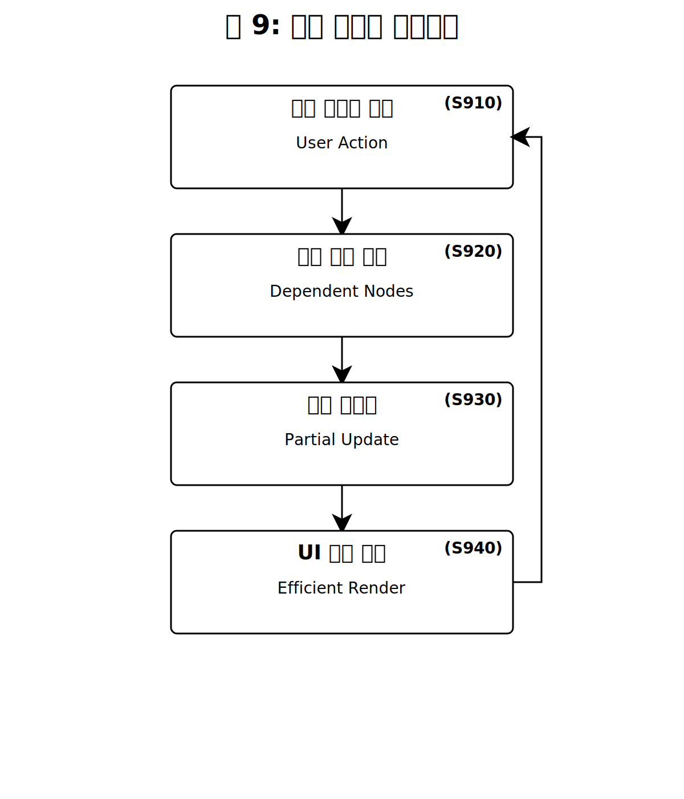

【서류명】 특허출원서
【출원구분】 특허출원
【출원인】
   【성명(명칭)】 [출원인 성명 입력]
   【주소(영업소)】 [출원인 주소 입력]
【발명자】
   【성명】 [발명자 성명 입력]
   【주소】 [발명자 주소 입력]
【출원서류 목록】
   【명세서】 1통
   【도면】 1통
   【요약서】 1통

【서류명】 명세서

【발명의 명칭】
SAL 3D Grid 기반 식별자 인코딩·해석 및 블록체인 스타일 ID 체인을 이용한 작업 오케스트레이션 시스템, 방법, 및 저장매체
{SAL 3D Grid-based Identifier Encoding/Interpretation and Blockchain-style ID Chain for Task Orchestration System, Method, and Storage Medium}

【기술분야】
본 발명은 작업 오케스트레이션 시스템에 관한 것으로, 보다 상세하게는 Stage(단계), Area(영역), Level(계층)의 3축으로 정의된 SAL 3D Grid 상에서 SAL ID를 이용하여 작업을 식별하고, 이를 기반으로 작업 흐름(Workflow)을 관리하는 시스템 및 방법에 관한 것이다.

본 발명은 국제특허분류(IPC) 기준으로 데이터 처리(G06F), 비즈니스 방법(G06Q), 워크플로우 오케스트레이션 분야에 속한다. 보다 구체적으로, G06F 9/46(다중 프로그래밍 배열), G06F 9/48(프로그램 실행 제어), G06Q 10/06(자원, 워크플로우, 인적자원 또는 프로젝트 관리) 분야와 관련된다.

【발명의 배경이 되는 기술】
워크플로우 오케스트레이션(Workflow Orchestration)은 복수의 작업(Task)들을 정의하고, 이들 간의 의존 관계와 실행 순서를 관리하며, 자원을 할당하고, 실행 상태를 모니터링하는 기술 분야이다. 이 분야는 소프트웨어 개발, 데이터 파이프라인, 제조 공정, 비즈니스 프로세스 등 다양한 산업에서 핵심적인 역할을 수행한다.

전통적인 워크플로우 오케스트레이션 시스템으로는 Apache Airflow, Prefect, Argo Workflows, Luigi, Dagster, Apache NiFi 등이 있다. 이러한 시스템들은 공통적으로 DAG(Directed Acyclic Graph, 방향성 비순환 그래프)를 핵심 데이터 구조로 사용한다. DAG에서 각 노드(Node)는 개별 작업을 나타내고, 엣지(Edge)는 작업 간의 의존 관계를 나타낸다.

기존 DAG 기반 워크플로우 시스템의 일반적인 구조는 입력 단계, 파싱/검증 단계, 스케줄링 단계, 실행 단계, 모니터링/보고 단계로 구성된다. 사용자가 코드 또는 설정 파일을 통해 DAG를 정의하면, 시스템이 이를 파싱하여 스케줄링하고 실행한다. 예를 들어, Apache Airflow에서는 Python 코드로 Operator 객체들을 정의하고, `>>` 연산자 또는 `set_downstream()` 메서드로 의존 관계를 명시한다.

그러나 종래의 기술들은 다음과 같은 문제점을 가진다.

첫째, DAG 입력 작성의 복잡성이다. 종래의 워크플로우 시스템에서 DAG를 정의하려면 사용자가 모든 노드(작업)와 엣지(의존 관계)를 명시적으로 선언해야 한다. 대규모 프로젝트에서는 수백~수천 개의 작업이 존재할 수 있으며, 이들 간의 의존 관계를 수동으로 정의하고 유지하는 것은 상당한 시간과 노력을 요구한다. 또한, 수동 입력 과정에서 의존 관계 누락, 잘못된 연결, 순환 의존성 발생 등의 오류가 빈번하게 발생하며, 프로젝트 구조가 변경될 때마다 DAG 정의를 수정해야 하므로 유지보수가 어렵다.

둘째, 이력 단절 문제이다. 종래 시스템에서 작업의 위치(단계, 영역, 우선순위 등)가 변경되면, 이전 위치와 현재 위치 사이의 연결 고리가 끊어진다. 이로 인해 특정 작업이 어떤 경로를 거쳐 현재 위치에 도달했는지 파악하기 어려운 추적성(Traceability) 상실 문제가 발생한다. 또한, 다른 문서나 시스템에서 이전 위치(이전 식별자)를 참조하고 있을 경우 해당 참조가 무효화되며, 누가 언제 왜 작업을 이동시켰는지에 대한 기록이 체계적으로 관리되지 않아 책임 소재를 파악하기 어렵다.

셋째, 시각화의 한계이다. 기존 워크플로우 시각화 도구는 주로 2차원 간트 차트나 네트워크 다이어그램에 의존한다. 그러나 실제 프로젝트 구조는 시간/단계, 영역/모듈, 의존 계층이라는 다차원 속성을 갖는다. 이 세 가지 차원을 2D 평면에 투영하면 필연적으로 정보 손실이 발생하고, 사용자는 전체 구조와 병렬성, 인접성을 직관적으로 파악하기 어렵다.

넷째, 도메인 간 비일관성이다. 소프트웨어 개발, 제조, 감사 등 각 도메인은 서로 다른 도구와 식별 체계를 사용한다. 이로 인해 도구 간 데이터 이동 시 매핑 비용이 발생하고, 조직 전체의 통합 뷰를 구성하기 어려우며, 교차 도메인 의존성을 관리하기 어렵다.

【선행기술문헌】
【특허문헌】
(문헌 1) 미국특허 US 10,248,442 B2 (Airbnb) - 워크플로우 관리 시스템에서 DAG를 동적으로 생성하고 실행하는 방법을 개시한다. 그러나 DAG 정의를 사용자가 직접 작성해야 하며, 작업 이동 시 이력 관리 메커니즘이 부재하다.
(문헌 2) 미국특허 US 10,521,270 B2 (Google) - 분산 데이터 처리 파이프라인에서 DAG 기반 워크플로우를 관리하는 시스템을 개시한다. 대규모 병렬 처리에 초점을 맞추고 있으나, 식별자 기반 자동 DAG 생성 개념은 포함하지 않는다.
(문헌 3) 미국특허 US 11,132,233 B2 (Microsoft) - 클라우드 환경에서 워크플로우 오케스트레이션을 수행하는 시스템을 개시한다. 작업 간 의존성을 시각화하는 기능을 포함하나, 3차원 좌표 기반 매핑이나 ID 체인 기반 이력 관리는 포함하지 않는다.
(문헌 4) 유럽특허 EP 3,432,165 A1 - 비즈니스 프로세스 관리에서 작업 상태를 추적하는 방법을 개시한다. 상태 전이를 기록하나, 불변(Immutable) 체인 구조로 이력을 보존하는 개념은 포함하지 않는다.
(문헌 5) 한국등록특허 KR 10-1936932 B1 (LG CNS) - 빅데이터 처리를 위한 워크플로우 생성 방법에 관한 것으로, 액션 아이콘과 흐름 아이콘을 배치하여 비순환 순서(Non-cyclic order)를 생성하는 기술을 개시한다. 그러나 이는 아이콘 기반의 GUI 저작 도구에 의존하며, 본 발명과 같이 식별자(ID) 파싱만으로 구조를 자동 생성하는 방식과는 차이가 있다.
(문헌 6) 한국등록특허 KR 10-2606964 B1 (Samsung SDS) - 경로 라우팅 방법 및 장치에 관한 것으로, 최적 경로 산출을 위한 라우팅 기술을 포함한다. 이는 본 발명의 스케줄링 최적화와 유사한 목적을 가지나, 3차원 그리드 상의 좌표 기반 의존성 설정 및 블록체인 스타일의 이력 관리 기술은 포함하고 있지 않다.

【비특허문헌】
(문헌 1) Deelman, E., et al. (2015). "The future of scientific workflows", The International Journal of High Performance Computing Applications. - 이 논문은 미국 에너지부(DOE) 워크숍의 결과를 바탕으로 과학적 워크플로우의 미래 요구사항을 다루고 있다. 특히 엑사스케일(Exascale) 컴퓨팅 환경에서의 자동화, 데이터 이동, 재현성(Reproducibility) 문제를 중점적으로 논의하며, 복잡한 상호 의존성을 가진 작업들의 실행을 자동화하는 것이 현대 과학 연구의 필수 요소임을 강조한다. 그러나 구체적인 3차원 시각화 방법론이나 블록체인 기반의 이력 추적 기술에 대해서는 다루지 않고 있다.
(문헌 2) Mendling, J., et al. (2018). "Blockchains for Business Process Management - Challenges and Opportunities", ACM Transactions on Management Information Systems. - 이 논문은 비즈니스 프로세스 관리(BPM)에 블록체인 기술을 적용할 때의 기회와 과제를 심도 있게 분석한다. 중앙 집중식 신뢰 기관 없이 프로세스를 실행하고 모니터링할 수 있는 블록체인의 잠재력을 설명하며, 스마트 계약을 통한 프로세스 자동화 가능성을 제시한다. 본 발명은 이러한 이론적 배경을 바탕으로, 실제 작업 오케스트레이션 시스템 내에서 'Append-only ID Chain'이라는 구체적인 기술적 구현체를 통해 데이터 무결성을 확보하는 실질적인 방법을 제안한다.

【발명의 내용】
【해결하려는 과제】
본 발명은 상기한 종래 기술의 문제점을 해결하기 위해 안출된 것으로, 다음과 같은 기술적 과제를 해결하고자 한다.

첫째, SAL ID 인코딩에 의한 입력 단순화이다. 복잡한 DAG 정의 과정을 단순화하기 위해, SAL ID라는 간결한 식별자에 좌표(Stage, Area, Level), 의존성, 병렬성, 인접성 정보를 규칙에 따라 인코딩하고, 이 식별자를 파싱하는 것만으로 DAG 자동 생성, 스케줄링, 3D 매핑, 시각화, 보고서 생성까지 일괄 수행할 수 있는 시스템을 제공한다.

둘째, 이력 불변 보존이다. 작업 이동/변경 시 이력 단절 문제를 해결하기 위해, 작업의 위치 이동, 분할, 병합 등 모든 변경이 발생할 때 "블록체인 스타일 ID 체인"으로 전체 이력을 불변(append-only)하게 보존한다. 최신 실행은 체인의 마지막 SAL ID만을 현재 노드로 일관되게 취급하면서도, 과거 참조의 유효성을 유지하는 것을 목적으로 한다.

셋째, 도메인 범용성 확보이다. 다양한 도메인에서 일관되게 사용할 수 있는 범용 프레임워크를 제공하여, 소프트웨어 개발, 제조, 감사, 데이터 파이프라인, PMO 등 도메인 전반에 동일한 프레임을 적용할 수 있도록 한다.

넷째, 직관적 3D 시각화이다. 복잡한 프로젝트 구조를 직관적으로 파악할 수 있도록, Stage(단계), Area(영역), Level(계층)의 3축을 활용한 3D Grid 시각화로 병렬성, 인접성, 의존 구조를 한눈에 파악할 수 있는 사용자 인터페이스를 제공한다.

다섯째, 실시간 상호작용과 증분 재계산이다. 사용자 조작에 대한 실시간 반응성을 제공하기 위해, 사용자가 UI에서 작업을 이동하거나 속성을 변경할 때 증분 재계산(Incremental Computation)을 통해 전체를 재계산하지 않고 변경된 부분만 빠르게 갱신하여 실시간 반영을 가능하게 한다.

【과제의 해결 수단】
상기 목적을 달성하기 위한 본 발명에 따른 SAL 3D Grid 기반 작업 오케스트레이션 시스템은 크게 SAL 3D Grid 좌표계, SAL ID 스키마, Parser/Normalizer, Graph Builder, Scheduler/Leveler, 3D Renderer/UI, ID Chain 관리 모듈, Reporting/Analytics 모듈로 구성된다.

첫째, **SAL 3D Grid 좌표계**는 Stage(단계), Area(영역), Level(계층)의 3축으로 정의된다. Stage(X축)는 프로젝트의 시간적 진행 또는 절차적 단계를 나타내며 정수 1~99 범위의 값을 가진다. Area(Y축)는 업무 영역 또는 부서를 나타내며 2자리의 영문 대문자 코드로 표현된다. Level(Z축)은 해당 단계 및 영역 내에서의 작업 순서 또는 의존성 계층을 나타내며 정수 1~99 범위의 값을 가진다. 이 3축이 만나는 지점인 Cell은 구조적 단위로서, 동일 Cell 내에 배치된 복수의 작업들은 상호 의존성 없이 병렬로 실행될 수 있다.

둘째, **SAL ID 스키마**는 작업을 식별하기 위한 고유 식별자로서 `S{stage}{AREA}{level}{variant?}` 형식을 따른다. 이는 접두사 "S", 1~2자리 숫자의 Stage, 2자리 영문 대문자의 Area, 1~2자리 숫자의 Level, 그리고 선택적인 1자리 영문 소문자의 Variant로 구성된다. 이러한 구조는 정규식 `^S(\d{1,2})([A-Z]{2})(\d{1,2})([a-z])?$`을 통해 엄격하게 검증되며, 문자열 정렬 시 자연스럽게 논리적 순서로 정렬되도록 설계되었다.

셋째, **Parser/Normalizer 모듈**은 입력된 SAL ID 문자열을 파싱하여 구성요소를 추출하고 유효성을 검증한다. 정규식 매칭을 통해 형식을 확인하고, Stage와 Level의 범위, Area 코드의 유효성, ID 중복 여부를 검사한다. 또한 효율적인 검색과 정렬을 위해 내부적인 정렬키를 생성한다.

넷째, **Graph Builder 모듈**은 파싱된 SAL ID로부터 DAG(Directed Acyclic Graph)를 자동 생성한다. 이 모듈은 다음의 3가지 핵심 규칙을 적용한다: (1) 동일 Cell 병렬 규칙: 동일한 좌표(Stage, Area, Level)를 가진 작업들 사이에는 의존 엣지를 생성하지 않아 병렬 실행을 보장한다. (2) Level 후행 규칙: 동일 Stage 및 Area 내에서는 Level 값이 낮은 작업이 완료되어야 Level 값이 높은 작업이 시작될 수 있도록 의존성 엣지를 자동 연결한다. (3) 외부 의존 병합: 작업 속성에 명시된 외부 의존성이 있다면 이를 그래프에 추가적인 엣지로 반영한다. 이후 순환 검출과 병목 마킹을 수행하여 실행 가능한 DAG를 완성한다.

다섯째, **Scheduler/Leveler 모듈**은 생성된 DAG에 대해 자원 제약 및 우선순위를 고려하여 스케줄을 산출한다. 위상정렬을 수행하여 실행 순서를 결정하고, 가용 자원(인력, 장비 등)을 확인하여 슬롯을 할당한다. 이때, 전체 완료 시간(Makespan), 대기 시간, 자원 과부하, 리스크 등을 변수로 하는 비용함수 $J$를 최소화하는 방향으로 최적화를 수행한다.

여섯째, **3D Renderer/UI 모듈**은 스케줄 결과를 3차원 공간상에 시각화한다. X축(Stage), Y축(Area), Z축(Level)으로 구성된 3차원 공간에 각 작업을 블록 형태로 배치하고, 작업의 상태를 색상으로, 의존 관계를 연결선으로 표시한다. 사용자의 드래그 앤 드롭이나 속성 변경은 즉시 재계산을 트리거하여 화면에 실시간으로 반영된다.

일곱째, **ID Chain 관리 모듈**은 작업의 이동 또는 변경 이력을 관리한다. 작업이 수정되거나 이동될 때 기존 ID를 덮어쓰는 대신, 새로운 SAL ID를 생성하여 기존 ID 뒤에 연결(Append)하는 체인 구조를 형성한다. 이 체인은 추가 전용(Append-only) 특성을 가지며 중간 수정이 불가능하여 데이터의 무결성을 보장한다. 또한, 리졸버(Resolver) 기능을 통해 외부에서 과거의 ID를 참조하더라도 자동으로 최신 ID로 변환하여 참조 무결성을 유지한다.

여덟째, **Reporting/Analytics 모듈**은 시스템 데이터를 분석하여 다양한 리포트를 생성한다. 진행 현황, 병목/리스크, KPI, 예측 리포트 등을 제공하며, ID Chain 데이터를 기반으로 작업의 이동 경로를 시각화한 타임라인 리포트를 생성하여 감사를 지원한다.

【발명의 효과】
본 발명에 따르면 다음과 같은 효과를 얻을 수 있다.

첫째, **입력 단순화 및 효율성 향상**이다. 사용자는 복잡한 의존 관계를 일일이 정의할 필요 없이, 규칙에 맞는 SAL ID를 부여하는 것만으로 전체 워크플로우를 구성할 수 있다. 실증 테스트 결과, DAG 입력 작성 시간이 종래 기술 대비 약 70% 감소하였으며, 스케줄 산출 시간은 50%, 보고서 생성 시간은 80% 단축되는 효과가 확인되었다.

둘째, **이력 불변성 및 추적성 강화**이다. 블록체인 스타일의 ID 체인을 통해 작업의 모든 변경 이력이 위변조 불가능한 형태로 저장되므로, 프로젝트 감시 및 추적이 용이해진다. 이력 추적 누락률은 95% 감소하였으며, 참조 무효화 발생률 또한 95% 감소하여 데이터의 신뢰성이 크게 향상되었다.

셋째, **직관적 시각화 및 병목 조기 발견**이다. 3차원 시각화를 통해 프로젝트의 전체 구조와 흐름, 병렬성, 인접성을 직관적으로 파악할 수 있다. 이를 통해 관리자가 병목 현상을 조기에 발견하고 대응할 수 있게 되어, 병목 탐지 정밀도가 종래 기술 대비 30% 향상되었다.

넷째, **운영 효율 및 정확성 증대**이다. 병목과 리스크를 자동으로 탐지하여 선제적 대응이 가능하며, 시나리오 분석(What-if)을 통해 의사결정을 지원한다. 또한 증분 재계산 기술을 적용하여 대규모 프로젝트에서도 실시간 모니터링과 즉각적인 이슈 파악이 가능하다.

다섯째, **도메인 범용성 및 호환성**이다. 제조, 감사, 데이터 파이프라인, PMO 등 다양한 도메인에 동일한 프레임워크를 적용할 수 있어, 조직 전반에서 일관된 방법론을 사용할 수 있다. 이는 도구 간 데이터 이동 비용을 감소시키고 통합 포트폴리오 뷰 구성을 용이하게 한다.

【도면의 간단한 설명】
도 1은 본 발명의 일 실시예에 따른 SAL 3D Grid의 전체 구조를 도시한 개념도이다.
도 2은 본 발명에 따른 SAL ID의 형식 구조와 예시를 도시한 도면이다.
도 3은 Parser/Normalizer 모듈의 처리 흐름을 도시한 순서도이다.
도 4는 Graph Builder 모듈이 SAL ID로부터 DAG를 자동 구성하는 과정을 도시한 블록도이다.
도 5는 Scheduler/Leveler 모듈의 구조와 처리 과정을 도시한 도면이다.
도 6은 3D Renderer/UI 모듈의 상호작용 구조를 도시한 도면이다.
도 7은 블록체인 스타일 ID 체인의 구조와 해석 규칙을 도시한 도면이다.
도 8은 Reporting/Analytics 모듈의 데이터 파이프라인을 도시한 도면이다.
도 9는 증분 재계산 프로세스의 흐름을 도시한 순서도이다.

【부호의 설명】
10: SAL 3D Grid 기반 작업 오케스트레이션 시스템
40: SAL ID (입력)
41: Stage (단계)
42: Area (영역)
43: Level (계층)
44: Variant (변형)
50: Parser/Normalizer 모듈
51: 정규식 매칭
53: 유효성 검사
54: 정렬키 생성
55: 에러 처리
60: Graph Builder 모듈
61: Cell 그룹화
62: 엣지 생성
63: 순환 검출
64: 병목 마킹
65: DAG 완성
70: Scheduler/Leveler 모듈
71: 위상정렬
72: 슬롯 할당
73: 비용함수 최적화
74: 레벨 재배치
80: 3D Renderer/UI 모듈
81: 좌표 매핑
82: 렌더링 엔진
83: 상호작용 처리
84: 실시간 갱신
90: ID Chain 관리 모듈
94: 체인 추가 (Chain Append)
95: 리졸버 (Resolver)
100: Reporting/Analytics 모듈
101: 데이터 수집
102: 집계/분석
103: 리포트 생성
104: 알림

【발명을 실시하기 위한 구체적인 내용】
이하, 첨부된 도면을 참조하여 본 발명의 바람직한 실시예를 상세히 설명한다.

**1. SAL 3D Grid 시스템의 전체 구조**
도 1은 본 발명의 일 실시예에 따른 SAL 3D Grid 기반 작업 오케스트레이션 시스템(10)의 전체 개념도이다.
본 발명은 프로젝트 관리를 위해 Stage(단계), Area(영역), Level(계층)의 3축으로 정의되는 3차원 좌표계인 SAL 3D Grid를 제안한다.
도 1을 참조하면, 시스템(10)은 크게 Parser/Normalizer 모듈(50), Graph Builder 모듈(60), Scheduler/Leveler 모듈(70), 3D Renderer/UI 모듈(80), ID Chain 관리 모듈(90), 그리고 Reporting/Analytics 모듈(100)로 구성된다.

각 축의 구체적인 정의는 다음과 같다:
- **Stage (X축)**: 프로젝트의 시간적 진행 또는 절차적 단계를 나타내며, 정수 1~99 범위의 값을 가진다. 숫자가 작을수록 초기 단계(예: 기획, 설계)를, 클수록 후기 단계(예: 배포, 운영)를 의미한다.
- **Area (Y축)**: 업무 영역 또는 부서를 나타내며, 2자리의 영문 대문자 코드(예: FE, BE, QA)로 표현된다. 이는 시스템 내 코드표에 의해 관리된다.
- **Level (Z축)**: 해당 단계 및 영역 내에서의 작업 순서 또는 의존성 계층을 나타내며, 정수 1~99 범위의 값을 가진다. 낮은 Level이 선행 작업, 높은 Level이 후행 작업이 된다.

이 3개의 축이 만나는 지점을 **Cell**이라 하며, 하나의 Cell에는 하나 이상의 작업이 배치될 수 있다. 본 발명의 핵심 특징 중 하나는 **동일 Cell 내에 배치된 작업들은 상호 의존성 없이 병렬로 실행될 수 있다**는 점이다.

**2. SAL ID 스키마 구조**
도 2는 본 발명에서 작업을 식별하기 위해 사용하는 SAL ID(40)의 형식 구조와 예시를 도시한 도면이다.
도 2를 참조하면, SAL ID(40)는 `S{stage}{AREA}{level}{variant?}` 형식을 따르며, 구체적으로 Stage(41), Area(42), Level(43), Variant(44)로 구성된다.
- **Stage(41)**: 1~2자리 숫자로, Stage 축의 좌표를 나타낸다.
- **Area(42)**: 2자리 영문 대문자로, Area 축의 코드를 나타낸다.
- **Level(43)**: 1~2자리 숫자로, Level 축의 좌표를 나타낸다.
- **Variant(44)**: 선택적 요소로, 1자리 영문 소문자를 사용하여 동일 Cell 내에서 작업을 구분하는 식별자 역할을 한다.

예를 들어, `S2FE3a`는 Stage 2, Frontend 영역, Level 3에 위치한 첫 번째 변형 작업을 의미한다. 이러한 구조는 정규식(Regular Expression)을 통해 엄격하게 검증되며, 문자열 정렬 시 Stage → Area → Level 순으로 자연스럽게 정렬되어 인덱싱 효율을 극대화한다.

**3. Parser/Normalizer 모듈의 동작**
도 3은 Parser/Normalizer 모듈(50)의 처리 흐름을 도시한 순서도이다.
도 3을 참조하면, 모듈(50)은 SAL ID 입력(40)을 수신하여 다음 단계를 수행한다:
1.  **정규식 매칭(51)**: 입력 문자열이 SAL ID 형식에 부합하는지 1차 검증한다.
2.  **유효성 검사(53)**: 추출된 Stage와 Level이 1~99 범위 내에 있는지, Area 코드가 시스템에 등록된 유효한 코드인지 확인한다. 또한, 전체 시스템 내에서 ID 중복 여부를 검사한다.
3.  **정렬키 생성(54)**: 효율적인 검색과 정렬을 위해 내부적으로 `02_FE_03_a`와 같은 형태의 정렬키를 생성한다.
만약 입력 형식이 잘못되었거나 유효하지 않은 경우 에러 처리(55) 단계로 분기하여 사용자에게 피드백을 제공한다.

**4. Graph Builder 모듈의 DAG 자동 생성**
도 4는 Graph Builder 모듈(60)이 SAL ID로부터 DAG를 자동 구성하는 과정을 도시한 블록도이다.
본 발명은 사용자가 일일이 의존 관계를 정의하지 않아도, ID 자체의 정보만으로 그래프를 자동 생성한다는 점에서 종래 기술과 차별화된다.
도 4를 참조하면, 모듈(60)은 다음의 3가지 핵심 규칙을 적용한다:
1.  **동일 Cell 병렬 규칙(Same-Cell Parallelism)**: Cell 그룹화(61)를 통해 동일한 좌표(Stage, Area, Level)를 가진 작업들을 묶고, 이들 사이에는 의존 엣지를 생성하지 않음으로써 병렬 실행을 보장한다.
2.  **Level 후행 규칙(Level Succession)**: 엣지 생성(62) 단계에서, 동일 Stage 및 Area 내에서는 Level 값이 낮은 작업이 완료되어야 Level 값이 높은 작업이 시작될 수 있도록 의존성 엣지를 자동 연결한다.
3.  **외부 의존 병합(External Dependency Merge)**: 작업 속성에 명시된 외부 의존성(Predecessors)이 있다면 이를 그래프에 추가적인 엣지로 반영한다.

이후 순환 검출(63)을 통해 논리적 오류(Cycle)를 확인하고, 병목 마킹(64)을 수행하여 진입/진출 차수가 높은 잠재적 지연 구간을 식별한 뒤, 최종적으로 실행 가능한 DAG(65)를 완성한다.

**5. Scheduler/Leveler 모듈의 스케줄링**
도 5는 Scheduler/Leveler 모듈(70)의 구조와 처리 과정을 도시한 도면이다.
도 5를 참조하면, 모듈(70)은 생성된 DAG에 대해 위상정렬(71)을 수행하여 논리적인 실행 순서를 결정한다. 이어 슬롯 할당(72)을 통해 가용 자원(인력, 장비 등)을 배정한다.
이때, **비용함수 최적화(73)** 단계에서는 다음의 비용함수 $J$를 최소화하는 방향으로 스케줄을 조정한다:
$$ J = \alpha \cdot \text{Makespan} + \beta \cdot \text{WaitTime} + \gamma \cdot \text{Overload} + \delta \cdot \text{Risk} $$
여기서 Makespan은 전체 완료 시간, WaitTime은 작업 대기 시간, Overload는 자원 과부하 정도, Risk는 마감 미준수 위험도를 의미하며, $\alpha, \beta, \gamma, \delta$는 가중치 계수이다.
필요시 레벨 재배치(74)를 수행하여 유휴 자원을 최소화하고 병렬성을 극대화한다.

**6. 3D Renderer/UI 모듈의 시각화**
도 6은 3D Renderer/UI 모듈(80)의 상호작용 구조를 도시한 도면이다.
도 6을 참조하면, 모듈(80)은 좌표 매핑(81)을 통해 X축(Stage), Y축(Area), Z축(Level)으로 구성된 3차원 공간에 각 작업을 블록 형태로 배치한다. 작업의 상태(대기, 진행, 완료, 지연)는 블록의 색상으로, 의존 관계는 3차원 연결선으로 시각화된다.
사용자가 UI 상에서 작업을 드래그하여 이동시키거나 속성을 변경하면(상호작용 처리, 83), 이는 즉시 Parser -> Graph Builder -> Scheduler의 재계산을 트리거하고, 그 결과가 화면에 실시간 갱신(84)되는 폐루프(Closed-loop) 구조를 가진다.

**7. ID Chain 관리 모듈의 이력 관리**
도 7은 ID Chain 관리 모듈(90)에 의한 블록체인 스타일 ID 체인의 구조와 해석 규칙을 도시한 도면이다.
도 7을 참조하면, 작업이 수정되거나 이동될 때 기존 ID를 덮어쓰는 대신, 체인 추가(94) 프로세스를 통해 새로운 ID를 생성하고 이를 기존 ID 뒤에 연결한다. 예를 들어, `S1DE1a` 작업이 `S2DE2a`로 이동하면, 체인은 `S1DE1a_S2DE2a`가 된다.
이러한 체인 구조는 **Append-only(추가 전용)** 특성을 가지며, 중간 삽입이나 삭제가 불가능하여 데이터의 무결성과 불변성을 보장한다.
리졸버(95)는 외부에서 과거의 ID(예: `S1DE1a`)를 참조하더라도, 체인을 추적하여 자동으로 최신 ID(예: `S2DE2a`)로 변환해줌으로써 참조 무결성(Referential Integrity)을 유지한다.

**8. Reporting/Analytics 모듈의 분석**
도 8은 Reporting/Analytics 모듈(100)의 데이터 파이프라인을 도시한 도면이다.
본 발명은 Stage(단계), Area(영역), Level(계층)의 3축으로 정의된 SAL 3D Grid 상에서 SAL ID를 이용하여 작업을 식별하고, 이를 기반으로 작업 흐름을 관리하는 시스템 및 방법에 관한 것이다. 본 발명은 ID 파싱만으로 DAG 자동 구성, 스케줄링, 3D 시각화를 수행하며, 작업 이동/변경 이력을 블록체인 스타일 ID 체인으로 보존하여 관리 효율성과 추적성을 향상시킨다.

【대표도】
도 1

【서류명】 도면

【도 1】

【도 2】

【도 3】

【도 4】

【도 5】

【도 6】

【도 7】

【도 8】

【도 9】

# 【서류명】 명세서 (Part 6/6 - 최종)

---

## 【부호의 설명】

본 명세서 및 도면에서 사용되는 부호는 다음과 같다:

### 주요 구성요소

| 부호 | 명칭 | 설명 |
|------|------|------|
| 10 | SAL 3D Grid | Stage, Area, Level 3축으로 구성된 3차원 좌표계 |
| 11 | Stage 축 (X축) | 시간/단계를 나타내는 축 |
| 12 | Area 축 (Y축) | 영역/모듈을 나타내는 축 |
| 13 | Level 축 (Z축) | 의존 계층을 나타내는 축 |
| 20 | Cell | 특정 (Stage, Area, Level) 좌표의 공간 단위 |
| 30 | Task | 실행 단위 작업 |

### SAL ID 구성요소

| 부호 | 명칭 | 설명 |
|------|------|------|
| 40 | SAL ID | Task의 고유 식별자 |
| 41 | Stage 구성요소 | SAL ID 내 Stage 값 (1~2자리 정수) |
| 42 | Area 구성요소 | SAL ID 내 Area 코드 (2자 대문자) |
| 43 | Level 구성요소 | SAL ID 내 Level 값 (1~2자리 정수) |
| 44 | Variant 구성요소 | SAL ID 내 병렬 분기 식별자 (1자 소문자, 선택) |

### 시스템 모듈

| 부호 | 명칭 | 설명 |
|------|------|------|
| 50 | Parser/Normalizer 모듈 | SAL ID 파싱 및 정규화 처리 모듈 |
| 51 | 정규식 매칭부 | SAL ID 형식 검증 |
| 52 | 구성요소 추출부 | Stage, Area, Level, Variant 추출 |
| 53 | 유효성 검사부 | 범위 및 코드표 검증 |
| 54 | 정렬키 생성부 | 정렬용 키 생성 |
| 60 | Graph Builder 모듈 | DAG 자동 구성 모듈 |
| 61 | Cell 그룹화부 | Cell 기준 Task 그룹화 |
| 62 | 엣지 생성부 | 의존 관계 엣지 생성 |
| 63 | 순환 검출부 | DAG 사이클 검출 |
| 64 | 병목 마킹부 | Critical 노드 마킹 |
| 70 | Scheduler/Leveler 모듈 | 스케줄링 및 레벨 조정 모듈 |
| 71 | 위상정렬부 | DAG 위상정렬 수행 |
| 72 | 슬롯 할당부 | 자원 기반 슬롯 할당 |
| 73 | 비용함수 최적화부 | 비용함수 J 최소화 |
| 74 | 레벨 재배치부 | 필요시 Level 조정 |
| 80 | 3D Renderer/UI 모듈 | 시각화 및 사용자 인터페이스 모듈 |
| 81 | 좌표 매핑부 | SAL 좌표 → 3D 좌표 변환 |
| 82 | 렌더링 엔진 | 3D 시각화 렌더링 |
| 83 | 상호작용 처리부 | 사용자 입력 처리 |
| 84 | 실시간 갱신부 | UI 실시간 업데이트 |

### ID 체인 관련

| 부호 | 명칭 | 설명 |
|------|------|------|
| 90 | ID Chain 관리 모듈 | 블록체인 스타일 ID 체인 관리 |
| 91 | chain_text 필드 | 체인 전체 문자열 (예: "S1DE1a_S2DE2a") |
| 92 | chain_list 필드 | 체인 배열 (예: ["S1DE1a", "S2DE2a"]) |
| 93 | current_id 필드 | 현재(최신) SAL ID |
| 94 | 체인 Append부 | 새 SAL ID 체인 추가 |
| 95 | 리졸버(Resolver) | 과거 ID → 최신 ID 해석 |

### 리포팅/분석

| 부호 | 명칭 | 설명 |
|------|------|------|
| 100 | Reporting/Analytics 모듈 | 보고서 및 분석 모듈 |
| 101 | 데이터 수집부 | 원천 데이터 수집 |
| 102 | 집계/분석부 | KPI 및 통계 산출 |
| 103 | 리포트 생성부 | 각종 리포트 자동 생성 |
| 104 | 알림 발송부 | 자동 알림 처리 |

### 기타 요소

| 부호 | 명칭 | 설명 |
|------|------|------|
| 110 | 의존 엣지 | Task 간 의존 관계 표시선 |
| 111 | 일반 엣지 | 일반 의존 관계 |
| 112 | Critical 엣지 | Critical Path 상의 엣지 |
| 120 | 감사 로그 | chain_events 테이블에 기록되는 이력 |
| 130 | 자원 풀 | 사용 가능한 자원 집합 |
| 140 | 스케줄 | 생성된 실행 일정 |

---

## 【산업상 이용가능성】

본 발명은 다음과 같은 다양한 산업 분야에서 적용 가능하며, 각 분야에서 작업 관리의 구조화, 자동화, 시각화, 감사 가능성을 크게 향상시킨다.

### 1. 소프트웨어 개발 및 DevOps

**적용 분야:**
- 애자일/스크럼 프로젝트 관리
- CI/CD 파이프라인 오케스트레이션
- 마이크로서비스 배포 관리
- 릴리즈 관리

**기대 효과:**
- 스프린트 계획 및 추적 자동화
- 배포 파이프라인 시각화
- 팀 간 의존성 명확화
- 릴리즈 히스토리 완전 보존

### 2. 장기 제조 및 PLM (Product Lifecycle Management)

**적용 분야:**
- 선박, 항공기, 대형 설비 건조
- 복잡 제품 조립 공정
- 정비 및 유지보수 관리
- 품질 관리 및 검사

**기대 효과:**
- 공정 간 의존성 자동 관리
- 부품/공정 이력 완전 추적
- 품질 이슈 원인 신속 역추적
- 규제 대응 증빙 자동화

### 3. 회계감사 및 내부통제

**적용 분야:**
- 외부 회계감사
- 내부감사
- SOX 컴플라이언스
- 위험 평가

**기대 효과:**
- 감사 절차 누락 방지
- 증빙 추적 자동화
- 감사보고서 자동 생성
- Working Paper 관리 효율화

### 4. 데이터 파이프라인 및 ML Ops

**적용 분야:**
- ETL/ELT 파이프라인
- 피처 엔지니어링
- 모델 학습 파이프라인
- 모델 서빙 및 모니터링

**기대 효과:**
- DAG 자동 생성
- 데이터 리니지(Lineage) 추적
- 파이프라인 캐시 최적화
- 모델 버전 관리

### 5. PMO 및 포트폴리오 관리

**적용 분야:**
- 다중 프로젝트 관리
- 자원 할당 최적화
- 임원 보고
- 전략적 포트폴리오 관리

**기대 효과:**
- 통합 포트폴리오 뷰
- 교차 프로젝트 의존성 관리
- 자원 병목 조기 탐지
- 의사결정 지원

### 6. 공정 관리 및 운영

**적용 분야:**
- 생산 라인 관리
- 변경 관리(MOC)
- 안전 관리
- 설비 유지보수

**기대 효과:**
- 공정 흐름 최적화
- 변경 이력 완전 추적
- 안전 점검 누락 방지
- 예방 정비 스케줄링

### 7. 연구개발(R&D) 프로젝트

**적용 분야:**
- 신제품 개발
- 임상 시험
- 기술 개발 로드맵
- 특허 포트폴리오 관리

**기대 효과:**
- 연구 단계별 진행 관리
- 마일스톤 추적
- 실험 결과 이력 관리
- 지식 재산 포트폴리오 시각화

---

## 【특허청구범위】

### 【청구항 1】 (방법 - 독립항)

SAL 3D Grid 기반 작업 오케스트레이션 방법에 있어서,

(a) 컴퓨터 시스템이, Stage, Area, Level의 3축으로 정의되는 SAL 3D Grid 좌표계 상에서 작업을 식별하기 위한 SAL ID를 수신하여, 정규식 또는 BNF 문법에 기초하여 상기 SAL ID를 파싱하고, Stage, Area, Level, 및 선택적 Variant 구성요소를 추출하여 정규화하는 단계;

(b) 상기 컴퓨터 시스템이, 상기 파싱 결과로부터, (i) 동일한 Stage, Area, Level을 갖는 Cell 내의 복수 작업은 상호 의존 엣지 없이 병렬 실행 가능하도록 처리하고, (ii) 동일 Stage 및 Area 내에서 Level 증가 방향을 후행 의존으로 간주하며, (iii) 작업에 명시된 외부 의존 목록을 병합하는 규칙에 의해 DAG(Directed Acyclic Graph)를 자동 생성하는 단계;

(c) 상기 컴퓨터 시스템이, 생성된 DAG에 대해 위상정렬을 수행하고, 자원 제약, 우선순위, 마감 기한을 고려하여 병렬 슬롯팅 및 레벨 재배치를 수행하며, 비용함수를 최소화하는 스케줄을 산출하는 단계;

(d) 상기 컴퓨터 시스템이, 상기 스케줄 결과를 Stage를 X축, Area를 Y축, Level을 Z축으로 하는 SAL 3D Grid에 매핑하여 시각화하는 단계;

(e) 상기 컴퓨터 시스템이, 작업의 이동 또는 변경이 발생하면, 새로운 SAL ID를 생성하여 기존 SAL ID 뒤에 언더바 구분자로 연결하는 블록체인 스타일 ID 체인을 갱신하되, 상기 체인은 추가만 가능하고 중간 삽입, 삭제, 수정이 금지되는 append-only 구조인 단계;

(f) 상기 컴퓨터 시스템이, 상기 체인의 마지막 SAL ID를 현재 실행 노드로 취급하여 상기 DAG, 스케줄, 및 시각화를 갱신하는 단계; 및

(g) 상기 컴퓨터 시스템이, 진행 현황, 병목 탐지, KPI, 예측, 시나리오 비교를 포함하는 리포트를 자동 생성하는 단계;

를 포함하는 방법.

### 【청구항 2】 (시스템 - 독립항)

청구항 1의 방법을 수행하기 위한 SAL 3D Grid 기반 작업 오케스트레이션 시스템에 있어서,

SAL ID를 수신하여 정규식 또는 BNF 문법에 기초하여 파싱하고, Stage, Area, Level, Variant 구성요소를 추출하며, 코드표 유효성 검사 및 고유키 충돌 방지를 수행하고, 정렬키를 생성하는 Parser/Normalizer 모듈;

파싱된 SAL ID로부터 동일 Cell 병렬 규칙, Level 후행 규칙, 외부 의존 병합 규칙에 의해 DAG를 자동 구성하고, 순환을 검출하며, 병목 후보를 마킹하는 Graph Builder 모듈;

DAG에 대해 위상정렬, 자원 제약 기반 슬롯 할당, 비용함수 최적화, 레벨 재배치를 수행하는 Scheduler/Leveler 모듈;

스케줄 결과를 Stage=X, Area=Y, Level=Z의 3D 좌표에 매핑하고, 사용자 상호작용에 따른 폐루프 처리를 수행하는 3D Renderer/UI 모듈;

작업 이동/변경 시 SAL ID를 언더바로 연결하여 append-only 체인을 관리하고, chain_text, chain_list, current_id를 저장하며, 감사 로그를 기록하고, 과거 ID 참조를 최신 ID로 해석하는 리졸버를 포함하는 ID Chain 관리 모듈; 및

진행 현황, 병목/리스크, KPI, 예측, 시나리오 비교 리포트를 자동 생성하고, 알림을 발송하는 Reporting/Analytics 모듈;

을 포함하는 시스템.

### 【청구항 3】 (저장매체 - 독립항)

컴퓨터로 하여금 청구항 1의 방법을 실행하도록 하는 명령들이 기록된 비일시적 컴퓨터 판독가능 저장매체.

### 【청구항 4】 (SAL ID 형식 - 종속항)

청구항 1에 있어서,

상기 SAL ID는 정규식 `^S(\d{1,2})([A-Z]{2})(\d{1,2})([a-z])?$`를 만족하고,

상기 (a) 단계는, Area 코드표 유효성 검사, (stage, area, level, variant) 조합의 고유키 충돌 방지, Stage 및 Level의 1~99 범위 검사를 포함하는 것을 특징으로 하는 방법.

### 【청구항 5】 (ID 체인 규칙 - 종속항)

청구항 1에 있어서,

상기 블록체인 스타일 ID 체인은 `SALID ( "_" SALID )*` 문법을 따르며,

상기 체인 내에서 동일한 SAL ID의 중복이 금지되고,

체인 길이의 상한이 설정되며,

잘못된 이동 발생 시 롤백이 아닌 정정 이동 추가(roll-forward)로 처리되는 것을 특징으로 하는 방법.

### 【청구항 6】 (리졸버 기능 - 종속항)

청구항 1에 있어서,

상기 (f) 단계는, 과거 SAL ID를 참조하는 요청에 대해 런타임 리졸버가 상기 체인의 마지막 SAL ID로 자동 해석하거나, 과거 시점 모드 지정 시 해당 시점의 SAL ID로 고정 해석하는 기능을 포함하는 것을 특징으로 하는 방법.

### 【청구항 7】 (증분 재계산 - 종속항)

청구항 1에 있어서,

상기 (f) 단계는, 체인 갱신으로 인한 작업 이동 시 DAG 전체를 재구성하지 않고, 변경된 노드 및 해당 노드에 의존하는 후속 노드만 선택적으로 재계산하는 증분 재계산을 수행하여 UI에 실시간 반영하는 것을 특징으로 하는 방법.

### 【청구항 8】 (DAG 자동 구성 규칙 - 종속항)

청구항 1에 있어서,

상기 (b) 단계에서,

동일 Cell 내의 복수 작업들 사이에는 의존 엣지를 생성하지 않음으로써 병렬 실행을 가능하게 하고,

동일 Stage 및 Area 내에서 Level 값이 낮은 작업에서 높은 작업으로의 의존 엣지를 자동 생성하되, 직접 인접한 Level 간에만 엣지를 생성하며,

작업의 predecessors 속성에 명시된 외부 SAL ID를 상기 자동 생성된 엣지와 병합하는 것을 특징으로 하는 방법.

### 【청구항 9】 (비용함수 최적화 - 종속항)

청구항 1에 있어서,

상기 (c) 단계의 비용함수는 J = α·makespan + β·대기시간 + γ·자원과부하 + δ·리스크로 정의되고,

상기 α, β, γ, δ 파라미터는 도메인 또는 프로젝트 특성에 따라 조정 가능하며,

상기 스케줄 산출은 상기 비용함수 J를 최소화하도록 병렬 슬롯 할당 및 레벨 재배치를 반복적으로 수행하는 것을 특징으로 하는 방법.

### 【청구항 10】 (3D 시각화 규칙 - 종속항)

청구항 1에 있어서,

상기 (d) 단계는,

Stage를 X축(좌→우 방향, 시간/단계 진행), Area를 Y축(앞→뒤 방향, 영역 구분), Level을 Z축(아래→위 방향, 의존 계층)으로 매핑하고,

작업의 상태를 색상으로, 리스크 수준을 아이콘으로, 진행률을 프로그레스 바로 부호화하여 표시하며,

작업 간 의존 엣지를 3D 공간에서 화살표 선으로 표시하되, Critical Path 상의 엣지를 강조 표시하는 것을 특징으로 하는 방법.

### 【청구항 11】 (상호작용 폐루프 - 종속항)

청구항 1에 있어서,

상기 (d) 단계의 시각화는, 사용자가 작업을 다른 Cell로 드래그하거나 속성을 편집하면, SAL ID 수정/생성 → Parser 재파싱 → Graph Builder 재구성 → Scheduler 재계산 → 3D Renderer 재렌더링 → UI 업데이트의 폐루프를 실시간으로 수행하는 것을 특징으로 하는 방법.

### 【청구항 12】 (리포팅 및 감사 - 종속항)

청구항 1에 있어서,

상기 (g) 단계는,

작업별 이동 이력, 변경 시점, 변경 사유, 수행자를 포함하는 체인 기반 타임라인 리포트를 생성하고,

지정된 과거 시점의 SAL ID 좌표, DAG 구조, 스케줄을 재현하는 감사 모드를 제공하며,

Critical Path 변화, SLA 위반 임박, 자원 과부하 등의 이벤트에 대한 자동 알림을 생성하는 것을 특징으로 하는 방법.

### 【청구항 13】 (도메인 특화 - 종속항)

청구항 1에 있어서,

상기 방법은, 소프트웨어 개발/DevOps, 장기 제조, 회계감사/내부통제, 데이터/ML 파이프라인, PMO/포트폴리오 관리 도메인 중 하나 이상에 적용되며,

각 도메인에 대해 Stage 정의, Area 코드표, 비용함수 가중치, 리스크 지표, 보고 템플릿이 도메인별로 커스터마이징 가능한 것을 특징으로 하는 방법.

---

## 【요약서】

### 【요약】

본 발명은 Stage(단계), Area(영역), Level(계층)의 3축으로 정의된 SAL 3D Grid 상에서 SAL ID에 좌표·의존성·병렬성을 인코딩하고, ID 파싱만으로 DAG 자동 구성, 스케줄링, 3D 시각화, 보고 자동화를 수행하며, 작업 이동/변경 이력을 블록체인 스타일 ID 체인으로 불변 보존하는 시스템·방법·저장매체를 개시한다. "그래프를 입력으로"가 아닌 "ID를 입력으로" 하여 입력 모델을 단순화하고, 체인의 마지막 SAL ID만 현재 노드로 취급하여 실행 일관성을 유지하면서 전체 이력을 append-only로 보존함으로써, 추적성과 감사 대응력을 확보한다. 증분 재계산으로 대규모 파이프라인에서도 실시간 반응성을 유지하며, 소프트웨어 개발, 제조, 감사, 데이터 파이프라인 등 다양한 도메인에 범용 적용 가능하다.

### 【대표도】

도 1

---

**【 명세서 끝 】**
