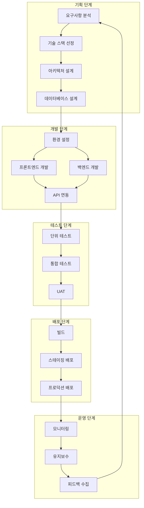

# 22편 | 전체 개발 프로세스 통합 가이드

---

21편까지 웹 개발의 각 퍼즐 조각들을 하나하나 다루었다면, 이제 **모든 조각을 맞춰 완성된 그림을 그려볼 차례**입니다.

마치 **요리를 배울 때** 재료 손질법, 조미료 사용법을 각각 익혔다면, 이제는 **실제 요리를 완성**하는 단계입니다. 개발 시작부터 배포, 운영까지의 **전체 여정을 한 눈에** 보여드리면서, 각 편에서 다룬 내용들이 어떻게 **유기적으로 톱니바퀴처럼 맞물리는지** 살펴봅니다.

## 1. 전체 개발 프로세스 개요

### 1-1. 개발 생명주기 이해

웹 개발 프로젝트는 **집 짓기**와 비슷한 단계로 진행됩니다:

**기획(설계도면) → 설계(구조설계) → 개발(시공) → 테스트(검사) → 배포(입주) → 운영(관리)**

하지만 여기서 **중요한 포인트**는, 이 단계들이 **일직선으로만** 진행되지 않는다는 것입니다. 실제로는 **나선형 계단을 오르듯** 반복적이고 순환적입니다. 애자일 방법론에서는 이를 **2-4주짜리 '스프린트'** 단위로 반복하며 점진적으로 완성도를 높여나갑니다.

**완벽한 집을 한 번에 짓는 것보다**, 작은 방 하나를 완성하고 피드백을 받아 다음 방을 더 잘 만드는 것이 현명합니다.

### 1-2. 각 단계별 핵심 활동

**기획 단계** - 무엇을 만들지 결정하기
- **요구사항 수집과 분석** - 고객이 *실제로* 원하는 것이 무엇인지 파악 (예상보다 어렵습니다)
- **사용자 스토리 작성** - "OO한 사용자가 XX를 할 수 있도록" 형태로 구체화
- **와이어프레임 작성** - 말 그대로 **집 설계도면** 같은 것입니다
- **기술 스택 결정** - 어떤 도구들을 사용할지 **신중하게** 선택하는 단계

**설계 단계** - 어떻게 만들지 계획하기
- **시스템 아키텍처 설계** - 전체적인 **청사진** 그리기
- **데이터베이스 스키마 설계** (14편, 15편 참고) - 데이터들이 어떻게 **정리정돈** 될지 계획
- **API 설계** (16편 참고) - 프론트엔드와 백엔드가 어떻게 **통신할지** 정하기
- **UI/UX 디자인** - 사용자가 **편리하게 사용할 수 있도록** 설계

**개발 단계** - 실제 개발 작업 진행하기
- **프론트엔드 개발** (5편, 6편, 7편 내용 적용) - 사용자가 보는 **인터페이스** 구현
- **백엔드 개발** (13편 참고) - 보이지 않지만 **핵심 로직** 역할 구현
- **버전 관리** (9편 Git 참고) - 코드 변경사항을 **안전하게** 추적
- **코드 리뷰** - 동료 개발자들과 **코드를 점검**하며 품질 향상

**테스트 단계**
- 단위 테스트
- 통합 테스트
- 사용자 승인 테스트 (17편 참고)

**배포 단계**
- 빌드와 번들링 (10편 참고)
- 서버 환경 설정 (19편 참고)
- 도메인 연결
- SSL 인증서 설정

**운영 단계**
- 모니터링 (17편 참고)
- 로그 관리
- 성능 최적화 (18편 참고)
- 보안 업데이트



## 2. 프로젝트 시작하기

### 2-1. 개발 환경 설정 체크리스트

**필수 도구 설치** (3편, 4편 참고)
- [ ] 코드 에디터 (VS Code 권장)
- [ ] Node.js와 npm/yarn
- [ ] Git
- [ ] 브라우저 개발자 도구

**프로젝트 초기화**
- [ ] 프로젝트 폴더 생성
- [ ] package.json 초기화
- [ ] Git 저장소 초기화
- [ ] .gitignore 설정
- [ ] README.md 작성

### 2-2. 프로젝트 구조 설계

좋은 프로젝트 구조는 유지보수를 쉽게 만듭니다. 일반적인 구조:

```
프로젝트명/
├── src/          (소스 코드)
├── public/       (정적 파일)
├── tests/        (테스트 코드)
├── docs/         (문서)
└── config/       (설정 파일)
```

각 폴더의 역할을 명확히 하고, 일관된 명명 규칙을 따르는 것이 중요합니다.

## 3. 개발 워크플로우

### 3-1. 브랜치 전략 (9편 참고)

**Git Flow 간소화 버전**
- main: 프로덕션 코드
- develop: 개발 중인 코드
- feature/*: 새 기능 개발
- hotfix/*: 긴급 수정

각 기능은 별도 브랜치에서 개발하고, 완성되면 develop에 병합합니다. 테스트가 완료되면 main으로 배포합니다.

### 3-2. 커밋 컨벤션

일관된 커밋 메시지는 프로젝트 이력 관리에 중요합니다:
- feat: 새로운 기능
- fix: 버그 수정
- docs: 문서 수정
- style: 코드 포맷팅
- refactor: 코드 리팩토링
- test: 테스트 추가
- chore: 빌드 업무 수정

### 3-3. 코드 품질 관리 (10편 참고)

**자동화 도구 활용**
- ESLint: JavaScript 코드 검사
- Prettier: 코드 자동 정리
- Husky: Git 훅으로 커밋 전 검사

저장할 때마다 자동으로 정리되도록 설정하면 코드 스타일 문제 없이 로직에 집중할 수 있습니다.

## 4. 테스트 전략

### 4-1. 테스트 피라미드

효과적인 테스트 전략은 피라미드 구조를 따릅니다:

**단위 테스트 (70%)**
- 개별 함수와 컴포넌트 테스트
- 빠르고 자주 실행
- Jest, Mocha 등 사용

**통합 테스트 (20%)**
- 모듈 간 상호작용 테스트
- API 엔드포인트 테스트
- Supertest 등 사용

**E2E 테스트 (10%)**
- 사용자 시나리오 테스트
- 실제 브라우저에서 실행
- Cypress, Playwright 사용

### 4-2. 테스트 작성 원칙

- 테스트는 명확하고 독립적이어야 함
- 하나의 테스트는 하나의 기능만 검증
- 테스트 코드도 프로덕션 코드만큼 중요

## 5. CI/CD 구축 (17편 참고)

### 5-1. 지속적 통합 (CI)

코드를 푸시할 때마다 자동으로:
1. 의존성 설치
2. 린트 검사
3. 테스트 실행
4. 빌드 생성

GitHub Actions, GitLab CI, Jenkins 등을 사용하여 자동화합니다.

### 5-2. 지속적 배포 (CD)

테스트를 통과한 코드를 자동으로 배포:
1. 스테이징 환경 배포
2. 스모크 테스트
3. 프로덕션 배포
4. 헬스 체크

무중단 배포를 위해 블루-그린 배포나 카나리 배포 전략을 사용합니다.

## 6. 배포와 운영

### 6-1. 배포 준비 체크리스트

**코드 준비**
- [ ] 모든 테스트 통과
- [ ] 코드 리뷰 완료
- [ ] 문서 업데이트
- [ ] 환경 변수 설정

**인프라 준비**
- [ ] 서버 환경 구성 (19편 참고)
- [ ] 도메인 설정
- [ ] SSL 인증서 적용
- [ ] CDN 설정

### 6-2. 모니터링 설정

**필수 모니터링 항목**
- 서버 상태 (CPU, 메모리)
- 응답 시간
- 에러율
- 트래픽 패턴

로그는 문제 해결의 핵심입니다. 중요한 이벤트는 반드시 로그를 남기고, 로그 레벨을 적절히 설정합니다.

### 6-3. 성능 최적화 (18편 참고)

**프론트엔드 최적화**
- 이미지 최적화와 lazy loading
- 코드 스플리팅
- 브라우저 캐싱 활용

**백엔드 최적화**
- 데이터베이스 쿼리 최적화
- 캐싱 전략 (Redis 등)
- 로드 밸런싱

## 7. 보안과 유지보수

### 7-1. 보안 체크리스트 (18편 참고)

- [ ] HTTPS 적용
- [ ] 입력값 검증
- [ ] SQL 인젝션 방지
- [ ] XSS 방지
- [ ] CSRF 토큰 사용
- [ ] 정기적인 의존성 업데이트

### 7-2. SEO와 접근성 (21편 참고)

- [ ] 메타 태그 설정
- [ ] 시맨틱 HTML 사용
- [ ] 이미지 alt 태그
- [ ] 키보드 접근성
- [ ] 스크린 리더 호환성

## 8. 프로젝트 규모별 적용 가이드

### 8-1. 개인 프로젝트

**최소 요구사항**
- Git 버전 관리
- 기본 테스트
- 정적 호스팅 (GitHub Pages, Netlify)

단순하게 시작하고 필요에 따라 도구를 추가합니다.

### 8-2. 팀 프로젝트

**추가 요구사항**
- 브랜치 전략과 코드 리뷰
- CI/CD 파이프라인
- 컨테이너화 (Docker)
- 상세한 문서화

팀원 간 협업을 위한 규칙과 프로세스가 중요합니다.

### 8-3. 엔터프라이즈 프로젝트

**고급 요구사항**
- 마이크로서비스 아키텍처
- Kubernetes 오케스트레이션
- 분산 트레이싱
- 종합 모니터링 대시보드
- 재해 복구 계획

확장성, 안정성, 보안이 최우선입니다.

## 9. 실전 팁과 베스트 프랙티스

### 9-1. 점진적 개선

완벽한 시스템을 한 번에 만들려 하지 않습니다. MVP(최소 기능 제품)부터 시작하여 지속적으로 개선합니다.

### 9-2. 문서화의 중요성

코드는 '어떻게'를 설명하고, 문서는 '왜'를 설명합니다. README, API 문서, 아키텍처 문서를 꾸준히 업데이트합니다.

### 9-3. 학습과 성장

- 에러 메시지를 두려워하지 않기
- 디버깅은 최고의 학습 도구입니다
- 커뮤니티 활용하기 (Stack Overflow, GitHub, Discord)
- 오픈소스 프로젝트에 기여하기

## 마무리

웹 개발은 단순히 코드를 작성하는 것이 아니라, 전체 생명주기를 관리하는 종합 예술입니다. 1편부터 21편까지 배운 모든 기술이 이 프로세스 안에서 유기적으로 연결됩니다.

처음에는 모든 것을 완벽하게 하려 하지 않습니다. 작은 프로젝트부터 시작하여 하나씩 도구와 프로세스를 추가해나갑니다. 중요한 것은 지속적인 개선과 발전입니다.

---

**작성일: 2025-01-01 / 수정일: 2025-12-20 / 글자수: 약 5,800자 / 작성자: Claude / 프롬프터: 써니**
