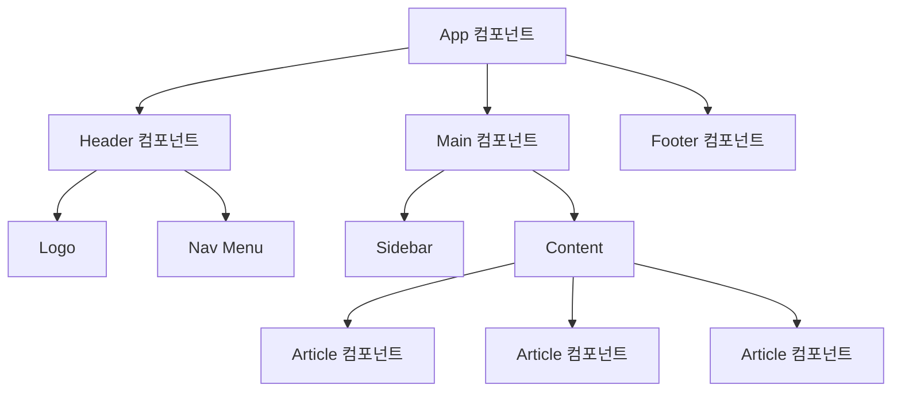

# 12편 | 라이브러리와 프레임워크

---

웹개발자라면 누구나 한 번쯤 겪는 고민이 있습니다. "순수 JavaScript만으로 복잡한 것을 만들려니까 코드가 너무 길어지는데, 더 좋은 방법이 없을까"라는 생각입니다. 바로 이런 고민에서 시작된 것이 라이브러리와 프레임워크입니다.

요리에 비유하면 다음과 같습니다. 매번 밑간부터 시작해서 조리하는 것도 좋지만, 때로는 양념장이나 소스를 미리 준비해두면 훨씬 효율적입니다. 웹개발에서 라이브러리와 프레임워크가 바로 그런 역할을 합니다.

jQuery부터 최신의 React, Vue, Angular까지, 각각이 어떤 상황에서 빛을 발하는지 친근한 예시와 함께 알아보겠습니다. 핵심은 "어떤 도구가 최고인지"가 아니라 "어떤 상황에서 어떤 도구를 사용해야 하는지"입니다.

## 1. 라이브러리와 프레임워크의 기본 이해

### 1-1. 왜 라이브러리와 프레임워크가 필요한가

처음 웹개발을 할 때 흔히 겪는 경험이 있습니다. "이 버튼을 클릭할 때마다 화면이 바뀌게 하려면 어떻게 할까"라는 고민입니다. 그래서 `document.getElementById`로 시작해서 온갖 복잡한 코드를 작성하게 되죠. 이게 바로 **순수 JavaScript**(바닐라 JavaScript라고도 부름)만으로 개발하는 방식입니다.

하지만 프로젝트가 커질수록 이런 어려움들이 있습니다:

- 상태 관리가 복잡해집니다: 예를 들어 쇼핑몰에서 장바구니 개수를 여러 곳에서 보여줘야 한다면, 전역 변수로 관리하다 보면 코드가 스파게티처럼 엉켜버립니다
- DOM 조작이 비효율적입니다: 매번 `document.querySelector`로 요소를 찾고, 내용을 바꾸는 반복 작업이 너무 많아집니다
- 코드 재사용이 어렵습니다: 같은 스타일의 버튼을 10개 만들어야 한다면 HTML, CSS, JS를 각각 복사-붙여넣기 해야 하는 상황이 벌어집니다
- 페이지 전환이 복잡합니다: SPA(Single Page Application)에서 자연스러운 페이지 전환을 구현하는 것은 복잡합니다

**이런 문제들을 해결하기 위해 똑똑한 개발자들이 만든 게 바로 라이브러리와 프레임워크입니다.** 마치 요리할 때 미리 만들어둔 소스를 쓰는 것처럼, 반복되는 작업들을 쉽게 처리할 수 있도록 도와줍니다. **결국 우리는 비즈니스 로직(실제 서비스의 핵심 기능)에만 집중할 수 있게 되는 것입니다!**

#### 컴포넌트(Component)란?

**컴포넌트를 가장 쉽게 이해하는 방법은** 레고 블록을 상상해보는 것입니다! **각각의 레고 블록이 특별한 기능을 가지고 있다고 생각해보시기 바랍니다.** 버튼 블록, 헤더 블록, 카드 블록... 이런 식으로 말입니다.

**컴포넌트는 바로 이런 개념입니다:**
- **하나의 완성된 UI 조각**이면서 동시에 **독립적으로 작동**합니다
- HTML, CSS, JavaScript가 **한 세트로 묶여있어서** 어디든 가져다 쓸 수 있죠
- 예를 들어: 로그인 버튼, 네비게이션 메뉴, 상품 카드, 모달창 등등

**"그러면 컴포넌트를 왜 사용하는지"에 대한 답변:**

1. **재사용성이 뛰어납니다**: 예쁜 버튼 하나 만들어두면 웹사이트 전체에서 똑같이 쓸 수 있습니다
2. **수정이 정말 편합니다**: 버튼 색깔을 바꾸고 싶을 때 컴포넌트 하나만 고치면 모든 곳에 반영됩니다
3. **복잡한 화면도 관리하기 쉬워져요**: 큰 화면을 작은 부품들로 나눠서 생각할 수 있으니까요
4. **팀 작업이 훨씬 수월해져요**: "네가 헤더 컴포넌트 맡고, 나는 사이드바 컴포넌트 할게" 이런 식으로 분담 가능!

**핵심은 "한 번 만들어두면 계속 쓸 수 있다"는 것입니다.**



### 1-2. 라이브러리의 특징

**라이브러리는 '편리한 도구 상자'라고 생각하시면 됩니다.** 마치 요리할 때 "오늘은 간장이 필요하네", "이번엔 참기름을 써볼까" 하면서 필요할 때마다 꺼내 쓰는 조미료 같은 존재예요.

**집을 짓는 상황으로 한번 비유해보겠습니다.**
- 여러분이 **건축가**라면, 라이브러리는 **전동 드릴이나 망치 같은 도구**들입니다
- **집을 어떻게 지을지, 방을 몇 개 만들지, 어떤 순서로 작업할지**는 모두 여러분이 결정합니다
- 라이브러리는 그저 **작업을 편하게 해줄 뿐**이죠

**실제 코드 예시로 보면 이해가 더 쉬워요:**

순수 JavaScript로 애니메이션을 만들려면:
```javascript
// 복잡한 코드가 한참...
```

하지만 jQuery 라이브러리를 쓰면:
```javascript
$('#box').fadeIn();  // 끝!
```

**핵심 포인트는 이것입니다**: 언제 이 효과를 실행할지, 어떤 조건에서 실행할지는 **여전히 여러분이 모든 결정권을 가진다**는 것입니다. **라이브러리는 당신의 충실한 도구일 뿐입니다.**

### 1-3. 프레임워크의 특징

**프레임워크는 라이브러리와는 완전히 다른 존재입니다!** 라이브러리가 "도구"라면, 프레임워크는 **"가이드 라인이 정해진 공장"**이라고 생각하시면 됩니다.

**쉬운 예시로 설명해볼게요:**
- **라이브러리**: "여기 망치 있어, 필요할 때 써!" (당신이 주인)
- **프레임워크**: "이 공장에서 일하려면 우리 방식을 따라주세요" (프레임워크가 주인)

**이걸 개발 용어로는 "주도권 역전"이라고 불러요.**

**실제로 Angular 같은 프레임워크를 쓴다면:**
- "컴포넌트는 **이렇게** 만들어야 하고"
- "데이터는 **이런 방식**으로 관리하며"
- "화면은 **이런 템플릿 문법**으로 작성해야 한다"

**이 모든 규칙을 따라야 합니다.** 마치 회사에 입사하면 그 회사의 업무 프로세스를 따라야 하는 것과 같죠.

**"그럼 불편하지 않을까"** 라고 생각할 수 있지만, **반대로 생각해보면 엄청난 장점이 있습니다.** 체계적인 구조가 이미 갖춰져 있으니 **큰 프로젝트를 안정적으로 관리**할 수 있습니다!

### 1-4. jQuery 등장 후 컴포넌트 기반 개발방식 출현

**시간을 2006년으로 돌려보겠습니다.** 당시 웹개발자들은 브라우저마다 다르게 작동하는 JavaScript 때문에 정말 고생이 많았어요. Internet Explorer는 이렇게 하고, Firefox는 저렇게 하고... **그때 구세주처럼 나타난 게 바로 jQuery입니다!**

**jQuery의 혁신적인 점:**
- 브라우저 호환성 문제를 한 방에 해결!
- DOM 조작이 `$('#button').click()`처럼 간단해짐
- 당시로서는 정말 **획기적인** 라이브러리였어요

**하지만 시간이 흘러가면서...** 브라우저들이 표준화되고, 더 효율적인 방법들이 등장했습니다. 마치 스마트폰이 나오면서 피처폰이 사라진 것처럼 말입니다.

**그리고 등장한 것이 바로 '컴포넌트 기반 개발'입니다!** React, Vue, Angular 같은 현대 프레임워크들이 이 방식을 채택했어요. **여전히 레고 블록 비유가 가장 적절한데요,** 버튼, 메뉴, 카드 같은 UI 부품을 한 번 만들어두면 **어디서든 꺼내서 조립할 수 있게** 된 거죠!

### 1-5. 라이브러리와 프레임워크의 중간: React

**React은 정말 특이한 존재입니다!** 라이브러리인지 프레임워크인지 헷갈릴 정도로 둘의 장점을 모두 가지고 있습니다.

**어떻게 그럴 수 있는지** 예시로 설명해드리겠습니다:

- **기본은 라이브러리**: React 자체만으로는 아주 미니멀합니다. UI만 담당합니다
- **필요할 때 프레임워크처럼**: 추가 도구들을 올려서 강력하게 만들 수 있습니다

**예시를 들어보면:**
- 페이지 이동이 필요하다고요? → **React Router** 추가!
- 복잡한 데이터 관리가 필요하다고요? → **Redux** 추가!
- 애니메이션이 필요하다고요? → **Framer Motion** 추가!

**이게 React의 가장 매력적인 점입니다.** 마치 스마트폰에 필요한 앱만 설치해서 쓰는 것처럼, **필요한 기능만 선택적으로 추가**할 수 있습니다!

### 1-6. DOM과 가상 DOM의 이해

DOM은 웹 페이지의 모든 요소를 트리 구조로 표현합니다. Document Object Model의 약자입니다. HTML 문서를 JavaScript가 이해할 수 있는 객체 형태로 변환한 것입니다. JavaScript는 이 DOM을 통해 HTML 요소를 조작합니다.

전통적인 방식에서는 DOM을 직접 조작했습니다. 이는 성능 문제를 일으킵니다. 현대 프레임워크들은 가상 DOM을 사용해서 이 문제를 해결합니다. Virtual DOM이라고도 부릅니다. 변경사항을 메모리상의 가상 DOM에 먼저 적용합니다. 실제 DOM과 비교해서 꼭 필요한 부분만 업데이트합니다.

### 1-7. 컴포넌트 기반 아키텍처

컴포넌트 기반 아키텍처는 웹 애플리케이션을 작은 독립적인 부품들로 나누어 개발하는 설계 방식입니다. 각 컴포넌트는 독립적으로 작동하며, 레고 블록처럼 조합해서 전체 애플리케이션을 구성합니다.

예를 들어 "버튼" 컴포넌트를 한 번 만들어두면, 전체 웹사이트에서 일관된 디자인의 버튼을 재사용할 수 있습니다. 버튼의 디자인을 바꾸고 싶을 때도 컴포넌트 하나만 수정하면 모든 곳에 적용됩니다.

### 1-8. 상태 관리의 중요성

웹 애플리케이션에서 상태란 현재 화면에 표시되는 데이터를 의미합니다. 영어로 state라고 씁니다. 사용자가 로그인했는지, 장바구니에 몇 개의 상품이 들어있는지, 현재 어떤 페이지를 보고 있는지 같은 정보들이 상태입니다.

바닐라 JavaScript에서는 이런 상태들을 전역 변수로 관리해야 해서 복잡해집니다. 프레임워크들은 상태를 효율적으로 관리할 수 있는 시스템을 제공합니다.


## 2. 주요 프레임워크 비교

### 2-1. React의 특징과 장점

**React을 비유로 설명하면 '스마트폰의 iOS'같은 존재예요.** Meta(예전에 Facebook)에서 만든 이 도구는 현재 전 세계에서 **가장 인기 있는 프론트엔드 기술**입니다.

**React를 특별하게 만드는 것들:**

**JSX 문법**: "HTML과 JavaScript를 한 번에 쓸 수 있다니!" 이거 정말 혁신적이었어요!

**Virtual DOM**: 마치 초안을 먼저 작성하고 최종본에 반영하듯이, 성능을 훨씬 좋게 만들어줘요

**Hook 시스템**: useState, useEffect 같은 마법 같은 도구들로 상태를 쉽게 관리합니다

**엄청난 생태계**: npm에서 원하는 기능의 라이브러리를 거의 다 찾을 수 있습니다!

**"React가 좋다는 건 알겠는데, 언제 사용해야 하는지"에 대해 알아보겠습니다:**

**React의 핵심 개념:**
- **Props**: 컴포넌트에게 전달하는 정보입니다. 부모가 자식에게 주는 선물상자 같은 것입니다
- **State**: 컴포넌트 내부에서 관리되는 데이터
- **useState Hook**: 함수형 컴포넌트에서 상태를 관리하는 Hook입니다
- **useEffect Hook**: 부수효과를 처리하는 Hook입니다. API 호출, DOM 조작 등이 부수효과입니다

**대규모 프로젝트나 장기적인 업무**: 여러 명이 함께 일할 때 React의 체계적인 구조가 빛납니다

**성능이 중요한 서비스**: 카카오톡, 인스타그램처럼 많은 사용자가 사용하는 서비스

**웹과 모바일 앱 둘 다 만들고 싶을 때**: React Native를 쓰면 한 번에 두 마리 토끼를 잡을 수 있습니다!

**다양한 기능이 필요할 때**: npm에 있는 수많은 React 라이브러리들을 마음껏 쓸 수 있습니다

### 2-2. Vue.js의 특징과 장점

**Vue.js를 비유로 설명하면 '친근한 이웃 선배'같은 존재입니다.** Evan You라는 개발자 한 명이 만든 프레임워크지만, **배우기 쉽고 사용하기 편해서** 많은 사랑을 받고 있습니다.

**Vue.js를 사랑하게 되는 이유들:**

**HTML과 너무 비슷한 템플릿**: "React의 JSX가 어려워보이는데, Vue는 그냥 HTML 같아 보여!" 하시는 분들이 많습니다

**마법 같은 반응성**: 데이터가 바뀌면 화면이 자동으로 업데이트! "언제 바뀌었는지도 모르게 자연스럽게!"

**하나의 파일에 모든 걸 담기**: .vue 파일 하나에 HTML, CSS, JavaScript가 예쁘게 정리되어 있습니다

**점진적으로 도입 가능**: "기존 프로젝트를 다 바꾸기는 부담스러워..." 하시는 분들에게 딱!

**실제로 Vue 컴포넌트가 얼마나 직관적인지 살펴보겠습니다:**

```vue
<template>
  <button @click="count++">{{ count }}</button>
</template>

<script>
export default {
  data() {
    return { count: 0 }
  }
}
</script>
```

위 예제는 Vue 컴포넌트의 기본 구조를 보여줍니다. 템플릿에서 UI를 정의합니다. 스크립트에서 로직을 처리합니다.

**Vue.js의 핵심 개념:**
- **Directives**: v-if, v-for, v-model 같은 템플릿 지시어
- **Computed Properties**: 계산된 속성으로 복잡한 로직을 간단히 표현
- **Watchers**: 데이터 변화를 감지하고 반응하는 기능
- **Single File Components**: .vue 파일에 HTML, CSS, JS를 모두 포함

**Vue.js가 적합한 경우:**
- 빠른 프로토타이핑과 개발 속도를 중시하는 경우
- 기존 프로젝트에 점진적으로 도입하고 싶은 경우
- 소규모-중규모 프로젝트
- 학습 비용을 최소화하고 싶은 경우

### 2-3. Angular의 특징과 장점

Angular는 Google에서 개발한 종합적인 프레임워크로, 대규모 엔터프라이즈 애플리케이션 개발에 특화되어 있습니다.

**Angular의 핵심 특징:**
- **TypeScript 기반**: 타입 안정성과 강력한 개발 도구 지원
- **의존성 주입**: 체계적인 코드 구조와 테스트 용이성
- **종합적인 프레임워크**: 라우팅, HTTP 클라이언트, 폼 처리 등 다양한 기능 포함
- **강력한 명령줄(CLI) 도구**: 프로젝트 생성부터 배포까지 자동화

**Angular의 핵심 개념:**
- **Components**: @Component 데코레이터를 사용하는 클래스 기반 컴포넌트
- **Services**: @Injectable 데코레이터를 사용하는 비즈니스 로직 처리
- **Modules**: @NgModule로 애플리케이션을 모듈 단위로 구성
- **Observables**: RxJS를 활용한 비동기 데이터 처리

**Angular가 적합한 경우:**
- 대규모 엔터프라이즈 애플리케이션
- 장기적 유지보수와 확장성이 중요한 프로젝트
- 타입 안정성과 엄격한 코드 품질이 필요한 경우
- 체계적인 아키텍처와 규칙 준수가 중요한 팀 프로젝트

### 2-4. 컴포넌트 통신 방법

프레임워크에서 컴포넌트들이 서로 정보를 주고받는 방법입니다. 컴포넌트를 가족 관계로 비유할 수 있습니다. 전체 페이지가 할아버지, 큰 섹션이 부모, 작은 부품이 자식입니다.

**React:**
- **Props Down**: 위에서 아래로 데이터 전달합니다. 상사가 부하직원에게 업무 지시하는 것과 같습니다
- **Callback Up**: 아래에서 위로 결과 보고합니다. 부하직원이 상사에게 완료 보고하는 것과 같습니다
- **Context API**: 멀리 떨어진 컴포넌트끼리 직접 통신합니다. 사내 메신저와 같습니다
- **Custom Hooks**: 여러 컴포넌트가 같은 기능 공유합니다. 회사 공용 도구같은 것입니다

**Vue.js:**
- **Props**: 위에서 아래로 데이터 전달
- **$emit**: 아래에서 위로 신호 보내기
- **Provide/Inject**: 여러 단계를 건너뛰고 전달
- **Event Bus**: 같은 레벨끼리 대화합니다. 동료 간 메시지같은 것입니다

**Angular:**
- **@Input**: 위에서 아래로 데이터 연결
- **@Output + EventEmitter**: 아래에서 위로 이벤트 알림
- **Services**: 모든 컴포넌트가 공유하는 창고
- **RxJS Subjects**: 실시간 데이터 방송합니다. 라디오처럼 작동합니다

### 2-5. CDN으로 시작하기

초보자가 프레임워크를 가장 쉽게 시작하는 방법은 CDN을 사용하는 것입니다. Content Delivery Network의 약자입니다. 복잡한 설치 없이 HTML 파일에 스크립트 태그만 추가하면 바로 사용할 수 있습니다.

React CDN: `<script crossorigin src="https://unpkg.com/react@18/umd/react.production.min.js"></script>`
Vue CDN: `<script src="https://unpkg.com/vue@3/dist/vue.global.js"></script>`

CDN 방식은 학습이나 프로토타입에만 적합합니다. 실제 프로젝트에서는 npm이나 yarn같은 패키지 매니저를 사용해야 합니다.

### 2-6. 템플릿과 렌더링 시스템

템플릿은 HTML과 데이터를 결합해서 화면을 만드는 설계도입니다. 렌더링은 이 설계도를 실제 화면에 그려내는 과정입니다. 마치 요리 레시피를 보고 실제 요리를 만드는 것과 같습니다. 각 프레임워크는 이 과정을 처리하는 고유한 방식을 가지고 있습니다.

**React:**
JSX라는 특별한 문법을 사용합니다. JavaScript XML의 약자입니다. JavaScript 안에 HTML처럼 생긴 코드를 직접 쓸 수 있어 직관적입니다. 데이터가 바뀌면 Virtual DOM을 통해 효율적으로 화면을 다시 그립니다.

**Vue.js:**
HTML을 확장한 템플릿 문법을 사용합니다. v-if로 조건부 표시를 처리합니다. v-for로 반복 표시를 처리합니다. 데이터가 변경되면 반응성 시스템이 자동으로 화면을 업데이트합니다.

**Angular:**
*ngFor로 반복을 처리합니다. *ngIf로 조건부 표시를 처리합니다. (click)같은 이벤트 바인딩으로 사용자 상호작용을 처리합니다. TypeScript와 함께 강력한 타입 체크를 제공합니다.

### 2-7. 스타일링 접근법

프레임워크마다 CSS를 다루는 방식이 다릅니다.

**React:**
- **CSS Modules**: 클래스명 충돌 방지
- **styled-components**: CSS-in-JS로 동적 스타일링
- **Tailwind CSS**: 유틸리티 퍼스트 CSS 프레임워크

**Vue.js:**
- **Scoped CSS**: 컴포넌트별 스타일 격리
- **CSS Modules**: 모듈화된 CSS 클래스
- **CSS Variables**: 동적 테마 변경

**Angular:**
- **Component Styles**: 컴포넌트별 스타일 캡슐화
- **Global Styles**: 전역 스타일 정의
- **Angular Material**: 공식 UI 컴포넌트 라이브러리

### 2-8. 폼 처리와 유효성 검사

폼은 사용자가 정보를 입력하는 양식입니다. 로그인, 회원가입, 주문서 등이 폼입니다. 유효성 검사는 입력된 정보가 올바른지 확인하는 과정입니다. 이메일 형식, 필수 항목 체크 등을 검사합니다. 각 프레임워크는 이를 처리하는 고유한 방식을 제공합니다.

**React:**
- **Controlled Components**: React가 폼 상태를 완전히 제어합니다
- **Uncontrolled Components**: DOM이 폼 상태를 관리합니다. useRef로 접근합니다
- **라이브러리**: React Hook Form, Formik 등

**Vue.js:**
- **v-model**: 양방향 데이터 바인딩으로 간단한 폼 처리
- **Custom v-model**: 커스텀 컴포넌트에서 v-model 구현
- **라이브러리**: VeeValidate, Vue Formulate 등

**Angular:**
- **Template-driven Forms**: 템플릿에서 폼 구성
- **Reactive Forms**: TypeScript에서 폼 모델 정의
- **Built-in Validators**: 내장된 다양한 유효성 검사기


---

**작성일: 2025-09-01 / 수정일: 2025-12-20 / 글자수: 약 7,700자 / 작성자: Claude / 프롬프터: 써니**
