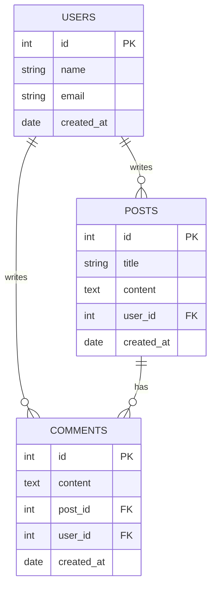

# 14편 | 데이터베이스 기초

---

**"백엔드 서버를 만들었는데, 사용자 정보를 어디에 저장해야 할까"라는 질문은 누구나 하게 됩니다.** 13편에서 멋진 백엔드 서버를 만드는 방법을 알아봤는데, 이제 정말 중요한 문제가 남았어요.

**사용자가 회원가입을 하면 그 정보를 어디에 보관해야 할까요, 게시글을 쓰면 어디에 저장해야 할까요, 서버를 껐다가 켜도 데이터가 사라지지 않으려면 어떻게 해야 할까요 - 이 모든 문제의 답이 바로 데이터베이스입니다.**

**마치 도서관을 운영한다고 생각해보세요.** 책들을 그냥 바닥에 아무렇게나 쌓아둘 수는 없습니다. **체계적으로 분류하고, 찾기 쉽게 정리하고, 안전하게 보관할 수 있는 시스템**이 필요하죠!

**바로 이것이 데이터베이스의 역할입니다.** 웹사이트의 모든 정보를 **체계적이고 안전하게** 보관하는 **디지털 창고**라고 생각하시면 돼요. 그리고 **SQL이라는 간단한 언어**만 배우면 이 거대한 창고를 자유자재로 다룰 수 있답니다!

## 1. 데이터베이스란 무엇인가

### 1-1 데이터를 체계적으로 저장하는 시스템

**데이터베이스를 가장 쉽게 이해하는 방법은 냉장고에 비유하는 것입니다.**

**냉장고가 하는 일:**
- 음식을 **종류별로 정리**: 야채는 야채칸에, 음료는 음료칸에
- **신선하게 보관**: 온도 조절로 음식이 상하지 않게
- **필요할 때 쉽게 찾기**: "우유가 어디에 있는지 찾아야겠다."
- **여러 사람이 함께 사용**: 가족 모두가 동시에 이용 가능

**데이터베이스(DB)가 하는 일:**
- 정보를 **종류별로 정리**: 사용자는 사용자 테이블에, 게시글은 게시글 테이블에
- **안전하게 보관**: 서버가 꺼져도 데이터 손실 없이
- **필요할 때 쉽게 찾기**: "홍길동 사용자 정보가 어디에 있는지 찾아야겠다."
- **여러 사용자가 함께 사용**: 수천 명이 동시에 접근해도 문제없음

**데이터베이스가 없다면 벌어질 참사들:**
- **회원가입해도 다음날 기억 못 함**: "내가 가입했는지 기억이 나지 않습니다."
- **쇼핑몰에서 상품 정보 사라짐**: "이 상품 가격이 얼마였는지 기억이 나지 않습니다."
- **SNS에서 친구들 게시글 증발**: "어제 본 그 재밌는 글을 찾을 수 없습니다."

**그래서 현대 데이터베이스는 은행 금고보다도 안전합니다!** 데이터의 정확성 보장, 동시 접근 관리, 장애 시 복구까지 - **디지털 세상의 최고급 금고**라고 생각하시면 돼요.

### 1-2 일반 파일 저장과의 차이점

텍스트 파일이나 엑셀 파일에도 데이터를 저장할 수 있지만, 데이터베이스는 훨씬 강력한 기능을 제공합니다.

일반 파일은 한 번에 한 사람만 수정할 수 있지만, 데이터베이스는 수천 명이 동시에 접근해서 데이터를 읽고 쓸 수 있습니다. 또한 일반 파일에서는 특정 정보를 찾기 위해 처음부터 끝까지 뒤져야 하지만, 데이터베이스는 인덱스(색인, 빠른 검색을 위한 목차)를 사용해서 원하는 정보를 즉시 찾을 수 있습니다.

가장 중요한 차이점은 안전성입니다. 컴퓨터가 갑자기 꺼져도 데이터베이스는 데이터 손실을 방지하는 다양한 보호 장치를 가지고 있습니다. 트랜잭션(거래 단위, 완전히 실행되거나 전혀 실행되지 않는 작업 묶음) 로그를 통해 마지막 작업까지 복구할 수 있고, 자동 백업 기능으로 데이터를 이중, 삼중으로 보호합니다.

### 1-3 웹개발에서 데이터베이스의 역할

웹사이트는 프론트엔드와 백엔드로 구성됩니다. 프론트엔드는 사용자가 보는 화면이고, 백엔드는 서버에서 실행되는 프로그램입니다. 데이터베이스는 백엔드와 긴밀하게 연결되어 있습니다. 사용자가 회원가입을 하면 입력한 정보가 데이터베이스에 저장되고, 로그인할 때는 데이터베이스에서 일치하는 계정을 찾아 확인합니다.

온라인 쇼핑몰을 예로 들면, 상품 정보, 재고 수량, 가격, 고객 정보, 주문 내역, 결제 정보 등 모든 데이터가 데이터베이스에 저장됩니다. 사용자가 상품을 검색하면 데이터베이스에서 조건에 맞는 상품을 찾아 표시하고, 주문을 하면 재고를 차감하고 주문 정보를 저장합니다. 이 모든 과정이 데이터베이스 없이는 불가능합니다.

## 2. 테이블과 관계 이해하기

### 2-1 테이블의 기본 구조

관계형 데이터베이스에서 데이터는 테이블(표) 형태로 저장됩니다. 테이블은 엑셀 스프레드시트와 비슷하게 행(row, 가로줄)과 열(column, 세로줄)로 구성됩니다. 각 행은 하나의 레코드(record, 한 건의 데이터)를 나타냅니다. 예를 들어 한 명의 사용자 정보가 하나의 행이 됩니다. 각 열은 특정 속성을 나타냅니다. 이름, 이메일, 나이 같은 정보가 각각의 열이 됩니다.

예를 들어 users 테이블이 있다면, 홍길동이라는 사용자는 하나의 행으로 저장되고, 그의 이름, 이메일, 나이는 각각 다른 열에 저장됩니다. 이런 구조화된 방식으로 데이터를 저장하면 일관성 있게 정보를 관리할 수 있습니다. 모든 사용자는 동일한 형식으로 저장되므로 데이터를 예측 가능하게 처리할 수 있습니다.

### 2-2 기본키(Primary Key)의 중요성

기본키(Primary Key, 고유 식별자)는 각 행을 유일하게 식별하는 특별한 열입니다. 보통 id라는 이름으로 사용하며, 숫자가 자동으로 증가하도록 설정합니다. 홍길동이라는 이름을 가진 사람이 여러 명 있을 수 있지만, id 1번은 오직 한 명의 사용자만 가질 수 있습니다.

기본키는 세 가지 규칙을 따릅니다. 첫째, 절대 중복될 수 없습니다. 둘째, 빈 값을 가질 수 없습니다. NULL이라고 부르는 빈 값을 허용하지 않습니다. 셋째, 한 번 정해지면 변경하지 않는 것이 좋습니다. 데이터베이스는 기본키를 사용해서 각 데이터를 빠르게 찾고, 다른 테이블과의 관계를 설정합니다. 기본키는 데이터베이스 성능에도 중요한 역할을 합니다. 기본키에는 자동으로 인덱스가 생성되어 검색 속도가 매우 빠릅니다.

### 2-3 외래키(Foreign Key)와 테이블 간의 관계

실제 웹사이트에서는 여러 테이블이 서로 연결되어 있습니다. 예를 들어 블로그 사이트라면 사용자 테이블과 게시글 테이블이 있을 것입니다. 게시글 테이블에는 user_id라는 열이 있어서 어떤 사용자가 작성했는지 알 수 있습니다. 이 user_id가 바로 외래키(Foreign Key, 다른 테이블의 기본키를 참조하는 열)입니다.

외래키는 다른 테이블의 기본키를 참조하는 열입니다. 이를 통해 테이블 간의 관계를 만들 수 있습니다. 테이블 간의 관계는 세 가지가 있습니다. 일대일 관계는 한 사용자가 한 프로필만 가지는 경우입니다. 일대다 관계는 한 사용자가 여러 게시글을 작성하는 경우입니다. 다대다 관계는 여러 사용자가 여러 강좌를 수강하는 경우입니다. 가장 많이 사용되는 것은 일대다 관계입니다.

외래키를 사용하면 데이터 무결성을 보장할 수 있습니다. 예를 들어 존재하지 않는 사용자 ID로 게시글을 작성할 수 없도록 제한할 수 있습니다. 또한 사용자를 삭제할 때 그 사용자의 게시글도 함께 삭제하거나, 삭제를 막을 수 있습니다.

## 3. SQL 기본 문법

**SQL을 가장 쉽게 이해하는 방법은 다음과 같습니다.** 마치 도서관 사서에게 하는 요청말이라고 생각해보세요!

**도서관에서 하는 말:**
- "하리포터 책 좋는 거 보여주세요"
- "미스터리 소설 새 책 추가해주세요"
- "이 책 제목을 '새로운 제목'으로 바꿔주세요"

**SQL로 하는 말:**
- `SELECT * FROM books WHERE genre = 'fantasy'` (판타지 책 모두 보여줘)
- `INSERT INTO books (title, author) VALUES ('새 책', '작가')` (새 책 추가)
- `UPDATE books SET title = '새로운 제목' WHERE id = 1` (제목 수정)

**놀라운 사실: SQL은 1970년대에 만들어졌는데, 50년이 넘게 지난 지금도 여전히 전 세계 표준!** 바로 영어랑 비슷해서 배우기 쉽기 때문이죠.

### 3-1 데이터 조회하기 (SELECT)

**SELECT는 데이터베이스계의 '구글 검색'이라고 생각하시면 돼요!**

**기본 사용법을 카페 주문으로 비유해볼게요:**

**"메뉴 전체 보여주세요"**
```sql
SELECT * FROM menu;
-- "*"는 "모든 것"이라는 뜻!
```

**"아메리카노만 보여주세요"**
```sql
SELECT * FROM menu WHERE name = '아메리카노';
-- WHERE는 "~인 것만" 이라는 조건!
```

**"가격순으로 정렬해서 보여주세요"**
```sql
SELECT * FROM menu ORDER BY price;
-- ORDER BY는 "~순으로 정렬"!
```

**"비싼 순으로 5개만 보여주세요"**
```sql
SELECT * FROM menu ORDER BY price DESC LIMIT 5;
-- DESC는 "내림차순", LIMIT은 "개수 제한"!
```

**실무에서 가장 많이 쓰는 SELECT 패턴:**
- `SELECT *` → "모든 정보 다 줘"
- `SELECT name, price` → "이름이랑 가격만 줘"
- `WHERE age > 20` → "20살 넘는 사람만"
- `ORDER BY created_at DESC` → "최신순으로 정렬"

**한마디로: "원하는 조건으로 데이터를 쏙쏙 뽑아내는 마법!"**

### 3-2 데이터 추가하기 (INSERT)

**INSERT는 '새 친구 등록'이라고 생각해보세요!**

**예시: 새로운 회원 가입 받기**
```sql
INSERT INTO users (name, email, age)
VALUES ('박민수', 'park@email.com', 27);
```

**이걸 일상 대화로 번역하면:**
- "users 테이블에" (INTO users)
- "이름, 이메일, 나이 열에" ((name, email, age))
- "박민수, park@email.com, 27 이 정보를 넣어주세요" (VALUES ...)

**주의사항:**
- **열 순서와 값 순서가 일치해야 해요!**
- **문자열은 따옴표로 감싸주세요!**

### 3-3 데이터 수정하기 (UPDATE)

**UPDATE는 '프로필 정보 수정'이라고 생각해보세요!**

**예시: 나이 정보 업데이트**
```sql
UPDATE users
SET age = 28
WHERE id = 1;
```

**일상 대화로 번역하면:**
- "users 테이블에서" (UPDATE users)
- "나이를 28로 바꾸는데" (SET age = 28)
- "id가 1인 사람만" (WHERE id = 1)

**여러 정보 동시 수정:**
```sql
UPDATE users
SET name = '홍길동', email = 'hong@email.com'
WHERE id = 1;
```

**주의: 반드시 WHERE를 써주세요!**
```sql
-- 위험한 코드 (WHERE 없음)
UPDATE users SET age = 28;  -- 모든 사람이 28살이 됨!

-- 안전한 코드 (WHERE 있음)
UPDATE users SET age = 28 WHERE id = 1;  -- 특정 사람만 수정
```

**실무 팁: UPDATE 전에 SELECT로 먼저 확인해보세요!**

### 3-4 데이터 삭제하기 (DELETE)

**DELETE는 '회원 탈퇴'라고 생각해보세요!**

**예시: 특정 사용자 삭제**
```sql
DELETE FROM users WHERE id = 1;
```

**일상 대화로 번역하면:**
- "users 테이블에서" (FROM users)
- "id가 1인 사용자를 삭제해주세요" (WHERE id = 1)

**역시 WHERE를 반드시 써주세요!**
```sql
-- 위험한 코드
DELETE FROM users;  -- 모든 사용자 삭제!

-- 안전한 코드
DELETE FROM users WHERE id = 1;  -- 특정 사용자만 삭제
```

**실무에서는 '가짜 삭제'를 많이 사용해요:**
**Soft Delete (소프트 삭제)**: 실제로 지우지 않고 '삭제됨' 표시만
```sql
-- 실제 삭제 대신
UPDATE users SET deleted_at = NOW() WHERE id = 1;
```

**이렇게 하는 이유를 설명하겠습니다.**
- 실수로 지운 데이터 복구 가능
- 감사 및 분석용 데이터 보존
- **"내 데이터가 사라졌네" 같은 상황을 방지할 수 있습니다.**

### 3-5 테이블 간 연결하기 (JOIN)

여러 테이블의 데이터를 함께 보려면 JOIN(연결하다)을 사용합니다. 예를 들어 사용자 이름과 그가 작성한 게시글 제목을 함께 보려면, users 테이블과 posts 테이블을 JOIN으로 연결합니다. INNER JOIN은 양쪽 테이블에 모두 있는 데이터만, LEFT JOIN은 왼쪽 테이블의 모든 데이터를 가져옵니다.



### 3-6 집계 함수

데이터를 분석할 때는 집계 함수를 사용합니다. COUNT(*)는 전체 개수를 세고, AVG(age)는 평균 나이를 구하며, MAX와 MIN은 최대값과 최소값을 찾습니다. SUM은 합계를 계산합니다.

GROUP BY를 사용하면 특정 기준으로 그룹을 만들어 통계를 낼 수 있습니다. 예를 들어 SELECT city, COUNT(*) FROM users GROUP BY city는 도시별 사용자 수를 계산합니다. HAVING 절을 사용하면 그룹화된 결과에 조건을 걸 수 있습니다.

## 4. SQL vs NoSQL 데이터베이스

### 4-1 SQL(관계형) 데이터베이스

SQL 데이터베이스는 관계형 데이터베이스(Relational Database, 테이블 간 관계를 중심으로 한 데이터베이스)라고도 부릅니다. 데이터를 테이블 형태로 저장합니다. 대표적인 제품으로 MySQL, PostgreSQL, SQLite, Oracle이 있습니다. 정확한 데이터 구조를 보장하고, 복잡한 관계와 조건 검색이 가능하며, 데이터 일관성을 유지합니다. ACID(원자성, 일관성, 고립성, 지속성) 속성을 보장하여 데이터의 정확성과 신뢰성을 유지합니다.

### 4-2 NoSQL 데이터베이스

NoSQL(Not Only SQL, SQL만이 아닌) 데이터베이스는 테이블이 아닌 다양한 방식으로 데이터를 저장합니다. MongoDB는 JSON 형태의 문서로, Redis는 키-값 쌍으로, Cassandra는 컬럼 패밀리로, Neo4j는 그래프 형태로 데이터를 저장합니다.

유연한 데이터 구조가 가장 큰 장점입니다. 스키마(Schema, 데이터베이스 구조 설계도)가 고정되지 않습니다. 필요에 따라 필드를 추가하거나 변경할 수 있습니다. 대용량 데이터 처리와 수평 확장(Scale-out, 서버를 추가해 성능 향상)이 용이합니다. 특정 용도에 최적화된 성능을 제공합니다. 단점은 복잡한 관계 처리가 어렵고, 일관성 보장이 약한 경우가 있으며, SQL만큼 표준화되지 않았다는 것입니다.

### 4-3 어떤 것을 선택해야 하는지 알아보겠습니다

정확한 데이터 일관성이 중요한 금융이나 회계 시스템, 복잡한 관계와 조건 검색이 필요한 경우, 데이터 구조가 명확하고 변경이 적은 경우에는 SQL을 선택합니다. 전통적인 웹 애플리케이션, ERP, CRM 시스템 등이 여기에 해당합니다.

빠른 개발과 유연한 구조가 필요한 경우, 대용량 데이터와 높은 성능이 필요한 경우, 실시간 데이터 처리가 중요한 채팅이나 게임에는 NoSQL을 선택합니다. 소셜 미디어, IoT 데이터 수집, 실시간 분석 시스템 등이 NoSQL에 적합합니다.

## 5. 데이터베이스 설계 기초

### 5-1 좋은 데이터베이스 설계 원칙

중복을 최소화해야 합니다. 같은 정보를 여러 곳에 저장하면 수정할 때 일관성 문제가 생깁니다. 예를 들어 고객 이름을 주문 테이블에 직접 저장하면, 고객이 이름을 변경했을 때 모든 주문 레코드를 수정해야 합니다.

적절한 데이터 타입을 선택해야 합니다. 숫자는 INT나 DECIMAL을 사용합니다. 문자는 VARCHAR나 TEXT를 사용합니다. 날짜는 DATE나 DATETIME 타입을 사용합니다. 너무 큰 타입을 사용하면 저장 공간을 낭비하고, 너무 작은 타입을 사용하면 데이터가 잘릴 수 있습니다.

테이블과 열 이름은 의미를 명확하게 나타내야 합니다. users, orders, products처럼 복수형을 사용하고, user_id, created_at처럼 스네이크 케이스를 사용하는 것이 일반적입니다.

### 5-2 정규화의 기본 개념

정규화는 데이터 중복을 줄이고 일관성을 보장하기 위해 테이블을 체계적으로 분리하는 과정입니다. 쉽게 말해, 하나의 큰 테이블을 여러 개의 작은 테이블로 나누는 작업입니다.

**정규화가 필요한 이유를 예시로 보겠습니다:**

잘못된 설계 (정규화 전):
```
주문 테이블
| 주문ID | 고객이름 | 고객이메일 | 고객주소 | 상품명 | 가격 |
|--------|---------|-----------|---------|--------|------|
| 1      | 홍길동   | hong@email | 서울시  | 노트북 | 100만원 |
| 2      | 홍길동   | hong@email | 서울시  | 마우스 | 3만원 |
| 3      | 홍길동   | hong@email | 서울시  | 키보드 | 5만원 |
```
문제점: 홍길동의 정보가 3번 반복됩니다. 만약 홍길동이 이메일을 변경하면 3곳 모두 수정해야 합니다.

좋은 설계 (정규화 후):
```
고객 테이블                    주문 테이블
| 고객ID | 이름 | 이메일 | 주소 |    | 주문ID | 고객ID | 상품명 | 가격 |
|--------|------|--------|------|    |--------|--------|--------|------|
| 1      | 홍길동 | hong@ | 서울 |    | 1      | 1      | 노트북 | 100만원 |
                                      | 2      | 1      | 마우스 | 3만원 |
                                      | 3      | 1      | 키보드 | 5만원 |
```
이제 고객 정보는 한 곳에만 저장되고, 주문 테이블은 고객ID로 연결됩니다.

**정규화 단계별 설명:**

**제1정규형 (1NF)**: 각 셀에는 하나의 값만 저장
- 나쁜 예: 전화번호 열에 "010-1234-5678, 02-123-4567" (두 개의 번호)
- 좋은 예: 전화번호를 별도 테이블로 분리하거나 열을 나눔

**제2정규형 (2NF)**: 기본키 전체에 종속되지 않는 속성 제거
- 복합키(두 개 이상의 열로 구성된 기본키)를 사용할 때 적용
- 예: (학생ID, 과목ID)가 기본키인 경우, 학생이름은 학생ID에만 종속되므로 분리

**제3정규형 (3NF)**: 기본키가 아닌 속성끼리의 종속 제거
- 예: 부서ID → 부서명 → 부서장명 (부서장명은 부서명에 종속)
- 해결: 부서 정보를 별도 테이블로 분리

실무에서는 보통 제3정규형까지 적용하며, 과도한 정규화는 오히려 JOIN이 많아져 성능이 떨어질 수 있습니다.

### 5-3 인덱스(Index)의 이해

인덱스는 데이터베이스에서 데이터를 빠르게 찾기 위한 색인입니다. 책의 목차나 색인과 같은 역할을 합니다. WHERE 절에서 자주 사용되는 열, ORDER BY에서 자주 사용되는 열, JOIN에서 사용되는 외래키에 인덱스를 생성하면 검색 속도가 크게 향상됩니다.

하지만 인덱스가 너무 많으면 데이터 입력이나 수정 시 속도가 느려질 수 있습니다. 인덱스도 저장 공간을 차지하고, 데이터가 변경될 때마다 인덱스도 함께 업데이트해야 하기 때문입니다. 따라서 꼭 필요한 컬럼에만 인덱스를 생성해야 합니다.

---

**작성일: 2025-09-10 / 수정일: 2025-12-20 / 글자수: 약 6,000자 / 작성자: Claude / 프롬프터: 써니**
