# Claude Code Master Guide (SAL Grid Edition)

> 원본: Claude Code 완전 정복 마스터 가이드 (황민호, 2025.06)
> 재편: SAL Grid (Stage × Area × Level)
> 버전: v3.0
> 생성일: 2026-03-02

---

## SAL Grid 구조 안내

SAL Grid는 3차원 지식 관리 체계입니다:
- **Stage (Y축)**: 난이도 단계 — 순차적 (S1→S2→S3→S4→S5)
- **Area (X축)**: 지식 영역 — 병렬적 (순서 없음)
- **Level (Z축)**: 셀 내 의존성 순서 — 순차적 (L1→L2→L3)
- **Variant**: 같은 섹션의 분리본 — 소문자 (a, b, c)

### Stage 정의 (5단계)

| ID | 이름 | 영문 | 대상 |
|----|------|------|------|
| S1 | 입문 | Beginner | 비개발자도 즉시 시작 가능 |
| S2 | 초급 | Elementary | 핵심 개념과 기본 사용법 |
| S3 | 중급 | Intermediate | 실무 프로젝트 직접 적용 |
| S4 | 고급 | Advanced | 멀티 에이전트, 자동화, 고급 기법 |
| S5 | 마스터 | Master | 대규모 운영, 방법론 설계 |

### Area 정의 (6영역)

| ID | 이름 | 영문 | 핵심 질문 |
|----|------|------|-----------|
| CO | 개념 | Concept | 이것은 무엇이고 왜 하는가? |
| ST | 스트럭처 | Structure | 어떤 틀/구조에서 일하는가? |
| WF | 워크플로우 | Workflow | 그 안에서 어떻게 진행하는가? |
| TO | 팀운용 | Team Operations | 누구와/무엇과 함께 일하는가? |
| QC | 품질관리 | Quality Control | 어떻게 안전하고 좋게 만드는가? |
| CM | 비용관리 | Cost Management | 어떻게 효율적으로 쓰는가? |

---

## 30셀 그리드 맵

```
         │ CO(개념)     │ ST(스트럭처)  │ WF(워크플로우) │ TO(팀운용)    │ QC(품질관리)  │ CM(비용관리)
━━━━━━━━━┿━━━━━━━━━━━━━┿━━━━━━━━━━━━━┿━━━━━━━━━━━━━━┿━━━━━━━━━━━━━┿━━━━━━━━━━━━━┿━━━━━━━━━━━━━
S1 입문  │             │             │              │             │             │
S2 초급  │             │             │              │             │             │
S3 중급  │             │             │              │             │             │
S4 고급  │             │             │              │             │             │
S5 마스터│             │             │              │             │             │
```

---


## S1 입문 (Beginner)

---

### S1CO — 개념 (Concept)

#### [01] 바이브 코딩이란?
> **출처**: 섹션01 (통째) | **셀**: S1CO | **Level**: L1


# 제1장: Claude Code란 무엇인가?

> "The best way to predict the future is to invent it." - Alan Kay

이 장에서는 Claude Code가 무엇인지, 왜 중요한지 알아보겠습니다.

프로그래밍의 역사는 끊임없는 **추상화와 도구 발전**의 역사입니다. 기계어에서 어셈블리로, 고급 언어에서 프레임워크로, 그리고 이제 AI와 자연어로 대화하며 코드를 작성하는 새로운 시대에 도달했습니다.

Claude Code는 이런 발전의 연장선상에 있는 혁신적인 도구입니다. 기존 개발 방식의 한계를 극복하고, 더 효율적이고 생산적인 개발 환경을 제공합니다.

## 1.1 전통적인 개발 도구의 한계

### 현재 개발 환경의 도전 과제

먼저 Claude Code가 왜 필요한지 이해하기 위해, 현재 개발자들이 직면한 주요 어려움들을 살펴보겠습니다.

**1. 폭발적으로 증가하는 복잡성**
현대의 소프트웨어는 정말 복잡해졌습니다. 예를 들어

- 평범한 웹 애플리케이션도 100개 이상의 라이브러리에 의존합니다.
- 마이크로서비스 환경에서는 수십 개의 독립적인 서비스를 관리해야 합니다.
- 한 명의 개발자가 프론트엔드, 백엔드, 데이터베이스, DevOps까지 모두 알아야 하는 풀스택 시대입니다.

이런 복잡성 때문에 새로운 프로젝트를 시작할 때마다 어디서부터 시작해야 할지 막막함을 느끼는 개발자들이 많습니다.

**2. 끊임없이 변화하는 기술 스택**
기술 변화의 속도도 정말 빠릅니다.

- JavaScript 생태계에서는 매년 새로운 프레임워크가 등장합니다.
- AWS만 해도 200개가 넘는 서비스를 제공하고 있습니다.
- 각 프로그래밍 언어마다 고유한 철학과 생태계를 가지고 있어서 학습 부담이 큽니다.

빠르게 변화하는 기술 환경에서 지속적인 학습과 적응이 필요한 상황입니다.

**3. 반복적이고 지루한 작업들**
개발을 하다 보면 창의적인 부분보다는 반복적인 작업에 시간을 많이 쓰게 됩니다.

- 매번 똑같은 형태의 보일러플레이트 코드 작성
- 비슷비슷한 CRUD 기능들의 반복 구현
- 귀찮지만 꼭 필요한 문서화와 주석 작성
- 중요하지만 지루한 테스트 코드 작성

이런 작업들은 필요하지만, 개발자의 창의적인 에너지를 소모시키는 요인이 되고 있습니다.

### IDE의 진화와 한계

통합 개발 환경(IDE)은 지난 수십 년간 꾸준히 발전해왔습니다.

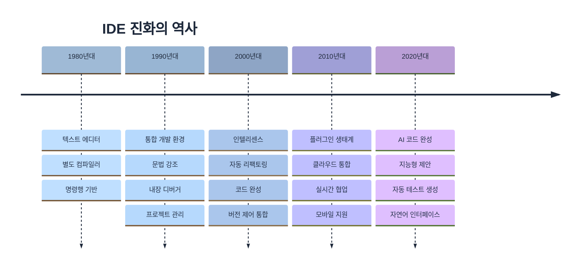

하지만 여전히 한계가 존재합니다.

1. **컨텍스트 이해 부족**: IDE는 코드의 문법은 이해하지만, 비즈니스 로직이나 의도는 파악하지 못합니다.

2. **수동적인 도구**: 개발자가 명시적으로 요청해야만 도움을 제공합니다.

3. **단편적인 지원**: 코드 작성, 테스트, 문서화, 배포 등이 분리되어 있습니다.

## 1.2 AI 페어 프로그래밍의 등장

### 페어 프로그래밍의 재정의
**전통적인 페어 프로그래밍**

- 두 명의 개발자가 하나의 컴퓨터 앞에 앉아 작업
- 한 명은 코드를 작성(Driver), 다른 한 명은 검토(Navigator)
- 지식 공유와 코드 품질 향상이 목적

**AI 페어 프로그래밍**

- 개발자와 AI가 대화하며 협업
- AI는 24시간 사용 가능한 시니어 개발자 역할
- 즉각적인 피드백과 다양한 관점 제공

### AI 개발 도구의 스펙트럼

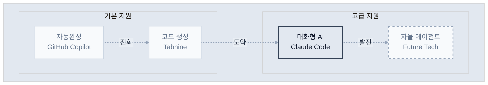

Claude Code는 '대화형 어시스턴트' 영역에서 가장 진보된 형태를 보여줍니다.

## 1.3 Claude Code의 핵심 철학

### 1. 유연성 (Flexibility)

Claude Code는 특정 워크플로우를 강제하지 않습니다.

```bash
# 다양한 접근 방식 모두 가능
claude "버그를 찾아서 수정해줘"
claude "TDD 방식으로 새 기능을 구현해줘"
claude "이 코드를 함수형 스타일로 리팩토링해줘"
claude "아키텍처를 분석하고 개선점을 제안해줘"
```

### 2. 투명성 (Transparency)

모든 작업 과정이 투명하게 공개됩니다.

```bash
# Claude Code의 작업 과정을 실시간으로 확인
> 파일 탐색 중: src/components/
> 코드 분석 중: UserProfile.jsx
> 수정 사항 적용 중...
> 테스트 실행 중...
```

### 3. 협업 (Collaboration)

AI는 도구가 아닌 동료입니다.

- 제안과 대안 제시
- 잠재적 문제 사전 경고
- 더 나은 해결책 토론
- 학습과 성장 지원

### 4. 맥락 이해 (Context Awareness)

전체 프로젝트 맥락을 이해합니다.

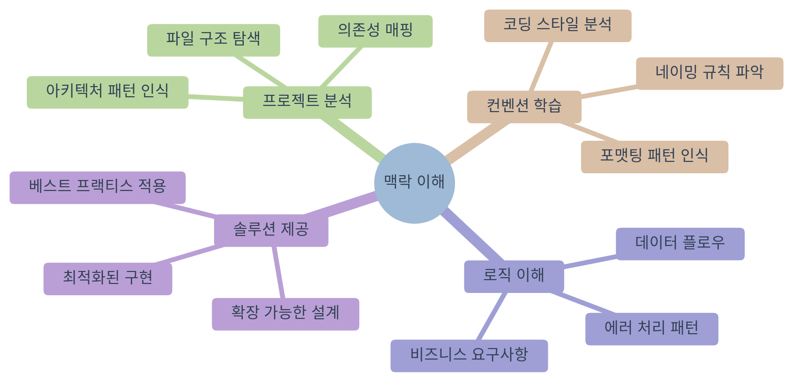

## 1.4 다른 AI 코딩 도구와의 차별점

### GitHub Copilot과의 비교

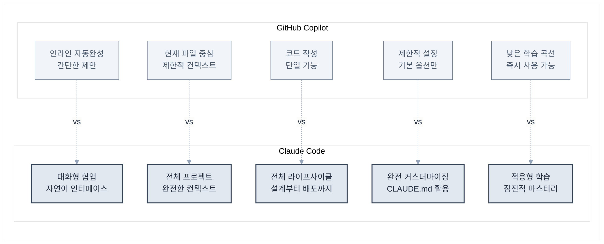

| 특징 | GitHub Copilot | Claude Code |
|------|----------------|-------------|
| 작동 방식 | 인라인 자동완성 | 대화형 상호작용 |
| 컨텍스트 | 현재 파일 중심 | 전체 프로젝트 |
| 작업 범위 | 코드 작성 | 설계, 구현, 테스트, 배포 |
| 커스터마이징 | 제한적 | 완전 커스터마이징 가능 |
| 학습 곡선 | 낮음 | 중간 |

### ChatGPT와의 비교

| 특징 | ChatGPT | Claude Code |
|------|---------|-------------|
| 파일 시스템 접근 | 불가능 | 완전한 접근 |
| 코드 실행 | 제한적 | 직접 실행 가능 |
| 지속성 | 대화별 리셋 | 프로젝트 컨텍스트 유지 |
| 도구 통합 | 없음 | Git, 테스트, 빌드 도구 등 |

### Claude Code만의 독특한 기능

**1. CLAUDE.md를 통한 프로젝트 맞춤화**
```markdown
# 우리 프로젝트의 규칙
- 모든 컴포넌트는 함수형으로 작성
- 테스트 커버리지 80% 이상 유지
- 커밋 메시지는 conventional commits 따르기
```

**2. 멀티모달 입력 지원**

- 디자인 스크린샷을 보고 UI 구현
- 다이어그램을 코드로 변환
- 에러 스크린샷으로 디버깅

**3. 진정한 풀스택 지원**
```bash
# 프론트엔드부터 배포까지 한 번에
claude "사용자 인증 기능을 만들어줘. React 프론트엔드, Node.js 백엔드, PostgreSQL 데이터베이스, Docker 컨테이너화까지"
```

## 실제 사례: 30분 만에 만든 실시간 채팅 앱

한 스타트업 개발자의 경험담

> "새로운 프로젝트를 시작해야 했는데, 실시간 채팅 기능이 핵심이었습니다. 
> 보통이라면 아키텍처 설계부터 시작해서 일주일은 걸렸을 텐데, 
> Claude Code와 함께 30분 만에 작동하는 프로토타입을 만들었습니다.
> 
> 더 놀라운 건, 코드 품질이 제가 직접 작성한 것보다 나았다는 점입니다.
> 에러 핸들링, 보안, 확장성까지 고려되어 있었죠."

이것이 가능했던 이유

1. Claude Code가 실시간 통신의 베스트 프랙티스를 알고 있음
2. 프로젝트 구조를 자동으로 파악하고 적절히 통합
3. 테스트 코드까지 함께 생성
4. 잠재적 문제점을 사전에 지적하고 해결

## 마치며

Claude Code는 단순한 도구가 아닙니다. 이는 개발 방식의 패러다임 전환입니다.

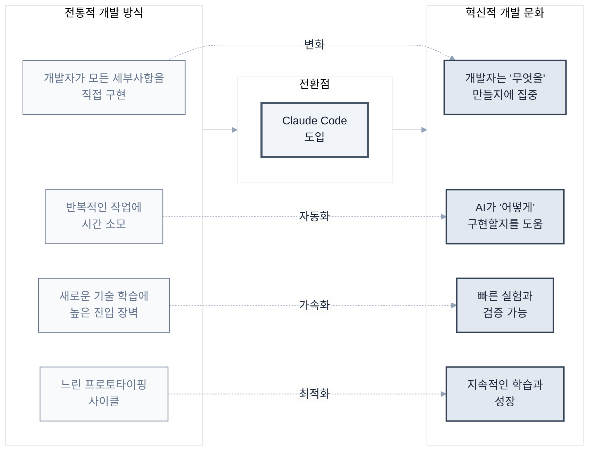

다음 장에서는 Claude Code를 실제로 설치하고 첫 번째 명령을 실행해보겠습니다. AI와 함께하는 개발의 새로운 여정을 시작해보겠습니다.

\newpage


---

#### [25a] 비개발자 가이드 — 개념편
> **출처**: 섹션25 (쪼갬 variant) | **셀**: S1CO | **Level**: L2
> ⚠️쪼갬: "필수 지식", "잘할 수 있는 영역", "학습 로드맵"


## 학습 목표

이 장을 완료하면 다음을 할 수 있습니다.

- 다양한 직무와 팀에서 Claude Code를 효과적으로 활용하는 방법을 이해할 수 있습니다.
- 자신의 조직 상황에 맞는 활용 전략을 수립할 수 있습니다.
- 팀 간 협업과 지식 공유를 통한 시너지 효과를 창출할 수 있습니다.
- 비개발자도 Claude Code를 활용하여 생산성을 향상시킬 수 있습니다.

## 개요

Claude Code는 단순한 개발 도구를 넘어서 조직 전반의 문제 해결과 업무 자동화를 가능하게 하는 **멀티-역할 에이전트**입니다. Anthropic의 실제 사용 사례를 통해 각 팀이 어떻게 업무 특성에 맞춰 Claude Code를 최적화하여 활용하는지 살펴보겠습니다.

이 장에서는 개발팀뿐만 아니라 데이터 과학, 마케팅, 디자인, 법무 등 다양한 부서의 실제 활용 사례를 분석하여, 여러분의 조직에서 Claude Code를 도입하고 확산하는 구체적인 방법을 제시합니다.

## 13.10 법무 팀 - 비개발자의 도구 개발

법무팀은 개발 경험이 전혀 없음에도 불구하고 Claude Code를 통해 맞춤형 법무 도구를 직접 개발하여 업무 효율성을 혁신적으로 개선했습니다.

### 법무 특화 도구 개발

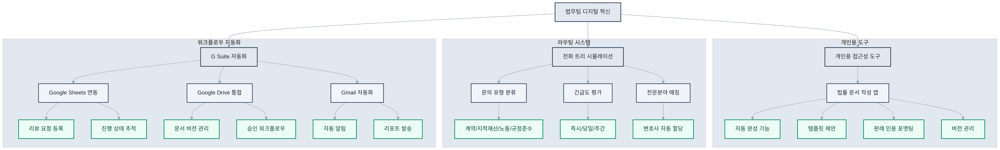

**1. 개인용 접근성 도구**

```bash
# 1시간 만에 프로토타입 완성
claude "법률 문서 작성을 도와주는 예측 텍스트 앱을 만들어줘

기능
- 법률 용어 자동 완성
- 계약서 조항 템플릿 제안
- 판례 인용 자동 포맷팅
- 문서 버전 관리
- 협업 댓글 기능

기술 스택
- 간단한 웹 앱 (HTML, CSS, JavaScript)
- 로컬 저장소 활용
- 오프라인에서도 동작

1시간 내에 기본 동작하는 프로토타입으로 만들어줘"
```

**2. 전화 트리 시뮬레이션 시스템**

```bash
# 담당 변호사 매칭 자동화
claude "법무 문의를 적절한 담당 변호사에게 라우팅하는 시스템을 만들어줘

라우팅 로직
- 문의 유형 분류 (계약, 지적재산, 노동, 규정준수)
- 긴급도 평가 (즉시, 당일, 주간)
- 변호사 전문분야 매칭
- 업무량 기반 할당

인터페이스
- 간단한 질문 트리
- 드래그 앤 드롭 문서 업로드
- 자동 이메일 알림
- 진행 상태 추적"
```

**3. G Suite 자동화 도구**

```bash
# 법무 리뷰 프로세스 자동화
claude "Google Workspace를 활용한 법무 리뷰 추적 시스템을 만들어줘

Google Sheets 연동
- 리뷰 요청 자동 등록
- 진행 상태 실시간 업데이트
- 담당자별 업무량 시각화
- 마감일 알림 자동화

Google Drive 통합
- 문서 버전 관리
- 댓글 기반 피드백 수집
- 최종 승인 워크플로우
- 아카이브 자동화

Gmail 자동화
- 리뷰 완료 시 자동 알림
- 지연 시 에스컬레이션
- 주간/월간 리포트 자동 발송"
```

### 시각 중심 프로토타이핑

```mermaid
%%{init: {"theme": "base", "themeVariables": {"primaryColor": "#f8fafc", "primaryTextColor": "#1e293b", "primaryBorderColor": "#e2e8f0", "lineColor": "#94a3b8", "secondaryColor": "#f1f5f9", "tertiaryColor": "#e2e8f0"}, "flowchart": {"htmlLabels": false, "useMaxWidth": false}}}%%
flowchart LR
    A[손그림 스케치] --> B[요구사항 분석]
    B --> C[레이아웃 구조 설계]
    C --> D[기능 동작 구현]
    D --> E[스타일링 적용]
    E --> F[최종 검토]
    
    subgraph feedback [피드백 루프]
        G[팀원 테스트] --> H[피드백 수집]
        H --> I[개선사항 식별]
        I --> J[반복적 개선]
        J --> G
    end
    
    F --> G
    J --> K[완성된 웹앱]
    
    subgraph requirements [핵심 요구사항]
        L[실제 동작하는 버튼]
        M[데이터 입력/저장]
        N[모바일 친화적 레이아웃]
        O[법무팀 브랜딩]
    end
    
    C --> requirements
    
    classDef processStyle fill:#e2e8f0,stroke:#334155,stroke-width:2px,color:#1e293b
    classDef feedbackStyle fill:#f1f5f9,stroke:#475569,stroke-width:2px,color:#1e293b
    classDef requirementStyle fill:#ecfdf5,stroke:#059669,stroke-width:2px,color:#064e3b
    
    class A,B,C,D,E,F,K processStyle
    class G,H,I,J feedbackStyle
    class L,M,N,O requirementStyle
```

**1. 와이어프레임 → 작동하는 앱**

```bash
# 스케치에서 앱으로
claude "이 손그림 와이어프레임을 보고 작동하는 웹앱을 만들어줢

[손그림 스케치 첨부]

요구사항
- 모든 버튼이 실제로 동작
- 데이터 입력과 저장 기능
- 모바일 친화적 레이아웃
- 법무팀 브랜딩 적용

단계별 확인
1. 레이아웃 구조 확인
2. 기능 동작 테스트
3. 스타일링 개선
4. 최종 검토"
```

**2. 반복적 개선 프로세스**

```bash
# 사용자 피드백 기반 개선
claude "팀원들이 사용해보고 다음 피드백을 주었어
- 버튼이 너무 작아서 모바일에서 클릭하기 어려움
- 문서 업로드 후 진행상황을 알 수 없음
- 이메일 알림이 너무 자주 옴

이 피드백을 반영해서 개선해줘"
```

### 법무 워크플로우 디지털화

**1. 계약서 검토 자동화**

```bash
# AI 기반 계약서 분석 도구
claude "계약서 초안을 업로드하면 자동으로 검토하는 도구를 만들어줘

검토 항목
- 표준 조항 누락 여부
- 리스크 조항 식별
- 금액/날짜 정합성 확인
- 법적 요구사항 준수 체크

결과 출력
- 위험도별 이슈 분류
- 수정 제안사항
- 유사 계약서 참조
- 검토 우선순위 제시"
```

**2. 규정 준수 모니터링**

```bash
# 컴플라이언스 대시보드
claude "회사의 규정 준수 현황을 모니터링하는 대시보드를 만들어줘

추적 영역
- 데이터 보호 (GDPR, CCPA)
- 금융 규제 (SOX, PCI-DSS)
- 노동법 준수
- 환경 규제

자동화 기능
- 규제 변경사항 모니터링
- 준수 상태 실시간 체크
- 리스크 레벨 시각화
- 액션 아이템 자동 생성"
```

### 팀 성과

- **디지털 역량**: 비개발자도 업무 특화 도구 직접 개발 가능성 입증
- **업무 효율**: 반복 업무 자동화로 고부가가치 업무에 집중
- **혁신 문화**: 프로토타이핑을 통한 아이디어 검증과 공유 활성화

### 법무 팀 성공 노하우

```bash
# Claude.ai에서 설계 후 Claude Code로 구현
# 1단계: Claude.ai에서 아이디어 구체화
"법무 업무에서 가장 반복적이고 시간이 많이 걸리는 작업이 뭔지 
분석해주고, 자동화 가능한 부분을 찾아줘"

# 2단계: Claude Code에서 구현
"앞서 논의한 계약서 검토 프로세스를 실제로 구현해줘"

# 단계별 피드백 루프
claude "이 기능이 제대로 동작하는지 스크린샷으로 확인해줄게.
다음에 추가할 기능은 뭐가 좋을까?"

# 완성도보다 공유 우선
claude "아직 완벽하지 않지만 팀원들과 공유할 수 있는 
데모 버전을 만들어줘. 피드백을 받아서 개선하고 싶어"
```

## 마치며 - 조직 혁신의 새로운 패러다임

Anthropic의 다양한 팀 사례를 통해 Claude Code가 단순한 개발 도구를 넘어서 **조직 전반의 업무 방식을 혁신하는 플랫폼**임을 확인할 수 있습니다. 각 팀이 자신들의 업무 특성에 맞게 도구를 활용하여 달성한 성과들은 Claude Code의 무한한 가능성을 보여줍니다.

### 핵심 인사이트

**1. 도메인 전문성 + AI 도구 = 혁신**
- 각 팀의 도메인 지식과 Claude Code의 기술적 능력이 결합될 때 최고의 시너지 창출
- 비개발자도 자신의 전문 영역에서 맞춤형 도구 개발 가능

**2. 점진적 도입과 문화 변화**
- 작은 성공부터 시작하여 점진적으로 확산하는 전략이 효과적
- 도구 도입이 아닌 업무 문화의 변화로 접근해야 지속 가능

**3. 협업과 지식 공유의 중요성**
- 개인의 경험을 팀의 자산으로 만드는 체계적인 지식 관리
- CLAUDE.md와 메모리 시스템을 통한 조직 지식의 축적

---

#### 🌾 [추후 삽입] 비개발자 관점
> **셀**: S1CO | **Level**: L2a
> 이 슬롯은 추후 콘텐츠가 삽입될 예정입니다.

---

### S1ST — 스트럭처 (Structure)

> (빈 셀)

---

### S1WF — 워크플로우 (Workflow)

#### [25b] 환경 설정 & 첫 프로젝트
> **출처**: 섹션25 (쪼갬 variant) | **셀**: S1WF | **Level**: L1
> ⚠️쪼갬: "환경 설정", "첫 프로젝트", "흔한 실수 5가지"


# 제2장: 설치와 초기 설정

> "시작이 반이다" - 한국 속담

이제 Claude Code를 설치해보겠습니다. 이 장에서는 **각 운영체제별로 단계별 설치 가이드**를 제공하며, 설치 과정에서 발생할 수 있는 문제들과 해결 방법도 함께 다룹니다.

## 2.1 시스템 요구사항

### 최소 요구사항

먼저 시스템이 Claude Code를 실행할 수 있는지 확인해보겠습니다. 최소 요구사항은 일반적인 개발 환경과 유사하며, 대부분의 현대적인 시스템에서 실행 가능합니다.

| 구성 요소 | 최소 요구사항 | 권장 사항 |
|----------|-------------|----------|
| 운영체제 | macOS 12+, Windows 10+, Ubuntu 20.04+ | 최신 버전 |
| RAM | 8GB | 16GB 이상 |
| 저장공간 | 2GB 여유 공간 | 10GB 이상 |
| 인터넷 | 안정적인 연결 필요 | 고속 인터넷 |
| Node.js | 18.0 이상 | 20.0 이상 |

### 사전 준비사항

설치 전 시스템 환경을 확인하겠습니다. 터미널을 열고 다음 명령어들을 실행하여 필요한 도구들이 설치되어 있는지 확인하세요.

**터미널 실행 방법**

- **Mac**: `Cmd + Space` → "터미널" 검색
- **Windows**: `Win + R` → "cmd" 입력
- **Linux**: `Ctrl + Alt + T`

```bash
# Node.js 버전 확인
node --version

# npm 버전 확인
npm --version

# Git 설치 확인 (선택사항이지만 권장)
git --version
```

**Node.js가 설치되어 있지 않거나 버전이 낮다면**

1. [Node.js 공식 사이트](https://nodejs.org)에서 LTS 버전을 다운로드하세요
2. 또는 패키지 매니저를 사용하세요
   - **Mac**: `brew install node` (Homebrew 필요)
   - **Windows**: `choco install nodejs` (Chocolatey 필요)
   - **Linux**: `sudo apt install nodejs npm` (Ubuntu/Debian)

> **권장사항**: LTS(Long Term Support) 버전을 사용하면 안정성과 호환성을 보장받을 수 있습니다.

## 2.2 설치 가이드 (OS별)

이제 운영체제별로 Claude Code를 설치하겠습니다. 각 OS에 최적화된 설치 방법을 제공합니다.

### macOS에서 설치하기

macOS에서는 두 가지 설치 방법을 제공합니다.

**방법 1: npm을 통한 설치 (권장)**

가장 간단하고 안정적인 방법입니다.

```bash
# Claude Code 설치
npm install -g @anthropic-ai/claude-code

# 설치 확인
claude --version
```

**방법 2: Homebrew를 통한 설치**

```bash
# Homebrew tap 추가
brew tap anthropic-ai/claude-code

# Claude Code 설치
brew install claude-code

# 설치 확인
claude --version
```

**macOS 특화 설정**

```bash
# 터미널 권한 설정 (필요한 경우)
# 시스템 환경설정 > 보안 및 개인정보 > 개인정보 > 전체 디스크 접근 권한
# Terminal.app 또는 사용 중인 터미널 앱 추가

# Spotlight 검색 제외 (선택사항)
# .claude-code 디렉토리를 Spotlight 검색에서 제외하여 성능 향상
```

### Windows에서 설치하기

Windows에서는 WSL 2(Windows Subsystem for Linux)를 통해 Claude Code를 설치하는 것이 권장됩니다. 현재 Claude Code는 Windows 네이티브 클라이언트를 지원하지 않으므로, Linux 환경이 필요합니다.

**시스템 요구사항**

| 항목 | 최소 조건 |
|------|-----------|
| OS | Windows 10 (21H2) 또는 Windows 11 + WSL 2 |
| RAM | 4GB 이상 |
| 네트워크 | 인터넷 연결 (OAuth 인증 및 API 호출) |
| 소프트웨어 | WSL 2, Node.js 18+, Git(선택사항) |

**1단계: WSL 2 설치**

PowerShell을 **관리자 권한**으로 실행하고 다음 명령어를 입력하세요.

```powershell
# WSL 설치 (Ubuntu 22.04 LTS 기본 포함)
wsl --install

# 설치 후 시스템 재부팅
```

기존에 WSL 1을 사용하고 있다면 다음과 같이 업그레이드하세요.

```powershell
# WSL 2로 업그레이드
wsl --set-version Ubuntu 2

# 설치 상태 확인
wsl --status
wsl --list --verbose
```

**2단계: Node.js 설치 (WSL 내부)**

WSL 터미널(Ubuntu)을 열고 NVM을 통해 Node.js를 설치하세요.

```bash
# NVM 설치
curl -o- https://raw.githubusercontent.com/nvm-sh/nvm/v0.39.7/install.sh | bash

# 변경사항 적용
source ~/.bashrc

# Node.js 18 LTS 설치 및 사용
nvm install 18
nvm use 18

# 설치 확인
node --version
npm --version
```

> **중요**: `which node` 명령 실행 시 경로가 `/home/<username>/.nvm/...`으로 표시되어야 합니다. `/mnt/c/...` 경로가 나타나면 Windows와 경로가 충돌하는 상황이므로 위 과정을 다시 진행하세요.

**3단계: Claude Code 설치**

```bash
# Claude Code 설치
npm install -g @anthropic-ai/claude-code

# 설치 확인
claude --version
```

**설치 오류 해결**

| 오류 | 해결방법 |
|------|----------|
| `OS detection failed` | `npm config set os linux` 실행 후 `npm install -g @anthropic-ai/claude-code --force --no-os-check` |
| `exec: node: not found` | Node.js 설치 재확인, `which node` 경로 점검 |
| 권한 오류 | `npm config set prefix '~/.npm-global'` 실행 후 재설치 |

### Linux (Ubuntu/Debian)에서 설치하기

```bash
# 시스템 패키지 업데이트
sudo apt update && sudo apt upgrade

# Node.js 설치 (아직 없는 경우)
curl -fsSL https://deb.nodesource.com/setup_20.x | sudo -E bash -
sudo apt install nodejs

# Claude Code 설치
sudo npm install -g @anthropic-ai/claude-code

# 설치 확인
claude --version

# 권한 설정 (필요한 경우)
sudo chmod +x /usr/local/bin/claude
```

## 2.3 첫 번째 명령어 실행하기

설치가 완료되었습니다. 이제 Claude Code의 기본 설정을 진행하겠습니다.

### API 키 설정

Claude Code를 사용하려면 API 키 설정이 필요합니다. 무료 사용량으로 시작할 수 있습니다.

**1단계: API 키 발급받기**

1. [Anthropic Console](https://console.anthropic.com)에 접속하세요
2. 계정을 만들거나 로그인하세요
3. "API Keys" 섹션에서 새 키를 생성하세요

**2단계: API 키 설정하기**
```bash
# API 키 설정 명령어 실행
claude login

# 프롬프트가 나타나면 복사한 API 키를 붙여넣기
# (키를 입력할 때는 화면에 표시되지 않는 것이 정상입니다)
```

> **보안 주의사항**: API 키는 개인 계정과 연결되므로 타인과 공유하지 않도록 주의하세요.

### 첫 번째 대화

이제 Claude Code와 첫 대화를 시작해보겠습니다.

```bash
# 첫 인사 (Claude가 답변하면 성공!)
claude "안녕하세요, Claude! 처음 뵙겠습니다."

# 간단한 작업 요청해보기
claude "현재 시스템 정보를 알려주세요"

# 디렉토리 탐색해보기
claude "현재 폴더에 어떤 파일들이 있는지 보여주세요"
```

**응답이 정상적으로 출력되면 설치와 기본 설정이 완료된 것입니다.** Claude Code 사용 준비가 완료되었습니다.

### 대화형 모드 vs 명령 모드

**명령 모드 (일회성 작업)**
```bash
claude "package.json 파일을 읽고 요약해줘"
```

**대화형 모드 (지속적인 작업)**

명령 모드는 단발성 작업에 적합하지만, 복잡한 프로젝트나 여러 단계를 거쳐야 하는 작업에는 대화형 모드가 더 효율적입니다.

```bash
# 대화형 모드 시작
claude

# 이제 지속적으로 대화 가능
> 새로운 React 프로젝트를 시작하고 싶어
> TypeScript를 사용하고, 테스트 환경도 설정해줘
> Material-UI도 추가해줘
```

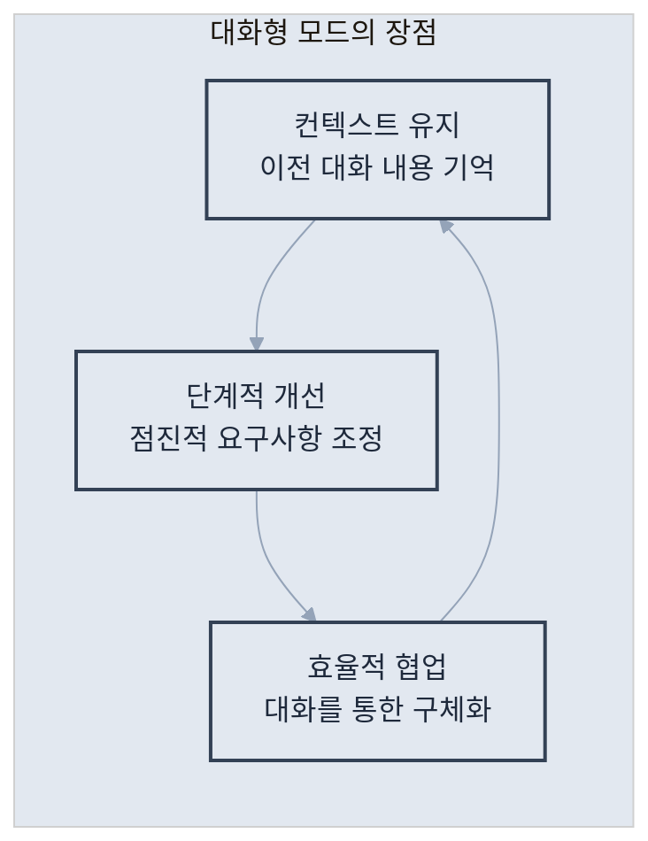

대화형 모드의 장점

## 2.4 기본 설정 최적화

Claude Code를 더 효율적으로 사용하기 위해서는 개인의 작업 환경과 선호도에 맞게 설정을 조정하는 것이 중요합니다. 이 섹션에서는 주요 설정 옵션들과 최적화 방법을 알아보겠습니다.

### 전역 설정 파일

Claude Code의 모든 설정은 홈 디렉토리의 설정 파일에서 관리됩니다. 이 파일을 통해 개인화된 작업 환경을 구성할 수 있습니다.

**설정 파일 위치**: `~/.claude-code/config.json`

```json
{
  "api_key": "sk-ant-...",              // API 인증 키
  "default_model": "claude-3-opus-20240229", // 기본 사용 모델
  "theme": "dark",                       // 인터페이스 테마 (dark/light)
  "editor": "vscode",                    // 선호 에디터
  "auto_commit": false,                  // 자동 커밋 여부
  "language": "ko",                      // 기본 언어 설정
  "permissions": {
    "file_write": true,                  // 파일 쓰기 권한
    "file_read": true,                   // 파일 읽기 권한
    "command_execution": true            // 명령 실행 권한
  }
}
```

**주요 설정 옵션 설명**

- `default_model`: 작업 유형에 따라 적절한 모델 선택 (opus: 복잡한 작업, sonnet: 일반 작업, haiku: 빠른 응답)
- `auto_commit`: 코드 변경 시 자동으로 Git 커밋할지 결정
- `permissions`: 보안을 위해 필요한 권한만 활성화하는 것을 권장

### 권한 설정

Claude Code는 강력한 도구이므로 적절한 권한 관리가 중요합니다. 작업 환경과 보안 요구사항에 따라 권한을 조정할 수 있습니다.

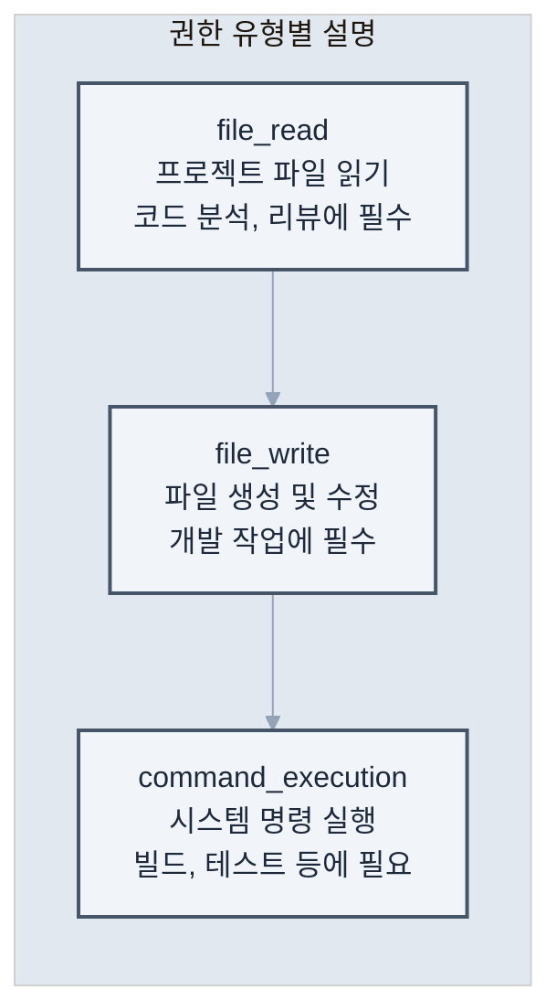

**권한 유형별 설명**

보안과 편의성의 균형을 위한 권한 설정 전략

```bash
# 모든 권한 부여 (개발 환경)
claude --allow-all

# 읽기 전용 모드 (코드 리뷰용)
claude --read-only

# 특정 권한만 부여
claude --allow-read --allow-write --deny-execute
```

### 에디터 통합

개발 효율성을 높이기 위해 Claude Code를 기존 에디터와 통합할 수 있습니다. 에디터 통합을 통해 코드 편집과 AI 지원을 원활하게 연결할 수 있습니다.

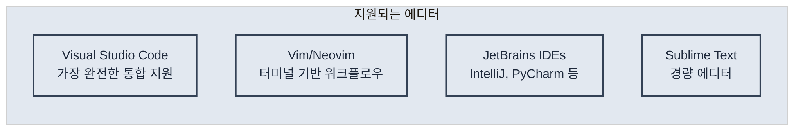

**지원되는 에디터**

선호하는 에디터와 통합 설정

```bash
# VSCode 통합
claude config set editor vscode

# Vim 통합
claude config set editor vim

# 에디터에서 직접 Claude Code 호출
# VSCode: Cmd+Shift+P > "Claude: Ask"
```

### 프록시 설정 (기업 환경)

많은 기업에서는 보안상의 이유로 프록시 서버를 통해 외부 인터넷에 접속합니다. Claude Code도 이런 환경에서 사용할 수 있도록 프록시 설정을 지원합니다.

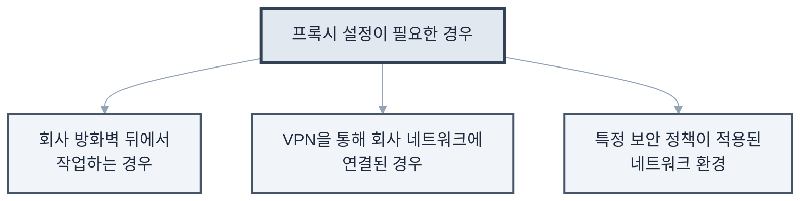

**프록시 설정이 필요한 경우**

기업 환경에서 프록시를 사용하는 경우의 설정 방법

```bash
# HTTP 프록시 설정
export HTTP_PROXY=http://proxy.company.com:8080
export HTTPS_PROXY=http://proxy.company.com:8080

# Claude Code 전용 프록시 설정
claude config set proxy http://proxy.company.com:8080
```

## 2.5 문제 해결 가이드

Claude Code 설치 및 초기 사용 과정에서 발생할 수 있는 일반적인 문제들과 해결 방법을 정리했습니다. 문제 상황별로 단계적인 해결 방안을 제시하므로, 차근차근 따라하면 대부분의 문제를 해결할 수 있습니다.

### 자주 발생하는 문제와 해결 방법

다음은 Claude Code 사용자들이 가장 자주 경험하는 문제들과 검증된 해결 방법들입니다.

**1. "command not found: claude"**

이 오류는 Claude Code가 설치되었지만 시스템 PATH에 등록되지 않았을 때 발생합니다.

**원인 분석**

- npm 전역 설치 경로가 PATH에 포함되지 않음
- 잘못된 설치 경로
- Shell 환경 변수 설정 문제

**해결 방법**
```bash
# 1단계: npm 전역 경로 확인
npm config get prefix

# 2단계: PATH에 추가 (bash/zsh)
echo 'export PATH="$PATH:$(npm config get prefix)/bin"' >> ~/.bashrc
source ~/.bashrc

# 3단계: 설치 확인
claude --version
```

**추가 해결책**

- macOS에서 `.zshrc` 파일 수정 필요할 수 있음
- Windows에서는 시스템 환경 변수에서 PATH 수정

**2. "EACCES: permission denied"**

이 오류는 npm 전역 설치 시 권한 문제로 발생합니다. 특히 Linux나 macOS에서 자주 나타납니다.

**원인 분석**

- npm 전역 디렉토리에 대한 쓰기 권한 부족
- sudo로 설치했을 때 소유권 문제
- 시스템 보호된 디렉토리에 설치 시도

**해결 방법**
```bash
# 방법 1: 권한 수정 (권장)
sudo chown -R $(whoami) $(npm config get prefix)/{lib/node_modules,bin,share}

# 방법 2: npx를 통한 실행 (임시 해결)
npx @anthropic-ai/claude-code

# 방법 3: npm 전역 디렉토리 변경
mkdir ~/.npm-global
npm config set prefix '~/.npm-global'
echo 'export PATH=~/.npm-global/bin:$PATH' >> ~/.bashrc
source ~/.bashrc
```

**3. "API rate limit exceeded"**

API 사용량 제한에 도달했을 때 발생하는 오류입니다. Anthropic의 API 정책에 따라 시간당 요청 횟수가 제한됩니다.

**원인 분석**
- 단시간 내 너무 많은 요청
- API 플랜의 사용량 한계 도달
- 네트워크 문제로 인한 중복 요청

**해결 방법**
```bash
# 1단계: 현재 상태 확인
claude status

# 2단계: 자동 재시도 간격 설정 (밀리초)
claude config set retry_delay 5000

# 3단계: 최대 재시도 횟수 설정
claude config set max_retries 3
```

**예방 방법**

- 대용량 작업 시 작은 단위로 분할하여 실행
- `--rate-limit` 옵션 사용하여 요청 속도 조절
- API 사용량 모니터링으로 제한 사전 파악

**4. "SSL certificate problem"**

기업 환경에서 자체 인증서를 사용하거나 네트워크 보안 정책으로 인해 SSL 인증서 검증에 실패할 때 발생합니다.

**원인 분석**

- 회사 방화벽의 SSL 검사
- 자체 서명된 인증서 사용
- 오래된 시스템의 인증서 저장소 문제

**해결 방법**
```bash
# ⚠️ 임시 해결책 (보안 위험 있음)
export NODE_TLS_REJECT_UNAUTHORIZED=0

# ✅ 권장 해결책: 회사 인증서 설치
# 1단계: IT 부서에서 인증서 파일 받기
# 2단계: npm에 인증서 등록
npm config set cafile /path/to/company-cert.pem

# 3단계: Claude Code 전용 설정
claude config set tls_verify true
claude config set ca_bundle /path/to/company-cert.pem
```

**보안 고려사항**

- `NODE_TLS_REJECT_UNAUTHORIZED=0`은 보안 위험이 있으므로 임시로만 사용
- 가능하면 IT 부서와 협력하여 적절한 인증서 설정

### 성능 최적화 팁

Claude Code의 응답 속도와 효율성을 향상시키기 위한 설정들입니다. 프로젝트 규모와 작업 패턴에 따라 적절히 조정하여 사용하세요.

**1. 캐시 활성화**

반복적인 요청에 대한 응답을 캐시하여 속도를 향상시킵니다.

```bash
# 응답 캐싱 활성화
claude config set cache_enabled true

# 캐시 유지 시간 설정 (초 단위, 기본: 3600초 = 1시간)
claude config set cache_ttl 3600

# 캐시 크기 제한 설정 (MB 단위)
claude config set cache_max_size 100
```

**캐시 활용 팁**

- 동일한 코드를 반복 분석할 때 유용
- 큰 프로젝트에서 점진적 작업 시 효과적
- 캐시 무효화: `claude cache clear`


### Junior Developer - 가속 학습자
```bash
# 학습 가속화
claude "주니어 개발자의 빠른 성장을 위해 이 작업을 학습 기회로 활용해줘
- 단계별 구현 가이드
- 각 단계에서 배울 수 있는 핵심 개념
- 흔히 하는 실수와 예방법
- 시니어에게 질문할 타이밍과 방법
- 자신의 진전을 측정하는 방법

단순히 정답을 주기보다는 사고 과정을 기를 수 있도록 안내해줘"
```

---

#### 🌾 [추후 삽입] SSAL Works 설치 가이드
> **셀**: S1WF | **Level**: L1a
> 이 슬롯은 추후 콘텐츠가 삽입될 예정입니다.

---

### S1TO — 팀운용 (Team Operations)

> (빈 셀)

---

### S1QC — 품질관리 (Quality Control)

> (빈 셀)

---

### S1CM — 비용관리 (Cost Management)

#### [19] 요금제 선택 가이드
> **출처**: 섹션19 (통째) | **셀**: S1CM | **Level**: L1


## 2.4 기본 설정 최적화

Claude Code를 더 효율적으로 사용하기 위해서는 개인의 작업 환경과 선호도에 맞게 설정을 조정하는 것이 중요합니다. 이 섹션에서는 주요 설정 옵션들과 최적화 방법을 알아보겠습니다.

### 전역 설정 파일

Claude Code의 모든 설정은 홈 디렉토리의 설정 파일에서 관리됩니다. 이 파일을 통해 개인화된 작업 환경을 구성할 수 있습니다.

**설정 파일 위치**: `~/.claude-code/config.json`

```json
{
  "api_key": "sk-ant-...",              // API 인증 키
  "default_model": "claude-3-opus-20240229", // 기본 사용 모델
  "theme": "dark",                       // 인터페이스 테마 (dark/light)
  "editor": "vscode",                    // 선호 에디터
  "auto_commit": false,                  // 자동 커밋 여부
  "language": "ko",                      // 기본 언어 설정
  "permissions": {
    "file_write": true,                  // 파일 쓰기 권한
    "file_read": true,                   // 파일 읽기 권한
    "command_execution": true            // 명령 실행 권한
  }
}
```

**주요 설정 옵션 설명**

- `default_model`: 작업 유형에 따라 적절한 모델 선택 (opus: 복잡한 작업, sonnet: 일반 작업, haiku: 빠른 응답)
- `auto_commit`: 코드 변경 시 자동으로 Git 커밋할지 결정
- `permissions`: 보안을 위해 필요한 권한만 활성화하는 것을 권장

### 권한 설정

Claude Code는 강력한 도구이므로 적절한 권한 관리가 중요합니다. 작업 환경과 보안 요구사항에 따라 권한을 조정할 수 있습니다.


**권한 유형별 설명**

보안과 편의성의 균형을 위한 권한 설정 전략

```bash
# 모든 권한 부여 (개발 환경)
claude --allow-all

# 읽기 전용 모드 (코드 리뷰용)
claude --read-only

# 특정 권한만 부여
claude --allow-read --allow-write --deny-execute
```

### 에디터 통합

개발 효율성을 높이기 위해 Claude Code를 기존 에디터와 통합할 수 있습니다. 에디터 통합을 통해 코드 편집과 AI 지원을 원활하게 연결할 수 있습니다.


**지원되는 에디터**

선호하는 에디터와 통합 설정

```bash
# VSCode 통합
claude config set editor vscode

# Vim 통합
claude config set editor vim

# 에디터에서 직접 Claude Code 호출
# VSCode: Cmd+Shift+P > "Claude: Ask"
```

### 프록시 설정 (기업 환경)

많은 기업에서는 보안상의 이유로 프록시 서버를 통해 외부 인터넷에 접속합니다. Claude Code도 이런 환경에서 사용할 수 있도록 프록시 설정을 지원합니다.


**프록시 설정이 필요한 경우**

기업 환경에서 프록시를 사용하는 경우의 설정 방법

```bash
# HTTP 프록시 설정
export HTTP_PROXY=http://proxy.company.com:8080
export HTTPS_PROXY=http://proxy.company.com:8080

# Claude Code 전용 프록시 설정
claude config set proxy http://proxy.company.com:8080
```


---


## S2 초급 (Elementary)

---

### S2CO — 개념 (Concept)

#### [02] 6대 핵심 철학
> **출처**: 섹션02 (통째) | **셀**: S2CO | **Level**: L1


## 1.3 Claude Code의 핵심 철학

### 1. 유연성 (Flexibility)

Claude Code는 특정 워크플로우를 강제하지 않습니다.

```bash
# 다양한 접근 방식 모두 가능
claude "버그를 찾아서 수정해줘"
claude "TDD 방식으로 새 기능을 구현해줘"
claude "이 코드를 함수형 스타일로 리팩토링해줘"
claude "아키텍처를 분석하고 개선점을 제안해줘"
```

### 2. 투명성 (Transparency)

모든 작업 과정이 투명하게 공개됩니다.

```bash
# Claude Code의 작업 과정을 실시간으로 확인
> 파일 탐색 중: src/components/
> 코드 분석 중: UserProfile.jsx
> 수정 사항 적용 중...
> 테스트 실행 중...
```

### 3. 협업 (Collaboration)

AI는 도구가 아닌 동료입니다.

- 제안과 대안 제시
- 잠재적 문제 사전 경고
- 더 나은 해결책 토론
- 학습과 성장 지원

### 4. 맥락 이해 (Context Awareness)

전체 프로젝트 맥락을 이해합니다.


---

#### 🌾 [추후 삽입] 7번째 철학 "Muscle Memory Outsourcing"
> **셀**: S2CO | **Level**: L1a
> 이 슬롯은 추후 콘텐츠가 삽입될 예정입니다.

---

#### [18] 바이브 코딩 적합성 판단
> **출처**: 섹션18 (통째) | **셀**: S2CO | **Level**: L2


## 1.4 다른 AI 코딩 도구와의 차별점

### GitHub Copilot과의 비교


| 특징 | GitHub Copilot | Claude Code |
|------|----------------|-------------|
| 작동 방식 | 인라인 자동완성 | 대화형 상호작용 |
| 컨텍스트 | 현재 파일 중심 | 전체 프로젝트 |
| 작업 범위 | 코드 작성 | 설계, 구현, 테스트, 배포 |
| 커스터마이징 | 제한적 | 완전 커스터마이징 가능 |
| 학습 곡선 | 낮음 | 중간 |

### ChatGPT와의 비교

| 특징 | ChatGPT | Claude Code |
|------|---------|-------------|
| 파일 시스템 접근 | 불가능 | 완전한 접근 |
| 코드 실행 | 제한적 | 직접 실행 가능 |
| 지속성 | 대화별 리셋 | 프로젝트 컨텍스트 유지 |
| 도구 통합 | 없음 | Git, 테스트, 빌드 도구 등 |

### Claude Code만의 독특한 기능

**1. CLAUDE.md를 통한 프로젝트 맞춤화**
```markdown
# 우리 프로젝트의 규칙
- 모든 컴포넌트는 함수형으로 작성
- 테스트 커버리지 80% 이상 유지
- 커밋 메시지는 conventional commits 따르기
```

**2. 멀티모달 입력 지원**

- 디자인 스크린샷을 보고 UI 구현
- 다이어그램을 코드로 변환
- 에러 스크린샷으로 디버깅

**3. 진정한 풀스택 지원**
```bash
# 프론트엔드부터 배포까지 한 번에
claude "사용자 인증 기능을 만들어줘. React 프론트엔드, Node.js 백엔드, PostgreSQL 데이터베이스, Docker 컨테이너화까지"
```

## 실제 사례: 30분 만에 만든 실시간 채팅 앱

한 스타트업 개발자의 경험담

> "새로운 프로젝트를 시작해야 했는데, 실시간 채팅 기능이 핵심이었습니다. 
> 보통이라면 아키텍처 설계부터 시작해서 일주일은 걸렸을 텐데, 
> Claude Code와 함께 30분 만에 작동하는 프로토타입을 만들었습니다.
> 
> 더 놀라운 건, 코드 품질이 제가 직접 작성한 것보다 나았다는 점입니다.
> 에러 핸들링, 보안, 확장성까지 고려되어 있었죠."

이것이 가능했던 이유

1. Claude Code가 실시간 통신의 베스트 프랙티스를 알고 있음
2. 프로젝트 구조를 자동으로 파악하고 적절히 통합
3. 테스트 코드까지 함께 생성
4. 잠재적 문제점을 사전에 지적하고 해결

## 마치며

Claude Code는 단순한 도구가 아닙니다. 이는 개발 방식의 패러다임 전환입니다.


다음 장에서는 Claude Code를 실제로 설치하고 첫 번째 명령을 실행해보겠습니다. AI와 함께하는 개발의 새로운 여정을 시작해보겠습니다.

\newpage


---

#### [15] 10대 황금 원칙
> **출처**: 섹션15 (통째) | **셀**: S2CO | **Level**: L3


## 프로 팁: 효율성 극대화

### 1. 별칭(Alias) 설정

자주 사용하는 명령어에 단축 별칭을 설정하여 작업 효율성을 높일 수 있습니다.

```bash
# ~/.bashrc 또는 ~/.zshrc에 추가
alias cc="claude"
alias ccc="claude --clear"
alias ccr="claude 'npm run'"
```

### 2. 템플릿 활용

반복적으로 사용하는 명령어 패턴을 템플릿으로 저장하여 재사용성을 높입니다.

**템플릿 디렉토리 구조 만들기**
```bash
# Claude Code 템플릿 디렉토리 생성
mkdir -p ~/.claude-templates/{components,features,tests,docs}
```

**실용적인 템플릿 예시들**

1. **React 컴포넌트 템플릿**
```bash
# 컴포넌트 생성 템플릿
cat > ~/.claude-templates/components/react-component.txt << 'EOF'
새로운 React 컴포넌트를 만들어줘
- 컴포넌트 이름: [COMPONENT_NAME]
- 함수형 컴포넌트로 작성
- TypeScript 사용
- Props 인터페이스 정의
- 기본 스타일 포함
- 스토리북 스토리 파일도 생성
- 유닛 테스트 파일 포함
EOF

# 사용 예시
COMPONENT_NAME="UserProfile" envsubst < ~/.claude-templates/components/react-component.txt | claude
```

2. **API 엔드포인트 템플릿**
```bash
# API 라우트 생성 템플릿
cat > ~/.claude-templates/features/api-endpoint.txt << 'EOF'
새로운 REST API 엔드포인트를 만들어줘
- 리소스: [RESOURCE_NAME]
- CRUD 작업 모두 포함
- Express.js 라우터 사용
- 입력 검증 미들웨어
- 에러 핸들링
- Swagger 문서 주석
- 통합 테스트 포함
EOF
```

3. **버그 수정 템플릿**
```bash
# 버그 수정 워크플로우 템플릿
cat > ~/.claude-templates/features/bugfix.txt << 'EOF'
다음 버그를 수정해줘
1. 먼저 관련된 코드를 찾아서 분석해줘
2. 버그의 근본 원인을 설명해줘
3. 수정 방안을 제시하고 구현해줘
4. 재발 방지를 위한 테스트를 추가해줘
5. 수정사항을 커밋 메시지와 함께 정리해줘

버그 설명: [BUG_DESCRIPTION]
EOF
```

### 3. 컨텍스트 유지

복잡하고 긴 작업을 수행할 때는 대화형 모드를 활용하여 문맥을 유지합니다. 효과적인 컨텍스트 관리는 대규모 작업의 성공 열쇠입니다.

**대규모 리팩토링 시나리오**
```bash
# 대화형 모드로 시작
claude

> 이제부터 레거시 코드를 최신 아키텍처로 마이그레이션할 거야
< 알겠습니다. 먼저 현재 코드베이스를 분석하고 마이그레이션 계획을 수립하겠습니다.

> 1단계: 현재 아키텍처를 분석하고 문제점을 파악해줘
< 분석 결과
  - 모놀리식 구조로 모듈 간 결합도가 높음
  - 클래스 기반 컴포넌트 사용 (React 16.2)
  - 상태 관리가 prop drilling으로 복잡함
  - 테스트 커버리지 30%
  
  주요 개선 필요 영역을 식별했습니다. 계속 진행할까요?

> 2단계: 마이그레이션 로드맵을 만들어줘
< 단계별 마이그레이션 로드맵
  Phase 1: 인프라 현대화 (1-2주)
  - 빌드 도구를 Webpack에서 Vite로 마이그레이션
  - TypeScript 도입
  
  Phase 2: 컴포넌트 현대화 (3-4주)
  - 클래스 컴포넌트를 함수형으로 전환
  - Custom Hooks로 로직 추출
  
  Phase 3: 상태 관리 개선 (1주)
  - Context API 또는 Zustand 도입
  
  Phase 4: 테스트 강화 (1주)
  - 테스트 커버리지 80% 목표

> 좋아, Phase 1부터 시작하자. 먼저 Vite 마이그레이션을 진행해줘
< Phase 1 시작: Vite 마이그레이션을 단계별로 진행하겠습니다...
```

**컨텍스트 유지 팁**

1. **체크포인트 생성**: 각 단계 완료 시 진행 상황 요약 요청
2. **명확한 단계 구분**: 번호나 라벨로 작업 단계 명시
3. **정기적인 검증**: 중간중간 결과 확인 및 방향 조정
4. **컨텍스트 저장**: 중요한 결정사항은 별도 문서로 저장


## 워크플로우 CLAUDE.md 예시

```markdown
# Development Workflow

## 기능 개발 프로세스
1. 이슈 생성 및 브랜치 생성
2. 탐색: 관련 코드 분석 (30분)
3. 계획: 구현 전략 수립 (30분)
4. 구현: TDD로 개발 (2-4시간)
5. 리뷰: 자체 코드 리뷰 (30분)
6. PR 생성 및 리뷰 요청

## 일일 루틴
- 09:00: 이슈 확인 및 우선순위 정리
- 09:30: 집중 코딩 (포모도로 기법)
- 14:00: 코드 리뷰
- 16:00: 문서 업데이트
- 17:00: 다음 날 계획

## 품질 체크리스트
- [ ] 테스트 커버리지 80% 이상
- [ ] 모든 함수에 JSDoc
- [ ] 성능 프로파일링 완료
- [ ] 접근성 검사 통과
- [ ] 보안 스캔 통과
```

## 마치며

효율적인 개발 워크플로우는 개발자와 팀의 생산성을 결정하는 핵심 요소입니다. Claude Code는 이러한 워크플로우의 각 단계에서 지능적인 지원을 제공하여, 개발자가 더 높은 수준의 문제 해결에 집중할 수 있도록 도와줍니다.

### 핵심 원칙 요약

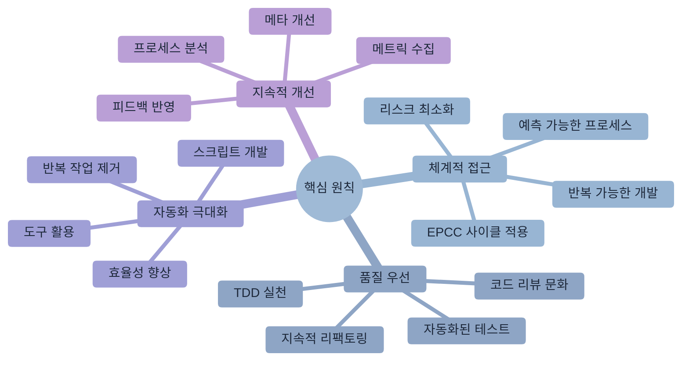

1. **체계적 접근**: EPCC(탐색-계획-코딩-커밋) 사이클을 통한 예측 가능하고 반복 가능한 개발 프로세스
2. **품질 우선**: TDD와 지속적인 리팩토링을 통한 코드 품질의 지속적 향상
3. **자동화 극대화**: 반복적인 작업의 자동화를 통한 개발자 시간의 효율적 활용
4. **지속적 개선**: 워크플로우 자체도 지속적으로 측정하고 개선하는 메타 프로세스

### 실무 적용 전략

- **개인 개발자**: 일관된 개발 리듬 구축과 품질 기준 수립
- **팀 리더**: 팀 전체의 워크플로우 표준화와 모범 사례 공유
- **조직**: 워크플로우 메트릭 수집과 지속적인 프로세스 개선
- **프로젝트 관리**: 예측 가능한 개발 속도와 품질 보장

다음 장에서는 여러 Claude Code 인스턴스를 활용한 멀티태스킹과 병렬 처리 전략을 살펴보겠습니다. 복잡한 프로젝트에서 개발 속도를 극대화하는 고급 활용법을 탐구해봅시다.

\newpage


---

### S2ST — 스트럭처 (Structure)

#### [04] CLAUDE.md 완전 가이드
> **출처**: 섹션04 (통째) | **셀**: S2ST | **Level**: L1


# 제4장: CLAUDE.md로 프로젝트 맞춤 설정

> "좋은 도구는 사용자에게 맞춰진다" - 도널드 노먼

이 장에서는 **CLAUDE.md 파일을 통한 프로젝트 맞춤 설정**에 대해 알아보겠습니다. 각 프로젝트의 고유한 특성과 요구사항에 맞춰 Claude Code를 최적화하는 방법을 체계적으로 학습하겠습니다.

CLAUDE.md는 Claude Code가 프로젝트의 컨텍스트를 이해하고, 팀의 코딩 규칙을 준수하며, 일관된 품질의 코드를 생성하도록 돕는 핵심 도구입니다.

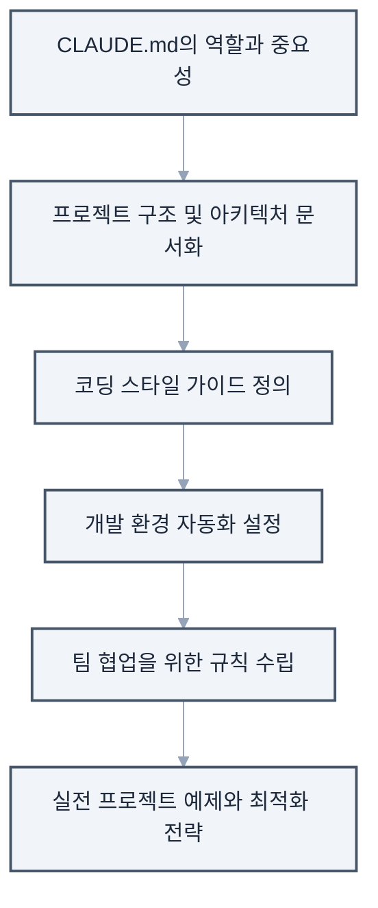

**이 장에서 다룰 내용**

## 4.1 CLAUDE.md의 역할과 중요성

### CLAUDE.md란?

CLAUDE.md는 프로젝트 루트 디렉토리에 위치하는 특별한 마크다운 파일입니다. 이 파일은 Claude Code에게 프로젝트별 지침과 규칙을 제공하여, 보다 정확하고 일관된 결과를 도출할 수 있게 합니다.

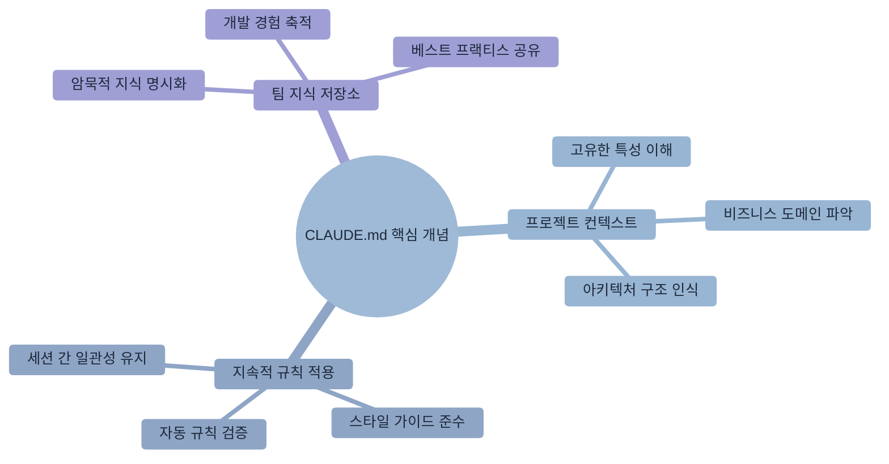

**CLAUDE.md의 핵심 개념**

프로젝트 구조 예시

```
프로젝트 루트/
├── CLAUDE.md          # Claude Code 설정 파일
├── README.md          # 일반 프로젝트 문서
├── package.json
└── src/
```

### 왜 중요한가?

CLAUDE.md를 통해 얻을 수 있는 주요 이점들을 구체적인 예시와 함께 살펴보겠습니다.

**1. 일관성 보장**

CLAUDE.md가 없을 때와 있을 때의 차이를 비교해보겠습니다.
```markdown
# CLAUDE.md
## 코드 스타일

- 모든 함수는 화살표 함수로 작성
- 세미콜론 항상 사용
- 들여쓰기는 2칸
```

**2. 팀 규칙 자동 적용**

팀의 Git 커밋 규칙을 CLAUDE.md에 정의하면, Claude Code가 자동으로 규칙에 맞는 커밋 메시지를 생성합니다.

```markdown
## Git 커밋 규칙
- feat: 새로운 기능 추가
- fix: 버그 수정
- docs: 문서 수정
- style: 코드 포매팅 (기능 변경 없음)
- refactor: 코드 리팩토링 (기능 변경 없음)
- test: 테스트 추가 또는 수정
- chore: 빌드 프로세스 또는 보조 도구 변경

## 커밋 메시지 형식
<type>(<scope>): <subject>

예시
feat(auth): 소셜 로그인 기능 추가
fix(api): 사용자 조회 시 null 참조 오류 수정
```

이렇게 정의하면 Claude Code가 자동으로 올바른 형식의 커밋 메시지를 생성합니다.

**3. 프로젝트 특화 지식**

프로젝트의 도메인 지식을 명시하면 Claude Code가 비즈니스 맥락을 이해하고 더 정확한 코드를 생성합니다.

```markdown
## 도메인 용어
- SKU (Stock Keeping Unit): 재고 관리 단위
  - 예: "SHOE-NIKE-AF1-WHT-42" (나이키 에어포스1 흰색 42사이즈)
- PDP (Product Detail Page): 상품 상세 페이지
  - 주요 컴포넌트: 이미지 갤러리, 가격 정보, 재고 상태, 리뷰
- CAC (Customer Acquisition Cost): 고객 획득 비용
  - 계산식: 총 마케팅 비용 / 신규 고객 수

## 비즈니스 규칙
- 재고가 5개 이하일 때 "품절 임박" 표시
- 신규 회원은 첫 구매 시 10% 할인 자동 적용
- 50,000원 이상 구매 시 무료 배송
```

### CLAUDE.md vs README.md

```mermaid
%%{init: {"theme": "base", "themeVariables": {"primaryColor": "#f8fafc", "primaryTextColor": "#1e293b", "primaryBorderColor": "#e2e8f0", "lineColor": "#94a3b8", "secondaryColor": "#f1f5f9", "tertiaryColor": "#e2e8f0"}}}%%
graph LR
    subgraph readme ["README.md"]
        A1["대상: 사람<br/>개발자, 사용자"]
        A2["목적: 프로젝트 소개<br/>사용 가이드"]
        A3["내용: 설치 방법<br/>API 문서, 예제"]
        A4["형식: 사용자 친화적<br/>설명 중심"]
    end
    
    subgraph claude ["CLAUDE.md"]
        B1["대상: Claude Code<br/>AI 어시스턴트"]
        B2["목적: 작업 지침<br/>컨텍스트 제공"]
        B3["내용: 코딩 규칙<br/>아키텍처, 팀 컨벤션"]
        B4["형식: 구조화된<br/>AI 이해 최적화"]
    end
    
    A1 -.->|vs| B1
    A2 -.->|vs| B2
    A3 -.->|vs| B3
    A4 -.->|vs| B4
    
    classDef readmeStyle fill:#f1f5f9,stroke:#475569,stroke-width:2px,color:#1e293b
    classDef claudeStyle fill:#e2e8f0,stroke:#334155,stroke-width:2px,color:#1e293b
    
    class A1,A2,A3,A4 readmeStyle
    class B1,B2,B3,B4 claudeStyle
```

두 파일의 차이점과 각각의 역할을 명확히 이해하는 것이 중요합니다.

**실제 활용 예시**

```markdown
# README.md (사람을 위한 문서)
## 프로젝트 소개
이 프로젝트는 전자상거래 플랫폼입니다.

## 설치 방법

1. 저장소를 클론합니다.
2. `npm install` 실행
3. `npm start`로 서버 시작

---

# CLAUDE.md (Claude Code를 위한 문서)
## 프로젝트 아키텍처
- 패턴: MVC + Repository Pattern
- 프론트엔드: React 18 + TypeScript
- 백엔드: Node.js + Express
- 데이터베이스: PostgreSQL + Redis

## 코드 생성 규칙
- 모든 API 응답은 ResponseDto로 래핑
- 에러는 CustomError 클래스 사용
- 비동기 함수는 반드시 try-catch 포함
```

## 4.2 프로젝트 구조 문서화

### 기본 구조 설명

프로젝트의 디렉토리 구조와 각 파일의 역할을 명확히 정의하면 Claude Code가 더 정확한 작업을 수행할 수 있습니다. 단순한 구조 나열을 넘어서 각 디렉토리의 책임과 파일 명명 규칙까지 포함해야 합니다.

```markdown
# CLAUDE.md

## 프로젝트 구조

### 디렉토리 구조
```
src/
├── components/      # React 컴포넌트
│   ├── common/     # 공통 컴포넌트
│   ├── features/   # 기능별 컴포넌트
│   └── layouts/    # 레이아웃 컴포넌트
├── hooks/          # 커스텀 React 훅
├── services/       # API 통신 로직
├── store/          # Redux 스토어
├── utils/          # 유틸리티 함수
└── types/          # TypeScript 타입 정의
```

### 주요 파일 위치
- 환경 설정: `.env`, `.env.example`
- API 엔드포인트: `src/services/api.ts`
- 라우팅 설정: `src/routes/index.tsx`
- 전역 스타일: `src/styles/global.css`

### 파일 명명 규칙
- 컴포넌트: PascalCase (예: UserProfile.tsx)
- 유틸리티: camelCase (예: formatDate.ts)
- 상수: UPPER_SNAKE_CASE (예: API_ENDPOINTS.ts)
- 스타일: kebab-case (예: user-profile.module.css)
```

### 아키텍처 패턴 명시

프로젝트에서 사용하는 주요 아키텍처 패턴과 디자인 원칙을 명시하면 일관성 있는 코드를 생성할 수 있습니다.

```markdown
## 아키텍처 패턴

### 상태 관리
- Redux Toolkit 사용
- 각 기능별로 slice 파일 생성
- RTK Query로 API 상태 관리

### 컴포넌트 구조
```typescript
// 모든 컴포넌트는 다음 구조를 따름
interface ComponentProps {
  // props 정의
}

export const ComponentName: React.FC<ComponentProps> = (props) => {
  // 훅은 최상단에
  // 로직
  // JSX 반환
}
```

### 데이터 흐름

1. 사용자 액션 → 2. Action dispatch → 3. Reducer 처리 → 4. State 업데이트 → 5. UI 리렌더링


## 4.3 코딩 스타일 가이드 정의

### 언어별 스타일 가이드

프로젝트에서 사용하는 프로그래밍 언어별로 일관된 코딩 스타일을 정의해야 합니다. 이는 단순한 포매팅 규칙을 넘어서 코드의 가독성과 유지보수성을 높이는 핵심 요소입니다.

````markdown
## 코딩 스타일

### TypeScript/JavaScript
- 함수명: camelCase
- 컴포넌트명: PascalCase  
- 상수: UPPER_SNAKE_CASE
- 파일명: kebab-case.ts

### 명명 규칙 예시
```typescript
// 좋은 예
const getUserData = async (userId: string) => { }
const MAX_RETRY_COUNT = 3;
export const UserProfile: React.FC = () => { }

// 피해야 할 예
const get_user_data = async (userid) => { }
const maxretrycount = 3;
export const userprofile = () => { }
```

```mermaid
%%{init: {"theme": "base", "themeVariables": {"primaryColor": "#f8fafc", "primaryTextColor": "#1e293b", "primaryBorderColor": "#e2e8f0", "lineColor": "#94a3b8", "secondaryColor": "#f1f5f9", "tertiaryColor": "#e2e8f0"}}}%%
flowchart TD
    A["Import 순서"] --> B["1. React 관련<br/>React, useState, useEffect"]
    B --> C["2. 외부 라이브러리<br/>axios, lodash, moment"]
    C --> D["3. 내부 모듈<br/>@/constants, @/services"]
    D --> E["4. 상대 경로 import<br/>../components, ./utils"]
    E --> F["5. 스타일 파일<br/>CSS, SCSS 파일"]
    
    classDef importStyle fill:#f1f5f9,stroke:#475569,stroke-width:2px,color:#1e293b
    classDef rootStyle fill:#e2e8f0,stroke:#334155,stroke-width:3px,color:#1e293b
    
    class A rootStyle
    class B,C,D,E,F importStyle
```

### Import 순서

```typescript
import React, { useState, useEffect } from 'react';
import { useSelector } from 'react-redux';
import axios from 'axios';

import { API_ENDPOINTS } from '@/constants';
import { UserService } from '@/services';

import { Button } from '../components';
import './styles.css';
```
````

### 코드 품질 기준

높은 품질의 코드를 유지하기 위한 구체적인 기준과 규칙을 설정합니다. 이러한 기준은 코드 리뷰 시 체크리스트로도 활용됩니다.

```markdown
## 코드 품질 기준

```mermaid
%%{init: {"theme": "base", "themeVariables": {"primaryColor": "#f8fafc", "primaryTextColor": "#1e293b", "primaryBorderColor": "#e2e8f0", "lineColor": "#94a3b8", "secondaryColor": "#f1f5f9", "tertiaryColor": "#e2e8f0"}}}%%
graph TB
    subgraph rules ["함수 작성 규칙"]
        A["한 가지 일만 수행<br/>Single Responsibility"]
        B["함수 길이 50줄 이하<br/>가독성 향상"]
        C["매개변수 3개 이하<br/>복잡성 감소"]
        D["복잡도 10 이하<br/>Cyclomatic Complexity"]
    end
    
    classDef ruleStyle fill:#e2e8f0,stroke:#334155,stroke-width:2px,color:#1e293b
    
    class A,B,C,D ruleStyle
```

### 함수 작성 규칙

### 에러 처리
```typescript
// 모든 비동기 함수는 try-catch 사용
try {
  const data = await fetchData();
  return { success: true, data };
} catch (error) {
  console.error('Error fetching data:', error);
  return { success: false, error: error.message };
}
```

### 주석 작성
- 코드가 '무엇을' 하는지가 아닌 '왜' 하는지 설명
- JSDoc 형식으로 함수 문서화
- TODO 주석은 이슈 번호와 함께

```typescript
/**
 * 사용자 인증 토큰을 검증합니다.
 * @param token - JWT 토큰
 * @returns 토큰이 유효한지 여부
 */
const validateToken = (token: string): boolean => {
  // TODO(#123): 토큰 만료 시간 검증 로직 추가
  return jwt.verify(token, SECRET_KEY);
}
```

## 4.4 개발 환경 자동화

### 개발 환경 설정

일관된 개발 환경을 위한 필수 도구와 설정을 명시합니다. 새로운 팀원이 빠르게 개발 환경을 구축할 수 있도록 단계별 가이드를 제공합니다.

```markdown
## 개발 환경

### 필수 도구
- Node.js 18.0 이상
- pnpm 8.0 이상 (npm 대신 사용)
- VS Code + 추천 확장 프로그램

### 초기 설정 스크립트
# 의존성 설치
pnpm install

# 환경 변수 설정
cp .env.example .env

# 데이터베이스 마이그레이션
pnpm db:migrate

# 개발 서버 시작
pnpm dev
```

### VS Code 설정
`.vscode/settings.json` 파일이 자동으로 적용됩니다.
- 자동 포매팅 (저장 시)
- ESLint 자동 수정
- 추천 확장 프로그램 설치 알림

### 코드 생성 템플릿
`pnpm generate:component` 실행 시

1. 컴포넌트 이름 입력
2. 컴포넌트 타입 선택 (일반/페이지/레이아웃)
3. 자동으로 파일 생성
   - ComponentName.tsx
   - ComponentName.test.tsx
   - ComponentName.stories.tsx
   - index.ts

### Git Hooks

- pre-commit: 린트 및 포매팅 검사
- commit-msg: 커밋 메시지 형식 검증
- pre-push: 테스트 실행

## 4.5 팀 협업을 위한 규칙 설정

### 코드 리뷰 가이드라인

효과적인 코드 리뷰를 위한 체계적인 가이드라인을 수립합니다. 단순한 체크리스트를 넘어서 리뷰어와 작성자 모두를 위한 실질적인 가이드를 제공합니다.

```markdown
## 코드 리뷰 가이드라인

### PR 작성 규칙
1. 제목: `[타입] 간단한 설명`
2. 본문 필수 포함 사항
   - 변경 사항 요약
   - 관련 이슈 번호
   - 테스트 방법
   - 스크린샷 (UI 변경 시)

### 리뷰 체크리스트
- [ ] 코드가 프로젝트 컨벤션을 따르는가?
- [ ] 테스트가 충분히 작성되었는가?
- [ ] 성능 영향은 고려되었는가?
- [ ] 보안 취약점은 없는가?
- [ ] 문서는 업데이트되었는가?

### 머지 기준
- 최소 1명의 승인 필요
- 모든 CI 체크 통과
- 충돌 해결 완료

### 브랜치 전략

체계적인 Git 브랜치 관리를 위한 전략과 규칙을 정의합니다. Git Flow를 기반으로 한 실용적인 브랜치 전략을 소개합니다.

## Git 브랜치 전략

### 브랜치 명명 규칙
- feature/기능명: 새 기능 개발
- fix/이슈번호: 버그 수정
- hotfix/설명: 긴급 수정
- refactor/대상: 리팩토링

### 브랜치 플로우
main
  ├── develop
  │     ├── feature/user-auth
  │     ├── feature/payment
  │     └── fix/123
  └── hotfix/critical-bug

### 머지 전략
- feature → develop: Squash merge
- develop → main: Merge commit
- hotfix → main: Cherry-pick
```


## 팀 커뮤니케이션

### 이슈 템플릿
버그 리포트

- 재현 단계
- 예상 동작
- 실제 동작
- 환경 정보

기능 요청

- 사용자 스토리
- 수락 기준
- 기술적 고려사항

### 일일 스탠드업
매일 오전 10시, 다음 내용 공유

1. 어제 한 일
2. 오늘 할 일
3. 블로커

### 기술 결정 기록
`docs/adr/` 디렉토리에 Architecture Decision Records 작성

- 배경
- 고려한 옵션들
- 결정 사항
- 결과

## 실전 예제: 대규모 전자상거래 프로젝트

실제 프로덕션 환경에서 사용할 수 있는 체계적이고 포괄적인 CLAUDE.md 예시를 살펴보겠습니다.

````markdown
# E-Commerce Project Guidelines for Claude Code

## 프로젝트 개요
대규모 전자상거래 플랫폼 (일 100만 MAU)

## 핵심 기술 스택
- Frontend: Next.js 14, TypeScript, Tailwind CSS
- State: Zustand + React Query
- Backend: Node.js, Express, PostgreSQL
- Infrastructure: AWS, Docker, K8s

## 도메인 지식

### 비즈니스 용어
- SKU: Stock Keeping Unit (재고 관리 코드)
- GMV: Gross Merchandise Volume (총 거래액)
- AOV: Average Order Value (평균 주문 금액)
- Cart Abandonment: 장바구니 이탈

### 핵심 도메인 모델
```typescript
interface Product {
  id: string;
  sku: string;
  name: string;
  price: Money;
  inventory: Inventory;
  category: Category;
}

interface Order {
  id: string;
  userId: string;
  items: OrderItem[];
  status: OrderStatus;
  payment: Payment;
  shipping: Shipping;
}
```

## 성능 요구사항
- 페이지 로드: 3초 이내
- API 응답: 200ms 이내
- 99.9% 가용성

## 보안 규칙
- 모든 사용자 입력 검증
- SQL Injection 방지
- XSS 방지
- 민감 정보 암호화

## 테스트 전략
- 단위 테스트: 80% 커버리지
- 통합 테스트: 핵심 플로우
- E2E 테스트: 구매 플로우

## 배포 프로세스
1. feature 브랜치에서 개발
2. PR 생성 및 리뷰
3. develop 브랜치 머지
4. 스테이징 자동 배포
5. QA 검증
6. 프로덕션 배포 (승인 필요)

## Claude Code 특별 지침
- 성능을 항상 고려하여 코드 작성
- 확장 가능한 아키텍처 유지
- 마이크로서비스 경계 준수
- 비동기 처리 우선
- 에러 로깅 필수
````

## 프로 팁: CLAUDE.md 최적화

### 1. 섹션별 우선순위

중요도에 따라 CLAUDE.md의 내용을 구조화하면 Claude Code가 더 효과적으로 규칙을 인식할 수 있습니다.

```markdown
# CLAUDE.md

## 🚨 중요 규칙 (항상 준수)
- 절대 main 브랜치에 직접 푸시 금지
- 모든 API 키는 환경 변수로
- 테스트 없는 코드 커밋 금지

## 📋 일반 가이드라인
- 가능하면 함수형 프로그래밍
- 주석은 최소화, 코드로 설명

## 💡 권장사항
- 새로운 라이브러리 도입 전 팀 논의
- 성능 최적화는 측정 후 진행 
```

### 2. 동적 업데이트

CLAUDE.md를 업데이트했을 때 Claude Code가 새로운 규칙을 인식하도록 할 수 있습니다.

```bash
# CLAUDE.md 업데이트 시 Claude Code에게 알리기
claude "CLAUDE.md 파일이 업데이트되었어. 
새로운 규칙들을 확인하고 요약해줘"
```

### 3. 환경별 설정 관리

다양한 개발 환경에 따른 다른 설정을 체계적으로 관리할 수 있습니다.

## 환경별 설정

### 개발 환경
- 로그 레벨: DEBUG
- 더미 데이터 사용 가능
- 에러 상세 정보 표시

### 프로덕션 환경
- 로그 레벨: ERROR
- 실제 데이터만 사용
- 에러 메시지 일반화


### 4. 지속적 개선과 버전 관리

CLAUDE.md 자체도 소프트웨어처럼 버전 관리하고 지속적으로 개선해야 합니다.

## CLAUDE.md 버전 관리

### v2.1.0 (2024-03-15)
#### 추가
- 새로운 보안 규칙 (SQL Injection 방지)
- React 18 훅 사용 가이드라인

#### 변경
- TypeScript 설정을 strict 모드로 업그레이드
- API 응답 시간 기준을 200ms로 강화

#### 제거
- 구형 Internet Explorer 지원 중단

### v2.0.0 (2024-02-01)
#### 주요 변경
- 마이크로서비스 아키텍처로 전환
- 새로운 브랜치 전략 (Git Flow → GitHub Flow)


**개선 사이클 예시**
```bash
# 월간 CLAUDE.md 리뷰
claude "지난 한 달간 우리 팀의 개발 패턴을 분석해서
CLAUDE.md에서 개선이 필요한 부분을 찾아줘"

# 규칙 효과성 분석
claude "현재 CLAUDE.md 규칙들이 실제로 잘 지켜지고 있는지
코드베이스를 분석해서 준수율을 보고해줘"

# 새로운 규칙 제안
claude "최근 발생한 버그들을 분석해서
예방할 수 있는 새로운 규칙을 제안해줘"
```

## 마치며

이 장에서는 CLAUDE.md를 통한 프로젝트 맞춤 설정 방법을 체계적으로 학습했습니다.

### 핵심 학습 내용

**1. 전략적 설정 구성**
- **우선순위 기반 규칙 구조**: 중요도에 따른 단계적 규칙 적용
- **컨텍스트 인식**: 프로젝트 특성과 팀 문화를 반영한 맞춤 설정
- **환경별 최적화**: 개발/스테이징/프로덕션 환경에 맞는 차별화된 접근

**2. 실용적 운영 방법**
- **동적 업데이트**: 규칙 변경 시 영향도 분석과 점진적 적용
- **지속적 개선**: 데이터 기반의 규칙 효과성 측정과 개선
- **팀 협업 강화**: 명확한 가이드라인을 통한 일관된 코드 품질 유지

### 실무 적용 로드맵

**1단계: 기본 CLAUDE.md 작성 (1주)**

- 프로젝트 구조와 기본 코딩 스타일 정의
- 필수 보안 규칙과 품질 기준 설정
- 팀 커밋 메시지 규칙 통일

**2단계: 환경별 설정 분리 (2주)**

- 개발/스테이징/프로덕션 환경별 규칙 세분화
- 자동화 스크립트와 CI/CD 설정 통합
- 코드 리뷰 프로세스 표준화

**3단계: 고도화와 최적화 (지속적)**

- 팀 피드백을 바탕으로 한 규칙 개선
- 성능 메트릭 기반의 품질 기준 조정
- 새로운 기술 도입 시 가이드라인 업데이트

### CLAUDE.md의 전략적 가치

1. **일관성 보장**: 모든 팀원이 동일한 품질 기준으로 코드 생성
2. **학습 가속화**: 새로운 팀원의 빠른 온보딩과 생산성 향상
3. **지식 체계화**: 팀의 암묵적 지식을 명시적 규칙으로 전환
4. **품질 자동화**: 수동 검토 없이도 일정 품질 이상 보장
5. **문화 전파**: 팀의 개발 철학과 가치관을 코드에 반영

**중요한 것은 CLAUDE.md가 단순한 규칙 문서가 아니라, 팀의 개발 문화와 철학을 담은 살아있는 가이드북이라는 점입니다.** 정기적인 업데이트와 지속적인 개선을 통해 팀의 성장과 함께 진화하는 도구로 활용해야 합니다.

다음 장에서는 이러한 설정을 바탕으로 다양한 프레임워크별로 Claude Code를 효과적으로 활용하는 구체적인 전략과 베스트 프랙티스를 알아보겠습니다.

\newpage


---

#### 🌾 [추후 삽입] SSAL 프로젝트 통합 연동
> **셀**: S2ST | **Level**: L1a
> 이 슬롯은 추후 콘텐츠가 삽입될 예정입니다.

---

### S2WF — 워크플로우 (Workflow)

#### [03] 4단계 황금 워크플로우
> **출처**: 섹션03 (통째) | **셀**: S2WF | **Level**: L1


## 7.1 탐색-계획-코딩-커밋 사이클

EPCC(Explore-Plan-Code-Commit) 워크플로우는 체계적이고 반복 가능한 개발 프로세스를 제공합니다. 이 워크플로우는 무작정 코딩을 시작하는 대신, 충분한 이해와 계획을 바탕으로 한 신중한 개발을 가능하게 합니다.

### EPCC (Explore-Plan-Code-Commit) 워크플로우

각 단계는 고유한 목적과 산출물을 가지며, 순환적으로 반복되어 지속적인 품질 향상을 달성합니다.

```mermaid
%%{init: {"theme": "base", "themeVariables": {"primaryColor": "#f8fafc", "primaryTextColor": "#1e293b", "primaryBorderColor": "#e2e8f0", "lineColor": "#94a3b8", "secondaryColor": "#f1f5f9", "tertiaryColor": "#e2e8f0"}}}%%
flowchart TD
    A[Explore<br/>코드베이스 이해] --> B[Plan<br/>접근 방법 설계]
    B --> C[Code<br/>구현 및 테스트]
    C --> D[Commit<br/>검증 및 커밋]
    D --> A
    
    E[체계적 분석<br/>아키텍처 파악<br/>기술 부채 식별] -.-> A
    F[구현 전략 수립<br/>작업 분해<br/>리스크 평가] -.-> B
    G[점진적 구현<br/>TDD 적용<br/>통합 테스트] -.-> C
    H[코드 검증<br/>커밋 메시지<br/>품질 확인] -.-> D
    
    classDef primaryStyle fill:#e2e8f0,stroke:#334155,stroke-width:3px,color:#1e293b
    classDef detailStyle fill:#f1f5f9,stroke:#475569,stroke-width:2px,color:#1e293b
    
    class A,B,C,D primaryStyle
    class E,F,G,H detailStyle
```

### 1단계: Explore (탐색) - 체계적 코드베이스 이해

탐색 단계는 성공적인 개발을 위한 기반을 마련하는 중요한 과정입니다. 충분한 이해 없이 코딩을 시작하는 것은 잘못된 설계와 기술 부채로 이어질 수 있습니다. Claude Code는 복잡한 코드베이스를 체계적으로 분석하여 개발자가 빠르게 전체 구조를 파악할 수 있도록 지원합니다.

**프로젝트 아키텍처 분석**

```bash
# 고수준 아키텍처 이해
claude "이 프로젝트의 전체 아키텍처를 분석해줘.
- 마이크로서비스 vs 모놀리식 구조
- 주요 도메인과 경계
- 데이터 흐름과 의존성 방향
- 외부 시스템과의 통합 지점
- 보안 경계와 인증 방식"

# 기술 스택 심층 분석
claude "사용된 기술 스택을 종합적으로 분석해줘.
- 프론트엔드: 프레임워크, 상태 관리, 빌드 도구
- 백엔드: 언어, 프레임워크, ORM, 미들웨어
- 데이터베이스: 타입, 버전, 스키마 설계 패턴
- 인프라: 컨테이너화, 오케스트레이션, 모니터링
- 각 기술 선택의 이유와 장단점 분석"

# 코드 품질과 컨벤션 평가
claude "프로젝트의 코드 품질과 개발 관행을 평가해줘.
- 네이밍 규칙과 일관성 확인
- 파일/폴더 구조 패턴
- 테스트 커버리지와 전략
- 문서화 수준과 품질
- CI/CD 파이프라인 구성
- 코드 리뷰 프로세스 흔적"
```

**기능별 심층 추적과 분석**

```bash
# 비즈니스 크리티컬 기능 분석
claude "사용자 인증 및 권한 관리 시스템을 종합 분석해줘.
- 인증 플로우 (로그인, 토큰 관리, 세션)
- 권한 부여 메커니즘 (RBAC, ABAC)
- 보안 고려사항 (암호화, 검증)
- 프론트엔드-백엔드 연동 방식
- 에러 처리와 사용자 경험
- 확장 가능성과 개선점"

# 데이터 흐름과 상태 관리
claude "애플리케이션의 데이터 흐름을 추적하고 분석해줘.
- 사용자 입력부터 데이터 저장까지의 전체 경로
- 클라이언트 사이드 상태 관리 패턴
- 서버 사이드 데이터 처리 로직
- 캐싱 전략과 성능 최적화
- 데이터 일관성과 동시성 처리"

# 성능과 확장성 분석
claude "시스템의 성능 특성과 확장성을 분석해줘.
- 현재 성능 병목 지점 식별
- 트래픽 처리 능력과 한계
- 데이터베이스 쿼리 패턴과 최적화 기회
- 메모리 사용 패턴과 가비지 컬렉션
- 확장 전략 (수평적 vs 수직적)"
```

**기술적 부채와 개선 기회 식별**

효과적인 탐색은 단순히 현재 상태를 이해하는 것을 넘어서 잠재적 문제와 개선 기회를 사전에 식별하는 것입니다.

```bash
# 기술 부채 평가
claude "코드베이스의 기술 부채를 종합 평가해줘.
- 구식 라이브러리와 보안 취약점
- 중복 코드와 리팩토링 필요 영역
- 복잡도가 높은 모듈과 함수
- 테스트가 부족한 크리티컬 영역
- 문서화 부족으로 인한 유지보수 어려움
- 우선순위별 개선 로드맵 제안"

# 아키텍처 진화 가능성
claude "현재 아키텍처의 발전 방향을 제안해줘.
- 마이크로서비스 분해 가능성
- 새로운 기술 스택 도입 기회
- 성능 개선을 위한 아키텍처 변경
- 확장성 향상 방안
- 비용 최적화 기회"

### 2단계: Plan (계획)

**구현 전략 수립**

```bash
claude "장바구니 기능을 추가하려고 해. 
현재 아키텍처를 고려해서 구현 계획을 세워줘.
필요한 컴포넌트, API 엔드포인트, 데이터 모델을 포함해줘"
```

**작업 분해**

```bash
claude "이 기능을 구현하기 위한 작업을 단계별로 나눠줘.
각 단계는 독립적으로 테스트 가능해야 하고,
예상 소요 시간도 추정해줘"
```

**리스크 평가**

```bash
claude "이 변경사항이 기존 코드에 미칠 영향을 분석해줘.
잠재적인 문제점과 해결 방안을 제시해줘"
```

### 3단계: Code (코딩)

**점진적 구현**

```bash
# 스켈레톤 코드 생성
claude "계획에 따라 기본 구조를 먼저 만들어줘.
인터페이스와 빈 메서드로 시작해서 단계적으로 구현할 수 있도록"

# 핵심 로직 구현
claude "이제 핵심 비즈니스 로직을 구현해줘.
단위 테스트도 함께 작성해서 동작을 검증해줘"

# 통합 및 연결
claude "구현한 기능을 기존 시스템과 통합해줘.
필요한 어댑터나 미들웨어도 작성해줘"
```


---

#### [06a] 프롬프팅 기본 기법
> **출처**: 섹션06 (쪼갬 variant) | **셀**: S2WF | **Level**: L2
> ⚠️쪼갬: 명확한 지시, 단계별 요청, 기본 구조


## 3.2 파일 탐색과 읽기

### 프로젝트 구조 파악하기

새로운 프로젝트에 투입되었을 때 빠르게 전체 구조를 파악하는 것은 중요합니다. Claude Code를 활용하면 효율적으로 코드베이스를 탐색할 수 있습니다.

```mermaid
%%{init: {"theme": "base", "themeVariables": {"primaryColor": "#f8fafc", "primaryTextColor": "#1e293b", "primaryBorderColor": "#e2e8f0", "lineColor": "#94a3b8", "secondaryColor": "#f1f5f9", "tertiaryColor": "#e2e8f0"}}}%%
flowchart TD
    A["전체 구조 파악 전략"]
    
    A --> B["프로젝트 개요 파악<br/>• 구조 트리 시각화<br/>• 기술 스택 분석"]
    A --> C["핵심 디렉토리 탐색<br/>• src 폴더 상세 분석<br/>• 설정 파일 분류"]
    A --> D["파일 패턴 분석<br/>• 파일 타입별 그룹핑<br/>• 테스트 구조 파악"]
    A --> E["최근 활동 추적<br/>• 변경사항 분석<br/>• 핵심 로직 위치 파악"]
    
    classDef strategyStyle fill:#e2e8f0,stroke:#334155,stroke-width:3px,color:#1e293b
    classDef stepStyle fill:#f1f5f9,stroke:#475569,stroke-width:2px,color:#1e293b
    
    class A strategyStyle
    class B,C,D,E stepStyle
```

**전체 구조 파악 전략**

### 효율적인 파일 읽기

단순히 파일을 열어보는 것이 아니라, 목적에 맞는 정보를 효과적으로 추출하는 방법입니다.

```bash
# 단일 파일 읽기
claude "package.json 파일을 읽어줘"

# 여러 파일 동시에 읽기
claude "모든 설정 파일들(config로 시작하는)을 읽고 요약해줘"

# 특정 부분만 읽기
claude "app.js 파일에서 라우터 설정 부분만 보여줘"

# 파일 비교
claude "개발 환경과 프로덕션 환경 설정 파일을 비교해줘"
```

### 코드 분석 요청

기존 코드의 동작 원리를 이해하거나 잠재적 문제를 발견하는 데 유용한 분석 요청들입니다.

```bash
# 함수 분석
claude "calculateTotalPrice 함수가 어떻게 동작하는지 설명해줘"

# 의존성 분석
claude "이 프로젝트가 사용하는 주요 라이브러리들과 용도를 설명해줘"

# 아키텍처 분석
claude "이 프로젝트의 전체적인 아키텍처를 다이어그램으로 설명해줘"

# 보안 취약점 검사
claude "보안상 문제가 될 수 있는 코드가 있는지 검사해줘"
```

## 3.3 코드 작성과 수정

### 새 파일 생성

프로젝트의 컨벤션과 구조에 맞는 새 파일을 자동으로 생성할 수 있습니다.

```bash
# 기본적인 파일 생성
claude "utils 폴더에 날짜 관련 유틸리티 함수들을 만들어줘"

# 템플릿 기반 생성
claude "Express 라우터 템플릿으로 user 라우터를 만들어줘"

# 테스트 파일 자동 생성
claude "UserService에 대한 Jest 테스트 파일을 만들어줘"

# 문서 생성
claude "API 엔드포인트 문서를 Swagger 형식으로 만들어줘"
```

### 코드 수정 패턴

다양한 수정 작업을 체계적으로 수행하는 방법들입니다. 각 패턴별로 실제 사용 시나리오와 베스트 프랙티스를 함께 소개합니다.

**1. 단순 수정 - 코드 현대화**
```bash
# ES5를 ES6+ 문법으로 업그레이드
claude "모든 var를 const나 let으로 바꿔줘. 재할당되는 변수만 let을 사용해"

# 콜백을 async/await로 변환
claude "콜백 기반 코드를 async/await 패턴으로 변경해줘"

# 문자열 연결을 템플릿 리터럴로
claude "문자열 연결 연산자(+)를 템플릿 리터럴로 바꿔줘"
```

**2. 리팩토링 - 코드 구조 개선**
```bash
# 긴 함수 분리
claude "이 함수가 50줄이 넘는데, 논리적 단위로 분리해서 가독성을 높여줘"

# 중복 코드 제거
claude "중복되는 코드를 찾아서 재사용 가능한 함수로 추출해줘"

# 조건문 단순화
claude "복잡한 if-else 체인을 early return 패턴이나 switch문으로 개선해줘"
```

**3. 기능 추가 - 점진적 개선**
```bash
# 에러 처리 추가
claude "이 API 호출 함수에 적절한 에러 처리와 재시도 로직을 추가해줘"

# 로딩 상태 관리
claude "이 컴포넌트에 로딩, 성공, 에러 상태를 관리하는 로직을 추가해줘"

# 유효성 검사 추가
claude "사용자 입력 폼에 실시간 유효성 검사를 추가해줘"
```

**4. 버그 수정 - 안정성 향상**
```bash
# 잠재적 오류 찾기
claude "null/undefined 참조 오류가 발생할 수 있는 부분을 찾아서 옵셔널 체이닝으로 수정해줘"

# 메모리 누수 방지
claude "이벤트 리스너나 타이머가 제대로 정리되지 않는 부분을 찾아서 수정해줘"

# 경쟁 조건 해결
claude "비동기 작업에서 경쟁 조건이 발생할 수 있는 부분을 찾아서 수정해줘"
```

### 코드 스타일 통일

프로젝트 전반에 일관된 코딩 스타일을 적용하는 작업입니다.

```bash
# 포매팅
claude "프로젝트 전체를 Prettier 규칙에 맞게 포매팅해줘"

# 네이밍 컨벤션
claude "camelCase를 snake_case로 변경해줘"

# 주석 추가
claude "복잡한 로직에 설명 주석을 추가해줘"

# 타입 추가
claude "JavaScript 파일에 TypeScript 타입을 추가해줘"
```


---

#### 🌾 [추후 삽입] 오더시트 시스템
> **셀**: S2WF | **Level**: L2a
> 이 슬롯은 추후 콘텐츠가 삽입될 예정입니다.

---

#### [14] 필수 단축키 & 명령어
> **출처**: 섹션14 (통째) | **셀**: S2WF | **Level**: L3


## 3.1 기본 명령어 구조

### 명령어 해부학

```mermaid
%%{init: {"theme": "base", "themeVariables": {"primaryColor": "#f8fafc", "primaryTextColor": "#1e293b", "primaryBorderColor": "#e2e8f0", "lineColor": "#94a3b8", "secondaryColor": "#f1f5f9", "tertiaryColor": "#e2e8f0"}}}%%
graph LR
    subgraph structure ["Claude Code 명령어 구조"]
        A["claude<br/>기본 명령어"] --> B["[옵션]<br/>동작 방식 제어 플래그"]
        B --> C["[명령/질문]<br/>자연어로 작성하는 요청"]
    end
    
    classDef commandStyle fill:#e2e8f0,stroke:#334155,stroke-width:2px,color:#1e293b
    classDef optionStyle fill:#f1f5f9,stroke:#475569,stroke-width:2px,color:#1e293b
    
    class A commandStyle
    class B,C optionStyle
```

Claude Code 명령어의 구조는 직관적이면서도 강력합니다.

### 주요 옵션들

Claude Code는 다양한 옵션을 통해 동작을 세밀하게 제어할 수 있습니다. 각 옵션의 용도와 활용 시나리오를 이해하면 더 효과적으로 사용할 수 있습니다.

**기본 옵션들**
```bash
# 도움말 보기 - 사용 가능한 모든 명령어와 옵션 확인
claude --help
claude -h

# 버전 확인 - 현재 설치된 Claude Code 버전 확인
claude --version
claude -v

# 대화 기록 지우기 - 새로운 컨텍스트로 시작하고 싶을 때
claude --clear
claude -c
```

**모델 선택 옵션**
```bash
# 복잡한 작업을 위한 고성능 모델 사용
claude --model claude-3-opus "복잡한 알고리즘 구현해줘"

# 빠른 응답이 필요한 간단한 작업
claude -m claude-3-haiku "간단한 설명만 해줘"

# 균형잡힌 성능과 속도
claude -m claude-3-sonnet "코드 리뷰해줘"
```

**출력 형식 제어**
```bash
# JSON 형식으로 구조화된 데이터 받기
claude --json "프로젝트 구조를 JSON으로 출력해줘"

# 마크다운 형식으로 문서 생성
claude --markdown "README 파일 내용을 마크다운으로 보여줘"

# 일반 텍스트 출력 (기본값)
claude --plain "간단한 설명을 텍스트로 보여줘"
```

### 자연어 명령의 힘

Claude Code의 핵심 특징은 복잡한 명령어 문법 대신 자연스러운 언어로 의도를 전달할 수 있다는 점입니다.

```bash
# 기술적인 요청
claude "UserService 클래스에 이메일 검증 메서드를 추가해줘"

# 탐색적인 질문
claude "이 프로젝트에서 인증은 어떻게 처리되고 있어?"

# 창의적인 요청
claude "이 함수를 더 효율적으로 만들 수 있는 방법이 있을까?"

# 복합적인 작업
claude "버그를 찾아서 수정하고, 테스트도 작성한 다음, 커밋 메시지까지 만들어줘"
```


---

### S2TO — 팀운용 (Team Operations)

#### [07a] 서브에이전트 기본
> **출처**: 섹션07 (쪼갬 variant) | **셀**: S2TO | **Level**: L1
> ⚠️쪼갬: 3가지 유형, 프론트매터 필드


# 제8장: 멀티태스킹과 병렬 처리

> "병렬로 일하되, 동시에 생각하라" - 소프트웨어 아키텍처 원칙

```mermaid
%%{init: {"theme": "base", "themeVariables": {"primaryColor": "#f8fafc", "primaryTextColor": "#1e293b", "primaryBorderColor": "#e2e8f0", "lineColor": "#94a3b8", "secondaryColor": "#f1f5f9", "tertiaryColor": "#e2e8f0"}, "flowchart": {"htmlLabels": false, "useMaxWidth": false}}}%%
mindmap
  root((학습 목표))
    멀티 인스턴스 관리
      효과적인 역할 분담
      컨텍스트 최적화
      작업 동기화
    병렬 개발 환경
      Git Worktree 활용
      독립적 개발 공간
      브랜치별 특화 설정
    마이크로서비스 개발
      서비스별 전문화
      동시 개발 전략
      통합 관리
    정보 공유 최적화
      컨텍스트 관리
      인스턴스 간 협업
      지식 동기화
```

## 학습 목표

이 장을 완료하면 다음을 할 수 있습니다.

- 여러 Claude Code 인스턴스를 효과적으로 관리하고 활용할 수 있습니다.
- Git Worktree와 연동한 병렬 개발 환경을 구축할 수 있습니다.
- 마이크로서비스 환경에서 동시 개발을 수행할 수 있습니다.
- 컨텍스트 관리와 인스턴스 간 정보 공유를 최적화할 수 있습니다.

## 개요

현대 소프트웨어 개발은 복잡한 시스템을 빠르게 구축해야 하는 요구사항으로 인해 필연적으로 멀티태스킹이 필요한 환경이 되었습니다. Claude Code의 멀티 인스턴스 활용은 단순히 여러 작업을 동시에 하는 것을 넘어서, 각 인스턴스가 특화된 역할을 수행하며 시너지를 창출하는 고급 개발 전략입니다.

이 장에서는 여러 Claude Code 인스턴스를 체계적으로 관리하고, 각각의 특성에 맞는 역할을 부여하여 개발 효율성을 극대화하는 방법을 다룹니다.

## 8.1 여러 Claude 인스턴스 활용

멀티 인스턴스 전략은 각 인스턴스가 특정 도메인에 특화되어 일관성 있는 결과를 생성하도록 하는 것이 핵심입니다. 이를 통해 컨텍스트 스위칭 비용을 줄이고 각 영역별 전문성을 확보할 수 있습니다.

현대 소프트웨어 개발에서 멀티 인스턴스 활용은 단순한 병렬 작업을 넘어서 전략적 아키텍처 관점에서 접근해야 합니다. 각 인스턴스는 마치 전문 팀원처럼 고유한 역할과 책임을 가지며, 서로 다른 기술적 맥락과 비즈니스 도메인에 최적화되어 운영됩니다.

### 엔터프라이즈급 멀티 인스턴스 아키텍처

효과적인 멀티 인스턴스 전략은 단순한 작업 분할을 넘어서 각 인스턴스의 전문성과 상호 보완성을 고려한 체계적 설계가 필요합니다.

```mermaid
%%{init: {"theme": "base", "themeVariables": {"primaryColor": "#f8fafc", "primaryTextColor": "#1e293b", "primaryBorderColor": "#e2e8f0", "lineColor": "#94a3b8", "secondaryColor": "#f1f5f9", "tertiaryColor": "#e2e8f0"}, "flowchart": {"htmlLabels": false, "useMaxWidth": false}}}%%
graph TD
    subgraph core [핵심 개발 영역]
        A[Frontend Studio<br/>인스턴스 #1<br/>UX/UI 전문가] 
        B[Backend Engine<br/>인스턴스 #2<br/>시스템 아키텍트]
    end
    
    subgraph ops [운영 및 품질 관리]
        C[DevOps Pipeline<br/>인스턴스 #3<br/>클라우드 네이티브 전문가]
        D[QA & Monitoring<br/>인스턴스 #4<br/>품질 보증 전문가]
    end
    
    subgraph integration [통합 관리]
        E[Integration Hub<br/>인스턴스 #5<br/>아키텍처 조정자]
    end
    
    A <--> B
    A --> C
    B --> C
    C <--> D
    A --> E
    B --> E
    C --> E
    D --> E
    
    F[크로스 도메인 이슈 해결] -.-> E
    G[아키텍처 일관성 검증] -.-> E
    H[팀 간 커뮤니케이션 조정] -.-> E
    
    classDef coreStyle fill:#e2e8f0,stroke:#334155,stroke-width:2px,color:#1e293b
    classDef opsStyle fill:#f1f5f9,stroke:#475569,stroke-width:2px,color:#1e293b
    classDef hubStyle fill:#cbd5e1,stroke:#475569,stroke-width:3px,color:#1e293b
    classDef activityStyle fill:#f8fafc,stroke:#94a3b8,stroke-width:1px,color:#64748b
    
    class A,B coreStyle
    class C,D opsStyle
    class E hubStyle
    class F,G,H activityStyle
```

### 인스턴스별 역할 분담

**Frontend Studio (인스턴스 #1) - 사용자 경험 전문가**

프론트엔드 전용 인스턴스는 단순한 UI 개발을 넘어서 사용자 경험의 모든 측면을 담당하는 전문가 역할을 수행합니다.

---

### S2QC — 품질관리 (Quality Control)

#### [12] 바이브 코딩 7대 실수
> **출처**: 섹션12 (통째) | **셀**: S2QC | **Level**: L1


## 12.7 고급 도전과제와 해결 전략

Claude Code의 팀 도입 과정에서 마주치는 복잡한 도전과제들은 단순한 기술적 문제를 넘어서 조직 문화, 개인의 저항, 그리고 장기적 전략과 관련된 다층적 이슈들입니다. 이러한 도전과제들을 체계적으로 분석하고 해결하는 것이 성공적인 도입의 핵심입니다.

### 심층적 도전과제 분석

**1. AI 의존성과 역량 균형**

```bash
# 건전한 AI 의존성 관리
claude "팀의 AI 의존성을 건전하게 관리하는 전략을 수립해줘.
현재 상황 분석
- 팀원별 Claude 활용 패턴과 의존도
- AI 없이 개발할 수 있는 역량 수준
- 창의적 문제 해결 능력의 변화
- 기본적인 코딩 스킬 유지 상태
- 비판적 사고와 설계 능력 발전도

균형 잡힌 개발 전략
- 주간 'AI-Free Development' 시간 운영
- 기본 원리 이해 중심의 학습 프로그램
- 알고리즘과 자료구조 정기 스터디
- 화이트보드 코딩과 페어 프로그래밍
- 설계 사고와 아키텍처 역량 강화"

# 개인별 맞춤형 역량 강화
claude "팀원별로 AI와의 건전한 협업 방식을 개발해줘.
신입 개발자: 기본기 우선, AI는 보조 도구로 활용
- 핵심 개념 이해 후 AI 활용 허용
- 단계별 도움 요청보다는 전체 맥락 학습
- 디버깅과 문제 해결 능력 우선 개발
- AI 제안에 대한 비판적 평가 능력 배양

시니어 개발자: AI를 창의성 증폭 도구로 활용
- 아키텍처 설계와 전략적 의사결정 주도
- AI를 통한 대안 탐색과 검증
- 복잡한 문제의 구조화와 분해
- 팀 전체의 AI 활용 가이드라인 제시"
```

**2. 품질 일관성과 코드 리뷰 문화**

```bash
# 고도화된 품질 보장 시스템
claude "AI 생성 코드의 품질 일관성을 보장하는 시스템을 구축해줘.
다층적 품질 검증
- AI 코드 생성 시 자동 품질 체크
- 피어 리뷰에서의 AI 특화 검증 항목
- 정적 분석과 동적 테스트 강화
- 코드 패턴 일관성 자동 검증
- 장기적 유지보수성 평가

진화하는 리뷰 문화
- AI 활용 과정의 투명성 확보
- 설계 결정과 트레이드오프 문서화
- 학습 중심의 건설적 피드백
- 코드 품질 표준의 지속적 개선
- 팀 전체의 집단 지혜 활용"

# 품질 메트릭 자동화
claude "AI 기반 개발의 품질을 자동으로 추적하는 시스템을 만들어줘.
실시간 품질 지표
- 코드 복잡도와 가독성 점수
- 테스트 커버리지와 테스트 품질
- 보안 취약점과 성능 이슈
- 문서화 완성도와 최신성
- 팀 코딩 스타일 일관성

품질 트렌드 분석
- 시간에 따른 품질 지표 변화
- AI 활용도와 품질의 상관관계
- 개인별/프로젝트별 품질 패턴
- 리팩토링 필요성 예측
- 기술 부채 누적 방지 알림"
```

**3. 팀 역량 격차와 협업 효율성**

```bash
# 팀 내 AI 활용 격차 해소
claude "팀원 간 Claude 활용 능력 차이를 줄이는 전략을 수립해줘.
현재 상태 진단
- 팀원별 AI 활용 숙련도 평가
- 생산성 격차와 영향 요인 분석
- 협업 패턴과 지식 공유 수준
- 학습 의욕과 변화 수용성 측정
- 멘토링 네트워크와 지원 체계

격차 해소 프로그램
- 단계별 AI 활용 교육 커리큘럼
- 버디 시스템과 1:1 멘토링
- 실전 프로젝트 기반 학습
- 정기적인 활용법 공유 세션
- 개인별 맞춤형 피드백과 지도"

# 협업 시너지 극대화
claude "AI를 활용한 팀 협업의 시너지를 극대화하는 방법을 제시해줘.
협업 패턴 최적화
- 역할별 AI 활용 전략 차별화
- 크로스 펑셔널 팀워크 강화
- 지식 공유와 집단 학습 촉진
- 의사결정 과정의 투명성 확보
- 창의성과 혁신 문화 조성

조직 차원의 변화 관리
- 리더십의 AI 전략과 비전 제시
- 성과 평가 시스템의 적응
- 인센티브와 동기부여 체계
- 지속적 학습 문화 구축
- 실패에 대한 관용과 실험 정신"
```

### 위기 상황 대응과 복구 전략

**시스템 복원력과 연속성 계획**

```bash
# AI 서비스 중단 시 대응 계획
claude "Claude Code 서비스 중단 상황에 대비한 팀 대응 매뉴얼을 작성해줘.
즉시 대응 (1-2시간)
- 핵심 업무 우선순위 재조정
- 대체 개발 방법론으로 전환
- 진행 중인 작업의 저장과 백업
- 팀 커뮤니케이션 방식 조정
- 고객과 이해관계자 상황 공유

단기 대응 (1-3일)
- 수동 개발 프로세스 활성화
- 기존 코드와 문서 최대 활용
- 팀원 간 지식 공유 강화
- 외부 도구와 리소스 활용
- 업무 일정과 마일스톤 조정

장기 대응 (1주 이상)
- 대체 AI 도구 평가와 도입
- 프로세스 개선과 자동화 강화
- 팀 스킬 다양화와 역량 강화
- 의존성 분산 전략 수립
- 복구 후 개선 방안 준비"

# 팀 탄력성 강화
claude "예상치 못한 변화에 대한 팀의 적응력을 강화하는 방법을 제시해줘.
탄력성 구축 요소
- 다양한 기술과 도구에 대한 경험
- 문제 해결 접근법의 다각화
- 팀원 간 스킬 중복과 백업
- 지속적 학습과 적응 문화
- 변화에 대한 긍정적 마인드셋

실무 적용 방안
- 정기적인 기술 스택 다양화 실험
- 로테이션과 크로스 트레이닝
- 위기 시뮬레이션과 대응 훈련
- 외부 네트워크와 커뮤니티 참여
- 혁신과 실험을 장려하는 문화"
```


---

#### [13a] Git 기본 — 절대 금지 & 레드 플래그
> **출처**: 섹션13 (쪼갬 variant) | **셀**: S2QC | **Level**: L2
> ⚠️쪼갬: 레드 플래그, 절대 금지 목록


## 3.5 Git 연동과 버전 관리

### 기본 Git 작업

일상적인 버전 관리 작업을 Claude Code와 함께 수행하는 방법입니다.

```bash
# 상태 확인
claude "git 상태를 확인하고 변경사항을 요약해줘"

# 스테이징
claude "수정된 파일 중 테스트 관련 파일만 스테이징해줘"

# 커밋
claude "의미 있는 커밋 메시지를 작성해서 커밋해줘"

# 브랜치 관리
claude "새로운 기능을 위한 브랜치를 만들고 체크아웃해줘"
```

### 고급 Git 작업

복잡한 Git 작업도 Claude Code의 도움으로 안전하고 효율적으로 수행할 수 있습니다.

```bash
# 대화형 리베이스
claude "최근 3개 커밋을 정리해서 하나로 합쳐줘"

# 충돌 해결
claude "머지 충돌을 해결해줘. 두 변경사항을 모두 유지하는 방향으로"

# 히스토리 분석
claude "이 버그가 언제 도입됐는지 git bisect로 찾아줘"

# 체리픽
claude "hotfix 브랜치의 버그 수정 커밋만 main으로 체리픽해줘"
```

### Pull Request 작성

팀 협업에서 중요한 Pull Request 관련 작업들입니다.

```bash
# PR 생성
claude "이 기능에 대한 Pull Request를 생성해줘. 
변경사항을 요약하고, 테스트 방법도 포함해줘"

# 코드 리뷰 대응
claude "리뷰어가 지적한 사항들을 수정하고 답변을 작성해줘"

# PR 템플릿 활용
claude "프로젝트의 PR 템플릿에 맞춰서 설명을 작성해줘"
```


```markdown
# CLAUDE.md

## 🚨 중요 규칙 (항상 준수)
- 절대 main 브랜치에 직접 푸시 금지
- 모든 API 키는 환경 변수로
- 테스트 없는 코드 커밋 금지

## 📋 일반 가이드라인
- 가능하면 함수형 프로그래밍
- 주석은 최소화, 코드로 설명

## 💡 권장사항
- 새로운 라이브러리 도입 전 팀 논의
- 성능 최적화는 측정 후 진행 
```

---

### S2CM — 비용관리 (Cost Management)

#### [05a] 컨텍스트 기초 — 토큰과 비용
> **출처**: 섹션05 (쪼갬 variant) | **셀**: S2CM | **Level**: L1
> ⚠️쪼갬: 200K 토큰 이해, /clear /compact 기본, 토큰과 비용 관계


**2. 컨텍스트 크기 조정**

프로젝트 규모에 따라 Claude Code가 한 번에 처리할 수 있는 컨텍스트 크기를 조정합니다.

```bash
# 큰 프로젝트의 경우 컨텍스트 확대
claude config set max_context_length 100000

# 작은 프로젝트나 빠른 응답이 필요한 경우
claude config set max_context_length 50000

# 현재 설정 확인
claude config get max_context_length
```

**설정 가이드라인**
- **소규모 프로젝트 (< 50개 파일)**: 50,000
- **중간 규모 프로젝트 (50-200개 파일)**: 100,000
- **대규모 프로젝트 (200개+ 파일)**: 200,000

**주의사항**: 컨텍스트가 클수록 응답 시간이 길어지고 API 비용이 증가할 수 있습니다.

---


## S3 중급 (Intermediate)

---

### S3CO — 개념 (Concept)

#### [16] 최신 업데이트 & 시대 변천
> **출처**: 섹션16 (통째) | **셀**: S3CO | **Level**: L1


# 서문

**© 2025 황민호 (robin.hwang@kakaocorp.com). All rights reserved.**  
**무단 배포 금지 - 개인 학습 및 연구 목적으로만 사용 가능**

---

## AI 시대의 개발 패러다임 변화

2025년, 우리는 소프트웨어 개발 역사상 가장 극적인 변화의 한가운데 서 있습니다. 

30년 전, 통합 개발 환경(IDE)의 등장이 개발자들의 생산성을 혁명적으로 향상시켰듯이, 오늘날 AI 페어 프로그래밍 도구들은 우리가 코드를 작성하고 문제를 해결하는 방식을 근본적으로 바꾸고 있습니다.

그중에서도 Claude Code는 단순한 코드 자동완성을 넘어, 진정한 의미의 'AI 동료'로서 개발자와 협업하는 새로운 패러다임을 제시합니다. 마치 경험 많은 시니어 개발자와 함께 일하는 것처럼, Claude Code는 여러분의 의도를 이해하고, 최적의 솔루션을 제안하며, 복잡한 작업을 함께 수행합니다.

## 이 책을 읽어야 할 사람

이 책은 다음과 같은 분들을 위해 쓰였습니다.

**초급 개발자라면**

- AI 도구를 활용해 빠르게 성장하고 싶은 분
- 복잡한 코드베이스를 효과적으로 탐색하는 방법을 배우고 싶은 분
- 시니어 개발자의 사고 과정을 학습하고 싶은 분

**중급 개발자라면**

- 반복적인 작업에서 벗어나 창의적인 문제 해결에 집중하고 싶은 분
- 개발 생산성을 획기적으로 높이고 싶은 분
- 새로운 기술 스택을 빠르게 습득하고 싶은 분

**시니어 개발자와 팀 리더라면**

- 팀의 개발 프로세스를 혁신하고 싶은 분
- 주니어 개발자들의 온보딩을 효과적으로 지원하고 싶은 분
- 복잡한 아키텍처 결정을 AI와 함께 검증하고 싶은 분

**기술 리더와 CTO라면**

- AI 시대의 개발 문화를 조직에 정착시키고 싶은 분
- 개발팀의 생산성과 코드 품질을 동시에 향상시키고 싶은 분
- 미래의 개발 환경을 준비하고 싶은 분

## 책의 구성과 활용법

이 책은 총 13개의 장으로 구성되어 있으며, 기초부터 고급 활용까지 단계적으로 학습할 수 있도록 설계되었습니다.

**기초 편 (1-3장)**

- 제1장: Claude Code란 무엇인가? - AI 페어 프로그래밍의 새로운 패러다임
- 제2장: 설치와 기본 설정 - 5분 만에 시작하기
- 제3장: 기본 사용법 마스터 - 프롬프트 엔지니어링의 기술

**프로젝트 최적화 (4-6장)**

- 제4장: CLAUDE.md로 프로젝트 맞춤 설정 - AI가 당신의 프로젝트를 이해하게 만들기
- 제5장: 프레임워크별 베스트 프랙티스 - React, Vue, Django, Spring 완벽 활용
- 제6장: 언어별 활용 전략 - TypeScript, Python, Java, Go, Rust 마스터하기

**고급 워크플로우 (7-9장)**

- 제7장: 효율적인 개발 워크플로우 - 생산성 10배 높이기
- 제8장: 멀티태스킹과 병렬 처리 - 여러 작업을 동시에 처리하는 기술
- 제9장: 자동화와 CI/CD 통합 - 반복 작업 제로 만들기

**실전 프로젝트 (10장)**

- 제10장: 웹 애플리케이션 구축 - 처음부터 배포까지 함께하기

**팀 협업과 조직 혁신 (11-13장)**

- 제11장: GitHub Actions와 Claude Code Action - PR 자동화의 마법
- 제12장: 팀에서 Claude Code 활용하기 - 함께 성장하는 개발 문화
- 제13장: 조직별 Claude Code 활용 사례 연구 - Anthropic 팀들의 실제 경험

### 이 책을 최대한 활용하는 방법

1. **실습 중심 학습**: 각 장의 예제를 직접 따라하며 학습하세요. Claude Code는 실제로 사용해봐야 그 가치를 알 수 있습니다.

2. **점진적 적용**: 현재 진행 중인 프로젝트에 하나씩 적용해보세요. 작은 성공 경험이 큰 변화로 이어집니다.

3. **커스터마이징**: 책의 내용을 그대로 따르기보다는, 여러분의 환경과 필요에 맞게 조정하세요.

4. **공유와 토론**: 팀원들과 경험을 공유하고, 더 나은 방법을 함께 찾아가세요.

## 함께 떠나는 여정

이 책은 단순한 도구 사용법을 넘어, AI와 함께 일하는 새로운 개발 문화를 만들어가는 여정입니다. 

Claude Code는 여러분의 코드를 대신 작성하는 도구가 아닙니다. 오히려 여러분이 더 나은 개발자가 되도록 돕는 동료입니다. 복잡한 문제를 함께 고민하고, 다양한 해결책을 제시하며, 때로는 여러분이 놓친 부분을 짚어주는 믿음직한 파트너입니다.

이제 AI와 함께하는 개발의 세계로 첫발을 내딛어 봅시다. 이 책이 여러분의 개발 인생에 새로운 장을 여는 계기가 되기를 바랍니다.

2025년 6월  
황민호

\newpage


# 결론: AI와 함께하는 개발의 미래

> "미래는 이미 와 있다. 다만 고르게 분포되어 있지 않을 뿐이다" - 윌리엄 깁슨

이 책을 통해 우리는 Claude Code라는 혁신적인 도구를 깊이 탐구했습니다. 단순한 사용법을 넘어, AI와 함께 일하는 새로운 개발 패러다임을 경험했습니다.

## 여정을 돌아보며

### 우리가 배운 것들

**기술적 측면**

- Claude Code의 핵심 기능과 활용법
- 프레임워크별, 언어별 최적화 전략
- 자동화와 CI/CD 통합 방법
- 팀 협업과 문화 변화

**철학적 측면**

- AI는 도구가 아닌 동료
- 인간의 창의성과 AI의 효율성 결합
- 지속적인 학습과 적응의 중요성
- 개발자 역할의 진화

### 변화하는 개발자의 역할

**Before AI**
```
개발자 = 코드 작성자
- 문법과 API 암기
- 반복적인 보일러플레이트 작성
- 스택오버플로우 검색
- 혼자서 모든 문제 해결
```

**After AI**
```
개발자 = 문제 해결자 + 아키텍트 + 멘토
- 비즈니스 문제 이해와 해결
- 시스템 설계와 아키텍처
- AI와의 협업을 통한 효율적 구현
- 팀과 AI를 이끄는 리더십
```

## 핵심 교훈들

### 1. AI는 증강(Augmentation)이지 대체(Replacement)가 아니다.

Claude Code는 개발자를 대체하는 것이 아니라 능력을 증강시킵니다.

```
인간의 창의성 + AI의 효율성 = 무한한 가능성
```

- **인간**: 문제 정의, 요구사항 이해, 창의적 해결책
- **AI**: 빠른 구현, 패턴 인식, 최적화 제안
- **협업**: 서로의 강점을 결합한 시너지

### 2. 지속적인 학습이 핵심이다.

AI 기술은 빠르게 발전합니다. 중요한 것은

- **기초 원리 이해**: 프로그래밍 기본기는 여전히 중요
- **새로운 도구 탐험**: 열린 마음으로 새로운 AI 도구 수용
- **실험과 실패**: 다양한 접근 방식 시도
- **공유와 토론**: 경험을 나누며 함께 성장

### 3. 품질은 자동화의 핵심이다.

Claude Code를 활용할 때 품질 관리는 필수입니다.

- **테스트 우선**: AI가 생성한 코드도 반드시 테스트
- **코드 리뷰**: 인간의 검증은 여전히 중요
- **점진적 개선**: 작은 단위로 개선하며 위험 최소화
- **메트릭 추적**: 품질 지표를 지속적으로 모니터링

### 4. 팀 문화가 성공을 좌우한다.

개인의 생산성을 넘어 팀 전체의 혁신이 목표입니다.

- **심리적 안전**: 실험과 실패를 허용하는 문화
- **지식 공유**: AI 활용 경험과 노하우 공유
- **지속적 개선**: 프로세스와 도구를 계속 발전시킴
- **인간 중심**: 기술은 수단, 사람이 목적

## 미래를 준비하며

### 다가올 변화들

**기술적 발전**

- 더 강력하고 특화된 AI 모델
- 실시간 협업과 컨텍스트 공유
- 음성과 제스처 기반 인터페이스
- AR/VR을 활용한 몰입형 개발 환경

**개발 문화 변화**

- AI 페어 프로그래밍이 표준이 되는 시대
- 인간-AI-인간 협업 패턴의 확산
- 창의적 문제 해결에 집중하는 개발자
- 도메인 전문성이 더욱 중요해지는 환경

### 개발자가 준비해야 할 것들

**1. 기본기 강화**
```bash
# 변하지 않는 것들
- 알고리즘과 자료구조
- 시스템 설계 원칙
- 문제 해결 사고력
- 커뮤니케이션 능력
```

**2. 새로운 역량 개발**
```bash
# 새롭게 필요한 것들
- AI와의 효과적인 소통 능력
- 프롬프트 엔지니어링 스킬
- 도메인 전문 지식
- 창의적 사고와 혁신 능력
```

**3. 지속적인 실험**
```bash
# 실험해야 할 것들
- 새로운 AI 도구와 플랫폼
- 혁신적인 개발 워크플로우
- 팀 협업 방식의 변화
- 자동화 가능한 작업 영역
```

## 실천 가이드

### 오늘부터 시작할 수 있는 것들

**개인 수준**

1. Claude Code 설치하고 첫 프로젝트 시작
2. 일일 업무에서 반복 작업 하나씩 자동화
3. 매주 새로운 AI 도구나 기능 실험
4. 학습한 내용을 블로그나 노트에 기록

**팀 수준**

1. 팀 CLAUDE.md 작성하고 공유
2. 코드 리뷰에 Claude 활용 시범 도입
3. 주간 AI 활용 사례 공유 세션 시작
4. 파일럿 프로젝트에서 집중적으로 활용

**조직 수준**

1. AI 도구 도입 가이드라인 수립
2. 교육 프로그램과 워크샵 계획
3. 성공 사례 수집과 확산 전략
4. 윤리적 AI 사용 정책 마련

### 장기적인 로드맵

**3개월 후**

- Claude Code 기본 활용법 완전 숙달
- 개인 워크플로우에 AI 도구 완전 통합
- 팀 내 AI 활용 문화 정착

**6개월 후**

- 프로젝트별 특화된 AI 활용 패턴 개발
- 자동화된 품질 관리 시스템 구축
- 다른 팀과의 AI 활용 경험 공유

**1년 후**

- AI와 함께하는 개발이 자연스러운 일상
- 조직 차원의 AI 활용 성숙도 향상
- 새로운 AI 도구의 빠른 적응과 활용

## 마지막 메시지

### 독자 여러분께

이 책을 끝까지 읽어주신 모든 분들께 감사드립니다. 여러분은 이제 AI 시대의 개발자로서 필요한 지식과 도구를 갖추셨습니다.

중요한 것은 이 지식을 실제로 적용하는 것입니다. 작은 프로젝트부터 시작해서, 실패를 두려워하지 말고, 지속적으로 실험하고 학습하세요.

### 미래의 개발자들에게

AI와 함께 일하는 것은 선택이 아닌 필수가 될 것입니다. 하지만 두려워할 필요는 없습니다. AI는 여러분의 능력을 대체하는 것이 아니라 확장하는 도구입니다.

중요한 것은

- **호기심을 잃지 마세요**: 새로운 기술과 도구에 열린 마음으로 접근하세요
- **기본기를 소홀히 하지 마세요**: AI 도구는 강력하지만 기초가 없으면 제대로 활용할 수 없습니다.
- **함께 성장하세요**: 혼자서는 한계가 있습니다. 동료들과 경험을 나누며 함께 발전하세요
- **인간다움을 잃지 마세요**: 기술은 수단일 뿐, 결국 중요한 것은 사람입니다.

### 우리 모두의 미래

AI와 함께하는 개발의 미래는 우리 모두가 만들어가는 것입니다. 이 책이 그 여정의 출발점이 되기를 바랍니다.

지금 이 순간에도 전 세계의 개발자들이 AI와 함께 놀라운 것들을 만들어내고 있습니다. 여러분도 그 일부가 되어, 더 나은 세상을 만드는 데 기여하시기 바랍니다.

**행운을 빕니다. 그리고 즐거운 코딩 되세요!** 🚀

---

*"The future belongs to those who learn more skills and combine them in creative ways." - Robert Greene*

이 책은 끝이지만, 여러분의 AI와 함께하는 개발 여정은 이제 시작입니다.

---

### S3ST — 스트럭처 (Structure)

#### [20] 실전 프로젝트 레시피 12종
> **출처**: 섹션20 (통째) | **셀**: S3ST | **Level**: L1


# 제5장: 프레임워크별 베스트 프랙티스

> "올바른 도구를 올바른 작업에 사용하라" - 프로그래밍 격언

```mermaid
%%{init: {"theme": "base", "themeVariables": {"primaryColor": "#f8fafc", "primaryTextColor": "#1e293b", "primaryBorderColor": "#e2e8f0", "lineColor": "#94a3b8", "secondaryColor": "#f1f5f9", "tertiaryColor": "#e2e8f0"}}}%%
mindmap
  root((학습 목표))
    전략 수립
      프레임워크별 특성 이해
      최적화된 활용 전략
      개발 패턴 정립
    주요 프레임워크
      React/Next.js 마스터
      Node.js/Express 활용
      Django 개발 패턴
    코드 품질 관리
      CLAUDE.md 설정
      일관된 품질 유지
      팀 협업 규칙
    마이그레이션
      프레임워크 전환 지원
      효과적 활용 방법
      실전 적용 능력
```

## 학습 목표

## 개요

현대 소프트웨어 개발에서 프레임워크는 개발 효율성과 코드 품질을 결정하는 핵심 요소입니다. 각 프레임워크는 고유한 철학, 설계 패턴, 그리고 모범 사례를 가지고 있어, 동일한 기능이라도 프레임워크에 따라 전혀 다른 접근 방식이 요구됩니다.

Claude Code는 이러한 프레임워크별 특성을 깊이 이해하고, 각 프레임워크의 관용구와 모범 사례를 준수하는 코드를 생성할 수 있습니다. 이 장에서는 주요 프레임워크별로 Claude Code를 최적화하는 전략과 실전 활용법을 체계적으로 살펴보겠습니다.

## 5.1 React/Next.js 프로젝트

React와 Next.js는 현대 프론트엔드 개발의 핵심 기술로, 컴포넌트 기반 아키텍처와 선언적 프로그래밍을 통해 복잡한 사용자 인터페이스를 효율적으로 구축할 수 있게 해줍니다. Claude Code는 React의 함수형 컴포넌트 패턴, Next.js의 App Router 구조, 그리고 현대적인 상태 관리 라이브러리들과의 통합을 완벽히 지원합니다.

### React 프로젝트 초기 설정

React 프로젝트를 시작할 때는 프로젝트의 규모와 요구사항에 맞는 도구 선택이 중요합니다. Claude Code는 업계 표준 도구들을 조합하여 확장 가능하고 유지보수하기 쉬운 프로젝트 구조를 생성할 수 있습니다.

```bash
# Vite를 사용한 React 프로젝트 생성
claude "Vite로 새로운 React TypeScript 프로젝트를 만들어줘. 
Tailwind CSS, React Router, React Query를 포함하고,
폴더 구조도 모범 사례에 따라 설정해줘"
```

Claude Code는 다음과 같은 구조를 생성합니다.

```
src/
├── components/
│   ├── common/        # Button, Input 등 공통 컴포넌트
│   ├── features/      # 기능별 컴포넌트
│   └── layouts/       # Header, Footer 등
├── hooks/            # 커스텀 훅
├── pages/            # 라우트별 페이지 컴포넌트
├── services/         # API 통신
├── store/            # 전역 상태 관리
├── utils/            # 유틸리티 함수
└── types/            # TypeScript 타입 정의
```

### React 컴포넌트 개발 패턴

React 컴포넌트는 재사용 가능하고 테스트 가능한 단위로 설계되어야 합니다. Claude Code는 컴포넌트의 역할과 책임을 명확히 분리하고, 적절한 추상화 수준을 유지하는 컴포넌트를 생성할 수 있습니다.

**1. 컴포넌트 생성 요청 - 실전 예시**

효과적인 컴포넌트 개발을 위해서는 명확한 요구사항 정의와 함께 테스트와 문서화를 포함한 완성도 높은 요청이 필요합니다. 다음은 실제 프로젝트에서 자주 사용되는 패턴들입니다.

```bash
# 기본 컴포넌트 생성
claude "UserProfile 컴포넌트를 만들어줘. 
프로필 이미지, 이름, 소개를 표시하고,
편집 모드를 지원해야 해. 
Storybook 스토리와 테스트 코드도 함께 작성해줘"

# 고급 데이터 테이블 컴포넌트
claude "DataTable 컴포넌트를 만들어줘.
- 정렬, 필터링, 페이지네이션 지원
- 선택 가능한 행과 대량 작업
- 가상 스크롤링으로 성능 최적화
- TypeScript 제네릭으로 타입 안전성 보장
- 접근성(a11y) 준수"

# 복잡한 폼 컴포넌트
claude "MultiStepForm 컴포넌트를 만들어줘.
- React Hook Form과 Zod 검증 통합
- 단계별 진행 표시와 네비게이션
- 자동 저장과 임시 저장 기능
- 오류 상태 처리와 사용자 피드백
- 각 단계별 조건부 필드 표시"
```

**2. 상태 관리 패턴**

```bash
# 인증 상태 관리
claude "사용자 인증 상태를 전역으로 관리하는 
Context와 커스텀 훅을 만들어줘.
로그인, 로그아웃, 토큰 갱신 기능이 필요해"

# 복잡한 비즈니스 로직 상태 관리
claude "전자상거래 장바구니 상태 관리를 구현해줘.
- Zustand로 상태 저장소 구성
- 상품 추가/제거/수량 변경 로직
- 할인 쿠폰 적용과 가격 계산
- 로컬스토리지 동기화
- 비관적/낙관적 업데이트 처리"

# 서버 상태와 캐싱
claude "React Query를 활용한 서버 상태 관리를 설정해줘.
- API 응답 캐싱 전략
- 백그라운드 리페칭과 스테일 타임 설정
- 무한 스크롤 데이터 페칭
- 에러 재시도 로직과 오프라인 지원"
```

**3. 성능 최적화 전략**

```bash
# 리렌더링 최적화
claude "이 컴포넌트의 불필요한 리렌더링을 방지하도록 
React.memo, useMemo, useCallback을 적용해줘"

# 코드 스플리팅과 지연 로딩
claude "이 애플리케이션에 코드 스플리팅을 적용해줘.
- 라우트 레벨 지연 로딩
- 무거운 컴포넌트의 동적 임포트
- 라이브러리 번들 분리
- 로딩 스피너와 에러 바운더리 추가"

# 대용량 리스트 최적화
claude "10,000개 아이템을 효율적으로 렌더링하는 
가상 스크롤 컴포넌트를 구현해줘.
- react-window 라이브러리 활용
- 동적 아이템 높이 지원
- 무한 스크롤과 페이지네이션 통합"

# 이미지 최적화
claude "이미지 갤러리의 성능을 최적화해줘.
- 지연 로딩과 프리로딩 전략
- WebP 포맷 지원과 폴백
- 이미지 압축과 리사이징
- Progressive loading 구현"
```

### Next.js 특화 기능 - 실전 활용

**1. App Router 고급 패턴**

```bash
# 종합적인 블로그 시스템
claude "Next.js 14 App Router로 블로그를 만들어줘.
동적 라우팅, 메타데이터 최적화, 
그리고 ISR(Incremental Static Regeneration)을 활용해줘"

# 다국어 지원과 국제화
claude "Next.js에서 다국어 지원을 구현해줘.
- i18n 라우팅 설정
- 서버 컴포넌트에서 번역 처리
- 동적 번역 로딩과 폴백
- SEO 최적화를 위한 hreflang 태그"

# 복잡한 인증 시스템
claude "NextAuth.js로 다중 인증 제공자를 지원하는 시스템을 구현해줘.
- OAuth (Google, GitHub), 이메일, 자격증명 로그인
- 역할 기반 접근 제어 (RBAC)
- 세션 관리와 보안 강화
- API 라우트 보호 미들웨어"
```

**2. Server Components 패턴**

```bash
claude "이 페이지를 Server Component로 리팩토링해줘.
데이터 페칭은 서버에서, 인터랙션은 Client Component로 분리해줘"
```

**3. API Routes 설계**

```bash
claude "RESTful API를 Next.js API routes로 구현해줘.
미들웨어로 인증을 처리하고, Zod로 요청 검증을 추가해줘"
```

### React/Next.js CLAUDE.md 예시

```markdown
# React/Next.js Project Guidelines

## 컴포넌트 규칙
- 함수형 컴포넌트만 사용
- Props는 인터페이스로 정의
- 컴포넌트당 하나의 파일

## 상태 관리
- 로컬 상태: useState
- 서버 상태: React Query (TanStack Query)
- 전역 상태: Zustand

## 폴더 구조
```
components/
├── Button/
│   ├── Button.tsx
│   ├── Button.test.tsx
│   ├── Button.stories.tsx
│   └── index.ts
```

## 성능 최적화
- 이미지는 next/image 사용
- 동적 import로 코드 스플리팅
- Lighthouse 점수 90+ 유지
```

## 5.2 Node.js/Express 백엔드

Node.js와 Express는 JavaScript 생태계에서 가장 널리 사용되는 백엔드 기술 스택입니다. 이벤트 기반 비동기 아키텍처의 장점을 활용하여 높은 성능과 확장성을 제공하며, Claude Code는 견고하고 유지보수 가능한 서버 애플리케이션 구축을 지원합니다.

### Express 서버 구조화 - 엔터프라이즈 패턴

확장 가능한 Express 애플리케이션을 위해서는 계층화된 아키텍처와 관심사의 분리가 핵심입니다. Claude Code는 업계 표준 아키텍처 패턴을 따르는 서버 구조를 생성할 수 있습니다.

```bash
# 기본 REST API 서버
claude "Express.js로 확장 가능한 REST API 서버를 만들어줘.
계층화된 아키텍처(Controller-Service-Repository)를 사용하고,
TypeScript, JWT 인증, 에러 핸들링, 로깅을 포함해줘"

# 마이크로서비스 패턴
claude "Express로 마이크로서비스 아키텍처를 구현해줘.
- 서비스 간 통신 (HTTP/gRPC)
- API Gateway 패턴
- 서비스 디스커버리와 로드 밸런싱
- 분산 로깅과 트레이싱
- Circuit Breaker 패턴"

# 고성능 API 서버
claude "대용량 트래픽을 처리하는 Express API를 만들어줘.
- 클러스터링과 워커 프로세스 관리
- Redis를 활용한 세션과 캐싱
- 요청 제한과 DDoS 방어
- 데이터베이스 커넥션 풀링
- APM 모니터링 통합"

# GraphQL API 서버
claude "Express에 GraphQL을 통합한 API 서버를 만들어줘.
- Apollo Server 설정
- 스키마 stitching과 federation
- DataLoader를 활용한 N+1 쿼리 방지
- 인증과 권한 부여
- 쿼리 복잡도 제한"
```

**엔터프라이즈급 프로젝트 구조**

```mermaid
%%{init: {"theme": "base", "themeVariables": {"primaryColor": "#f8fafc", "primaryTextColor": "#1e293b", "primaryBorderColor": "#e2e8f0", "lineColor": "#94a3b8", "secondaryColor": "#f1f5f9", "tertiaryColor": "#e2e8f0"}}}%%
graph TD
    A[src/] --> B[controllers/]
    A --> C[services/]
    A --> D[repositories/]
    A --> E[models/]
    A --> F[middleware/]
    A --> G[routes/]
    A --> H[config/]
    A --> I[utils/]
    A --> J[types/]
    A --> K[tests/]
    A --> L[docs/]
    
    B -.-> |HTTP 요청/응답 처리| B1[Request Handler]
    C -.-> |비즈니스 로직| C1[Business Logic]
    D -.-> |데이터 액세스 계층| D1[Data Access]
    E -.-> |데이터 모델과 스키마| E1[Schema Definition]
    F -.-> |인증, 로깅, 검증| F1[Middleware Functions]
    G -.-> |API 라우트 정의| G1[Route Definitions]
    H -.-> |환경 설정| H1[Configuration]
    I -.-> |공통 유틸리티| I1[Utility Functions]
    J -.-> |TypeScript 타입 정의| J1[Type Definitions]
    K -.-> |테스트 파일| K1[Test Suites]
    L -.-> |API 문서| L1[Documentation]
```

**계층별 책임 분리**

```mermaid
%%{init: {"theme": "base", "themeVariables": {"primaryColor": "#f8fafc", "primaryTextColor": "#1e293b", "primaryBorderColor": "#e2e8f0", "lineColor": "#94a3b8", "secondaryColor": "#f1f5f9", "tertiaryColor": "#e2e8f0"}}}%%
graph LR
    A[Controllers] --> B[Services]
    B --> C[Repositories]
    C --> D[Models]
    
    A1[요청/응답 처리] -.-> A
    B1[비즈니스 로직] -.-> B
    C1[데이터 접근] -.-> C
    D1[데이터 모델] -.-> D
    
    E[Middlewares] -.-> A
    F[Utils] -.-> B
    G[Config] -.-> B
    H[Types] -.-> A
    H -.-> B
    H -.-> C
```

### 백엔드 개발 패턴

**1. RESTful API 설계**

```bash
claude "사용자 관리를 위한 RESTful API를 설계해줘.
CRUD 작업, 페이지네이션, 필터링, 정렬을 지원하고,
OpenAPI(Swagger) 문서도 자동 생성되도록 해줘"
```

**2. 데이터베이스 통합**

```bash
claude "Prisma ORM을 사용해서 User, Post, Comment 모델을 만들어줘.
관계 설정, 마이그레이션, 시드 데이터도 포함해줘"
```

**3. 인증/인가 구현**

```bash
claude "JWT 기반 인증 시스템을 구현해줘.
액세스 토큰과 리프레시 토큰을 사용하고,
역할 기반 접근 제어(RBAC)도 추가해줘"
```

### 마이크로서비스 아키텍처

```bash
claude "이 모놀리식 앱을 마이크로서비스로 분해해줘.
User Service, Product Service, Order Service로 나누고,
API Gateway와 서비스 간 통신 방법도 설계해줘"
```

### Node.js/Express CLAUDE.md 예시

```markdown
# Node.js/Express API Guidelines

## API 설계 원칙
- RESTful 원칙 준수
- 일관된 응답 형식
- 적절한 HTTP 상태 코드 사용

## 응답 형식
```json
{
  "success": true,
  "data": {},
  "message": "Success",
  "timestamp": "2024-01-01T00:00:00Z"
}
```

## 에러 처리
- 모든 에러는 중앙 에러 핸들러로
- 에러 로깅 필수
- 클라이언트에게는 일반화된 메시지

## 보안
- 모든 엔드포인트 rate limiting
- SQL Injection 방지
- 입력 검증 필수
```

## 5.3 Python/Django 애플리케이션

Django는 "battery included" 철학을 기반으로 하는 Python 웹 프레임워크로, 강력한 ORM, 관리자 인터페이스, 그리고 보안 기능을 내장하고 있습니다. Django REST Framework와 함께 사용하면 견고한 API 서버를 빠르게 구축할 수 있으며, Claude Code는 Django의 모범 사례를 준수하는 확장 가능한 애플리케이션 개발을 지원합니다.

### Django 프로젝트 설정

Django 프로젝트의 성공은 초기 설정과 아키텍처 설계에서 결정됩니다. Claude Code는 Django의 앱 기반 모듈화와 설정 관리 모범 사례를 따르는 프로젝트 구조를 생성할 수 있습니다.

```bash
claude "Django REST Framework로 블로그 API를 만들어줘.
사용자 인증, 포스트 CRUD, 댓글, 태그 기능을 포함하고,
테스트 코드와 API 문서화도 설정해줘"
```

### Django 개발 패턴

**1. 모델 설계**

```bash
claude "전자상거래를 위한 Django 모델을 설계해줘.
Product, Category, Order, User 모델과 관계를 정의하고,
Admin 인터페이스도 커스터마이징해줘"
```

**2. ViewSet과 Serializer**

```bash
claude "Product 모델에 대한 ViewSet과 Serializer를 만들어줘.
필터링, 검색, 정렬을 지원하고,
중첩된 관계도 효율적으로 처리해줘"
```

**3. 비동기 태스크**

```bash
claude "Celery를 사용해서 이메일 발송과 
이미지 처리를 비동기로 처리하도록 설정해줘"
```

### Python/Django CLAUDE.md 예시

```markdown
# Django Project Guidelines

## 앱 구조
- 기능별로 앱 분리
- 앱당 최대 10개 모델
- 순환 의존성 금지

## 모델 설계
- 모든 모델에 created_at, updated_at
- soft delete 사용 (is_deleted 필드)
- 관계는 명시적으로 정의

## API 설계
- ViewSet 사용 권장
- 커스텀 액션은 @action 데코레이터
- 페이지네이션 기본 20개

## 테스트
- 모델, 뷰, 시리얼라이저 각각 테스트
- Factory Boy로 테스트 데이터 생성
- 커버리지 80% 이상
```

## 5.4 모바일 앱 개발 (React Native/Flutter)

모바일 앱 개발 영역에서 크로스 플랫폼 솔루션은 개발 효율성과 유지보수성을 크게 향상시킵니다. React Native는 JavaScript와 React 지식을 활용한 네이티브 앱 개발을, Flutter는 Dart 언어를 통한 고성능 UI 구현을 가능하게 합니다. Claude Code는 각 플랫폼의 특성을 이해하고 플랫폼별 최적화된 코드를 생성할 수 있습니다.

### React Native 프로젝트

React Native는 React의 컴포넌트 모델을 모바일 환경에 적용한 프레임워크로, 웹 개발 경험을 활용하여 네이티브 모바일 앱을 개발할 수 있게 해줍니다.

```bash
claude "Expo로 크로스 플랫폼 모바일 앱을 만들어줘.
네비게이션, 상태 관리, 네이티브 기능 접근을 설정하고,
iOS와 Android 스타일 차이도 처리해줘"
```

### React Native 개발 패턴

**1. 네비게이션 구조**

```bash
claude "React Navigation으로 복잡한 네비게이션을 구현해줘.
Tab Navigator, Stack Navigator, Drawer를 조합하고,
딥링킹도 설정해줘"
```

**2. 네이티브 모듈 통합**

```bash
claude "카메라와 위치 정보에 접근하는 기능을 구현해줘.
권한 요청 처리와 에러 핸들링도 포함해줘"
```

### Flutter 프로젝트

```bash
claude "Flutter로 Material Design 앱을 만들어줘.
다국어 지원, 다크 모드, 반응형 레이아웃을 포함하고,
Clean Architecture 패턴을 적용해줘"
```

### 모바일 앱 CLAUDE.md 예시

```markdown
# Mobile App Guidelines

## 아키텍처
- MVVM 패턴 사용
- 비즈니스 로직은 ViewModel에
- View는 상태만 표시

## 성능
- 리스트는 가상화 필수
- 이미지 최적화 및 캐싱
- 애니메이션 60fps 유지

## 플랫폼별 처리
```javascript
Platform.select({
  ios: { /* iOS 스타일 */ },
  android: { /* Android 스타일 */ }
})
```

## 테스트
- 컴포넌트 테스트: Jest
- E2E 테스트: Detox
- 플랫폼별 테스트 필수
```

## 5.5 데이터 과학 프로젝트 - MLOps 통합

데이터 과학과 머신러닝 분야는 탐색적 분석에서 프로덕션 배포까지 다양한 단계를 거치는 복잡한 워크플로우를 가지고 있습니다. Claude Code는 데이터 과학자들이 사용하는 주요 도구들과 현대적인 MLOps 파이프라인을 이해하여, 실험부터 배포까지 전체 프로세스를 지원할 수 있습니다.

### 현대적 데이터 과학 스택

데이터 과학 프로젝트의 성공을 위해서는 단순한 분석 도구를 넘어서 재현 가능하고 확장 가능한 MLOps 파이프라인이 필요합니다.

```mermaid
%%{init: {"theme": "base", "themeVariables": {"primaryColor": "#f8fafc", "primaryTextColor": "#1e293b", "primaryBorderColor": "#e2e8f0", "lineColor": "#94a3b8", "secondaryColor": "#f1f5f9", "tertiaryColor": "#e2e8f0"}}}%%
graph TB
    subgraph "데이터 수집"
        A1[Raw Data] --> A2[Data Pipeline]
        A2 --> A3[Clean Data]
    end
    
    subgraph "실험 및 개발"
        B1[Jupyter Notebooks] --> B2[Feature Engineering]
        B2 --> B3[Model Training]
        B3 --> B4[Experiment Tracking]
    end
    
    subgraph "모델 운영"
        C1[Model Registry] --> C2[API Serving]
        C2 --> C3[Monitoring]
        C3 --> C4[Retraining]
        C4 --> C1
    end
    
    A3 --> B1
    B4 --> C1
    C3 --> A2
```

### Jupyter Notebook 환경

Jupyter Notebook은 데이터 과학 프로젝트의 핵심 도구로, 코드, 시각화, 문서를 하나의 환경에서 통합적으로 관리할 수 있게 해줍니다. Claude Code는 재현 가능하고 체계적인 분석 환경 구축을 지원합니다.

```bash
claude "머신러닝 프로젝트를 위한 Jupyter 환경을 설정해줘.
데이터 분석, 시각화, 모델 학습 파이프라인을 구축하고,
실험 추적도 설정해줘"
```

### 데이터 분석 워크플로우 - 산업 표준 접근

**1. 데이터 전처리 파이프라인**

```bash
# 기본 데이터 전처리
claude "이 CSV 데이터를 분석하고 전처리해줘.
결측치 처리, 이상치 탐지, 특성 엔지니어링을 수행하고,
각 단계를 시각화해줘"

# 고급 특성 엔지니어링
claude "시계열 데이터의 특성 엔지니어링을 구현해줘.
- 시간 기반 특성 생성 (lag, rolling window)
- 계절성과 트렌드 분해
- Fourier 변환을 통한 주기 특성
- 스케일링과 정규화 파이프라인
- 범주형 변수 인코딩 전략"

# 대용량 데이터 처리
claude "Dask를 활용한 대용량 데이터 전처리 파이프라인을 만들어줘.
- 청크 단위 병렬 처리
- 메모리 효율적인 데이터 로딩
- 분산 컴퓨팅 환경 설정
- 진행 상황 모니터링"
```

**2. 모델 개발과 실험 관리**

```bash
# AutoML과 모델 비교
claude "여러 머신러닝 모델을 비교 평가해줘.
교차 검증, 하이퍼파라미터 튜닝을 수행하고,
결과를 표로 정리해줘"

# 딥러닝 모델 개발
claude "PyTorch로 이미지 분류 모델을 구현해줘.
- 전이학습 (Transfer Learning) 활용
- 데이터 증강과 정규화
- 학습률 스케줄링과 조기 종료
- 모델 체크포인트와 재개 기능
- TensorBoard 시각화"

# MLflow 실험 추적
claude "MLflow를 활용한 실험 추적 시스템을 구축해줘.
- 모델 메트릭과 파라미터 로깅
- 아티팩트 버전 관리
- 모델 레지스트리 설정
- A/B 테스트 프레임워크
- 실험 비교 대시보드"
```

**3. 모델 배포와 운영**

```bash
# API 서빙
claude "학습된 모델을 FastAPI로 서빙하는 API를 만들어줘.
입력 검증, 예측, 모니터링 기능을 포함해줘"

# 실시간 예측 시스템
claude "Kafka와 Redis를 활용한 실시간 ML 파이프라인을 구축해줘.
- 스트리밍 데이터 전처리
- 실시간 특성 저장소
- 배치와 온라인 예측 통합
- 모델 성능 모니터링
- 자동 재학습 트리거"

# 컨테이너 배포
claude "Docker와 Kubernetes로 ML 모델을 배포해줘.
- 멀티 스테이지 Docker 빌드
- GPU 지원 컨테이너
- 오토스케일링 설정
- 헬스체크와 로그 수집
- CI/CD 파이프라인 통합"

# 모델 모니터링
claude "프로덕션 ML 모델 모니터링 시스템을 구축해줘.
- 데이터 드리프트 탐지
- 모델 성능 저하 알림
- 편향성 모니터링
- 설명 가능한 AI 대시보드
- 사고 대응 플레이북"
```

### 데이터 과학 CLAUDE.md 예시

현대적인 데이터 과학 프로젝트를 위한 포괄적인 가이드라인

```markdown
# Data Science Project Guidelines

## 프로젝트 구조
```
project/
├── data/           # 원본 데이터
├── notebooks/      # 실험 노트북
├── src/           # 재사용 가능한 코드
├── models/        # 학습된 모델
└── reports/       # 분석 결과
```

## 코딩 규칙
- 노트북은 실험용, 프로덕션 코드는 .py로
- 모든 실험은 추적 가능하게
- 재현 가능성 보장 (시드 고정)

## 데이터 처리
- 원본 데이터는 수정하지 않음
- 전처리 파이프라인 문서화
- 데이터 버전 관리

## 모델 관리
- MLflow로 실험 추적
- 모델 버전 관리
- A/B 테스트 지원
```

## 프레임워크 독립적인 베스트 프랙티스

프레임워크별 특화된 접근 방식 외에도, 모든 프레임워크에 공통적으로 적용할 수 있는 핵심 원칙들이 있습니다. 이러한 원칙들을 이해하고 적용하면 어떤 프레임워크를 사용하든 일관된 품질의 결과를 얻을 수 있습니다.

### 1. 초기 탐색 전략

새로운 프로젝트나 기존 프로젝트에 참여할 때는 체계적인 탐색과 이해가 성공의 핵심입니다. Claude Code는 프로젝트의 전체적인 구조와 맥락을 파악하는 데 도움을 줄 수 있습니다.

```bash
# 새 프로젝트 시작 시
claude "이 프로젝트의 구조와 사용된 기술 스택을 분석해줘.
주요 파일들의 역할과 데이터 흐름을 설명해줘"
```

### 2. 점진적 개선

```bash
# 기존 코드 개선
claude "이 코드를 리팩토링해줘. 
먼저 테스트를 작성해서 동작을 보장한 후,
단계별로 개선해줘"
```

### 3. 문서화 자동화

```bash
# 문서 생성
claude "프로젝트의 README.md를 업데이트해줘.
설치 방법, 사용법, API 문서, 기여 가이드를 포함해줘"
```

### 4. 성능 프로파일링

```bash
# 성능 분석
claude "이 애플리케이션의 성능을 프로파일링하고,
병목 지점을 찾아서 최적화 방안을 제시해줘"
```

## 실전 팁: 프레임워크 전환과 현대화

프레임워크 마이그레이션은 기술 부채 해결과 성능 개선을 위한 중요한 프로젝트입니다. Claude Code는 체계적이고 위험을 최소화하는 마이그레이션 전략을 수립하고 실행하는 데 도움을 줄 수 있습니다.

### 레거시 시스템 현대화 전략

기존 시스템을 현대적인 아키텍처로 전환하는 것은 단순한 코드 변환을 넘어서 전체적인 시스템 재설계를 의미합니다.

### 마이그레이션 전략 수립 - 실전 사례

기존 프로젝트를 다른 프레임워크로 마이그레이션할 때는 단계적이고 점진적인 접근이 필요합니다.

```mermaid
%%{init: {"theme": "base", "themeVariables": {"primaryColor": "#f8fafc", "primaryTextColor": "#1e293b", "primaryBorderColor": "#e2e8f0", "lineColor": "#94a3b8", "secondaryColor": "#f1f5f9", "tertiaryColor": "#e2e8f0"}}}%%
graph TD
    A[현재 시스템 분석] --> B[마이그레이션 계획 수립]
    B --> C[파일럿 프로젝트]
    C --> D{성공 여부}
    D -->|성공| E[단계별 마이그레이션]
    D -->|실패| F[계획 수정]
    F --> C
    E --> G[성능 검증]
    G --> H{목표 달성}
    H -->|아니오| I[최적화]
    I --> G
    H -->|예| J[전체 시스템 전환]
    J --> K[모니터링 및 유지보수]
    
    style A fill:#e2e8f0
    style J fill:#dcfce7
    style K fill:#dcfce7
```

```bash
# 1. 의존성 및 아키텍처 분석
claude "이 Express 앱의 핵심 기능과 구조를 분석해줘.
- 의존성 트리와 순환 참조 확인
- 비즈니스 크리티컬 모듈 식별
- 테스트 커버리지 평가
- 성능 병목 지점 파악"

# 2. 상세한 마이그레이션 로드맵
claude "이 앱을 Fastify로 마이그레이션하는 계획을 세워줘.
- Strangler Fig 패턴 적용
- 단계별 롤백 계획
- 성능 벤치마크 설정
- 팀 교육 일정 포함
- 리스크 평가와 완화 전략"

# 3. 점진적 마이그레이션 실행
claude "인증 모듈부터 Fastify로 마이그레이션해줘.
- 트래픽 스플리팅 구현
- 모니터링과 알림 설정
- 데이터 일관성 보장
- 자동화된 테스트 스위트
- 성능 회귀 감지"

# 4. 복잡한 프론트엔드 마이그레이션
claude "React 클래스 컴포넌트를 함수형으로 마이그레이션해줘.
- 생명주기를 훅으로 변환
- 상태 관리 현대화
- 코드 분할과 지연 로딩 적용
- TypeScript 타입 안전성 강화
- 성능 최적화 기회 식별"

# 5. 데이터베이스 마이그레이션
claude "MySQL에서 PostgreSQL로 마이그레이션 계획을 세워줘.
- 스키마 변환과 데이터 타입 매핑
- 무중단 데이터 이전 전략
- 쿼리 최적화와 성능 튜닝
- 백업과 복구 절차
- 검증과 테스트 계획"
```

### 프레임워크별 성공 지표

각 프레임워크 전환 프로젝트의 성공을 측정하기 위한 구체적인 KPI를 설정하는 것이 중요합니다.

```bash
# 성능 지표 모니터링
claude "마이그레이션 전후 성능 비교 대시보드를 만들어줘.
- 응답 시간과 처리량 비교
- 메모리 사용량과 CPU 효율성
- 번들 크기와 로딩 시간
- 사용자 경험 메트릭 (LCP, FID, CLS)
- 개발자 생산성 지표"

# 품질 지표 추적
claude "코드 품질 개선 사항을 추적하는 시스템을 구축해줘.
- 테스트 커버리지 변화
- 코드 복잡도 감소
- 보안 취약점 해결
- 기술 부채 감소
- 팀 만족도 조사"
```

## 마치며

프레임워크별 베스트 프랙티스를 숙지하는 것은 Claude Code를 효과적으로 활용하는 핵심입니다. 각 프레임워크는 고유한 철학과 설계 원칙을 가지고 있으며, 이를 이해하고 적용하는 것이 성공적인 개발의 기반이 됩니다.

### 핵심 성공 요소

```mermaid
%%{init: {"theme": "base", "themeVariables": {"primaryColor": "#f8fafc", "primaryTextColor": "#1e293b", "primaryBorderColor": "#e2e8f0", "lineColor": "#94a3b8", "secondaryColor": "#f1f5f9", "tertiaryColor": "#e2e8f0"}}}%%
mindmap
  root((프레임워크 성공 요소))
    생태계 이해
      철학과 원칙
        핵심 개념 숙지
        설계 원칙 준수
      관용구와 패턴
        커뮤니티 모범 사례
        검증된 관례 적용
      도구 체인
        전용 도구 활용
        라이브러리 생태계
    실전 적용
      점진적 도입
        단계적 접근
        리스크 최소화
      성능 중심
        최적화 전략
        벤치마킹
      팀 교육
        체계적 학습
        지식 공유
    지속적 개선
      모니터링
        정량적 측정
        성과 추적
      피드백 루프
        프로세스 개선
        팀 의견 수렴
      최신 동향
        업데이트 추적
        신기능 학습
```

### 실무 체크리스트

**프로젝트 시작**

- [ ] 프레임워크별 CLAUDE.md 파일 작성
- [ ] 팀 코딩 컨벤션과 스타일 가이드 수립
- [ ] 개발 환경과 도구 체인 표준화
- [ ] 성능 벤치마크와 품질 기준 설정

**개발 과정**

- [ ] 프레임워크 모범 사례 준수 여부 코드 리뷰
- [ ] 정기적인 성능 프로파일링과 최적화
- [ ] 자동화된 테스트와 CI/CD 파이프라인 운영
- [ ] 기술 부채 관리와 리팩토링 계획

**마이그레이션 프로젝트**

- [ ] 상세한 마이그레이션 로드맵과 리스크 평가
- [ ] 점진적 전환을 위한 브리징 전략
- [ ] 성능과 안정성 회귀 방지 체계
- [ ] 팀 교육과 지식 전수 프로그램

**Claude Code의 진정한 가치는 단순히 코드를 생성하는 것이 아니라, 각 프레임워크의 철학과 모범 사례를 팀 전체가 일관되게 적용할 수 있도록 돕는 데 있습니다.** 이를 통해 개발 품질의 표준화와 팀 생산성의 극대화를 동시에 달성할 수 있습니다.

다음 장에서는 프로그래밍 언어별로 Claude Code를 최적화하는 전략을 살펴보겠습니다. 언어의 고유한 특성과 생태계를 이해하여 더욱 효과적인 개발 환경을 구축하는 방법을 탐구해봅시다.

\newpage

# 제6장: 언어별 활용 전략

> "언어는 사고를 형성한다" - 벤자민 리 워프

```mermaid
%%{init: {"theme": "base", "themeVariables": {"primaryColor": "#f8fafc", "primaryTextColor": "#1e293b", "primaryBorderColor": "#e2e8f0", "lineColor": "#94a3b8", "secondaryColor": "#f1f5f9", "tertiaryColor": "#e2e8f0"}, "flowchart": {"htmlLabels": false, "useMaxWidth": false}}}%%
mindmap
  root((학습 목표))
    전략 수립
      언어별 최적화 전략
      개발 환경 구성
      도구 체인 선택
    타입 시스템 활용
      타입 안전성 보장
      정적 분석 도구
      런타임 검증
    멀티 언어 프로젝트
      언어 간 상호 운용성
      API 인터페이스 설계
      타입 공유 전략
    언어 선택 가이드
      요구사항 분석
      성능 vs 생산성
      팀 역량 고려
```

## 학습 목표

이 장을 완료하면 다음을 할 수 있습니다.

- 주요 프로그래밍 언어별 Claude Code 최적화 전략을 수립할 수 있습니다.
- 언어별 타입 시스템과 안전성 기능을 효과적으로 활용할 수 있습니다.
- 언어 간 상호 운용성을 고려한 멀티 언어 프로젝트를 설계할 수 있습니다.
- 프로젝트 요구사항에 따라 최적의 프로그래밍 언어를 선택할 수 있습니다.

## 개요

프로그래밍 언어는 단순한 도구를 넘어서 개발자의 사고 방식과 문제 해결 접근법을 형성하는 중요한 요소입니다. 각 언어는 고유한 철학, 문법, 그리고 생태계를 가지고 있으며, 이러한 특성을 깊이 이해하고 활용하는 것이 성공적인 개발의 핵심입니다.

Claude Code는 다양한 프로그래밍 언어의 특성과 모범 사례를 이해하고 있어, 각 언어의 장점을 최대한 활용하는 코드를 생성할 수 있습니다. 이 장에서는 주요 프로그래밍 언어별로 Claude Code를 최적화하는 전략과 실전 활용법을 체계적으로 살펴보겠습니다.

## 6.1 TypeScript/JavaScript

TypeScript와 JavaScript는 현대 웹 개발 생태계의 중심이며, 동적 타이핑의 유연성과 정적 타이핑의 안전성을 모두 제공합니다. Claude Code는 TypeScript의 강력한 타입 시스템을 활용하여 안전하고 유지보수 가능한 코드를 생성하며, JavaScript의 함수형 프로그래밍 패러다임과 비동기 처리 특성을 최적화할 수 있습니다.

### TypeScript 엔터프라이즈 프로젝트 설정

견고한 TypeScript 프로젝트는 엄격한 타입 체크와 현대적인 개발 도구의 통합에서 시작됩니다. Claude Code는 프로젝트의 규모와 요구사항에 맞는 최적의 설정을 제안할 수 있습니다.

```bash
# 기본 TypeScript 프로젝트 설정
claude "엄격한 타입 체크를 사용하는 TypeScript 프로젝트를 설정해줘.
tsconfig.json을 최적화하고, ESLint와 Prettier도 TypeScript에 맞게 구성해줘"

# 대규모 모노레포 설정
claude "대규모 TypeScript 모노레포를 설정해줘.
- Nx 워크스페이스 구성
- 프로젝트 간 의존성 관리
- 공유 라이브러리 빌드 시스템
- 컨시스턴트 코드 스타일 적용
- 사이클릭 의존성 감지"

# 마이크로프론트엔드 아키텍처
claude "TypeScript 마이크로프론트엔드 아키텍처를 구성해줘.
- Module Federation 설정
- 런타임 타입 안전성 보장
- 사이드카 로딩과 버전 관리
- 공유 상태 및 이벤트 처리
- 테스트 전략과 목 설정"
```

**엔터프라이즈급 tsconfig.json 설정**

```json
{
  "compilerOptions": {
    // 최신 자바스크립트 표준 지원
    "target": "ES2022",
    "module": "ESNext",
    "lib": ["ES2022", "DOM", "DOM.Iterable"],
    
    // 최대 타입 안전성
    "strict": true,
    "noUncheckedIndexedAccess": true,
    "noImplicitOverride": true,
    "exactOptionalPropertyTypes": true,
    "noImplicitReturns": true,
    "noFallthroughCasesInSwitch": true,
    "noUncheckedSideEffectImports": true,
    
    // 추가 엄격성 옵션
    "allowUnusedLabels": false,
    "allowUnreachableCode": false,
    "forceConsistentCasingInFileNames": true,
    "skipLibCheck": true,
    
    // 모든 타입 및 내보내기
    "moduleResolution": "bundler",
    "allowImportingTsExtensions": true,
    "noEmit": true,
    "isolatedModules": true,
    
    // 성능 최적화
    "incremental": true,
    "tsBuildInfoFile": ".tsbuildinfo",
    
    // 경로 매핑
    "baseUrl": ".",
    "paths": {
      "@/*": ["./src/*"],
      "@/components/*": ["./src/components/*"],
      "@/utils/*": ["./src/utils/*"],
      "@/types/*": ["./src/types/*"]
    }
  },
  "include": [
    "src/**/*",
    "types/**/*",
    "tests/**/*"
  ],
  "exclude": [
    "node_modules",
    "dist",
    "build",
    "coverage"
  ]
}
```

### 고급 TypeScript 타입 패턴

TypeScript의 진정한 장점은 단순한 타입 체크를 넘어서 복잡한 비즈니스 로직을 타입 레벨에서 강제할 수 있다는 점입니다.

```bash
# Branded Types로 비즈니스 규칙 적용
claude "Branded Types를 사용해서 비즈니스 로직 안전성을 보장해줘.
- UserId, Email, PhoneNumber 등 도메인 타입 정의
- 런타임 검증 함수와 연동
- API 응답 타입 안전성 보장
- 데이터베이스 스키마와 동기화"

# Conditional Types로 API 타입 자동 생성
claude "Conditional Types를 활용해서 OpenAPI 스키마에서 
TypeScript 타입을 자동 생성하는 시스템을 만들어줘.
- Path Parameter와 Query Parameter 타입 추론
- Response 타입 자동 매핑
- HTTP Status Code별 타입 구분
- 에러 타입 유니온 생성"

# Template Literal Types로 DSL 구현
claude "Template Literal Types를 사용해서 타입 안전한 DSL을 만들어줘.
- CSS-in-JS 타입 체크
- SQL 쿼리 빌더 타입 안전성
- Event Name 자동 완성
- i18n 키 유효성 검사"
```

### 성능 최적화된 TypeScript 패턴

대규모 TypeScript 애플리케이션에서는 컴파일 시간과 런타임 성능 모두를 고려해야 합니다.

```bash
# 점진적 타입 로딩
claude "대규모 프로젝트의 TypeScript 컴파일 성능을 최적화해줘.
- Project References로 점진적 빌드
- Type-only imports 활용
- 사용하지 않는 타입 제거
- 동적 import로 타입 로딩 최적화
- Watch mode 성능 튜닝"

# 런타임 타입 검증 최적화
claude "런타임 타입 검증을 성능에 영향 없이 구현해줘.
- Zod로 런타임 스키마 검증
- Type Guards 최적화
- 비동기 검증 배칭
- 캐시 전략과 메모이제이션
- 에러 바운더리와 로깅"

### 타입 안전성 극대화

**1. 고급 타입 활용**

```bash
claude "이 JavaScript 코드를 TypeScript로 마이그레이션해줘.
유니온 타입, 제네릭, 조건부 타입을 활용해서
타입 안전성을 최대한 확보해줘"
```

**2. 타입 추론 개선**

```bash
claude "이 함수의 반환 타입이 너무 넓게 추론되고 있어.
타입 가드와 const assertion을 사용해서 더 정확한 타입을 추론하도록 해줘"
```

**3. Zod를 활용한 런타임 검증**

```bash
claude "API 응답을 Zod 스키마로 검증하는 시스템을 만들어줘.
타입스크립트 타입도 자동으로 생성되도록 해줘"
```

### JavaScript 모던 패턴

**1. 함수형 프로그래밍**

```bash
claude "이 명령형 코드를 함수형 스타일로 리팩토링해줘.
불변성을 유지하고, 순수 함수를 사용하며,
함수 조합으로 로직을 구성해줘"
```

**2. 비동기 처리 최적화**

```bash
claude "여러 API 호출을 효율적으로 처리하도록 최적화해줘.
Promise.all, Promise.allSettled를 적절히 사용하고,
에러 처리와 재시도 로직도 추가해줘"
```

### TypeScript/JavaScript CLAUDE.md 예시

```markdown
# TypeScript/JavaScript Guidelines

## 타입 정의 규칙
- 인터페이스 > 타입 별칭 (확장 가능한 경우)
- any 사용 금지 (unknown 사용)
- 명시적 반환 타입 선호

## 비동기 처리
```typescript
// 좋은 예
const fetchData = async (): Promise<Result<Data, Error>> => {
  try {
    const data = await api.get('/data');
    return { ok: true, value: data };
  } catch (error) {
    return { ok: false, error };
  }
};
```

## 불변성
- Object.freeze() 활용
- Spread 연산자로 복사
- Immer 라이브러리 사용 고려

## 에러 처리
- Error 클래스 상속하여 커스텀 에러 생성
- 에러 바운더리 활용
- 타입 안전한 에러 처리
```

### TypeScript 실전 디버깅과 모니터링

```bash
# 고급 디버깅 설정
claude "TypeScript 프로젝트에 고급 디버깅 환경을 설정해줘.
- Source Map 최적화로 디버깅 성능 향상
- Chrome DevTools 연동
- TypeScript 컴파일러 에러 추적
- 런타임 성능 프로파일링
- 메모리 누수 탐지 도구"

# 프로덕션 모니터링
claude "TypeScript 애플리케이션의 프로덕션 모니터링을 설정해줘.
- 런타임 타입 에러 수집
- 성능 병목 지점 추적
- 번들 크기 모니터링
- TypeScript 컴파일 시간 추적
- 코드 커버리지 리포트"
```

## 6.2 Python - 엔터프라이즈 파이썬

Python은 "읽기 쉬운 코드"를 철학으로 하는 언어로, 명확하고 간결한 문법을 통해 복잡한 문제를 우아하게 해결할 수 있게 해줍니다. Claude Code는 Python의 동적 특성과 Duck Typing의 장점을 활용하면서도, 타입 힌트와 정적 분석 도구를 통해 코드의 안정성을 높이는 모던 Python 개발 패턴을 지원합니다.

### Python 엔터프라이즈 프로젝트 구조화

확장 가능한 Python 프로젝트는 명확한 패키지 구조와 의존성 관리에서 시작됩니다. Claude Code는 PEP 표준을 준수하는 프로젝트 구조와 현대적인 개발 도구 설정을 제안할 수 있습니다.

```bash
# 기본 Python 프로젝트 설정
claude "Python 패키지 구조를 모범 사례에 따라 설정해줘.
pyproject.toml, 가상 환경, 타입 힌트, 
그리고 테스트 설정을 포함해줘"

# 대규모 FastAPI 애플리케이션
claude "FastAPI로 엔터프라이즈급 API 서버를 구축해줘.
- 비동기 데이터베이스 연동 (SQLAlchemy 2.0)
- Pydantic v2로 데이터 검증
- OAuth2/JWT 인증 시스템
- 마이크로서비스 아키텍처 대비
- 모니터링과 로깅 시스템"

# 데이터 엔지니어링 파이프라인
claude "Apache Airflow로 대용량 데이터 파이프라인을 구축해줘.
- ETL 워크플로우 자동화
- Pandas/Polars 성능 최적화
- 대용량 데이터 비동기 처리
- 에러 복구와 재시도 로직
- 모니터링과 알림 시스템"

# 머신러닝 프로덕션 시스템
claude "MLOps 파이프라인을 Python으로 구축해줘.
- MLflow로 실험 추적과 모델 버전 관리
- Celery로 비동기 매치 학습
- FastAPI로 모델 서빙 API
- 실시간 모델 모니터링
- A/B 테스트 프레임워크"
```

**엔터프라이즈급 pyproject.toml 설정**

```toml
[build-system]
requires = ["poetry-core>=1.0.0"]
build-backend = "poetry.core.masonry.api"

[tool.poetry]
name = "enterprise-python-app"
version = "0.1.0"
description = "Enterprise-grade Python application"
authors = ["Team <team@company.com>"]
readme = "README.md"
packages = [{include = "app", from = "src"}]

[tool.poetry.dependencies]
python = "^3.11"
fastapi = "^0.104.0"
uvicorn = {extras = ["standard"], version = "^0.24.0"}
sqlalchemy = "^2.0.0"
alembic = "^1.12.0"
pydantic = "^2.5.0"
celery = "^5.3.0"
redis = "^5.0.0"
structlog = "^23.2.0"
prometheus-client = "^0.19.0"

[tool.poetry.group.dev.dependencies]
pytest = "^7.4.0"
pytest-asyncio = "^0.21.0"
pytest-cov = "^4.1.0"
mypy = "^1.7.0"
black = "^23.11.0"
ruff = "^0.1.0"
pre-commit = "^3.5.0"

# 마이크로서비스 도구
locust = "^2.17.0"  # 로드 테스트
opentelemetry-api = "^1.21.0"  # 분산 추적
jinja2 = "^3.1.0"  # 템플릿 엔진

# 코드 품질 도구
[tool.mypy]
python_version = "3.11"
strict = true
warn_return_any = true
warn_unused_configs = true
disallow_untyped_defs = true
disallow_incomplete_defs = true
check_untyped_defs = true
disallow_untyped_decorators = true
no_implicit_optional = true
warn_redundant_casts = true
warn_unused_ignores = true
warn_no_return = true
warn_unreachable = true
strict_equality = true

[tool.black]
line-length = 88
target-version = ['py311']
include = '\.pyi?$'
extend-exclude = '''
^/(
  (
      \.eggs
    | \.git
    | \.mypy_cache
    | \.tox
    | \.venv
    | _build
    | buck-out
    | build
    | dist
  )/
)
'''

[tool.ruff]
select = [
    "E",   # pycodestyle errors
    "W",   # pycodestyle warnings  
    "F",   # pyflakes
    "I",   # isort
    "B",   # flake8-bugbear
    "C4",  # flake8-comprehensions
    "UP",  # pyupgrade
    "N",   # pep8-naming
    "S",   # bandit
]
ignore = [
    "E501",  # line too long
    "B008",  # do not perform function calls in argument defaults
    "S101",  # use of assert
]
line-length = 88
target-version = "py311"

[tool.pytest.ini_options]
minversion = "7.0"
addopts = "-ra -q --cov=src --cov-report=term-missing --cov-report=html"
testpaths = ["tests"]
python_files = ["test_*.py"]
python_classes = ["Test*"]
python_functions = ["test_*"]
asyncio_mode = "auto"
```

### 고급 타입 시스템과 정적 분석

Python의 동적 특성을 유지하면서도 타입 안전성을 확보하는 것이 현대 Python 개발의 핵심입니다.

```bash
# 고급 타입 힌트 패턴
claude "이 Python 코드에 고급 타입 힌트를 추가해줘.
- 제네릭과 프로토콜을 활용한 추상화
- Union과 Literal을 이용한 정확한 타입 정의
- TypeGuard로 런타임 타입 체크
- NewType으로 도메인 타입 생성
- mypy strict 모드 통과 보장"

# Pydantic v2 고급 기능
claude "Pydantic v2로 고급 데이터 검증 시스템을 구축해줘.
- Field validators와 model validators
- 비동기 검증자와 커스텀 시리얼라이저
- Discriminated Unions로 복잡한 데이터 구조
- JSON Schema 자동 생성
- 성능 최적화된 설정"

# 정적 분석 도구 통합
claude "Python 코드 품질을 위한 정적 분석 도구를 설정해줘.
- mypy + Pylance로 최대 타입 체크
- ruff로 빠른 린팅과 포매팅
- bandit으로 보안 취약점 검사
- vulture로 사용하지 않는 코드 탐지
- 전체 CI/CD 파이프라인 통합"
```

**실전 타입 힌트 예시**

```python
from typing import (
    AsyncGenerator, Awaitable, Callable, 
    Generic, Literal, Protocol, TypeGuard, 
    TypeVar, Union, overload
)
from dataclasses import dataclass
from pydantic import BaseModel, Field, field_validator
from datetime import datetime
from decimal import Decimal

# Domain Types with NewType
from typing import NewType
UserId = NewType('UserId', int)
Email = NewType('Email', str)
ProductId = NewType('ProductId', str)

# Protocol for dependency injection
class DatabaseProtocol(Protocol):
    async def execute(self, query: str) -> list[dict[str, any]]: ...
    async def fetch_one(self, query: str) -> dict[str, any] | None: ...

# Generic Repository Pattern
T = TypeVar('T', bound=BaseModel)

class Repository(Generic[T]):
    def __init__(self, db: DatabaseProtocol, model_class: type[T]) -> None:
        self._db = db
        self._model_class = model_class
    
    async def find_by_id(self, id_: int) -> T | None:
        result = await self._db.fetch_one(
            f"SELECT * FROM {self._model_class.__tablename__} WHERE id = {id_}"
        )
        return self._model_class(**result) if result else None

# Advanced Pydantic Models
class UserCreateRequest(BaseModel):
    email: Email = Field(..., pattern=r'^[\w\.-]+@[\w\.-]+\.\w+$')
    name: str = Field(..., min_length=1, max_length=100)
    age: int = Field(..., ge=18, le=120)
    
    @field_validator('email')
    @classmethod
    def validate_email_domain(cls, v: str) -> str:
        allowed_domains = ['company.com', 'partner.com']
        domain = v.split('@')[1]
        if domain not in allowed_domains:
            raise ValueError(f'Email domain must be one of {allowed_domains}')
        return v

# Type Guards for runtime validation
def is_valid_user_id(value: any) -> TypeGuard[UserId]:
    return isinstance(value, int) and value > 0

# Discriminated Union for complex data structures
class SuccessResponse(BaseModel):
    status: Literal['success'] = 'success'
    data: dict[str, any]
    timestamp: datetime = Field(default_factory=datetime.now)

class ErrorResponse(BaseModel):
    status: Literal['error'] = 'error'
    message: str
    error_code: int
    timestamp: datetime = Field(default_factory=datetime.now)

APIResponse = Union[SuccessResponse, ErrorResponse]

# Async Context Manager with proper typing
class AsyncDatabaseTransaction:
    def __init__(self, db: DatabaseProtocol) -> None:
        self._db = db
        self._transaction: any = None
    
    async def __aenter__(self) -> DatabaseProtocol:
        self._transaction = await self._db.begin()
        return self._db
    
    async def __aexit__(self, exc_type: type[Exception] | None, 
                       exc_val: Exception | None, 
                       exc_tb: any) -> None:
        if exc_type is None:
            await self._transaction.commit()
        else:
            await self._transaction.rollback()
```

### Python 성능 최적화 - 엔터프라이즈 수준

대규모 Python 애플리케이션에서는 처리량, 메모리 효율성, 동시성 처리가 모두 중요합니다.

```bash
# 고성능 비동기 시스템
claude "대용량 비동기 처리 시스템을 구축해줘.
- asyncio + aiohttp로 대량 HTTP 요청 처리
- asyncpg로 비동기 데이터베이스 연동
- 비동기 컨텍스트 매니저와 세마포어
- 백프레셔와 서킷 관리
- 에러 전파와 로깅 전략"

# 메모리 최적화 전략
claude "Pandas/Polars로 대용량 데이터 처리를 최적화해줘.
- 청크 단위 스트리밍 처리
- 제너레이터와 이터레이터 최적화
- 메모리 매핑 파일과 파켓 형식
- 병렬 처리와 멀티프로세싱
- 가비지 컴렉션 최적화"

# Celery로 백그라운드 작업 처리
claude "Celery로 엔터프라이즈급 비동기 작업 시스템을 구축해줘.
- Redis Sentinel로 고가용성 브로커
- 동적 워커 스케일링
- 작업 우선순위와 라우팅
- 실패 처리와 재시도 전략
- 모니터링과 메트릭 수집"

# 성능 프로파일링과 병목 분석
claude "Python 애플리케이션의 성능 병목을 찾아서 최적화해줘.
- cProfile과 py-spy로 프로파일링
- 메모리 사용량 분석 (memory_profiler)
- 데이터베이스 쿼리 최적화
- 캐시 전략 및 메모이제이션
- JIT 컴파일러 (Numba) 활용"
```

**고성능 비동기 패턴 예시**

```python
import asyncio
import aiohttp
import asyncpg
from typing import AsyncIterator, AsyncContextManager
from contextlib import asynccontextmanager
import structlog
from dataclasses import dataclass
from datetime import datetime

# 비동기 데이터베이스 커넥션 풀
class AsyncDatabasePool:
    def __init__(self, dsn: str, min_size: int = 10, max_size: int = 100):
        self.dsn = dsn
        self.min_size = min_size
        self.max_size = max_size
        self.pool: asyncpg.Pool | None = None
        self.logger = structlog.get_logger()
    
    async def initialize(self) -> None:
        """È비동기 커넥션 풀 초기화"""
        self.pool = await asyncpg.create_pool(
            self.dsn,
            min_size=self.min_size,
            max_size=self.max_size,
            command_timeout=60
        )
        self.logger.info("Database pool initialized", 
                        min_size=self.min_size, max_size=self.max_size)
    
    @asynccontextmanager
    async def acquire(self) -> AsyncIterator[asyncpg.Connection]:
        """È커넥션 획득 및 자동 반납"""
        if not self.pool:
            raise RuntimeError("Pool not initialized")
        
        async with self.pool.acquire() as conn:
            try:
                yield conn
            except Exception as e:
                self.logger.error("Database operation failed", error=str(e))
                raise
    
    async def close(self) -> None:
        """È커넥션 풀 종료"""
        if self.pool:
            await self.pool.close()
            self.logger.info("Database pool closed")

# 비동기 HTTP 클라이언트 래퍼
class AsyncHTTPClient:
    def __init__(self, timeout: int = 30, max_connections: int = 100):
        self.timeout = aiohttp.ClientTimeout(total=timeout)
        self.connector = aiohttp.TCPConnector(
            limit=max_connections,
            limit_per_host=20,
            keepalive_timeout=30
        )
        self.session: aiohttp.ClientSession | None = None
        self.logger = structlog.get_logger()
    
    async def __aenter__(self) -> 'AsyncHTTPClient':
        self.session = aiohttp.ClientSession(
            timeout=self.timeout,
            connector=self.connector
        )
        return self
    
    async def __aexit__(self, exc_type, exc_val, exc_tb) -> None:
        if self.session:
            await self.session.close()
    
    async def get_multiple(self, urls: list[str], 
                          concurrency: int = 10) -> AsyncIterator[dict]:
        """È여러 URL을 동시에 요청하고 결과를 스트리밍"""
        semaphore = asyncio.Semaphore(concurrency)
        
        async def fetch_one(url: str) -> dict:
            async with semaphore:
                try:
                    async with self.session.get(url) as response:
                        data = await response.json()
                        return {"url": url, "status": response.status, "data": data}
                except Exception as e:
                    self.logger.error("HTTP request failed", url=url, error=str(e))
                    return {"url": url, "status": 500, "error": str(e)}
        
        # 비동기 제너레이터로 결과 스트리밍
        tasks = [fetch_one(url) for url in urls]
        for task in asyncio.as_completed(tasks):
            result = await task
            yield result

# 대용량 데이터 처리를 위한 제너레이터 패턴
async def process_large_dataset_chunks(
    query: str, 
    db_pool: AsyncDatabasePool,
    chunk_size: int = 10000
) -> AsyncIterator[list[dict]]:
    """È대용량 데이터셋을 청크 단위로 처리"""
    offset = 0
    
    while True:
        chunked_query = f"{query} LIMIT {chunk_size} OFFSET {offset}"
        
        async with db_pool.acquire() as conn:
            rows = await conn.fetch(chunked_query)
            
        if not rows:
            break
            
        # dict로 변환하여 리턴
        chunk = [dict(row) for row in rows]
        yield chunk
        
        offset += chunk_size
        
        # 내부 처리를 위한 비동기 지연
        await asyncio.sleep(0.01)

# 무제한 재시도와 지수 백오프
async def retry_with_exponential_backoff(
    func: Callable[[], Awaitable[T]],
    max_retries: int = 3,
    base_delay: float = 1.0,
    max_delay: float = 60.0
) -> T:
    """È지수 백오프와 함께 재시도"""
    logger = structlog.get_logger()
    
    for attempt in range(max_retries + 1):
        try:
            return await func()
        except Exception as e:
            if attempt == max_retries:
                logger.error("Max retries exceeded", error=str(e))
                raise
            
            delay = min(base_delay * (2 ** attempt), max_delay)
            logger.warning(
                "Operation failed, retrying",
                attempt=attempt + 1,
                max_retries=max_retries,
                delay=delay,
                error=str(e)
            )
            await asyncio.sleep(delay)
    
    # 이 지점에 도달할 수 없음
    raise RuntimeError("Unexpected execution path")
```

### Python 엔터프라이즈 CLAUDE.md 예시

대규모 Python 프로젝트를 위한 포괄적인 가이드라인

```markdown
# Enterprise Python Guidelines

## 프로젝트 구조
```
src/
├── app/
│   ├── api/           # FastAPI 라우터와 엔드포인트
│   ├── core/          # 비즈니스 로직과 도메인 모델
│   ├── db/            # 데이터베이스 모델과 마이그레이션
│   ├── services/      # 비즈니스 로직 서비스
│   └── utils/         # 유틸리티 함수
├── tests/
└── scripts/          # 마이그레이션과 운영 스크립트
```

## 코드 품질 기준
- **PEP 8 + ruff**: 모든 코드는 ruff 린터 통과 필수
- **타입 힌트**: mypy strict 모드 100% 커버리지
- **복잡도**: 함수당 맥동 복잡도 10 이하
- **돁스트링**: 고품질 돁스트링 필수 (Google Style)

## 타입 힌트 규칙
```python
from typing import TypeVar, Generic, Protocol, TypeGuard, NewType
from datetime import datetime
from decimal import Decimal

# Domain Types
UserId = NewType('UserId', int)
Email = NewType('Email', str)

# Repository Protocol
T = TypeVar('T')

class Repository(Protocol, Generic[T]):
    async def find_by_id(self, id_: int) -> T | None: ...
    async def save(self, entity: T) -> T: ...
    async def delete(self, id_: int) -> bool: ...

# Type Guards
def is_valid_email(value: str) -> TypeGuard[Email]:
    return '@' in value and '.' in value.split('@')[1]

# Pydantic Models
class UserCreate(BaseModel):
    email: Email = Field(..., description="사용자 이메일")
    name: str = Field(..., min_length=1, max_length=100)
    
    @field_validator('email')
    @classmethod
    def validate_email(cls, v: str) -> str:
        if not is_valid_email(v):
            raise ValueError('유효하지 않은 이메일 형식')
        return v
```

## 비동기 처리 규칙
- **컨텍스트 매니저**: 모든 리소스는 async context manager 사용
- **에러 처리**: 비동기 작업에 대한 체계적 예외 처리
- **리소스 관리**: 커넥션 풀과 세마포어 사용
- **로깅**: structlog로 구조화된 로깅

## 성능 기준
- **API 응답 시간**: 95% 요청 200ms 이하
- **데이터베이스 쿼리**: 모든 쿼리 100ms 이하
- **메모리 사용량**: 프로세스당 512MB 이하
- **동시 사용자**: 10,000명 동시 접속 지원

## 테스트 전략
- **커버리지**: 단위 테스트 90% 이상
- **통합 테스트**: 주요 API 엔드포인트 100% 커버
- **E2E 테스트**: 비즈니스 크리티컬 시나리오
- **성능 테스트**: Locust로 로드 테스트

## 보안 규칙
- **입력 검증**: 모든 사용자 입력에 대한 Pydantic 검증
- **SQL Injection**: SQLAlchemy ORM 사용, 직접 쿼리 금지
- **비밀번호**: bcrypt로 해싱, 최소 12자리
- **API 키**: 환경 변수로만 관리, 코드에 하드코딩 금지

## 로깅과 모니터링
```python
import structlog

logger = structlog.get_logger()

# 비즈니스 로직
logger.info(
    "User created successfully", 
    user_id=user.id,
    email=user.email,
    timestamp=datetime.now().isoformat()
)

# 에러 로깅
logger.error(
    "Database connection failed",
    error=str(e),
    retry_count=retry_count,
    max_retries=max_retries
)
```

## CI/CD 체크리스트
- [ ] ruff linting 통과
- [ ] mypy 타입 체크 통과  
- [ ] pytest 모든 테스트 통과
- [ ] bandit 보안 스캔 통과
- [ ] 코드 커버리지 90% 이상
- [ ] 성능 테스트 기준 통과
```

### Python 실전 디버깅과 모니터링

```bash
# 프로덕션 디버깅 환경
claude "Python 애플리케이션의 프로덕션 디버깅 환경을 설정해줘.
- 원격 디버깅과 로그 수집
- APM 도구 (New Relic, DataDog) 연동
- 성능 병목 지점 실시간 추적
- 예외 및 오류 자동 수집
- 비동기 작업 모니터링"

# 대용량 시스템 모니터링
claude "Python 마이크로서비스의 종합 모니터링을 설정해줘.
- Prometheus + Grafana 메트릭 수집
- 분산 로깅 (ELK Stack)
- 비동기 작업 대시보드
- 자동 알림과 에스케일레이션
- 성능 회귀 감지"
```

## 6.3 Java/Kotlin - 엔터프라이즈 JVM

Java는 엔터프라이즈 애플리케이션 개발의 표준이며, Kotlin은 Java와의 완벽한 호환성을 유지하면서도 현대적이고 간결한 문법을 제공합니다. Claude Code는 Java의 강력한 생태계와 JVM의 성능 최적화 기능을 활용하며, Kotlin의 null 안전성과 함수형 프로그래밍 기능을 통해 더욱 안전하고 표현력 있는 코드를 생성할 수 있습니다.

### Java 엔터프라이즈 프로젝트 현대화

레거시 Java 시스템을 현대적인 아키텍처로 전환하는 것은 단순한 버전 업그레이드를 넘어서 전체적인 개발 패러다임의 변화를 의미합니다. Claude Code는 이러한 복잡한 마이그레이션을 체계적으로 지원할 수 있습니다.

```bash
# 기본 현대화 작업
claude "이 레거시 Java 8 코드를 Java 17+ 기능을 활용해서 현대화해줘.
- Records로 데이터 클래스 변환
- Pattern Matching으로 instanceof 간소화
- Text Blocks로 가독성 향상
- Optional로 null 안전성 강화
- Stream API로 컬렉션 처리 최적화"

# 대규모 시스템 마이그레이션
claude "모놀리식 Spring 애플리케이션을 마이크로서비스로 분해해줘.
- 도메인 경계 식별과 서비스 분리
- Spring Cloud Gateway로 API 게이트웨이 구성
- 분산 트랜잭션과 사가 패턴 적용
- 서비스 메시와 분산 추적 설정
- 데이터베이스 분리 전략"

# 성능 최적화
claude "Java 애플리케이션의 성능을 프로파일링하고 최적화해줘.
- JVM 튜닝과 GC 최적화
- 메모리 누수 탐지와 해결
- 스레드 풀 설정 최적화
- 데이터베이스 커넥션 풀링
- JIT 컴파일러 최적화"
```

```mermaid
%%{init: {"theme": "base", "themeVariables": {"primaryColor": "#f8fafc", "primaryTextColor": "#1e293b", "primaryBorderColor": "#e2e8f0", "lineColor": "#94a3b8", "secondaryColor": "#f1f5f9", "tertiaryColor": "#e2e8f0"}, "flowchart": {"htmlLabels": false, "useMaxWidth": false}}}%%
graph TD
    A[src/main/java/com/company/app/] --> B[config/<br/>Spring 설정 클래스]
    A --> C[domain/<br/>비즈니스 영역]
    A --> D[infrastructure/<br/>외부 시스템 연동]
    A --> E[presentation/<br/>컨트롤러와 DTO]
    A --> F[shared/<br/>공통 유틸리티]
    A --> G[security/<br/>보안 설정]
    
    C --> H[model/<br/>도메인 모델]
    C --> I[service/<br/>비즈니스 서비스]
    C --> J[repository/<br/>데이터 액세스]
    
    K[resources/] --> L[application.yml<br/>환경별 설정]
    K --> M[logback.xml<br/>로깅 설정]
    K --> N[schema.sql<br/>데이터베이스 스키마]
    
    classDef configStyle fill:#e2e8f0,stroke:#334155,stroke-width:2px,color:#1e293b
    classDef domainStyle fill:#f1f5f9,stroke:#475569,stroke-width:2px,color:#1e293b
    
    class B,D,E,F,G,H,I,J,L,M,N domainStyle
    class A,C,K configStyle
```

**엔터프라이즈급 Java 프로젝트 구조**

### Spring Boot 엔터프라이즈 패턴

**1. 고급 의존성 주입과 설정 관리**

```bash
# 복잡한 의존성 그래프 최적화
claude "Spring Boot 애플리케이션의 의존성 주입을 최적화해줘.
- Constructor injection으로 불변성 보장
- 순환 의존성 탐지와 해결
- Configuration Properties로 타입 안전한 설정
- Profile별 Bean 조건부 생성
- 테스트용 Test Configuration 분리"

# 멀티 모듈 프로젝트 설정
claude "대규모 Spring Boot 멀티 모듈 프로젝트를 설정해줘.
- 공통 모듈과 도메인별 모듈 분리
- 모듈 간 의존성 관리
- 통합 테스트와 단위 테스트 전략
- 빌드 최적화와 병렬 컴파일
- 도커 이미지 계층화"
```

**2. 반응형 프로그래밍과 비동기 처리**

```bash
# WebFlux 마이그레이션
claude "기존 Spring MVC REST API를 Spring WebFlux로 마이그레이션해줘.
- Mono와 Flux를 활용한 논블로킹 처리
- R2DBC로 반응형 데이터베이스 연동
- WebClient로 외부 API 호출 최적화
- 백프레셔 처리와 에러 복구
- 성능 벤치마크와 비교 분석"

# 하이브리드 아키텍처
claude "Spring MVC와 WebFlux를 혼합한 하이브리드 시스템을 구축해줘.
- CPU 집약적 작업은 MVC로 처리
- I/O 집약적 작업은 WebFlux로 처리
- 공통 보안 설정과 인증 처리
- 모니터링과 메트릭 통합
- 로드 밸런싱 전략"
```

### Kotlin 엔터프라이즈 개발 패턴

Kotlin은 Java의 표현력 부족을 해결하면서도 기존 Java 생태계와 완벽하게 호환되는 현대적인 언어입니다. 엔터프라이즈 환경에서는 특히 null 안전성과 간결한 문법이 개발 생산성을 크게 향상시킵니다.

```bash
# Java 코드베이스 점진적 Kotlin 전환
claude "기존 Java Spring Boot 프로젝트를 점진적으로 Kotlin으로 전환해줘.
- 새 기능은 Kotlin으로 작성
- data class로 DTO 간소화
- sealed class로 상태 관리
- extension functions로 유틸리티 함수 정리
- coroutines로 비동기 처리 개선"

# Kotlin DSL 활용
claude "Kotlin DSL을 활용해서 설정과 빌드 스크립트를 개선해줘.
- build.gradle.kts로 빌드 스크립트 타입 안전성 확보
- Spring Security DSL로 보안 설정 간소화
- 테스트 DSL로 가독성 높은 테스트 작성
- 도메인 특화 언어 구현"
```

**Kotlin 엔터프라이즈 코드 예시**

```kotlin
// 타입 안전한 설정 관리
@ConfigurationProperties(prefix = "app")
data class AppProperties(
    val database: DatabaseProperties,
    val security: SecurityProperties,
    val features: FeatureFlags
) {
    data class DatabaseProperties(
        val url: String,
        val maxPoolSize: Int = 20,
        val connectionTimeout: Duration = Duration.ofSeconds(30)
    )
    
    data class SecurityProperties(
        val jwtSecret: String,
        val jwtExpiration: Duration = Duration.ofHours(24),
        val corsAllowedOrigins: List<String> = emptyList()
    )
    
    data class FeatureFlags(
        val enableNewPaymentSystem: Boolean = false,
        val enableAdvancedAnalytics: Boolean = false
    )
}

// 결과 타입으로 에러 처리
sealed class Result<out T> {
    data class Success<T>(val value: T) : Result<T>()
    data class Error(val exception: Throwable) : Result<Nothing>()
    
    inline fun <R> map(transform: (T) -> R): Result<R> = when (this) {
        is Success -> Success(transform(value))
        is Error -> this
    }
    
    inline fun <R> flatMap(transform: (T) -> Result<R>): Result<R> = when (this) {
        is Success -> transform(value)
        is Error -> this
    }
}

// 코루틴을 활용한 서비스 계층
@Service
class UserService(
    private val userRepository: UserRepository,
    private val emailService: EmailService,
    private val auditService: AuditService
) {
    suspend fun createUser(request: CreateUserRequest): Result<User> = runCatching {
        // 병렬 검증
        val (emailExists, usernameExists) = coroutineScope {
            val emailCheck = async { userRepository.existsByEmail(request.email) }
            val usernameCheck = async { userRepository.existsByUsername(request.username) }
            emailCheck.await() to usernameCheck.await()
        }
        
        when {
            emailExists -> throw UserAlreadyExistsException("Email already exists")
            usernameExists -> throw UserAlreadyExistsException("Username already exists")
        }
        
        val user = User(
            email = request.email,
            username = request.username,
            hashedPassword = hashPassword(request.password)
        )
        
        // 병렬 처리
        coroutineScope {
            val saveUser = async { userRepository.save(user) }
            val sendEmail = async { emailService.sendWelcomeEmail(user.email) }
            val audit = async { auditService.logUserCreation(user.id) }
            
            saveUser.await().also {
                sendEmail.await()
                audit.await()
            }
        }
    }.fold(
        onSuccess = { Result.Success(it) },
        onFailure = { Result.Error(it) }
    )
}

// Extension functions로 유틸리티 확장
fun String.isValidEmail(): Boolean = 
    matches("""^[A-Za-z0-9+_.-]+@[A-Za-z0-9.-]+\.[A-Za-z]{2,}$""".toRegex())

fun <T> List<T>.chunkedParallel(size: Int, block: suspend (List<T>) -> Unit) = runBlocking {
    chunked(size).map { chunk ->
        async { block(chunk) }
    }.awaitAll()
}

// 타입 안전한 쿼리 빌더
class UserQueryBuilder {
    private val criteria = mutableListOf<String>()
    private val parameters = mutableMapOf<String, Any>()
    
    fun byEmail(email: String) = apply {
        criteria.add("email = :email")
        parameters["email"] = email
    }
    
    fun byAgeRange(min: Int, max: Int) = apply {
        criteria.add("age BETWEEN :minAge AND :maxAge")
        parameters["minAge"] = min
        parameters["maxAge"] = max
    }
    
    fun activeOnly() = apply {
        criteria.add("active = true")
    }
    
    fun build(): Pair<String, Map<String, Any>> {
        val query = "SELECT * FROM users" + 
            if (criteria.isNotEmpty()) " WHERE " + criteria.joinToString(" AND ")
            else ""
        return query to parameters
    }
}
```

### Java/Kotlin 성능 최적화 전략

```bash
# JVM 성능 튜닝
claude "Java/Kotlin 애플리케이션의 JVM 성능을 최적화해줘.
- G1GC vs ZGC vs Parallel GC 비교 분석
- 힙 크기와 메타스페이스 튜닝
- JIT 컴파일러 최적화 옵션
- 스레드 로컬 할당 버퍼(TLAB) 설정
- Flight Recorder로 성능 프로파일링"

# 메모리 최적화
claude "메모리 사용량을 최적화하고 GC 압박을 줄여줘.
- 객체 풀링과 재사용 전략
- 오프힙 캐싱 구현
- WeakReference와 SoftReference 활용
- 메모리 누수 탐지와 해결
- 대용량 데이터 스트리밍 처리"

# 동시성 최적화
claude "Java/Kotlin의 동시성 기능을 최적화해줘.
- Virtual Threads (Project Loom) 활용
- CompletableFuture vs Kotlin Coroutines 비교
- 락프리 자료구조 구현
- Actor 모델과 CSP 패턴
- 백프레셔와 플로우 제어"
```

### Java/Kotlin 엔터프라이즈 CLAUDE.md 예시

대규모 엔터프라이즈 환경에서의 종합적인 개발 가이드라인

```markdown
# Java/Kotlin Enterprise Guidelines

## 언어 선택 기준
- **신규 개발**: Kotlin 우선, 복잡한 비즈니스 로직 표현
- **레거시 통합**: Java 유지, 점진적 Kotlin 도입
- **성능 크리티컬**: 프로파일링 후 결정
- **팀 역량**: 학습 곡선 고려한 단계적 도입

## Java 개발 규칙
- **버전**: Java 17+ LTS 버전 사용
- **기능 활용**: Records, Pattern Matching, Sealed Classes
- **Null 처리**: Optional 적극 활용, null 리턴 금지
- **스트림**: 컬렉션 처리는 Stream API 사용
- **문자열**: Text Blocks로 가독성 향상

## Kotlin 개발 규칙
- **Null Safety**: nullable 타입 명시적 처리
- **불변성**: val 선호, 불변 컬렉션 사용
- **확장 함수**: 기존 클래스 확장, 유틸리티 대체
- **데이터 클래스**: DTO와 Value Object 표현
- **코루틴**: 비동기 처리의 기본 선택

## Spring Boot 패턴
```kotlin
// 컨트롤러 (RESTful API)
@RestController
@RequestMapping("/api/v1/users")
@Validated
class UserController(
    private val userService: UserService
) {
    @GetMapping("/{id}")
    suspend fun getUser(
        @PathVariable @Positive id: Long
    ): ResponseEntity<UserDto> = 
        userService.findById(id)
            .map { ResponseEntity.ok(it) }
            .getOrElse { 
                when (it) {
                    is UserNotFoundException -> ResponseEntity.notFound().build()
                    else -> ResponseEntity.internalServerError().build()
                }
            }
    
    @PostMapping
    suspend fun createUser(
        @Valid @RequestBody request: CreateUserRequest
    ): ResponseEntity<UserDto> = 
        userService.createUser(request)
            .map { ResponseEntity.status(201).body(it) }
            .getOrElse { ResponseEntity.badRequest().build() }
}

// 서비스 계층 (비즈니스 로직)
@Service
@Transactional
class UserService(
    private val userRepository: UserRepository,
    private val passwordEncoder: PasswordEncoder,
    private val eventPublisher: ApplicationEventPublisher
) {
    suspend fun createUser(request: CreateUserRequest): Result<UserDto> = 
        runCatching {
            validateUniqueConstraints(request)
            
            val user = User(
                email = request.email,
                username = request.username,
                password = passwordEncoder.encode(request.password)
            )
            
            userRepository.save(user).also {
                eventPublisher.publishEvent(UserCreatedEvent(it.id))
            }
        }.mapCatching { it.toDto() }
}
```

## 테스트 전략
- **프레임워크**: JUnit 5 + AssertJ + MockK(Kotlin) / Mockito(Java)
- **통합 테스트**: @SpringBootTest 최소화, TestContainers 활용
- **슬라이스 테스트**: @WebMvcTest, @DataJpaTest 등 적극 활용
- **픽스처**: 객체 생성 빌더 패턴, 테스트 데이터 빌더

```kotlin
// 테스트 예시
@ExtendWith(MockKExtension::class)
class UserServiceTest {
    @MockK
    private lateinit var userRepository: UserRepository
    
    @MockK
    private lateinit var passwordEncoder: PasswordEncoder
    
    @InjectMockKs
    private lateinit var userService: UserService
    
    @Test
    fun `should create user successfully`() = runTest {
        // Given
        val request = CreateUserRequestBuilder()
            .withEmail("test@example.com")
            .withUsername("testuser")
            .build()
            
        every { passwordEncoder.encode(any()) } returns "encoded_password"
        coEvery { userRepository.save(any()) } returns UserBuilder().build()
        
        // When
        val result = userService.createUser(request)
        
        // Then
        result.isSuccess shouldBe true
        coVerify { userRepository.save(any()) }
    }
}
```

## 성능 기준
- **응답 시간**: REST API 95% 요청 200ms 이하
- **처리량**: 초당 1000 요청 처리 가능
- **메모리**: 힙 사용률 80% 이하 유지
- **GC**: Full GC 1분 이하, Stop-the-world 10ms 이하

## 모니터링과 관찰 가능성
- **메트릭**: Micrometer + Prometheus
- **로깅**: Logback + Structured Logging
- **트레이싱**: Spring Cloud Sleuth + Zipkin
- **프로파일링**: Java Flight Recorder

## 배포와 운영
- **컨테이너**: Multi-stage Docker build
- **JVM 설정**: 환경별 최적화된 JVM 옵션
- **헬스체크**: Actuator 엔드포인트 활용
- **그레이스풀 셧다운**: 진행 중인 요청 완료 후 종료


### Java/Kotlin 실전 디버깅과 문제 해결

```bash
# 복잡한 동시성 문제 해결
claude "멀티스레드 환경에서 발생하는 데드락을 탐지하고 해결해줘.
- 스레드 덤프 분석과 해석
- 락 경합 지점 식별
- 락프리 알고리즘 적용
- Virtual Threads 마이그레이션
- 성능 벤치마크와 검증"

# 메모리 누수 진단
claude "Java 애플리케이션의 메모리 누수를 진단하고 해결해줘.
- 힙 덤프 분석과 MAT 도구 활용
- 강한 참조 체인 추적
- 리스너와 콜백 누수 탐지
- 오프힙 메모리 누수 확인
- 메모리 사용 패턴 최적화"

# 프로덕션 이슈 대응
claude "프로덕션 환경의 성능 저하를 실시간으로 진단해줘.
- APM 도구로 병목 지점 식별
- 데이터베이스 쿼리 성능 분석
- GC 로그 분석과 튜닝
- JIT 컴파일러 최적화 확인
- 자동 복구 메커니즘 구현"
```

## 6.4 Go

Go는 단순함과 성능을 동시에 추구하는 언어로, 명시적이고 읽기 쉬운 코드를 통해 확장 가능한 시스템을 구축할 수 있게 해줍니다. 강력한 동시성 모델과 컴파일 속도, 그리고 최소한의 런타임 의존성으로 클라우드 네이티브 애플리케이션과 마이크로서비스 개발에 이상적입니다. Claude Code는 Go의 관용구적 패턴과 동시성 프리미티브를 활용한 효율적인 코드를 생성할 수 있습니다.

### Go 프로젝트 구조

Go 프로젝트의 성공은 명확한 패키지 구조와 의존성 관리에서 시작됩니다. Claude Code는 Go 커뮤니티의 표준 프로젝트 레이아웃과 Clean Architecture 원칙을 적용한 구조를 제안할 수 있습니다.

```mermaid
%%{init: {"theme": "base", "themeVariables": {"primaryColor": "#f8fafc", "primaryTextColor": "#1e293b", "primaryBorderColor": "#e2e8f0", "lineColor": "#94a3b8", "secondaryColor": "#f1f5f9", "tertiaryColor": "#e2e8f0"}, "flowchart": {"htmlLabels": false, "useMaxWidth": false}}}%%
graph TD
    A[Go 프로젝트 구조] --> B[cmd/<br/>메인 애플리케이션<br/>진입점과 실행 파일]
    A --> C[internal/<br/>내부 패키지<br/>외부에서 import 불가]
    A --> D[pkg/<br/>공개 패키지<br/>외부에서 사용 가능]
    A --> E[api/<br/>API 정의<br/>OpenAPI, gRPC 스키마]
    A --> F[web/<br/>웹 애플리케이션<br/>정적 파일, 템플릿]
    A --> G[configs/<br/>설정 파일<br/>환경별 구성]
    
    C --> H[handler/<br/>HTTP 핸들러]
    C --> I[service/<br/>비즈니스 로직]
    C --> J[repository/<br/>데이터 저장소]
    C --> K[domain/<br/>도메인 모델]
    
    classDef publicStyle fill:#f1f5f9,stroke:#475569,stroke-width:2px,color:#1e293b
    classDef internalStyle fill:#e2e8f0,stroke:#334155,stroke-width:2px,color:#1e293b
    
    class B,D,E,F,G publicStyle
    class C,H,I,J,K internalStyle
```

```bash
claude "Go 모듈을 사용하는 프로젝트 구조를 만들어줘.
Clean Architecture를 적용하고, 
의존성 주입과 인터페이스를 활용해서 테스트하기 쉽게 만들어줘"
```

### Go 동시성 패턴

**1. 고루틴과 채널**

```bash
claude "이 순차 처리 코드를 고루틴과 채널을 사용해서 병렬화해줘.
적절한 에러 처리와 컨텍스트 취소도 구현해줘"
```

**2. 동시성 패턴**

```bash
claude "Worker Pool 패턴을 구현해줘.
작업 큐, 워커 고루틴, 결과 수집을 포함하고,
graceful shutdown도 지원해줘"
```

### Go CLAUDE.md 예시

```markdown
# Go Project Guidelines

## 프로젝트 구조
```
cmd/           # 메인 애플리케이션
internal/      # 내부 패키지
pkg/           # 공개 패키지
api/           # API 정의
```

## 코딩 규칙
- 에러는 항상 처리
- 인터페이스는 사용하는 쪽에서 정의
- 고루틴 리크 방지

## 에러 처리
```go
if err != nil {
    return fmt.Errorf("failed to process: %w", err)
}
```

## 테스트
- 테이블 기반 테스트
- 인터페이스로 모킹
- 통합 테스트 포함


## 6.5 Rust

Rust는 메모리 안전성과 성능을 동시에 보장하는 시스템 프로그래밍 언어로, 소유권 시스템과 타입 시스템을 통해 컴파일 타임에 많은 버그를 방지할 수 있습니다. Claude Code는 Rust의 독특한 소유권 모델과 트레이트 시스템을 이해하고, 안전하면서도 성능이 뛰어난 코드를 생성할 수 있습니다.

### Rust 안전성 활용

Rust의 가장 큰 장점은 메모리 안전성을 런타임 비용 없이 보장한다는 점입니다. Claude Code는 소유권, 차용, 생명주기 등 Rust의 핵심 개념을 활용한 안전한 코드를 생성할 수 있습니다.

```bash
claude "이 C++ 코드를 Rust로 재작성해줘.
소유권, 생명주기, 트레이트를 활용해서
메모리 안전성을 보장하면서도 성능을 유지해줘"
```

### Rust 에러 처리

**1. Result 타입 활용**

```bash
claude "이 함수들의 에러 처리를 개선해줘.
Result 타입과 ? 연산자를 사용하고,
커스텀 에러 타입도 정의해줘"
```

**2. 비동기 Rust**

```bash
claude "Tokio를 사용해서 비동기 웹 서버를 만들어줘.
동시 요청 처리, 타임아웃, 그리고 graceful shutdown을 구현해줘"
```

### Rust CLAUDE.md 예시

```markdown
# Rust Project Guidelines

## 안전성 규칙
- unsafe 최소화
- unwrap() 사용 금지
- clippy 경고 모두 해결

## 에러 처리
```rust
use thiserror::Error;

#[derive(Error, Debug)]
pub enum AppError {
    #[error("IO error: {0}")]
    Io(#[from] std::io::Error),
    
    #[error("Parse error: {0}")]
    Parse(String),
}
```

## 성능
- 불필요한 복사 피하기
- 제로 코스트 추상화 활용
- 벤치마크로 검증

## 의존성
- 최소한의 크레이트 사용
- 버전 고정
- 보안 감사 정기 실행
```

## 언어 간 상호 운용성

현대 소프트웨어 개발에서는 여러 프로그래밍 언어를 조합하여 각 언어의 장점을 활용하는 멀티 언어 아키텍처가 일반적입니다. Claude Code는 언어 간 경계를 넘나드는 통합 솔루션을 설계하고, 타입 안전성을 유지하면서 다양한 언어로 구성된 시스템을 구축할 수 있습니다.

### 다국어 프로젝트

서로 다른 언어로 개발된 컴포넌트들을 통합할 때는 API 인터페이스의 일관성과 타입 안전성이 중요합니다. Claude Code는 이러한 통합 과정을 자동화하고 최적화할 수 있습니다.

```bash
claude "Python 백엔드와 TypeScript 프론트엔드를 연결하는
타입 안전한 API 클라이언트를 생성해줘.
OpenAPI 스펙을 기반으로 자동 생성되도록 해줘"
```

### FFI (Foreign Function Interface)

```bash
claude "Rust로 작성된 고성능 라이브러리를 
Python에서 사용할 수 있도록 바인딩을 만들어줘.
PyO3를 사용하고, 타입 변환도 안전하게 처리해줘"
```

## 언어별 최적화 전략

각 프로그래밍 언어는 서로 다른 설계 목표와 트레이드오프를 가지고 있어, 언어별로 최적화 접근 방식이 달라야 합니다. Claude Code는 각 언어의 특성에 맞는 최적화 전략을 적용하여 최상의 결과를 달성할 수 있습니다.

### 1. 성능 중심 언어 (C++, Rust, Go)

성능이 핵심 요구사항인 언어들은 실행 속도, 메모리 사용량, 처리량 최적화에 집중해야 합니다. Claude Code는 벤치마킹과 프로파일링을 통한 데이터 기반 최적화를 지원합니다.

```bash
# 벤치마크 기반 최적화
claude "이 함수의 성능을 프로파일링하고 최적화해줘.
벤치마크를 작성하고, 병목 지점을 찾아서 개선해줘"
```

### 2. 생산성 중심 언어 (Python, Ruby, JavaScript)

```bash
# 개발 속도 최적화
claude "이 프로토타입을 빠르게 구현해줘.
일단 작동하게 만든 후, 필요한 부분만 최적화해줘"
```

### 3. 안전성 중심 언어 (Rust, Haskell, Kotlin)

```bash
# 타입 시스템 활용
claude "이 비즈니스 로직을 타입 시스템으로 보장해줘.
런타임 에러가 발생할 수 없도록 컴파일 타임에 검증해줘"
```

## 실전 팁: 언어 선택 가이드

프로젝트에 적합한 프로그래밍 언어를 선택하는 것은 프로젝트 성공의 핵심 요소입니다. Claude Code는 다양한 요소를 종합적으로 고려하여 최적의 언어 선택을 도와줄 수 있습니다.

### 언어 선택 기준

효과적인 언어 선택을 위해서는 기술적 요구사항뿐만 아니라 팀의 역량, 프로젝트 일정, 장기적 유지보수성 등을 종합적으로 고려해야 합니다.

```bash
# 프로젝트 요구사항 분석
claude "이 프로젝트의 요구사항을 분석하고,
가장 적합한 프로그래밍 언어를 추천해줘.
성능, 개발 속도, 팀 역량, 생태계를 고려해줘"
```

### 언어별 적합한 도메인

```mermaid
%%{init: {"theme": "base", "themeVariables": {"primaryColor": "#f8fafc", "primaryTextColor": "#1e293b", "primaryBorderColor": "#e2e8f0", "lineColor": "#94a3b8", "secondaryColor": "#f1f5f9", "tertiaryColor": "#e2e8f0"}, "flowchart": {"htmlLabels": false, "useMaxWidth": false}}}%%
graph LR
    subgraph languages [언어별 전문 분야]
        A[Python<br/>데이터 과학, AI/ML<br/>스크립팅] 
        B[JavaScript/TS<br/>웹 개발<br/>풀스택]
        C[Go<br/>마이크로서비스<br/>DevOps]
        D[Rust<br/>시스템 프로그래밍<br/>WebAssembly]
        E[Java/Kotlin<br/>엔터프라이즈<br/>Android]
    end
    
    subgraph strengths [핵심 강점]
        F[풍부한 라이브러리<br/>빠른 프로토타이핑]
        G[유니버설 언어<br/>생태계 통합]
        H[단순함과 성능<br/>동시성 모델]
        I[안전성과 성능<br/>메모리 효율성]
        J[성숙한 생태계<br/>플랫폼 안정성]
    end
    
    A -.-> F
    B -.-> G
    C -.-> H
    D -.-> I
    E -.-> J
    
    classDef langStyle fill:#e2e8f0,stroke:#334155,stroke-width:2px,color:#1e293b
    classDef strengthStyle fill:#f1f5f9,stroke:#475569,stroke-width:2px,color:#1e293b
    
    class A,B,C,D,E langStyle
    class F,G,H,I,J strengthStyle
```

## 마치며

언어별 특성을 깊이 이해하고 활용하는 것은 Claude Code를 효과적으로 활용하는 핵심입니다. 각 프로그래밍 언어는 고유한 철학과 강점을 가지고 있으며, 이를 최대한 활용할 때 진정한 가치를 발휘할 수 있습니다.

### 핵심 원칙 요약

```mermaid
%%{init: {"theme": "base", "themeVariables": {"primaryColor": "#f8fafc", "primaryTextColor": "#1e293b", "primaryBorderColor": "#e2e8f0", "lineColor": "#94a3b8", "secondaryColor": "#f1f5f9", "tertiaryColor": "#e2e8f0"}, "flowchart": {"htmlLabels": false, "useMaxWidth": false}}}%%
mindmap
  root((핵심 원칙))
    언어 철학 존중
      가치와 설계 원칙 이해
      언어 고유 특성 반영
      파라다임 일관성 유지
    생태계 활용
      표준 도구 적극 활용
      검증된 라이브러리 사용
      프레임워크 모범 사례
      개발 효율성 극대화
    관용구 따르기
      커뮤니티 검증 패턴
      일관된 코딩 스타일
      팀 협업 향상
      유지보수성 확보
    강점 극대화
      고유 장점 식별
      적합한 아키텍처 적용
      성능 특성 활용
      문제 영역 최적화
```

1. **언어 철학 존중**: 각 언어가 추구하는 가치와 설계 원칙을 깊이 이해하고 코드에 반영
2. **생태계 활용**: 언어별 표준 도구, 라이브러리, 프레임워크를 적극 활용하여 개발 효율성 극대화
3. **관용구 따르기**: 커뮤니티에서 검증된 코딩 스타일과 패턴을 준수하여 일관성 있는 코드 작성
4. **강점 극대화**: 각 언어의 고유한 장점을 살리는 아키텍처와 설계 패턴 적용

### 실무 적용 전략

- **프로젝트 시작 시**: 요구사항에 가장 적합한 언어 선택과 초기 설정 최적화
- **개발 중**: 언어별 모범 사례를 준수하는 코드 작성과 지속적인 코드 품질 관리
- **유지보수**: 언어 생태계의 발전에 맞춘 지속적인 업데이트와 현대화
- **팀 협업**: 언어별 가이드라인 공유와 코드 리뷰 기준 수립

다음 장에서는 이러한 언어별 특성을 활용하여 효율적인 개발 워크플로우를 구축하는 방법을 살펴보겠습니다. 개발 프로세스 전반에 걸쳐 Claude Code를 통합하여 생산성을 극대화하는 전략을 탐구해봅시다.

\newpage


---

#### 🌾 [추후 삽입] 5개 도메인 레시피
> **셀**: S3ST | **Level**: L1a
> 이 슬롯은 추후 콘텐츠가 삽입될 예정입니다.

---

#### 🌾 [추후 삽입] Inbox/Outbox JSON 기초
> **셀**: S3ST | **Level**: L2
> 이 슬롯은 추후 콘텐츠가 삽입될 예정입니다.

---

### S3WF — 워크플로우 (Workflow)

#### [06b] 프롬프팅 고급 기법
> **출처**: 섹션06 (쪼갬 variant) | **셀**: S3WF | **Level**: L1
> ⚠️쪼갬: 검증 수단, 인터뷰 기법, @ 참조, 파이프


## 7.2 테스트 주도 개발(TDD) 실천

테스트 주도 개발(TDD)은 높은 품질의 코드를 작성하기 위한 검증된 방법론입니다. Claude Code는 TDD의 각 단계에서 적절한 테스트 케이스 생성, 최소 구현, 그리고 리팩토링을 지원하여 개발자가 TDD 원칙을 효과적으로 실천할 수 있도록 도와줍니다.

### TDD 사이클

TDD의 Red-Green-Refactor 사이클은 코드 품질과 설계의 점진적 개선을 통해 견고한 소프트웨어를 구축하는 기반이 됩니다.

```mermaid
%%{init: {"theme": "base", "themeVariables": {"primaryColor": "#f8fafc", "primaryTextColor": "#1e293b", "primaryBorderColor": "#e2e8f0", "lineColor": "#94a3b8", "secondaryColor": "#f1f5f9", "tertiaryColor": "#e2e8f0"}}}%%
flowchart LR
    A[Red<br/>실패하는 테스트 작성] --> B[Green<br/>최소 구현으로 통과]
    B --> C[Refactor<br/>코드 품질 개선]
    C --> A
    
    subgraph activities [TDD 활동]
        D[테스트 케이스 정의<br/>엣지 케이스 고려<br/>실패 확인]
        E[최소한의 코드<br/>테스트 통과 집중<br/>성능은 나중에]
        F[중복 제거<br/>가독성 향상<br/>설계 개선]
    end
    
    A -.-> D
    B -.-> E
    C -.-> F
    
    classDef cycleStyle fill:#e2e8f0,stroke:#334155,stroke-width:3px,color:#1e293b
    classDef activityStyle fill:#f1f5f9,stroke:#475569,stroke-width:2px,color:#1e293b
    
    class A,B,C cycleStyle
    class D,E,F activityStyle
```

### TDD with Claude Code

**1. Red Phase - 실패하는 테스트 작성**

```bash
claude "calculateDiscount 함수를 위한 테스트를 먼저 작성해줘.
다음 시나리오를 포함해야 해
- 일반 할인 (10%)
- VIP 할인 (20%)
- 최대 할인 한도
- 엣지 케이스 (음수, 0, null)"
```

**2. Green Phase - 최소 구현**

```bash
claude "작성한 테스트를 통과하는 최소한의 코드를 구현해줘.
아직 최적화는 하지 말고, 테스트 통과에만 집중해줘"
```

**3. Refactor Phase - 개선**

```bash
claude "이제 테스트는 유지하면서 코드를 개선해줘.
중복 제거, 가독성 향상, 성능 최적화를 진행해줘"
```

### TDD 실전 예제

```bash
# 사용자 스토리
claude "사용자 스토리: '사용자는 비밀번호를 변경할 수 있다'
이를 위한 TDD 사이클을 시작해줘"

# Claude의 응답 과정
# 1. 테스트 케이스 정의
# 2. API 엔드포인트 테스트 작성
# 3. 서비스 레이어 테스트 작성
# 4. 실제 구현
# 5. 리팩토링
```


---

#### [21] 프롬프트 템플릿 라이브러리
> **출처**: 섹션21 (통째) | **셀**: S3WF | **Level**: L2


# 오전: 기존 시스템 이해
claude "현재 주문 시스템이 어떻게 구현되어 있는지 분석해줘"

# 오후: 결제 기능 설계
claude "Stripe를 사용한 결제 기능을 설계해줘.
보안, 에러 처리, 재시도 로직을 고려해줘"
```

### Day 2: 구현

```bash
# 오전: 백엔드 구현
claude "결제 API 엔드포인트를 TDD로 구현해줘"

# 오후: 프론트엔드 구현
claude "결제 UI를 구현해줘. 
카드 정보 입력, 검증, 로딩 상태를 포함해줘"
```

### Day 3: 통합과 테스트

```bash
# 오전: 통합 테스트
claude "결제 플로우 전체를 테스트하는 E2E 테스트를 작성해줘"

# 오후: 문서화와 배포
claude "결제 기능 사용 가이드를 작성하고,
배포 체크리스트를 만들어줘"
```

## 워크플로우 최적화 팁

### 1. 컨텍스트 관리

```bash
# 긴 작업 시 컨텍스트 저장
claude "지금까지의 작업을 요약하고,
다음에 해야 할 일을 정리해줘"

# 컨텍스트 복원
claude "이전에 작업하던 결제 기능 구현을 계속해줘.
마지막으로 작업한 부분부터 시작해줘"
```

### 2. 병렬 작업

```bash
# 독립적인 작업 식별
claude "이 기능들 중 동시에 진행할 수 있는 작업을 찾아줘"

# 멀티 인스턴스 활용
# Terminal 1: 백엔드 개발
# Terminal 2: 프론트엔드 개발
# Terminal 3: 테스트 작성
```

### 3. 자동화 스크립트

```bash
claude "반복적인 작업을 자동화하는 스크립트를 만들어줘
- 새 컴포넌트 생성
- 테스트 파일 생성
- 배포 전 체크
- 성능 측정"
```

## 워크플로우 CLAUDE.md 예시

```markdown
# Development Workflow

## 기능 개발 프로세스
1. 이슈 생성 및 브랜치 생성
2. 탐색: 관련 코드 분석 (30분)
3. 계획: 구현 전략 수립 (30분)
4. 구현: TDD로 개발 (2-4시간)
5. 리뷰: 자체 코드 리뷰 (30분)
6. PR 생성 및 리뷰 요청

## 일일 루틴
- 09:00: 이슈 확인 및 우선순위 정리
- 09:30: 집중 코딩 (포모도로 기법)
- 14:00: 코드 리뷰
- 16:00: 문서 업데이트
- 17:00: 다음 날 계획

## 품질 체크리스트
- [ ] 테스트 커버리지 80% 이상
- [ ] 모든 함수에 JSDoc
- [ ] 성능 프로파일링 완료
- [ ] 접근성 검사 통과
- [ ] 보안 스캔 통과
```


---

#### 🌾 [추후 삽입] 확장 템플릿 (스무고개, 5단계, 3대안)
> **셀**: S3WF | **Level**: L2a
> 이 슬롯은 추후 콘텐츠가 삽입될 예정입니다.

---

#### [05b] 컨텍스트 관리 전략
> **출처**: 섹션05 (쪼갬 variant) | **셀**: S3WF | **Level**: L3
> ⚠️쪼갬: Handoff 패턴, 7개 명령어 고급, 전략적 설계


## 8.5 효율적인 컨텍스트 관리

### 컨텍스트 스위칭 최적화

**작업 컨텍스트 저장**

```bash
# Terminal 1에서 작업 중단 시
claude "현재 작업 상황을 요약해줘.
다음에 다시 시작할 때 필요한 정보를 포함해줘"
```

**컨텍스트 복원**

```bash
# 다시 작업 시작 시
claude "이전에 작업하던 사용자 인증 기능을 계속해줘.
마지막 상태부터 이어서 진행해줘"
```

### 브랜치별 컨텍스트 관리

```bash
# 브랜치 전환 시 컨텍스트 자동 로드
claude "현재 브랜치(feature/user-auth)의 컨텍스트를 로드해줘.
관련 파일들과 작업 기록을 확인해줘"
```

### 인스턴스 간 정보 공유

**공통 문서 활용**

```markdown
# shared/context.md
## 현재 진행 상황
- Frontend: 로그인 컴포넌트 50% 완료
- Backend: 인증 API 80% 완료  
- Database: 스키마 완료, 마이그레이션 필요
- Testing: 단위 테스트 작성 중

## 공통 결정사항
- JWT 토큰 만료 시간: 1시간
- API 응답 형식: { success, data, message }
- 에러 코드 체계: HTTP 상태 코드 + 커스텀 코드
```

## 8.6 병렬 처리 실전 예제

### 시나리오: 전자상거래 플랫폼 구축

**프로젝트 구조**

```
ecommerce/
├── frontend/          # React 앱
├── backend/           # Node.js API  
├── admin-panel/       # 관리자 페이지
├── mobile-app/        # React Native
└── infrastructure/    # Docker, K8s
```

**팀 구성과 인스턴스 배치**

```mermaid
%%{init: {"theme": "base", "themeVariables": {"primaryColor": "#f8fafc", "primaryTextColor": "#1e293b", "primaryBorderColor": "#e2e8f0", "lineColor": "#94a3b8", "secondaryColor": "#f1f5f9", "tertiaryColor": "#e2e8f0"}, "flowchart": {"htmlLabels": false, "useMaxWidth": false}}}%%
graph LR
    subgraph devA [개발자 A: 프론트엔드]
        A1[Terminal A1<br/>Frontend 개발<br/>React + TypeScript]
        A2[Terminal A2<br/>Mobile App 개발<br/>React Native]
    end
    
    subgraph devB [개발자 B: 백엔드]
        B1[Terminal B1<br/>Backend API 개발<br/>Node.js + Express]
        B2[Terminal B2<br/>Infrastructure 관리<br/>Docker + K8s]
    end
    
    subgraph devC [개발자 C: 관리 및 품질]
        C1[Terminal C1<br/>Admin Panel 개발<br/>Next.js + Dashboard]
        C2[Terminal C2<br/>전체 테스트 및 QA<br/>Jest + Cypress]
    end
    
    subgraph shared [공유 리소스]
        S1[공통 API 스펙<br/>OpenAPI]
        S2[공유 컴포넌트<br/>Design System]
        S3[통합 문서<br/>Architecture Docs]
    end
    
    A1 --> S1
    A1 --> S2
    A2 --> S1
    A2 --> S2
    B1 --> S1
    B2 --> S3
    C1 --> S2
    C1 --> S3
    C2 --> S3
    
    classDef devStyle fill:#e2e8f0,stroke:#334155,stroke-width:2px,color:#1e293b
    classDef sharedStyle fill:#f1f5f9,stroke:#475569,stroke-width:2px,color:#1e293b
    
    class A1,A2,B1,B2,C1,C2 devStyle
    class S1,S2,S3 sharedStyle
```

### 1주차: 프로젝트 설정

**Day 1-2: 기반 구조**

```bash
# Terminal A1 (Frontend)
claude "React + TypeScript + Vite 프로젝트를 설정해줘.
상태 관리, 라우팅, UI 라이브러리를 포함해줘"

# Terminal B1 (Backend)
claude "Express + TypeScript + Prisma 프로젝트를 설정해줘.
인증, 로깅, 에러 핸들링을 포함해줘"

# Terminal B2 (Infrastructure)
claude "Docker Compose로 개발 환경을 구성해줘.
PostgreSQL, Redis, Nginx를 포함해줘"
```

**Day 3-5: 핵심 기능**

```bash
# 병렬 개발 시작
# Terminal A1: 제품 목록 컴포넌트
# Terminal A2: 모바일 네비게이션
# Terminal B1: 제품 API
# Terminal B2: 인증 시스템
# Terminal C1: 관리자 대시보드
```

### 2주차: 통합과 테스트

```bash
# Terminal A1: 프론트엔드 통합 테스트
claude "React Testing Library로 핵심 플로우를 테스트해줘"

# Terminal B1: API 통합 테스트  
claude "Jest + Supertest로 API 엔드포인트를 테스트해줘"

# Terminal C2: E2E 테스트
claude "Playwright로 전체 사용자 플로우를 테스트해줘"
```

## 멀티태스킹 최적화 팁

---

### S3TO — 팀운용 (Team Operations)

#### [07b] 서브에이전트 병렬 개발
> **출처**: 섹션07 (쪼갬 variant) | **셀**: S3TO | **Level**: L1
> ⚠️쪼갬: Writer/Reviewer 패턴, 병렬 개발


```bash
# Terminal 1 (Frontend Studio)
cd frontend/
claude "당신은 프론트엔드 UX 전문가입니다. 
다음 역할에 집중해주세요
- React/Vue/Angular 컴포넌트 아키텍처 설계
- 반응형 디자인과 접근성 최적화
- 성능 중심의 상태 관리 구현
- 브라우저 호환성과 Progressive Web App 기능
- 사용자 인터랙션 패턴과 애니메이션 최적화

현재 프로젝트: [프로젝트명]
기술 스택: React 18 + TypeScript + Vite
품질 기준: Lighthouse 95+ 점수 유지"
```

**고급 프론트엔드 패턴 예시**

```bash
# 컴포넌트 아키텍처 설계
claude "엔터프라이즈급 디자인 시스템을 구축해줘
- Atomic Design 방법론 적용
- 타입 안전한 테마 시스템
- 자동화된 스토리북 문서화
- 컴포넌트 성능 벤치마킹
- 시각적 회귀 테스트 통합"

# 상태 관리 최적화
claude "복잡한 애플리케이션 상태를 효율적으로 관리해줘
- 서버 상태와 클라이언트 상태 분리
- 옵티미스틱 업데이트 패턴
- 백그라운드 동기화 전략
- 오프라인 모드 지원
- 실시간 데이터 바인딩"
```

**Backend Engine (인스턴스 #2) - 시스템 아키텍처 마스터**

백엔드 인스턴스는 확장 가능하고 안전한 서버 시스템을 구축하는 전문가로서 운영됩니다.

```bash
# Terminal 2 (Backend Engine)
cd backend/
claude "당신은 백엔드 시스템 아키텍트입니다.
다음 영역에 전문성을 발휘해주세요
- 마이크로서비스 아키텍처와 도메인 주도 설계
- RESTful/GraphQL API 설계와 버전 관리
- 데이터베이스 최적화와 캐싱 전략
- 보안, 인증, 권한 관리 시스템
- 비동기 처리와 메시지 큐 아키텍처
- 모니터링, 로깅, 알림 시스템

현재 환경: Node.js/Python + PostgreSQL + Redis
성능 목표: 99.9% 가용성, 200ms 이하 응답시간
보안 기준: OWASP Top 10 완전 준수"
```

**엔터프라이즈 백엔드 패턴**

```bash
# 마이크로서비스 설계
claude "확장 가능한 마이크로서비스 아키텍처를 설계해줘
- 서비스 경계와 데이터 소유권 정의
- API Gateway와 서비스 메시 구성
- 분산 트랜잭션과 사가 패턴
- 서킷 브레이커와 벌크헤드 패턴
- 이벤트 소싱과 CQRS 적용"

# 고성능 데이터 처리
claude "대용량 데이터 처리 파이프라인을 구축해줘
- 스트리밍 데이터 처리 (Kafka/RabbitMQ)
- 배치 처리 최적화와 병렬화
- 데이터베이스 샤딩과 레플리케이션
- 캐시 계층화 전략 (L1/L2/L3)
- 실시간 분석과 메트릭 수집"
```

**DevOps Pipeline (인스턴스 #3) - 클라우드 네이티브 전문가**

인프라 인스턴스는 현대적인 클라우드 네이티브 환경의 구축과 운영을 전담합니다.

```bash
# Terminal 3 (DevOps Pipeline)
cd infrastructure/
claude "당신은 DevOps와 클라우드 아키텍처 전문가입니다.
다음 영역을 담당해주세요
- Infrastructure as Code (Terraform/Pulumi)
- 컨테이너 오케스트레이션 (Kubernetes/Docker Swarm)
- CI/CD 파이프라인 자동화 (GitLab CI/GitHub Actions)
- 클라우드 플랫폼 최적화 (AWS/GCP/Azure)
- 보안 강화와 컴플라이언스 관리
- 성능 모니터링과 자동 스케일링
- 재해 복구와 백업 전략

목표 환경: Production-Ready Kubernetes Cluster
가용성 목표: 99.99% uptime
보안 기준: SOC 2 Type II 준수"
```

**고급 DevOps 패턴**

```bash
# GitOps 파이프라인 구축
claude "완전 자동화된 GitOps 파이프라인을 구현해줘
- 멀티 환경 배포 전략 (dev/staging/prod)
- 블루-그린 배포와 카나리 릴리스
- 자동 롤백과 헬스체크 시스템
- 시크릿 관리와 암호화 (Vault/Sealed Secrets)
- 코드 품질 게이트와 보안 스캔
- 성능 테스트 자동화"

# 관찰 가능성 플랫폼
claude "종합적인 관찰 가능성 플랫폼을 구축해줘
- 메트릭 수집과 시각화 (Prometheus/Grafana)
- 분산 추적 (Jaeger/Zipkin)
- 구조화된 로깅 (ELK/Fluentd)
- 알림과 인시던트 관리 (PagerDuty/Slack)
- SLI/SLO 정의와 에러 버짓 관리"
```

**QA & Monitoring (인스턴스 #4) - 품질 보증 전문가**

QA 인스턴스는 소프트웨어 품질의 모든 측면을 책임지는 전문가입니다.

```bash
# Terminal 4 (QA & Monitoring)
claude "당신은 품질 보증과 테스트 자동화 전문가입니다.
다음 품질 영역을 담당해주세요
- 테스트 피라미드 전략 (Unit/Integration/E2E)
- 성능 테스트와 부하 테스트 (JMeter/k6)
- 보안 테스트와 취약점 스캔 (OWASP ZAP)
- 접근성 테스트와 사용성 평가
- 브라우저 호환성과 크로스 플랫폼 테스트
- 테스트 데이터 관리와 환경 구성
- 품질 메트릭 수집과 리포팅

품질 목표: 테스트 커버리지 90%+
성능 기준: 응답시간 200ms 이하
보안 수준: Zero known vulnerabilities"
```

**고급 QA 자동화 패턴**

```bash
# 지능형 테스트 자동화
claude "AI 기반 테스트 자동화 시스템을 구축해줘
- 시각적 회귀 테스트 (Applitools/Percy)
- 자동 테스트 케이스 생성과 유지보수
- 플레이키 테스트 탐지와 해결
- 테스트 실행 최적화와 병렬화
- 실패 분석과 자동 버그 리포팅"

# 프로덕션 모니터링
claude "실시간 품질 모니터링 시스템을 구현해줘
- 실사용자 모니터링 (RUM)
- 합성 트랜잭션 모니터링
- 에러 추적과 크래시 리포팅
- A/B 테스트 플랫폼
- 사용자 피드백 수집과 분석"
```

### 컨텍스트 특화

각 인스턴스에 특화된 CLAUDE.md 설정

**frontend/CLAUDE.md**
```markdown
# Frontend Development Context

## 주요 기술 스택
- React 18 + TypeScript
- Tailwind CSS
- React Query + Zustand

## 컴포넌트 규칙
- 함수형 컴포넌트만 사용
- Props는 인터페이스로 정의
- Storybook 스토리 필수

## 성능 최적화
- React.memo 적극 활용
- 번들 크기 최적화
- 이미지 최적화
```

**backend/CLAUDE.md**
```markdown
# Backend Development Context

## 주요 기술 스택
- Node.js + Express + TypeScript
- PostgreSQL + Prisma
- Redis for caching

## API 설계 원칙
- RESTful 설계
- 일관된 에러 응답
- Rate limiting 적용

## 보안 요구사항
- JWT 토큰 인증
- 입력 검증 필수
- SQL Injection 방지
```

**Integration Hub (인스턴스 #5) - 아키텍처 조정자**

통합 허브는 모든 인스턴스 간의 일관성과 협업을 보장하는 중앙 조정 역할을 수행합니다.

```bash
# Terminal 5 (Integration Hub)
claude "당신은 시스템 통합과 아키텍처 조정 전문가입니다.
다음 통합 영역을 담당해주세요
- 크로스 도메인 이슈 해결과 의사결정
- 아키텍처 일관성 검증과 가이드라인 적용
- 팀 간 커뮤니케이션과 지식 공유
- 기술 부채 관리와 리팩토링 계획
- 성능 병목 지점 분석과 최적화 방향
- 프로젝트 로드맵과 우선순위 조정

책임 범위: 전체 시스템 아키텍처
목표: 일관된 사용자 경험과 개발자 경험
원칙: 단순성, 확장성, 유지보수성"
```


---

#### [10] 플러그인 & 확장 생태계
> **출처**: 섹션10 (통째) | **셀**: S3TO | **Level**: L2


## 11.8 고급 커스터마이제이션

Claude Code Action의 진정한 가치는 조직의 특수한 요구사항에 맞게 깊이 있는 커스터마이제이션을 통해 실현됩니다. MCP(Model Context Protocol) 서버 통합, 커스텀 도구 개발, 그리고 조직별 워크플로우 최적화를 통해 Claude를 팀의 전용 AI 어시스턴트로 발전시킬 수 있습니다.

### MCP 서버 통합과 확장

MCP(Model Context Protocol)는 Claude의 기능을 확장하는 표준화된 방법입니다. 조직의 내부 시스템, 데이터베이스, API와의 통합을 통해 Claude가 더 풍부한 컨텍스트로 작업할 수 있게 합니다.

**기본 MCP 서버 통합**

```yaml
# Sequential Thinking MCP 서버 통합
- uses: anthropics/claude-code-action@beta
  with:
    anthropic_api_key: ${{ secrets.ANTHROPIC_API_KEY }}
    mcp_config: |
      {
        "mcpServers": {
          "sequential-thinking": {
            "command": "npx",
            "args": [
              "-y",
              "@modelcontextprotocol/server-sequential-thinking"
            ]
          }
        }
      }
    allowed_tools: "mcp__sequential-thinking__sequentialthinking"
```

**고급 MCP 서버 설정 - 내부 시스템 통합**

```bash
# 조직 특화 MCP 서버 설계
claude "우리 조직을 위한 커스텀 MCP 서버들을 설계해줘.
다음 시스템과의 통합이 필요해

내부 시스템 연동
- JIRA API: 이슈 트래킹과 프로젝트 관리
- Confluence: 문서와 지식 베이스 접근
- Slack API: 팀 커뮤니케이션과 알림
- Jenkins: CI/CD 파이프라인 상태
- DataDog: 모니터링과 성능 메트릭

외부 서비스 통합
- AWS API: 인프라 상태와 리소스 관리
- Kubernetes API: 컨테이너 오케스트레이션
- Database connections: 스키마 정보와 쿼리 실행
- Security scanners: 취약점 검사 결과

각 MCP 서버의 구현 방법과 보안 설정을 포함해줘."
```

**엔터프라이즈 MCP 서버 구성 예시**

```yaml
# 종합적인 MCP 서버 설정
- uses: anthropics/claude-code-action@beta
  with:
    anthropic_api_key: ${{ secrets.ANTHROPIC_API_KEY }}
    mcp_config: |
      {
        "mcpServers": {
          "jira-integration": {
            "command": "node",
            "args": ["./scripts/mcp-jira-server.js"],
            "env": {
              "JIRA_URL": "${{ secrets.JIRA_URL }}",
              "JIRA_TOKEN": "${{ secrets.JIRA_TOKEN }}",
              "JIRA_PROJECT_KEY": "${{ vars.JIRA_PROJECT_KEY }}"
            }
          },
          "database-inspector": {
            "command": "python",
            "args": ["./scripts/mcp-db-server.py"],
            "env": {
              "DB_CONNECTION_STRING": "${{ secrets.DB_READ_ONLY_CONNECTION }}",
              "DB_TYPE": "postgresql"
            }
          },
          "security-scanner": {
            "command": "npx",
            "args": ["-y", "@company/security-mcp-server"],
            "env": {
              "SCANNER_API_KEY": "${{ secrets.SECURITY_SCANNER_API_KEY }}",
              "SCAN_LEVEL": "comprehensive"
            }
          },
          "monitoring-integration": {
            "command": "node",
            "args": ["./scripts/mcp-monitoring-server.js"],
            "env": {
              "DATADOG_API_KEY": "${{ secrets.DATADOG_API_KEY }}",
              "GRAFANA_URL": "${{ secrets.GRAFANA_URL }}",
              "GRAFANA_TOKEN": "${{ secrets.GRAFANA_TOKEN }}"
            }
          }
        }
      }
    allowed_tools: |
      mcp__jira-integration__create-issue,
      mcp__jira-integration__update-issue,
      mcp__jira-integration__search-issues,
      mcp__database-inspector__query-schema,
      mcp__database-inspector__explain-query,
      mcp__security-scanner__scan-code,
      mcp__security-scanner__check-vulnerabilities,
      mcp__monitoring-integration__get-metrics,
      mcp__monitoring-integration__create-alert
```

### 조직별 커스텀 도구 개발

**코드 품질 검사 도구**

```bash
# 조직 특화 코드 품질 도구
claude "우리 팀의 코딩 표준을 자동으로 검사하는 커스텀 도구를 만들어줘.
다음 검사 항목을 포함해줘

코딩 표준 검사
- 함수 네이밍 규칙 (camelCase, 동사로 시작)
- 파일 구조 규칙 (feature/component 기반)
- 코멘트 작성 규칙 (JSDoc, docstring)
- 에러 처리 패턴 일관성
- 로깅 형식 표준화

성능 검사
- 메모리 누수 패턴 감지
- 비효율적인 루프와 쿼리
- 불필요한 렌더링 감지
- 번들 크기 최적화 기회

보안 검사
- 하드코딩된 시크릿 탐지
- SQL 인젝션 취약점
- XSS 공격 벡터
- 권한 부여 누락"
```

**자동 문서화 도구**

```yaml
# 커스텀 문서화 자동화
- uses: anthropics/claude-code-action@beta
  with:
    anthropic_api_key: ${{ secrets.ANTHROPIC_API_KEY }}
    custom_instructions: |
      당신은 우리 조직의 문서화 전문가입니다.
      다음 문서화 표준을 준수해주세요
      
      API 문서화
      - OpenAPI 3.0 스펙 준수
      - 요청/응답 예시 포함
      - 에러 코드와 메시지 설명
      - 버전 관리 정보
      
      코드 문서화
      - 함수별 JSDoc/docstring
      - 복잡한 로직 인라인 주석
      - README 업데이트
      - 아키텍처 다이어그램
      
      사용자 문서화
      - 설치와 설정 가이드
      - 사용 예시와 튜토리얼
      - 문제 해결 가이드
      - FAQ 섹션
    allowed_tools: |
      Edit,Replace,GitLog,GitDiff,
      mcp__docs-generator__create-api-docs,
      mcp__docs-generator__update-readme,
      mcp__docs-generator__generate-diagrams
```

### 워크플로우 최적화와 자동화

**지능형 워크플로우 라우팅**

```bash
# 컨텍스트 기반 워크플로우 자동화
claude "PR 내용을 분석해서 자동으로 적절한 워크플로우를 선택하는 시스템을 만들어줘.
다음 분류 기준을 사용해줘

변경 유형 분석
- 기능 추가 (feature): 새로운 기능 구현
- 버그 수정 (bugfix): 기존 기능 오류 수정
- 리팩토링 (refactor): 코드 구조 개선
- 문서화 (docs): 문서 업데이트
- 설정 (config): 설정 파일 변경
- 테스트 (test): 테스트 코드 관련

영향도 분석
- Critical: 핵심 비즈니스 로직 변경
- High: 사용자 경험에 직접 영향
- Medium: 내부 로직 개선
- Low: 문서나 주석 업데이트

각 분류에 따른 자동화 워크플로우
- 필요한 리뷰어 자동 할당
- 적절한 테스트 전략 선택
- 배포 승인 프로세스 결정
- 모니터링 수준 설정"
```

**동적 품질 게이트**

```yaml
# 지능형 품질 게이트 시스템
name: Adaptive Quality Gates
on:
  pull_request:
    types: [opened, synchronize]

jobs:
  analyze-changes:
    runs-on: ubuntu-latest
    outputs:
      risk_level: ${{ steps.analysis.outputs.risk_level }}
      test_strategy: ${{ steps.analysis.outputs.test_strategy }}
      review_requirements: ${{ steps.analysis.outputs.review_requirements }}
      
    steps:
      - uses: actions/checkout@v4
        with:
          fetch-depth: 0
          
      - uses: anthropics/claude-code-action@beta
        id: analysis
        with:
          anthropic_api_key: ${{ secrets.ANTHROPIC_API_KEY }}
          direct_prompt: |
            이 PR의 변경사항을 분석하고 다음을 결정해주세요
            
            1. 위험도 평가 (low/medium/high/critical)
            2. 필요한 테스트 전략 (unit/integration/e2e/performance)
            3. 리뷰 요구사항 (standard/senior/architect/security)
            
            분석 기준
            - 변경된 파일의 수와 중요도
            - 비즈니스 로직 변경 여부
            - 보안 관련 코드 수정
            - 데이터베이스 스키마 변경
            - API 인터페이스 변경
            - 성능에 영향을 줄 수 있는 변경
            
            결과를 다음 형식으로 GitHub Actions output에 설정해주세요
            echo "risk_level=medium" >> $GITHUB_OUTPUT
            echo "test_strategy=integration,e2e" >> $GITHUB_OUTPUT  
            echo "review_requirements=senior,security" >> $GITHUB_OUTPUT

  quality-gate-low:
    needs: analyze-changes
    if: needs.analyze-changes.outputs.risk_level == 'low'
    runs-on: ubuntu-latest
    steps:
      - name: Fast Track Review
        run: echo "Low risk changes - fast track approved"

  quality-gate-high:
    needs: analyze-changes
    if: contains(fromJson('["high", "critical"]'), needs.analyze-changes.outputs.risk_level)
    runs-on: ubuntu-latest
    steps:
      - uses: anthropics/claude-code-action@beta
        with:
          anthropic_api_key: ${{ secrets.ANTHROPIC_API_KEY }}
          direct_prompt: |
            이는 높은 위험도의 변경사항입니다.
            다음 강화된 검토를 수행해주세요
            
            1. 세부적인 코드 리뷰
            2. 보안 취약점 전체 검사
            3. 성능 영향 분석
            4. 롤백 계획 수립
            5. 모니터링 계획 제안
            
            추가로 다음 팀들을 리뷰에 포함시켜주세요
            @security-team @architecture-team @senior-engineers
```


---

### S3QC — 품질관리 (Quality Control)

#### [11] 보안 위험 & 체크리스트
> **출처**: 섹션11 (통째) | **셀**: S3QC | **Level**: L1


## 10.8 보안 강화

보안은 협업 도구에서 가장 중요한 요소 중 하나입니다. 사용자 데이터 보호, 인증/인가 시스템, 악성 공격 방지를 통해 신뢰할 수 있는 서비스를 구축해야 합니다.

### 인증/인가 보안

웹 애플리케이션의 보안은 다층적 방어 체계를 통해 구축되어야 합니다. 각각의 보안 위협에 대해 적절한 대응책을 마련하여 시스템의 전반적인 보안 수준을 향상시킵니다.

```bash
claude "보안을 강화해줘.
CSRF 방지, Rate limiting, 
입력 검증, SQL Injection 방지,
XSS 방지를 구현해줘"
```

**핵심 보안 요소**

1. **CSRF 방지**: 크로스 사이트 요청 위조 공격 차단
2. **Rate Limiting**: 무차별 대입 공격과 DDoS 공격 방지
3. **입력 검증**: 모든 사용자 입력에 대한 엄격한 검증과 정제
4. **SQL Injection 방지**: 매개변수화된 쿼리와 ORM 활용
5. **XSS 방지**: 출력 인코딩과 콘텐츠 보안 정책 적용

**추가 보안 고려사항**

- **HTTPS 강제**: 모든 통신의 암호화 적용
- **세션 관리**: 안전한 세션 생성과 만료 처리
- **권한 분리**: 최소 권한 원칙과 역할 기반 접근 제어
- **보안 헤더**: HSTS, X-Frame-Options 등 보안 헤더 설정

### 실시간 통신 보안

실시간 통신은 지속적인 연결과 빈번한 데이터 교환으로 인해 특별한 보안 고려사항이 필요합니다. 연결 인증, 메시지 검증, 악용 방지를 통해 안전한 실시간 환경을 구축합니다.

```bash
claude "Socket.io 보안을 강화해줘.
네임스페이스별 권한 검사, 메시지 검증,
스팸 방지, 악성 사용자 차단을 구현해줘"
```

**실시간 통신 보안 전략**

1. **연결 인증**: Socket.io 연결 시 JWT 토큰 검증
2. **권한 검사**: 네임스페이스와 룸별 접근 권한 확인
3. **메시지 검증**: 실시간 메시지의 형식과 내용 검증
4. **스팸 방지**: 메시지 빈도 제한과 패턴 분석
5. **악성 사용자 차단**: 실시간 모니터링과 자동 차단 시스템


## 11.6 보안과 권한 관리

Claude Code Action을 안전하게 운영하기 위해서는 철저한 보안 설계와 권한 관리가 필수입니다. 특히 엔터프라이즈 환경에서는 민감한 데이터 보호, 접근 제어, 감사 추적이 중요한 요구사항입니다.

### API 키 보안과 시크릿 관리

**계층화된 시크릿 관리 전략**

```bash
# 엔터프라이즈 시크릿 관리 전략
claude "Claude Code Action을 위한 포괄적인 시크릿 관리 전략을 설계해줘.
다음 요소를 포함해줘

시크릿 계층 구조
- Organization level secrets (전사 공통)
- Repository level secrets (프로젝트별)  
- Environment level secrets (환경별)

보안 모범 사례
- 시크릿 로테이션 정책 (30-90일)
- 접근 권한 최소화 원칙
- 암호화와 전송 보안
- 감사 로그와 모니터링
- 사고 대응 절차

규정 준수
- SOC 2 Type II 요구사항
- GDPR 개인정보 보호
- HIPAA 보건의료 규정
- 업계별 특수 요구사항"
```

**API 키 보안 강화**

```yaml
# 고급 시크릿 보안 설정
name: Secure Claude Action
on:
  issue_comment:
    types: [created]

jobs:
  security-validation:
    runs-on: ubuntu-latest
    environment: production
    steps:
      - name: API Key Validation
        env:
          ANTHROPIC_API_KEY: ${{ secrets.ANTHROPIC_API_KEY }}
        run: |
          # API 키 형식 검증
          if [[ ! "$ANTHROPIC_API_KEY" =~ ^sk-ant-api03- ]]; then
            echo "Invalid API key format"
            exit 1
          fi
          
          # API 키 활성화 상태 확인
          response=$(curl -s -H "x-api-key: $ANTHROPIC_API_KEY" \
                     https://api.anthropic.com/v1/models)
          if [[ $? -ne 0 ]]; then
            echo "API key validation failed"
            exit 1
          fi
          
      - name: Rate Limiting Check
        run: |
          # API 사용량 모니터링
          echo "Checking current API usage..."
          # 사용량이 임계값을 초과하면 중단
          
      - name: Security Context Validation
        run: |
          # 요청자 권한 확인
          if [[ "${{ github.actor }}" == "dependabot[bot]" ]]; then
            echo "Bot users not allowed"
            exit 1
          fi
          
          # 민감한 파일 변경 감지
          if git diff --name-only | grep -E "(secrets|keys|config)" > /dev/null; then
            echo "Sensitive files detected - additional approval required"
            # 추가 승인 프로세스 트리거
          fi

      - uses: anthropics/claude-code-action@beta
        with:
          anthropic_api_key: ${{ secrets.ANTHROPIC_API_KEY }}
          timeout_minutes: 30  # 실행 시간 제한
          disallowed_tools: "WebFetch,FileDelete,Bash(rm),Bash(curl)"
```

### 접근 제어와 권한 최소화

**세밀한 권한 제어 시스템**

```bash
# 역할 기반 접근 제어 (RBAC) 설계
claude "Claude Code Action을 위한 RBAC 시스템을 설계해줘.
다음 역할과 권한을 정의해줘

역할 정의
- Admin: 전체 설정과 시크릿 관리
- Senior Developer: 모든 코드 변경 권한
- Developer: 제한된 코드 변경 권한  
- Reviewer: 읽기 전용 리뷰 권한
- External Contributor: 최소한의 상호작용

권한 매트릭스
- 파일 읽기/쓰기 권한
- 브랜치별 접근 제어
- 민감한 디렉토리 보호
- 시스템 명령어 실행 권한
- 외부 API 호출 권한

구현 방법
- GitHub Team 기반 권한 매핑
- 동적 권한 검증 로직
- 감사 로그 자동 생성
- 권한 에스컬레이션 프로세스"
```

**민감한 파일과 데이터 보호**

```yaml
# 민감한 데이터 보호 설정
- uses: anthropics/claude-code-action@beta
  with:
    anthropic_api_key: ${{ secrets.ANTHROPIC_API_KEY }}
    
    # 접근 금지 파일 패턴
    disallowed_paths: |
      - "**/.env*"
      - "**/secrets/**"
      - "**/keys/**"
      - "**/*password*"
      - "**/*secret*"
      - "**/config/production.yaml"
      
    # 허용된 도구만 사용
    allowed_tools: "Edit,Replace,GitLog,GitDiff"
    disallowed_tools: "Bash,WebFetch,FileDelete,NetworkAccess"
    
    # 커스텀 보안 지침
    custom_instructions: |
      보안 지침
      1. 절대로 시크릿이나 패스워드를 코드에 하드코딩하지 마세요
      2. 모든 외부 입력은 검증해야 합니다.
      3. 민감한 정보는 로그에 남기지 마세요
      4. 보안 관련 변경사항은 별도 승인이 필요합니다.
      5. 데이터베이스 연결 정보는 환경 변수로만 관리하세요
```

### 감사와 모니터링

**포괄적인 감사 추적 시스템**

```bash
# 감사 로그 시스템 설계
claude "Claude Code Action의 모든 활동을 추적하는 감사 시스템을 설계해줘.
다음 요소를 포함해줘

로그 수집 대상
- 모든 API 호출과 응답
- 파일 변경과 커밋 내역
- 권한 요청과 승인/거부
- 에러와 예외 상황
- 성능과 리소스 사용량

로그 형식과 구조
- 구조화된 JSON 로그
- 타임스탬프와 상관관계 ID
- 사용자와 액션 컨텍스트
- 비즈니스 영향도 분류
- 보안 이벤트 마킹

저장과 분석
- 중앙화된 로그 수집 (ELK Stack)
- 실시간 알림과 대시보드
- 이상 패턴 자동 감지
- 규정 준수 리포팅
- 장기 보존 정책"
```

**실시간 보안 모니터링**

```yaml
# 보안 모니터링 워크플로우
name: Security Monitoring
on:
  workflow_run:
    workflows: ["Claude AI Assistant"]
    types: [completed]

jobs:
  security-audit:
    runs-on: ubuntu-latest
    steps:
      - name: Audit Log Collection
        run: |
          # Claude Action 실행 로그 수집
          echo "Collecting audit logs..."
          
          # 보안 이벤트 감지
          if grep -i "security\|password\|secret" $GITHUB_EVENT_PATH; then
            echo "Security-related activity detected"
            # 알림 발송
          fi
          
      - name: Anomaly Detection
        run: |
          # 비정상적인 패턴 감지
          # - 비정상적으로 많은 파일 변경
          # - 민감한 파일에 대한 접근 시도
          # - 평소와 다른 시간대의 활동
          
      - name: Compliance Reporting
        run: |
          # 규정 준수 리포트 생성
          echo "Generating compliance report..."
```


---

#### [13b] Git 전략 — 커밋 & 브랜치
> **출처**: 섹션13 (쪼갬 variant) | **셀**: S3QC | **Level**: L2
> ⚠️쪼갬: 커밋 전략, 브랜치 전략


### 브랜치 전략

체계적인 Git 브랜치 관리를 위한 전략과 규칙을 정의합니다. Git Flow를 기반으로 한 실용적인 브랜치 전략을 소개합니다.

## Git 브랜치 전략

### 브랜치 명명 규칙
- feature/기능명: 새 기능 개발
- fix/이슈번호: 버그 수정
- hotfix/설명: 긴급 수정
- refactor/대상: 리팩토링

### 브랜치 플로우
main
  ├── develop
  │     ├── feature/user-auth
  │     ├── feature/payment
  │     └── fix/123
  └── hotfix/critical-bug

### 머지 전략
- feature → develop: Squash merge
- develop → main: Merge commit
- hotfix → main: Cherry-pick
```

### 4단계: Commit (커밋)

**코드 검증**

```bash
# 자동 검증
claude "커밋하기 전에 다음을 확인해줘
- 모든 테스트 통과
- 린팅 규칙 준수
- 타입 체크 통과
- 코드 커버리지 확인"

# 커밋 메시지 작성
claude "변경사항을 분석해서 의미 있는 커밋 메시지를 작성해줘.
conventional commits 형식을 따르고,
변경 이유와 영향을 명확히 설명해줘"
```

---

#### [22] 디버깅 마스터 전략
> **출처**: 섹션22 (통째) | **셀**: S3QC | **Level**: L3


## 3.4 테스트 실행과 디버깅

### 테스트 작성

품질 높은 소프트웨어를 위한 체계적인 테스트 작성 방법입니다.

```bash
# 단위 테스트
claude "calculateDiscount 함수에 대한 단위 테스트를 작성해줘"

# 통합 테스트
claude "사용자 등록 API에 대한 통합 테스트를 작성해줘"

# 엣지 케이스
claude "이 함수의 엣지 케이스를 찾아서 테스트를 추가해줘"

# 테스트 커버리지
claude "테스트 커버리지를 확인하고 누락된 부분에 테스트를 추가해줘"
```

### 디버깅 전략

문제 발생 시 효과적으로 원인을 파악하고 해결하는 체계적인 접근법입니다.

**1. 오류 메시지 분석**
```bash
claude "이 오류 메시지가 무엇을 의미하는지 설명하고 해결 방법을 제시해줘
TypeError: Cannot read property 'name' of undefined"
```

**2. 로그 추가**
```bash
claude "문제가 발생하는 것 같은 부분에 디버그 로그를 추가해줘"
```

**3. 단계별 추적**
```bash
claude "이 함수의 실행 흐름을 단계별로 추적할 수 있도록 코드를 수정해줘"
```

**4. 성능 분석**
```bash
claude "이 코드의 성능 병목 지점을 찾아서 최적화해줘"
```

### 실시간 디버깅 세션

복잡한 문제를 대화형으로 해결하는 과정의 예시입니다. 실제 디버깅 시나리오를 통해 Claude Code와의 효과적인 협업 방법을 알아봅시다.

**시나리오 1: 서버 시작 오류 해결**
```bash
# 대화형 디버깅 시작
claude

> 서버가 시작되지 않아. 포트 3000에서 이미 사용 중이라는 오류가 나와.
< 포트 3000을 사용하는 프로세스를 확인해보겠습니다. 다음 명령을 실행해드릴게요
  lsof -i :3000

> 확인했더니 이전에 실행한 node 프로세스가 PID 12345로 실행 중이야.
< 해당 프로세스를 안전하게 종료하고, 향후 이런 문제를 방지하는 스크립트를 만들어드리겠습니다.
  1. 프로세스 종료 스크립트 생성
  2. package.json에 재시작 스크립트 추가
  3. graceful shutdown 코드 구현

> 좋아, 진행해줘. 그리고 왜 서버가 제대로 종료되지 않았는지도 알고 싶어.
< 서버 코드를 분석해보니 다음과 같은 문제들을 발견했습니다.
  1. SIGTERM 시그널 핸들러가 없어서 프로세스가 강제 종료됨
  2. 활성 연결이 정리되지 않고 있음
  3. 데이터베이스 연결 풀이 닫히지 않음
  
  이제 이 문제들을 하나씩 해결해드리겠습니다...
```

**시나리오 2: 메모리 누수 추적**
```bash
claude

> 서버가 며칠 동안 실행되면 메모리 사용량이 계속 증가해. 메모리 누수가 있는 것 같아.
< 메모리 누수를 추적하기 위해 다음 단계로 진행하겠습니다.
  1. 현재 코드에서 메모리 누수 가능성이 있는 패턴 검색
  2. 메모리 프로파일링 도구 설정
  3. 의심되는 코드 영역에 모니터링 추가

> 어떤 패턴들이 위험한가?
< 다음과 같은 패턴들을 발견했습니다.
  - 이벤트 리스너가 제거되지 않는 곳 3개
  - 전역 변수에 계속 데이터가 추가되는 캐시
  - 순환 참조가 있는 객체 구조
  각각 수정 방법을 보여드릴까요?
```


## 7.4 리팩토링과 코드 품질 개선

리팩토링은 코드의 외부 동작을 변경하지 않으면서 내부 구조를 개선하는 중요한 활동입니다. Claude Code는 코드 스멜을 자동으로 탐지하고, 안전한 리팩토링 전략을 제시하며, 지속적인 코드 품질 향상을 지원합니다.

### 체계적인 리팩토링

효과적인 리팩토링은 단순한 코드 정리를 넘어서, 시스템의 유지보수성과 확장성을 크게 향상시키는 전략적 활동입니다.

**1. 코드 스멜 탐지**

```bash
claude "이 코드베이스에서 리팩토링이 필요한 부분을 찾아줘.
다음을 중점적으로 확인해줘
- 중복 코드
- 긴 함수
- 복잡한 조건문
- 부적절한 이름"
```

**2. 단계별 리팩토링**

```bash
# 1단계: 테스트 확보
claude "리팩토링 전에 현재 동작을 보장하는 테스트를 작성해줘"

# 2단계: 작은 단위로 개선
claude "한 번에 하나씩 리팩토링을 진행해줘.
각 단계마다 테스트가 통과하는지 확인해줘"

# 3단계: 성능 검증
claude "리팩토링 전후의 성능을 비교해줘.
벤치마크를 실행하고 결과를 분석해줘"
```

### 코드 품질 메트릭

```bash
claude "코드 품질을 측정하고 개선 방안을 제시해줘
- 순환 복잡도
- 코드 커버리지
- 기술 부채
- 의존성 복잡도"
```


---

### S3CM — 비용관리 (Cost Management)

#### [24] 비용 최적화 10가지 전략
> **출처**: 섹션24 (통째) | **셀**: S3CM | **Level**: L1


## 11.9 모니터링과 성능 최적화

Claude Code Action의 안정적인 운영을 위해서는 포괄적인 모니터링과 지속적인 성능 최적화가 필수입니다. 시스템의 건강성을 실시간으로 추적하고, 병목 지점을 사전에 식별하며, 사용자 경험을 지속적으로 개선하는 체계적인 접근이 필요합니다.

### 종합적인 모니터링 시스템

**다층적 모니터링 아키텍처**

```bash
# 엔터프라이즈 모니터링 전략
claude "Claude Code Action을 위한 종합적인 모니터링 시스템을 설계해줘.
다음 계층별 모니터링을 포함해줘

인프라 계층
- GitHub Actions 러너 리소스 사용량
- API 응답 시간과 처리량
- 네트워크 지연 시간과 패킷 손실
- 저장소 I/O 성능
- 메모리와 CPU 사용 패턴

애플리케이션 계층
- Claude API 호출 성공률과 지연 시간
- 워크플로우 실행 시간과 성공률
- 오류 발생 빈도와 패턴
- 사용자 요청 처리 상태
- 캐시 히트율과 효율성

비즈니스 계층
- 사용자 만족도와 피드백
- 코드 품질 개선 지표
- 개발 생산성 향상 측정
- 비용 효율성과 ROI
- 팀 협업 효과성

모니터링 도구 통합
- Prometheus + Grafana 대시보드
- DataDog APM과 로그 분석
- AWS CloudWatch (Bedrock 사용 시)
- Google Cloud Monitoring (Vertex 사용 시)
- 커스텀 메트릭 수집과 알림"
```

**실시간 대시보드와 알림 시스템**

```yaml
# 모니터링 워크플로우
name: Claude Action Monitoring
on:
  schedule:
    - cron: '*/5 * * * *'  # 5분마다 실행
  workflow_run:
    workflows: ["Claude AI Assistant"]
    types: [completed, requested, in_progress]

jobs:
  health-check:
    runs-on: ubuntu-latest
    steps:
      - name: API Health Check
        id: health
        run: |
          # Anthropic API 상태 확인
          ANTHROPIC_STATUS=$(curl -s -w "%{http_code}" -H "x-api-key: ${{ secrets.ANTHROPIC_API_KEY }}" \
                            https://api.anthropic.com/v1/models -o /dev/null)
          
          # API 응답 시간 측정
          RESPONSE_TIME=$(curl -w "%{time_total}" -s -o /dev/null \
                         -H "x-api-key: ${{ secrets.ANTHROPIC_API_KEY }}" \
                         https://api.anthropic.com/v1/models)
          
          echo "api_status=$ANTHROPIC_STATUS" >> $GITHUB_OUTPUT
          echo "response_time=$RESPONSE_TIME" >> $GITHUB_OUTPUT
          
      - name: Usage Metrics Collection
        run: |
          # API 사용량 수집
          echo "Collecting usage metrics..."
          
          # GitHub Actions 사용량 확인
          gh api /repos/${{ github.repository }}/actions/workflows \
            --jq '.workflows[] | select(.name == "Claude AI Assistant") | .id' > workflow_id.txt
          
          # 최근 실행 통계 수집
          WORKFLOW_ID=$(cat workflow_id.txt)
          gh api "/repos/${{ github.repository }}/actions/workflows/$WORKFLOW_ID/runs?per_page=100" \
            --jq '.workflow_runs | group_by(.conclusion) | map({conclusion: .[0].conclusion, count: length})'
            
      - name: Performance Analysis
        run: |
          # 성능 지표 분석
          echo "Analyzing performance metrics..."
          
          # 평균 실행 시간 계산
          # 성공률 계산
          # 에러 패턴 분석
          
      - name: Alert on Issues
        if: steps.health.outputs.api_status != '200' || steps.health.outputs.response_time > '2.0'
        run: |
          # Slack 알림 발송
          curl -X POST -H 'Content-type: application/json' \
            --data '{"text":"🚨 Claude Code Action Alert: API issues detected"}' \
            ${{ secrets.SLACK_WEBHOOK_URL }}
```

### 성능 최적화 전략

**지능형 캐싱과 요청 최적화**

```bash
# 성능 최적화 방안
claude "Claude Code Action의 성능을 최적화하는 전략을 수립해줘.
다음 영역별 최적화를 포함해줘

API 호출 최적화
- 요청 배칭과 병렬 처리
- 결과 캐싱 전략 (Redis, Memcached)
- 지능형 재시도 로직
- 부분 응답과 스트리밍
- 컨텍스트 압축과 최적화

워크플로우 최적화
- 조건부 실행과 스킵 로직
- 의존성 최적화와 병렬화
- 아티팩트 캐싱과 재사용
- 환경 준비 시간 단축
- 리소스 효율적 할당

코드 분석 최적화
- 증분 분석 (변경된 부분만)
- 지능형 필터링 (관련 파일만)
- 사전 컴파일된 분석 결과 활용
- 백그라운드 전처리
- 예측적 프리페칭

모델 활용 최적화
- 적절한 모델 선택 (작업별)
- 프롬프트 최적화와 압축
- 컨텍스트 윈도우 관리
- 토큰 사용량 최적화
- 응답 품질 vs 속도 균형"
```

**스마트 리소스 관리**

```yaml
# 적응적 리소스 관리
name: Adaptive Resource Management
on:
  schedule:
    - cron: '0 */6 * * *'  # 6시간마다.

jobs:
  resource-optimization:
    runs-on: ubuntu-latest
    steps:
      - name: Analyze Usage Patterns
        id: analysis
        run: |
          # 사용 패턴 분석
          PEAK_HOURS=$(gh api "/repos/${{ github.repository }}/actions/workflows" \
                      --jq '.workflows[] | select(.name == "Claude AI Assistant") | .id' | \
                      xargs -I {} gh api "/repos/${{ github.repository }}/actions/workflows/{}/runs" \
                      --jq '.workflow_runs[0:50] | group_by(.created_at[11:13]) | 
                            map({hour: .[0].created_at[11:13], count: length}) | 
                            sort_by(.count) | reverse | .[0:3] | map(.hour) | join(",")')
          
          echo "peak_hours=$PEAK_HOURS" >> $GITHUB_OUTPUT
          
      - name: Optimize Configuration
        run: |
          # 사용 패턴에 따른 설정 최적화
          echo "Peak hours: ${{ steps.analysis.outputs.peak_hours }}"
          
          # 러너 타입 조정
          # 타임아웃 설정 최적화
          # 모델 선택 전략 업데이트
          
      - name: Update Scaling Policy
        run: |
          # 자동 스케일링 정책 업데이트
          echo "Updating scaling policies based on usage patterns..."
```

### 비용 모니터링과 최적화

**지능형 비용 관리**

```bash
# 비용 최적화 전략
claude "Claude Code Action의 운영 비용을 모니터링하고 최적화하는 시스템을 만들어줘.
다음 요소를 포함해줘

비용 추적
- API 호출 비용 (토큰 사용량 기반)
- GitHub Actions 런타임 비용
- 클라우드 인프라 비용 (Bedrock/Vertex)
- 스토리지와 네트워크 비용
- 모니터링 도구 비용

비용 최적화
- 토큰 효율적인 프롬프트 설계
- 캐싱을 통한 중복 호출 방지
- 스마트 모델 선택 (비용 vs 성능)
- 예약 인스턴스와 할인 활용
- 자동 스케일링과 리소스 해제

예산 관리
- 팀별/프로젝트별 비용 할당
- 예산 임계값과 알림 설정
- 월별 비용 예측과 계획
- 비용 대비 효과 측정
- 예산 초과 방지 메커니즘

리포팅과 분석
- 실시간 비용 대시보드
- 사용 패턴별 비용 분석
- ROI 계산과 비즈니스 가치
- 비용 트렌드와 예측
- 최적화 기회 식별"
```


---


## S4 고급 (Advanced)

---

### S4CO — 개념 (Concept)

#### 🌾 [추후 삽입] SSAL 철학
> **셀**: S4CO | **Level**: L1
> 이 슬롯은 추후 콘텐츠가 삽입될 예정입니다.

---

### S4ST — 스트럭처 (Structure)

#### [23] 멀티세션 워크플로우 8가지 패턴
> **출처**: 섹션23 (통째) | **셀**: S4ST | **Level**: L1


## 8.2 Git Worktree와의 고급 통합 전략

### 엔터프라이즈급 Worktree 아키텍처

Git Worktree를 활용한 병렬 개발은 단순한 브랜치 분리를 넘어서 각 작업 영역의 독립성과 안전성을 보장하는 전략적 접근이 필요합니다.

```bash
# 엔터프라이즈급 워크트리 아키텍처 구성
# 1. 기능별 격리된 개발 환경
git worktree add ../project-auth-service feature/auth-microservice
git worktree add ../project-payment-gateway feature/payment-integration
git worktree add ../project-user-dashboard feature/dashboard-redesign
git worktree add ../project-mobile-api feature/mobile-optimization
git worktree add ../project-security-audit hotfix/security-vulnerabilities

# 2. 각 워크트리에 특화된 Claude 설정
cd ../project-auth-service
echo "# Authentication Service Context" > CLAUDE.md
echo "Focus: OAuth2/JWT implementation, security best practices" >> CLAUDE.md
echo "Tech Stack: Node.js + Express + Passport" >> CLAUDE.md
echo "Security Level: CRITICAL - all inputs must be validated" >> CLAUDE.md
claude "당신은 보안 인증 시스템 전문가입니다. 
OAuth2와 JWT를 활용한 엔터프라이즈급 인증 시스템을 구축해주세요.
보안 모범 사례와 OWASP 가이드라인을 엄격히 준수해주세요."

cd ../project-payment-gateway
echo "# Payment Gateway Context" > CLAUDE.md
echo "Focus: PCI DSS compliance, payment processing" >> CLAUDE.md
echo "Tech Stack: Python + FastAPI + Stripe/PayPal" >> CLAUDE.md
echo "Compliance: PCI DSS Level 1, SOX compliance required" >> CLAUDE.md
claude "당신은 결제 시스템 전문가입니다.
PCI DSS 준수와 금융 보안 요구사항을 충족하는
안전하고 확장 가능한 결제 게이트웨이를 구현해주세요."

cd ../project-user-dashboard
echo "# User Dashboard Context" > CLAUDE.md
echo "Focus: React performance, user experience" >> CLAUDE.md
echo "Tech Stack: React 18 + TypeScript + Tailwind" >> CLAUDE.md
echo "Performance: Lighthouse 95+, Core Web Vitals optimized" >> CLAUDE.md
claude "당신은 프론트엔드 UX 전문가입니다.
사용자 중심의 대시보드를 설계하고 구현해주세요.
성능 최적화와 접근성을 최우선으로 고려해주세요."
```

### 지능형 Worktree 관리 시스템

Worktree 관리를 자동화하여 개발자의 인지 부담을 줄이고 일관된 개발 환경을 보장합니다.

```bash
# 고급 워크트리 관리 자동화
claude "엔터프라이즈급 Git Worktree 관리 시스템을 구축해줘

주요 기능
1. 기능별 템플릿 기반 워크트리 생성
2. 환경별 CLAUDE.md 자동 설정
3. 의존성 충돌 탐지와 해결
4. 작업 진행률 추적과 리포팅
5. 자동 정리와 아카이빙
6. 팀 협업을 위한 워크트리 공유

기술 요구사항
- Shell scripting with error handling
- JSON/YAML 설정 파일 지원
- 크로스 플랫폼 호환성 (Linux/macOS/Windows)
- 로깅과 감사 추적
- 백업과 복구 메커니즘"
```

생성되는 스크립트 예시

```bash
#!/bin/bash
# new-feature.sh

FEATURE_NAME=$1
WORKTREE_PATH="../project-$FEATURE_NAME"

# 브랜치 생성
git checkout -b "feature/$FEATURE_NAME"

# Worktree 추가
git worktree add "$WORKTREE_PATH" "feature/$FEATURE_NAME"

# 새 터미널에서 Claude 시작
cd "$WORKTREE_PATH"
osascript -e "tell app \"Terminal\" to do script \"cd $WORKTREE_PATH && claude\""

echo "Feature branch 'feature/$FEATURE_NAME' created in $WORKTREE_PATH"
```

## 8.3 마이크로서비스 동시 개발

### 서비스별 개발 환경 분리

```mermaid
%%{init: {"theme": "base", "themeVariables": {"primaryColor": "#f8fafc", "primaryTextColor": "#1e293b", "primaryBorderColor": "#e2e8f0", "lineColor": "#94a3b8", "secondaryColor": "#f1f5f9", "tertiaryColor": "#e2e8f0"}, "flowchart": {"htmlLabels": false, "useMaxWidth": false}}}%%
graph TB
    subgraph project [마이크로서비스 프로젝트 구조]
        A[user-service<br/>Terminal 1<br/>사용자 관리]
        B[product-service<br/>Terminal 2<br/>상품 관리]
        C[order-service<br/>Terminal 3<br/>주문 처리]
        D[payment-service<br/>Terminal 4<br/>결제 처리]
        E[api-gateway<br/>Terminal 5<br/>통합 관리]
    end
    
    subgraph terminals [병렬 개발 환경]
        T1[Claude Instance 1<br/>사용자 인증 및 프로필]
        T2[Claude Instance 2<br/>상품 카탈로그 및 검색]
        T3[Claude Instance 3<br/>주문 워크플로우]
        T4[Claude Instance 4<br/>결제 통합]
        T5[Claude Instance 5<br/>API 라우팅 및 보안]
    end
    
    A -.-> T1
    B -.-> T2
    C -.-> T3
    D -.-> T4
    E -.-> T5
    
    T1 --> T5
    T2 --> T5
    T3 --> T5
    T4 --> T5
    
    classDef serviceStyle fill:#e2e8f0,stroke:#334155,stroke-width:2px,color:#1e293b
    classDef terminalStyle fill:#f1f5f9,stroke:#475569,stroke-width:2px,color:#1e293b
    
    class A,B,C,D,E serviceStyle
    class T1,T2,T3,T4,T5 terminalStyle
```

### 서비스 간 통신 관리

**API 게이트웨이 개발**

```bash
# Terminal 1 (API Gateway)
claude "API Gateway를 구현해줘.
라우팅, 인증, 로드 밸런싱, 모니터링을 포함해줘"
```

**개별 서비스 개발**

```bash
# Terminal 2 (User Service)
claude "사용자 관리 마이크로서비스를 개발해줘.
회원가입, 로그인, 프로필 관리 기능을 포함해줘"

# Terminal 3 (Product Service)  
claude "상품 관리 마이크로서비스를 개발해줘.
상품 CRUD, 재고 관리, 검색 기능을 포함해줘"
```

### 서비스 간 계약 관리

```bash
# OpenAPI 스펙 동기화
claude "각 서비스의 OpenAPI 스펙을 생성하고,
API Gateway에서 통합 문서를 만들어줘"
```

## 8.4 프론트엔드-백엔드 병렬 작업

### API 우선 개발

**1단계: API 스펙 정의**

```bash
# 공통 작업
claude "사용자 관리 API의 OpenAPI 스펙을 정의해줘.
엔드포인트, 요청/응답 스키마, 에러 코드를 포함해줘"
```

**2단계: 병렬 개발**

```bash
# Terminal 1 (Backend)
claude "정의된 API 스펙에 따라 백엔드를 구현해줘.
Mock 데이터로 먼저 동작하게 만들어줘"

# Terminal 2 (Frontend)  
claude "API 스펙을 기반으로 프론트엔드를 구현해줘.
MSW를 사용해서 API를 모킹해줘"
```

### 타입 공유 전략

```bash
# 공통 타입 정의
claude "백엔드와 프론트엔드에서 공유할 타입 정의를 만들어줘.
Zod 스키마에서 TypeScript 타입을 자동 생성하도록 해줘"
```

### 실시간 동기화

```bash
# API 변경 시 자동 업데이트
claude "백엔드 API가 변경되면 프론트엔드 타입도 
자동으로 업데이트하는 시스템을 구축해줘"
```

## 8.5 효율적인 컨텍스트 관리

### 컨텍스트 스위칭 최적화

**작업 컨텍스트 저장**

```bash
# Terminal 1에서 작업 중단 시
claude "현재 작업 상황을 요약해줘.
다음에 다시 시작할 때 필요한 정보를 포함해줘"
```

**컨텍스트 복원**

```bash
# 다시 작업 시작 시
claude "이전에 작업하던 사용자 인증 기능을 계속해줘.
마지막 상태부터 이어서 진행해줘"
```

### 브랜치별 컨텍스트 관리

```bash
# 브랜치 전환 시 컨텍스트 자동 로드
claude "현재 브랜치(feature/user-auth)의 컨텍스트를 로드해줘.
관련 파일들과 작업 기록을 확인해줘"
```

### 인스턴스 간 정보 공유

**공통 문서 활용**

```markdown
# shared/context.md
## 현재 진행 상황
- Frontend: 로그인 컴포넌트 50% 완료
- Backend: 인증 API 80% 완료  
- Database: 스키마 완료, 마이그레이션 필요
- Testing: 단위 테스트 작성 중

## 공통 결정사항
- JWT 토큰 만료 시간: 1시간
- API 응답 형식: { success, data, message }
- 에러 코드 체계: HTTP 상태 코드 + 커스텀 코드
```

## 8.6 병렬 처리 실전 예제

### 시나리오: 전자상거래 플랫폼 구축

**프로젝트 구조**

```
ecommerce/
├── frontend/          # React 앱
├── backend/           # Node.js API  
├── admin-panel/       # 관리자 페이지
├── mobile-app/        # React Native
└── infrastructure/    # Docker, K8s
```

**팀 구성과 인스턴스 배치**

```mermaid
%%{init: {"theme": "base", "themeVariables": {"primaryColor": "#f8fafc", "primaryTextColor": "#1e293b", "primaryBorderColor": "#e2e8f0", "lineColor": "#94a3b8", "secondaryColor": "#f1f5f9", "tertiaryColor": "#e2e8f0"}, "flowchart": {"htmlLabels": false, "useMaxWidth": false}}}%%
graph LR
    subgraph devA [개발자 A: 프론트엔드]
        A1[Terminal A1<br/>Frontend 개발<br/>React + TypeScript]
        A2[Terminal A2<br/>Mobile App 개발<br/>React Native]
    end
    
    subgraph devB [개발자 B: 백엔드]
        B1[Terminal B1<br/>Backend API 개발<br/>Node.js + Express]
        B2[Terminal B2<br/>Infrastructure 관리<br/>Docker + K8s]
    end
    
    subgraph devC [개발자 C: 관리 및 품질]
        C1[Terminal C1<br/>Admin Panel 개발<br/>Next.js + Dashboard]
        C2[Terminal C2<br/>전체 테스트 및 QA<br/>Jest + Cypress]
    end
    
    subgraph shared [공유 리소스]
        S1[공통 API 스펙<br/>OpenAPI]
        S2[공유 컴포넌트<br/>Design System]
        S3[통합 문서<br/>Architecture Docs]
    end
    
    A1 --> S1
    A1 --> S2
    A2 --> S1
    A2 --> S2
    B1 --> S1
    B2 --> S3
    C1 --> S2
    C1 --> S3
    C2 --> S3
    
    classDef devStyle fill:#e2e8f0,stroke:#334155,stroke-width:2px,color:#1e293b
    classDef sharedStyle fill:#f1f5f9,stroke:#475569,stroke-width:2px,color:#1e293b
    
    class A1,A2,B1,B2,C1,C2 devStyle
    class S1,S2,S3 sharedStyle
```

### 1주차: 프로젝트 설정

**Day 1-2: 기반 구조**

```bash
# Terminal A1 (Frontend)
claude "React + TypeScript + Vite 프로젝트를 설정해줘.
상태 관리, 라우팅, UI 라이브러리를 포함해줘"

# Terminal B1 (Backend)
claude "Express + TypeScript + Prisma 프로젝트를 설정해줘.
인증, 로깅, 에러 핸들링을 포함해줘"

# Terminal B2 (Infrastructure)
claude "Docker Compose로 개발 환경을 구성해줘.
PostgreSQL, Redis, Nginx를 포함해줘"
```

**Day 3-5: 핵심 기능**

```bash
# 병렬 개발 시작
# Terminal A1: 제품 목록 컴포넌트
# Terminal A2: 모바일 네비게이션
# Terminal B1: 제품 API
# Terminal B2: 인증 시스템
# Terminal C1: 관리자 대시보드
```

### 2주차: 통합과 테스트

```bash
# Terminal A1: 프론트엔드 통합 테스트
claude "React Testing Library로 핵심 플로우를 테스트해줘"

# Terminal B1: API 통합 테스트  
claude "Jest + Supertest로 API 엔드포인트를 테스트해줘"

# Terminal C2: E2E 테스트
claude "Playwright로 전체 사용자 플로우를 테스트해줘"
```

## 멀티태스킹 최적화 팁

### 1. 작업 우선순위 관리

```bash
# 우선순위 매트릭스
claude "현재 진행 중인 작업들의 우선순위를 정리해줘.
긴급도와 중요도를 기준으로 매트릭스를 만들어줘"
```

### 2. 종속성 관리

```bash
# 의존성 그래프 생성
claude "작업 간 의존성을 분석해서 최적의 순서를 제안해줘.
병렬 처리 가능한 작업도 식별해줘"
```

### 3. 리소스 모니터링

```bash
# 시스템 리소스 확인
claude "현재 실행 중인 Claude 인스턴스들이 
시스템 리소스를 얼마나 사용하는지 확인해줘"
```

### 4. 동기화 포인트 설정

```bash
# 정기적인 동기화
claude "팀 작업 진행 상황을 정리하고,
다음 마일스톤까지의 계획을 세워줘"
```

## 멀티태스킹 CLAUDE.md 예시

```markdown
# Multi-Instance Development

## 인스턴스 역할 분담
- Terminal 1: Frontend (React/Next.js)
- Terminal 2: Backend (Node.js/Python)  
- Terminal 3: Mobile (React Native/Flutter)
- Terminal 4: DevOps (Docker/K8s)
- Terminal 5: Testing (Jest/Cypress)

## 컨텍스트 스위칭 규칙
- 작업 중단 시 상태 저장 필수
- 30분마다 진행 상황 공유
- 중요한 결정은 모든 인스턴스에 전파

## 동기화 포인트
- 매일 오전 9시: 일일 계획 공유
- 매일 오후 5시: 진행 상황 정리
- 주 2회: 아키텍처 리뷰

## 충돌 해결 절차
1. Git 충돌 시 우선순위 규칙 적용
2. API 변경 시 관련 팀 즉시 알림
3. 공통 파일 수정 시 락 메커니즘 사용
```


---

#### 🌾 [추후 삽입] Inbox/Outbox 완전 가이드
> **셀**: S4ST | **Level**: L2
> 이 슬롯은 추후 콘텐츠가 삽입될 예정입니다.

---

#### 🌾 [추후 삽입] 소대편제
> **셀**: S4ST | **Level**: L3
> 이 슬롯은 추후 콘텐츠가 삽입될 예정입니다.

---

### S4WF — 워크플로우 (Workflow)

#### [09] Hooks 시스템
> **출처**: 섹션09 (통째) | **셀**: S4WF | **Level**: L1


## 9.1 지능형 Headless 모드 아키텍처

### 엔터프라이즈급 Headless 통합 전략

Claude Code의 Headless 모드는 단순한 명령행 도구를 넘어서 엔터프라이즈급 자동화 생태계의 핵심 인프라로 기능합니다. 이 모드는 다양한 자동화 시나리오에 맞춰 유연하게 확장되며, 대규모 개발 조직의 복잡한 요구사항을 충족합니다.

```mermaid
%%{init: {"theme": "base", "themeVariables": {"primaryColor": "#f8fafc", "primaryTextColor": "#1e293b", "primaryBorderColor": "#e2e8f0", "lineColor": "#94a3b8", "secondaryColor": "#f1f5f9", "tertiaryColor": "#e2e8f0"}}}%%
graph TD
    A[Headless 모드] --> B[환경 감지]
    A --> C[컨텍스트 분석]
    A --> D[전략 수립]
    
    B --> E[Production<br/>최고 품질 모델]
    B --> F[Staging<br/>표준 검증]
    B --> G[Development<br/>빠른 피드백]
    
    C --> H[프로젝트 규모]
    C --> I[기술 스택]
    C --> J[팀 구조]
    
    D --> K[분석 깊이]
    D --> L[우선순위 영역]
    D --> M[리소스 할당]
    
    E --> N[종합 품질 분석]
    F --> O[표준 검증 프로세스]
    G --> P[빠른 피드백 루프]
    
    classDef envStyle fill:#e2e8f0,stroke:#334155,stroke-width:2px,color:#1e293b
    classDef analysisStyle fill:#f1f5f9,stroke:#475569,stroke-width:2px,color:#1e293b
    
    class A,B,C,D envStyle
    class E,F,G,H,I,J,K,L,M,N,O,P analysisStyle
```

**지능형 컨텍스트 인식 시스템**

Headless 모드는 실행 환경, 프로젝트 상태, 팀 규칙을 자동으로 감지하여 최적화된 분석을 제공합니다. 이는 단순한 명령 실행을 넘어서 프로젝트의 전체적인 맥락을 이해하고 적절한 판단을 내리는 지능형 시스템입니다.

**고급 Headless 실행 패턴**

```bash
# 환경별 적응형 분석
claude --headless --context production \
  "프로덕션 배포를 위한 종합 위험도 평가를 수행해주세요.
   보안, 성능, 안정성, 비즈니스 임팩트를 종합 분석하고
   배포 승인 여부를 JSON 형태로 제공해주세요."

# 실시간 스트리밍 분석
claude --headless --stream --output-format json \
  "대용량 코드 변경사항을 실시간으로 분석하며
   중요한 이슈 발견 시 즉시 알림을 제공해주세요."

# 지능형 조건부 실행
#!/bin/bash
# advanced-quality-gate.sh

set -euo pipefail

# 환경 감지 및 설정
DETECT_ENV=$(claude --headless --quiet \
  "현재 Git 브랜치와 변경사항을 분석하여
   적절한 품질 검증 수준을 결정해주세요 (minimal/standard/strict)")

case $DETECT_ENV in
  "strict")
    QUALITY_THRESHOLD=95
    SECURITY_SCAN=true
    PERFORMANCE_TEST=true
    ;;
  "standard")
    QUALITY_THRESHOLD=85
    SECURITY_SCAN=true
    PERFORMANCE_TEST=false
    ;;
  "minimal")
    QUALITY_THRESHOLD=75
    SECURITY_SCAN=false
    PERFORMANCE_TEST=false
    ;;
esac

# 적응형 품질 분석
QUALITY_RESULT=$(claude --headless --output quality-report.json \
  "코드 품질을 $QUALITY_THRESHOLD% 기준으로 분석해주세요.
   기준: 복잡도, 중복도, 테스트 커버리지, 문서화 수준
   결과: pass/fail과 상세 개선 방안")

# 조건부 보안 스캔
if [ "$SECURITY_SCAN" = true ]; then
  SECURITY_RESULT=$(claude --headless --output security-report.json \
    "OWASP Top 10과 SANS Top 25 기준으로
     보안 취약점을 종합 분석해주세요.
     심각도별 분류와 수정 우선순위 포함")
fi

# 지능형 의사결정
DECISION=$(claude --headless \
  "품질 리포트와 보안 리포트를 종합하여
   배포 승인 여부를 결정해주세요.
   결정 근거와 함께 명확한 approve/reject 답변")

if [[ $DECISION == *"approve"* ]]; then
  echo "✅ 품질 게이트 통과 - 배포 승인"
  exit 0
else
  echo "❌ 품질 게이트 실패 - 개선 필요"
  claude --headless "개선 방안과 예상 소요 시간을 제시해주세요"
  exit 1
fi
```

### 엔터프라이즈 환경 구성 관리

**다층 구성 시스템**

```bash
# 기본 환경 변수 (모든 환경 공통)
export CLAUDE_API_KEY="sk-ant-..."
export CLAUDE_MODEL="claude-3-sonnet-20240229"  # 비용 효율적 기본 모델
export CLAUDE_HEADLESS=true
export CLAUDE_TIMEOUT=300  # 5분 타임아웃
export CLAUDE_RETRY_COUNT=3
export CLAUDE_LOG_LEVEL="info"

# 환경별 세부 구성
case "$ENVIRONMENT" in
  "production")
    export CLAUDE_MODEL="claude-3-opus-20240229"  # 최고 품질
    export CLAUDE_OUTPUT_FORMAT="structured-json"
    export CLAUDE_VALIDATION_STRICT=true
    export CLAUDE_AUDIT_ENABLED=true
    ;;
  "staging")
    export CLAUDE_MODEL="claude-3-sonnet-20240229"
    export CLAUDE_OUTPUT_FORMAT="json"
    export CLAUDE_VALIDATION_STANDARD=true
    ;;
  "development")
    export CLAUDE_MODEL="claude-3-haiku-20240307"  # 빠른 반응
    export CLAUDE_OUTPUT_FORMAT="markdown"
    export CLAUDE_VALIDATION_MINIMAL=true
    ;;
esac

# 프로젝트별 컨텍스트 구성
export CLAUDE_PROJECT_TYPE="web-application"
export CLAUDE_TECH_STACK="react,node,typescript,postgresql"
export CLAUDE_TEAM_SIZE="12"
export CLAUDE_COMPLIANCE_LEVEL="SOC2"  # SOC2, HIPAA, PCI-DSS 등
export CLAUDE_QUALITY_GATES="security,performance,accessibility"

# 고급 기능 설정
export CLAUDE_CACHE_ENABLED=true
export CLAUDE_CACHE_TTL=3600  # 1시간
export CLAUDE_PARALLEL_ANALYSIS=true
export CLAUDE_MAX_CONCURRENT=4
export CLAUDE_MEMORY_LIMIT="2GB"

# 보안 및 규정 준수
export CLAUDE_DATA_RESIDENCY="us-east-1"
export CLAUDE_PII_DETECTION=true
export CLAUDE_SENSITIVE_DATA_MASKING=true
export CLAUDE_AUDIT_LOG_RETENTION="90d"
```

**동적 구성 로더**

```bash
#!/bin/bash
# claude-config-loader.sh

# 프로젝트별 동적 구성 로드
load_claude_config() {
    local project_root="$(git rev-parse --show-toplevel)"
    local config_file="$project_root/.claude/ci-config.json"
    
    if [[ -f "$config_file" ]]; then
        # JSON 구성 파일에서 환경 변수 로드
        eval "$(jq -r 'to_entries[] | "export CLAUDE_\(.key | ascii_upcase)=\(.value)"' "$config_file")"
    fi
    
    # Git 메타데이터 기반 자동 설정
    export CLAUDE_GIT_BRANCH="$(git rev-parse --abbrev-ref HEAD)"
    export CLAUDE_GIT_COMMIT="$(git rev-parse HEAD)"
    export CLAUDE_GIT_AUTHOR="$(git log -1 --pretty=format:'%an')"
    
    # 프로젝트 규모 자동 탐지
    local file_count=$(find . -name "*.ts" -o -name "*.js" -o -name "*.py" | wc -l)
    if (( file_count > 1000 )); then
        export CLAUDE_PROJECT_SCALE="large"
        export CLAUDE_ANALYSIS_DEPTH="comprehensive"
    elif (( file_count > 100 )); then
        export CLAUDE_PROJECT_SCALE="medium"
        export CLAUDE_ANALYSIS_DEPTH="standard"
    else
        export CLAUDE_PROJECT_SCALE="small"
        export CLAUDE_ANALYSIS_DEPTH="focused"
    fi
}

# 사용법
load_claude_config
```


---

#### [17] 고급 꿀팁 & 워크플로우
> **출처**: 섹션17 (통째) | **셀**: S4WF | **Level**: L2


## 7.3 비주얼 디자인 구현 워크플로우

비주얼 디자인을 정확하고 효율적으로 코드로 구현하는 것은 현대 프론트엔드 개발의 핵심 역량입니다. Claude Code는 디자인 의도를 정확히 파악하고, 반응형 레이아웃과 인터랙션까지 고려한 완성도 높은 구현을 지원합니다.

### 디자인을 코드로

체계적인 디자인 구현 워크플로우는 디자이너와 개발자 간의 협업을 원활하게 하고, 일관된 사용자 경험을 보장합니다.

**1. 스크린샷 기반 개발**

```bash
# 디자인 파일 제공
claude "이 Figma 디자인 스크린샷을 보고 
React 컴포넌트로 구현해줘. 
반응형 디자인과 다크 모드도 지원해야 해"
```

**2. 반복적 개선**

```bash
# 초기 구현
claude "기본 레이아웃과 스타일을 먼저 구현해줘"

# 세부 조정
claude "패딩을 조금 늘리고, 폰트 크기를 조정해줘.
호버 효과와 트랜지션도 추가해줘"

# 인터랙션 추가
claude "클릭 시 애니메이션과 로딩 상태를 추가해줘"
```

### 컴포넌트 라이브러리 구축

```bash
claude "디자인 시스템을 기반으로 컴포넌트 라이브러리를 만들어줘.
Button, Card, Modal 등 기본 컴포넌트를 포함하고,
Storybook으로 문서화해줘"
```

## 7.4 리팩토링과 코드 품질 개선

리팩토링은 코드의 외부 동작을 변경하지 않으면서 내부 구조를 개선하는 중요한 활동입니다. Claude Code는 코드 스멜을 자동으로 탐지하고, 안전한 리팩토링 전략을 제시하며, 지속적인 코드 품질 향상을 지원합니다.

### 체계적인 리팩토링

효과적인 리팩토링은 단순한 코드 정리를 넘어서, 시스템의 유지보수성과 확장성을 크게 향상시키는 전략적 활동입니다.

**1. 코드 스멜 탐지**

```bash
claude "이 코드베이스에서 리팩토링이 필요한 부분을 찾아줘.
다음을 중점적으로 확인해줘
- 중복 코드
- 긴 함수
- 복잡한 조건문
- 부적절한 이름"
```

**2. 단계별 리팩토링**

```bash
# 1단계: 테스트 확보
claude "리팩토링 전에 현재 동작을 보장하는 테스트를 작성해줘"

# 2단계: 작은 단위로 개선
claude "한 번에 하나씩 리팩토링을 진행해줘.
각 단계마다 테스트가 통과하는지 확인해줘"

# 3단계: 성능 검증
claude "리팩토링 전후의 성능을 비교해줘.
벤치마크를 실행하고 결과를 분석해줘"
```

### 코드 품질 메트릭

```bash
claude "코드 품질을 측정하고 개선 방안을 제시해줘
- 순환 복잡도
- 코드 커버리지
- 기술 부채
- 의존성 복잡도"
```

## 7.5 문서화 자동화

문서화는 코드의 지속적인 유지보수와 팀 협업에 필수적인 요소입니다. Claude Code는 코드에서 자동으로 문서를 생성하고, 시각적 다이어그램을 작성하여 복잡한 시스템을 이해하기 쉽게 만드는 문서화 자동화를 지원합니다.

### 코드에서 문서로

효과적인 문서화는 코드와 함께 진화하며, 개발자의 수작업을 최소화하면서도 항상 최신 상태를 유지해야 합니다.

**1. API 문서 자동 생성**

```bash
claude "코드를 분석해서 API 문서를 자동으로 생성해줘.
OpenAPI(Swagger) 스펙으로 만들고,
예제 요청/응답도 포함해줘"
```

**2. 코드 주석에서 문서로**

```bash
claude "JSDoc/TSDoc 주석을 파싱해서 
개발자 문서를 생성해줘.
함수 설명, 파라미터, 반환값, 예제를 포함해줘"
```

### 다이어그램 생성

```bash
claude "시스템 아키텍처를 Mermaid 다이어그램으로 그려줘.
컴포넌트 간 관계와 데이터 흐름을 표시해줘"
```

## 실전 워크플로우: 기능 추가 시나리오

실제 개발 환경에서 EPCC 워크플로우가 어떻게 적용되는지 구체적인 예시를 통해 살펴보겠습니다. 새로운 결제 기능을 추가하는 3일간의 전체 워크플로우를 통해 각 단계별 Claude Code 활용법을 확인할 수 있습니다.

### 프로젝트 개요: 새로운 결제 기능 추가

복잡한 기능 개발 시 체계적인 접근 방식이 어떻게 위험을 줄이고 품질을 향상시키는지 확인해보겠습니다.

```mermaid
%%{init: {"theme": "base", "themeVariables": {"primaryColor": "#f8fafc", "primaryTextColor": "#1e293b", "primaryBorderColor": "#e2e8f0", "lineColor": "#94a3b8", "secondaryColor": "#f1f5f9", "tertiaryColor": "#e2e8f0"}}}%%
gantt
    title 3일간 결제 기능 추가 워크플로우
    dateFormat  X
    axisFormat %d
    
    section Day 1: 탐색과 계획
    기존 시스템 분석     :active, d1-morning, 0, 1
    결제 기능 설계      :d1-afternoon, after d1-morning, 1
    아키텍처 문서화     :d1-doc, after d1-afternoon, 1
    
    section Day 2: 구현
    백엔드 API 개발     :d2-backend, 1, 1
    프론트엔드 UI      :d2-frontend, after d2-backend, 1
    단위 테스트 작성    :d2-test, after d2-frontend, 1
    
    section Day 3: 통합과 배포
    통합 테스트        :d3-integration, 2, 1
    E2E 테스트        :d3-e2e, after d3-integration, 1
    문서화 및 배포 준비  :d3-deploy, after d3-e2e, 1
```

### Day 1: 탐색과 계획

```bash

---

### S4TO — 팀운용 (Team Operations)

#### [08] Agent Teams — 멀티 에이전트 협업
> **출처**: 섹션08 (통째) | **셀**: S4TO | **Level**: L1


## 8.3 마이크로서비스 동시 개발

### 서비스별 개발 환경 분리

```mermaid
%%{init: {"theme": "base", "themeVariables": {"primaryColor": "#f8fafc", "primaryTextColor": "#1e293b", "primaryBorderColor": "#e2e8f0", "lineColor": "#94a3b8", "secondaryColor": "#f1f5f9", "tertiaryColor": "#e2e8f0"}, "flowchart": {"htmlLabels": false, "useMaxWidth": false}}}%%
graph TB
    subgraph project [마이크로서비스 프로젝트 구조]
        A[user-service<br/>Terminal 1<br/>사용자 관리]
        B[product-service<br/>Terminal 2<br/>상품 관리]
        C[order-service<br/>Terminal 3<br/>주문 처리]
        D[payment-service<br/>Terminal 4<br/>결제 처리]
        E[api-gateway<br/>Terminal 5<br/>통합 관리]
    end
    
    subgraph terminals [병렬 개발 환경]
        T1[Claude Instance 1<br/>사용자 인증 및 프로필]
        T2[Claude Instance 2<br/>상품 카탈로그 및 검색]
        T3[Claude Instance 3<br/>주문 워크플로우]
        T4[Claude Instance 4<br/>결제 통합]
        T5[Claude Instance 5<br/>API 라우팅 및 보안]
    end
    
    A -.-> T1
    B -.-> T2
    C -.-> T3
    D -.-> T4
    E -.-> T5
    
    T1 --> T5
    T2 --> T5
    T3 --> T5
    T4 --> T5
    
    classDef serviceStyle fill:#e2e8f0,stroke:#334155,stroke-width:2px,color:#1e293b
    classDef terminalStyle fill:#f1f5f9,stroke:#475569,stroke-width:2px,color:#1e293b
    
    class A,B,C,D,E serviceStyle
    class T1,T2,T3,T4,T5 terminalStyle
```

### 서비스 간 통신 관리

**API 게이트웨이 개발**

```bash
# Terminal 1 (API Gateway)
claude "API Gateway를 구현해줘.
라우팅, 인증, 로드 밸런싱, 모니터링을 포함해줘"
```

**개별 서비스 개발**

```bash
# Terminal 2 (User Service)
claude "사용자 관리 마이크로서비스를 개발해줘.
회원가입, 로그인, 프로필 관리 기능을 포함해줘"

# Terminal 3 (Product Service)  
claude "상품 관리 마이크로서비스를 개발해줘.
상품 CRUD, 재고 관리, 검색 기능을 포함해줘"
```

### 서비스 간 계약 관리

```bash
# OpenAPI 스펙 동기화
claude "각 서비스의 OpenAPI 스펙을 생성하고,
API Gateway에서 통합 문서를 만들어줘"
```

## 8.4 프론트엔드-백엔드 병렬 작업

### API 우선 개발

**1단계: API 스펙 정의**

```bash
# 공통 작업
claude "사용자 관리 API의 OpenAPI 스펙을 정의해줘.
엔드포인트, 요청/응답 스키마, 에러 코드를 포함해줘"
```

**2단계: 병렬 개발**

```bash
# Terminal 1 (Backend)
claude "정의된 API 스펙에 따라 백엔드를 구현해줘.
Mock 데이터로 먼저 동작하게 만들어줘"

# Terminal 2 (Frontend)  
claude "API 스펙을 기반으로 프론트엔드를 구현해줘.
MSW를 사용해서 API를 모킹해줘"
```

### 타입 공유 전략

```bash
# 공통 타입 정의
claude "백엔드와 프론트엔드에서 공유할 타입 정의를 만들어줘.
Zod 스키마에서 TypeScript 타입을 자동 생성하도록 해줘"
```

### 실시간 동기화

```bash
# API 변경 시 자동 업데이트
claude "백엔드 API가 변경되면 프론트엔드 타입도 
자동으로 업데이트하는 시스템을 구축해줘"
```


---

#### [26] MCP 서버 실전 활용 10종
> **출처**: 섹션26 (통째) | **셀**: S4TO | **Level**: L2


## 11.7 다중 클라우드 환경 설정

현대적인 엔터프라이즈 환경에서는 다양한 클라우드 프로바이더를 활용한 유연한 인프라 구성이 중요합니다. Claude Code Action은 직접 Anthropic API뿐만 아니라 AWS Bedrock과 Google Vertex AI를 통한 접근도 지원하여, 조직의 클라우드 전략에 맞는 최적의 배포가 가능합니다.

### AWS Bedrock 통합

AWS Bedrock을 통한 Claude 접근은 AWS의 보안 및 규정 준수 기능을 활용할 수 있게 해줍니다.

**OIDC 기반 Bedrock 설정**

```yaml
# AWS Bedrock을 통한 Claude Code Action
name: Claude via AWS Bedrock
on:
  issue_comment:
    types: [created]
  pull_request_review_comment:
    types: [created]

permissions:
  id-token: write  # OIDC 토큰 생성을 위해 필요
  contents: write
  pull-requests: write
  issues: write

jobs:
  claude-bedrock:
    runs-on: ubuntu-latest
    environment: production
    
    steps:
      - name: Configure AWS Credentials (OIDC)
        uses: aws-actions/configure-aws-credentials@v4
        with:
          role-to-assume: ${{ secrets.AWS_ROLE_TO_ASSUME }}
          role-session-name: claude-code-action
          aws-region: us-west-2
          
      - name: Validate AWS Permissions
        run: |
          # Bedrock 접근 권한 확인
          aws bedrock list-foundation-models --region us-west-2
          
          # Cross-region inference 권한 확인
          aws bedrock list-inference-profiles --region us-west-2
          
      - name: Generate GitHub App Token
        id: app-token
        uses: actions/create-github-app-token@v2
        with:
          app-id: ${{ secrets.APP_ID }}
          private-key: ${{ secrets.APP_PRIVATE_KEY }}
          
      - uses: anthropics/claude-code-action@beta
        with:
          github_token: ${{ steps.app-token.outputs.token }}
          model: "anthropic.claude-3-7-sonnet-20250219-beta:0"  # Cross-region inference
          use_bedrock: "true"
          timeout_minutes: 45
          
          custom_instructions: |
            AWS Bedrock 환경에서 실행 중입니다.
            다음 AWS 특화 고려사항을 적용해주세요
            - AWS 보안 모범 사례 준수
            - CloudTrail 로깅 고려
            - VPC 네트워크 정책 인식
            - AWS 리소스 태깅 표준 적용
```

**AWS IAM 역할과 정책 설정**

```bash
# AWS IAM 설정 최적화
claude "Claude Code Action을 위한 AWS IAM 설정을 최적화해줘.
다음을 포함해줘

IAM 역할 정의
- GitHub Actions용 OIDC 신뢰 관계
- Bedrock 모델 접근 권한
- CloudWatch 로깅 권한
- 최소 권한 원칙 적용

보안 강화 설정
- 조건부 접근 제어
- 리소스 기반 정책
- 시간 기반 접근 제한
- IP 주소 화이트리스트

Cross-region inference 설정
- 다중 리전 모델 접근
- 지연 시간 최적화
- 가용성 향상 전략
- 비용 최적화 고려사항"
```

### Google Vertex AI 통합

Google Cloud의 AI/ML 플랫폼인 Vertex AI를 통한 Claude 접근 설정

**Vertex AI OIDC 설정**

```yaml
# Google Vertex AI를 통한 Claude Code Action
name: Claude via Google Vertex AI  
on:
  issue_comment:
    types: [created]
  pull_request_review_comment:
    types: [created]

permissions:
  id-token: write  # OIDC 토큰 생성을 위해 필요
  contents: write
  pull-requests: write
  issues: write

jobs:
  claude-vertex:
    runs-on: ubuntu-latest
    environment: production
    
    steps:
      - name: Authenticate to Google Cloud
        uses: google-github-actions/auth@v2
        with:
          workload_identity_provider: ${{ secrets.GCP_WORKLOAD_IDENTITY_PROVIDER }}
          service_account: ${{ secrets.GCP_SERVICE_ACCOUNT }}
          
      - name: Set up Cloud SDK
        uses: google-github-actions/setup-gcloud@v2
        
      - name: Validate GCP Permissions
        run: |
          # Vertex AI 접근 권한 확인
          gcloud ai models list --region=us-central1
          
          # 프로젝트 설정 확인
          gcloud config list project
          
      - name: Generate GitHub App Token
        id: app-token
        uses: actions/create-github-app-token@v2
        with:
          app-id: ${{ secrets.APP_ID }}
          private-key: ${{ secrets.APP_PRIVATE_KEY }}
          
      - uses: anthropics/claude-code-action@beta
        with:
          github_token: ${{ steps.app-token.outputs.token }}
          model: "claude-3-7-sonnet@20250219"
          use_vertex: "true"
          timeout_minutes: 45
          
          custom_instructions: |
            Google Vertex AI 환경에서 실행 중입니다.
            다음 GCP 특화 고려사항을 적용해주세요
            - Google Cloud 보안 모범 사례 준수
            - Cloud Audit Logs 인식
            - VPC 및 방화벽 정책 고려
            - Google Cloud 리소스 라벨링 표준 적용
```

### 멀티 클라우드 전략과 페일오버

**지능형 클라우드 선택과 장애 조치**

```bash
# 멀티 클라우드 아키텍처 설계
claude "Claude Code Action을 위한 멀티 클라우드 전략을 설계해줘.
다음 요소를 포함해줘

클라우드 선택 기준
- 지역별 가용성과 지연 시간
- 비용 효율성과 예산 관리
- 규정 준수 요구사항
- 성능과 처리량 특성
- 장애 복구 능력

페일오버 시나리오
- Primary: Direct Anthropic API
- Secondary: AWS Bedrock (if primary fails)
- Tertiary: Google Vertex AI (if both fail)

자동 전환 로직
- 상태 모니터링과 헬스체크
- 지능형 라우팅 알고리즘
- 성능 기반 동적 선택
- 비용 최적화 고려
- 사용자 경험 우선순위"
```

**동적 클라우드 선택 워크플로우**

```yaml
# 지능형 클라우드 선택 시스템
name: Smart Cloud Selection
on:
  issue_comment:
    types: [created]

jobs:
  cloud-selection:
    runs-on: ubuntu-latest
    outputs:
      selected_cloud: ${{ steps.selector.outputs.cloud }}
      
    steps:
      - name: Cloud Status Check
        id: selector
        run: |
          # 각 클라우드 서비스 상태 확인
          ANTHROPIC_STATUS=$(curl -s https://status.anthropic.com/api/v2/status.json | jq -r '.status.indicator')
          AWS_STATUS=$(curl -s https://status.aws.amazon.com/rss/bedrock-us-west-2.rss | grep -c "operational" || echo 0)
          GCP_STATUS=$(curl -s https://status.cloud.google.com/incidents.json | jq -r '.incidents | length')
          
          # 지역별 지연 시간 측정
          ANTHROPIC_LATENCY=$(curl -w "%{time_total}" -s -o /dev/null https://api.anthropic.com/v1/models || echo 999)
          
          # 비용 고려사항 (시간대별 요금 차이)
          HOUR=$(date +%H)
          if [[ $HOUR -ge 9 && $HOUR -le 17 ]]; then
            COST_FACTOR="peak"
          else
            COST_FACTOR="off-peak"
          fi
          
          # 지능형 선택 로직
          if [[ "$ANTHROPIC_STATUS" == "none" && $ANTHROPIC_LATENCY -lt 2 ]]; then
            echo "cloud=anthropic" >> $GITHUB_OUTPUT
          elif [[ $AWS_STATUS -gt 0 ]]; then
            echo "cloud=bedrock" >> $GITHUB_OUTPUT
          elif [[ $GCP_STATUS -eq 0 ]]; then
            echo "cloud=vertex" >> $GITHUB_OUTPUT
          else
            echo "cloud=anthropic" >> $GITHUB_OUTPUT  # fallback
          fi

  claude-anthropic:
    needs: cloud-selection
    if: needs.cloud-selection.outputs.selected_cloud == 'anthropic'
    runs-on: ubuntu-latest
    steps:
      - uses: anthropics/claude-code-action@beta
        with:
          anthropic_api_key: ${{ secrets.ANTHROPIC_API_KEY }}

  claude-bedrock:
    needs: cloud-selection
    if: needs.cloud-selection.outputs.selected_cloud == 'bedrock'
    runs-on: ubuntu-latest
    steps:
      - name: Configure AWS Credentials
        uses: aws-actions/configure-aws-credentials@v4
        with:
          role-to-assume: ${{ secrets.AWS_ROLE_TO_ASSUME }}
          aws-region: us-west-2
          
      - uses: anthropics/claude-code-action@beta
        with:
          model: "anthropic.claude-3-7-sonnet-20250219-beta:0"
          use_bedrock: "true"

  claude-vertex:
    needs: cloud-selection
    if: needs.cloud-selection.outputs.selected_cloud == 'vertex'
    runs-on: ubuntu-latest
    steps:
      - name: Authenticate to Google Cloud
        uses: google-github-actions/auth@v2
        with:
          workload_identity_provider: ${{ secrets.GCP_WORKLOAD_IDENTITY_PROVIDER }}
          service_account: ${{ secrets.GCP_SERVICE_ACCOUNT }}
          
      - uses: anthropics/claude-code-action@beta
        with:
          model: "claude-3-7-sonnet@20250219"
          use_vertex: "true"
```

## 11.8 고급 커스터마이제이션

Claude Code Action의 진정한 가치는 조직의 특수한 요구사항에 맞게 깊이 있는 커스터마이제이션을 통해 실현됩니다. MCP(Model Context Protocol) 서버 통합, 커스텀 도구 개발, 그리고 조직별 워크플로우 최적화를 통해 Claude를 팀의 전용 AI 어시스턴트로 발전시킬 수 있습니다.

### MCP 서버 통합과 확장

MCP(Model Context Protocol)는 Claude의 기능을 확장하는 표준화된 방법입니다. 조직의 내부 시스템, 데이터베이스, API와의 통합을 통해 Claude가 더 풍부한 컨텍스트로 작업할 수 있게 합니다.

**기본 MCP 서버 통합**

```yaml
# Sequential Thinking MCP 서버 통합
- uses: anthropics/claude-code-action@beta
  with:
    anthropic_api_key: ${{ secrets.ANTHROPIC_API_KEY }}
    mcp_config: |
      {
        "mcpServers": {
          "sequential-thinking": {
            "command": "npx",
            "args": [
              "-y",
              "@modelcontextprotocol/server-sequential-thinking"
            ]
          }
        }
      }
    allowed_tools: "mcp__sequential-thinking__sequentialthinking"
```

**고급 MCP 서버 설정 - 내부 시스템 통합**

```bash
# 조직 특화 MCP 서버 설계
claude "우리 조직을 위한 커스텀 MCP 서버들을 설계해줘.
다음 시스템과의 통합이 필요해

내부 시스템 연동
- JIRA API: 이슈 트래킹과 프로젝트 관리
- Confluence: 문서와 지식 베이스 접근
- Slack API: 팀 커뮤니케이션과 알림
- Jenkins: CI/CD 파이프라인 상태
- DataDog: 모니터링과 성능 메트릭

외부 서비스 통합
- AWS API: 인프라 상태와 리소스 관리
- Kubernetes API: 컨테이너 오케스트레이션
- Database connections: 스키마 정보와 쿼리 실행
- Security scanners: 취약점 검사 결과

각 MCP 서버의 구현 방법과 보안 설정을 포함해줘."
```

**엔터프라이즈 MCP 서버 구성 예시**

```yaml
# 종합적인 MCP 서버 설정
- uses: anthropics/claude-code-action@beta
  with:
    anthropic_api_key: ${{ secrets.ANTHROPIC_API_KEY }}
    mcp_config: |
      {
        "mcpServers": {
          "jira-integration": {
            "command": "node",
            "args": ["./scripts/mcp-jira-server.js"],
            "env": {
              "JIRA_URL": "${{ secrets.JIRA_URL }}",
              "JIRA_TOKEN": "${{ secrets.JIRA_TOKEN }}",
              "JIRA_PROJECT_KEY": "${{ vars.JIRA_PROJECT_KEY }}"
            }
          },
          "database-inspector": {
            "command": "python",
            "args": ["./scripts/mcp-db-server.py"],
            "env": {
              "DB_CONNECTION_STRING": "${{ secrets.DB_READ_ONLY_CONNECTION }}",
              "DB_TYPE": "postgresql"
            }
          },
          "security-scanner": {
            "command": "npx",
            "args": ["-y", "@company/security-mcp-server"],
            "env": {
              "SCANNER_API_KEY": "${{ secrets.SECURITY_SCANNER_API_KEY }}",
              "SCAN_LEVEL": "comprehensive"
            }
          },
          "monitoring-integration": {
            "command": "node",
            "args": ["./scripts/mcp-monitoring-server.js"],
            "env": {
              "DATADOG_API_KEY": "${{ secrets.DATADOG_API_KEY }}",
              "GRAFANA_URL": "${{ secrets.GRAFANA_URL }}",
              "GRAFANA_TOKEN": "${{ secrets.GRAFANA_TOKEN }}"
            }
          }
        }
      }
    allowed_tools: |
      mcp__jira-integration__create-issue,
      mcp__jira-integration__update-issue,
      mcp__jira-integration__search-issues,
      mcp__database-inspector__query-schema,
      mcp__database-inspector__explain-query,
      mcp__security-scanner__scan-code,
      mcp__security-scanner__check-vulnerabilities,
      mcp__monitoring-integration__get-metrics,
      mcp__monitoring-integration__create-alert
```

### 조직별 커스텀 도구 개발

**코드 품질 검사 도구**

```bash
# 조직 특화 코드 품질 도구
claude "우리 팀의 코딩 표준을 자동으로 검사하는 커스텀 도구를 만들어줘.
다음 검사 항목을 포함해줘

코딩 표준 검사
- 함수 네이밍 규칙 (camelCase, 동사로 시작)
- 파일 구조 규칙 (feature/component 기반)
- 코멘트 작성 규칙 (JSDoc, docstring)
- 에러 처리 패턴 일관성
- 로깅 형식 표준화

성능 검사
- 메모리 누수 패턴 감지
- 비효율적인 루프와 쿼리
- 불필요한 렌더링 감지
- 번들 크기 최적화 기회

보안 검사
- 하드코딩된 시크릿 탐지
- SQL 인젝션 취약점
- XSS 공격 벡터
- 권한 부여 누락"
```

**자동 문서화 도구**

```yaml
# 커스텀 문서화 자동화
- uses: anthropics/claude-code-action@beta
  with:
    anthropic_api_key: ${{ secrets.ANTHROPIC_API_KEY }}
    custom_instructions: |
      당신은 우리 조직의 문서화 전문가입니다.
      다음 문서화 표준을 준수해주세요
      
      API 문서화
      - OpenAPI 3.0 스펙 준수
      - 요청/응답 예시 포함
      - 에러 코드와 메시지 설명
      - 버전 관리 정보
      
      코드 문서화
      - 함수별 JSDoc/docstring
      - 복잡한 로직 인라인 주석
      - README 업데이트
      - 아키텍처 다이어그램
      
      사용자 문서화
      - 설치와 설정 가이드
      - 사용 예시와 튜토리얼
      - 문제 해결 가이드
      - FAQ 섹션
    allowed_tools: |
      Edit,Replace,GitLog,GitDiff,
      mcp__docs-generator__create-api-docs,
      mcp__docs-generator__update-readme,
      mcp__docs-generator__generate-diagrams
```

### 워크플로우 최적화와 자동화

**지능형 워크플로우 라우팅**

```bash
# 컨텍스트 기반 워크플로우 자동화
claude "PR 내용을 분석해서 자동으로 적절한 워크플로우를 선택하는 시스템을 만들어줘.
다음 분류 기준을 사용해줘

변경 유형 분석
- 기능 추가 (feature): 새로운 기능 구현
- 버그 수정 (bugfix): 기존 기능 오류 수정
- 리팩토링 (refactor): 코드 구조 개선
- 문서화 (docs): 문서 업데이트
- 설정 (config): 설정 파일 변경
- 테스트 (test): 테스트 코드 관련

영향도 분석
- Critical: 핵심 비즈니스 로직 변경
- High: 사용자 경험에 직접 영향
- Medium: 내부 로직 개선
- Low: 문서나 주석 업데이트

각 분류에 따른 자동화 워크플로우
- 필요한 리뷰어 자동 할당
- 적절한 테스트 전략 선택
- 배포 승인 프로세스 결정
- 모니터링 수준 설정"
```

**동적 품질 게이트**

```yaml
# 지능형 품질 게이트 시스템
name: Adaptive Quality Gates
on:
  pull_request:
    types: [opened, synchronize]

jobs:
  analyze-changes:
    runs-on: ubuntu-latest
    outputs:
      risk_level: ${{ steps.analysis.outputs.risk_level }}
      test_strategy: ${{ steps.analysis.outputs.test_strategy }}
      review_requirements: ${{ steps.analysis.outputs.review_requirements }}
      
    steps:
      - uses: actions/checkout@v4
        with:
          fetch-depth: 0
          
      - uses: anthropics/claude-code-action@beta
        id: analysis
        with:
          anthropic_api_key: ${{ secrets.ANTHROPIC_API_KEY }}
          direct_prompt: |
            이 PR의 변경사항을 분석하고 다음을 결정해주세요
            
            1. 위험도 평가 (low/medium/high/critical)
            2. 필요한 테스트 전략 (unit/integration/e2e/performance)
            3. 리뷰 요구사항 (standard/senior/architect/security)
            
            분석 기준
            - 변경된 파일의 수와 중요도
            - 비즈니스 로직 변경 여부
            - 보안 관련 코드 수정
            - 데이터베이스 스키마 변경
            - API 인터페이스 변경
            - 성능에 영향을 줄 수 있는 변경
            
            결과를 다음 형식으로 GitHub Actions output에 설정해주세요
            echo "risk_level=medium" >> $GITHUB_OUTPUT
            echo "test_strategy=integration,e2e" >> $GITHUB_OUTPUT  
            echo "review_requirements=senior,security" >> $GITHUB_OUTPUT

  quality-gate-low:
    needs: analyze-changes
    if: needs.analyze-changes.outputs.risk_level == 'low'
    runs-on: ubuntu-latest
    steps:
      - name: Fast Track Review
        run: echo "Low risk changes - fast track approved"

  quality-gate-high:
    needs: analyze-changes
    if: contains(fromJson('["high", "critical"]'), needs.analyze-changes.outputs.risk_level)
    runs-on: ubuntu-latest
    steps:
      - uses: anthropics/claude-code-action@beta
        with:
          anthropic_api_key: ${{ secrets.ANTHROPIC_API_KEY }}
          direct_prompt: |
            이는 높은 위험도의 변경사항입니다.
            다음 강화된 검토를 수행해주세요
            
            1. 세부적인 코드 리뷰
            2. 보안 취약점 전체 검사
            3. 성능 영향 분석
            4. 롤백 계획 수립
            5. 모니터링 계획 제안
            
            추가로 다음 팀들을 리뷰에 포함시켜주세요
            @security-team @architecture-team @senior-engineers
```


---

#### 🌾 [추후 삽입] 용병체계
> **셀**: S4TO | **Level**: L2a
> 이 슬롯은 추후 콘텐츠가 삽입될 예정입니다.

---

### S4QC — 품질관리 (Quality Control)

#### [27] AI 코드 리뷰 8가지 마스터 패턴
> **출처**: 섹션27 (통째) | **셀**: S4QC | **Level**: L1


## 12.2 AI 증강 코드 리뷰 생태계

전통적인 코드 리뷰를 넘어서 AI와 인간의 서로 다른 강점을 활용한 다층적 품질 보장 시스템을 구축합니다.

```mermaid
%%{init: {"theme": "base", "themeVariables": {"primaryColor": "#f8fafc", "primaryTextColor": "#1e293b", "primaryBorderColor": "#e2e8f0", "lineColor": "#94a3b8", "secondaryColor": "#f1f5f9", "tertiaryColor": "#e2e8f0"}}}%%
flowchart TD
    A[코드 작성 완료] --> B[AI 사전 리뷰]
    B --> C{품질 기준 충족}
    C -->|기준 미달| D[자동 개선 제안]
    C -->|기준 충족| E[PR 생성]
    D --> F[개발자 수정]
    F --> B
    
    E --> G[맥락 인식 AI 리뷰]
    G --> H[역할별 전문 리뷰]
    
    subgraph specialists [전문가 리뷰 체계]
        I[보안 전문가<br/>Security Champion]
        J[성능 전문가<br/>Performance Specialist]
        K[아키텍처 전문가<br/>Architecture Guardian]
        L[UX 전문가<br/>User Experience Advocate]
    end
    
    H --> I
    H --> J
    H --> K
    H --> L
    
    subgraph analysis [전문 분석 영역]
        I --> M[보안 위협 모델링<br/>취약점 패턴 분석<br/>컴플라이언스 검증]
        J --> N[성능 병목 분석<br/>알고리즘 최적화<br/>리소스 효율성]
        K --> O[설계 원칙 준수<br/>의존성 관리<br/>확장성 평가]
        L --> P[사용성 평가<br/>접근성 검증<br/>인터렉션 품질]
    end
    
    M --> Q[종합 리뷰 리포트]
    N --> Q
    O --> Q
    P --> Q
    
    Q --> R{리뷰 결과}
    R -->|승인| S[병합 승인]
    R -->|수정 요청| T[개발자 피드백]
    T --> F
    S --> U[자동 배포]
    
    subgraph feedback [피드백 루프]
        U --> V[운영 메트릭 수집]
        V --> W[리뷰 효과성 분석]
        W --> X[리뷰 프로세스 개선]
        X --> B
    end
    
    classDef processStyle fill:#e2e8f0,stroke:#334155,stroke-width:2px,color:#1e293b
    classDef specialistStyle fill:#f1f5f9,stroke:#475569,stroke-width:2px,color:#1e293b
    classDef analysisStyle fill:#ecfdf5,stroke:#059669,stroke-width:2px,color:#064e3b
    classDef decisionStyle fill:#fef3c7,stroke:#d97706,stroke-width:2px,color:#92400e
    classDef feedbackStyle fill:#ddd6fe,stroke:#7c3aed,stroke-width:2px,color:#5b21b6
    
    class A,B,E,G,H,Q processStyle
    class I,J,K,L specialistStyle
    class M,N,O,P analysisStyle
    class C,R decisionStyle
    class V,W,X feedbackStyle
```

### 지능형 사전 리뷰 시스템

개발자가 PR을 생성하기 전에 AI가 다각도로 코드를 분석하여 품질을 사전에 보장합니다.

```bash
# 종합적 사전 품질 검증
claude "이 코드 변경사항을 다음 관점에서 종합 분석해줘

🔍 정적 분석 관점
- 코딩 표준과 컨벤션 준수
- 복잡도와 가독성 평가
- 잠재적 버그와 취약점
- 성능 병목 가능성
- 메모리 누수와 리소스 관리

🏗️ 아키텍처 관점
- 기존 설계 원칙과의 일관성
- 의존성과 결합도 분석
- 확장성과 유지보수성
- 테스트 가능성과 모킹 용이성
- API 설계와 인터페이스 품질

🧠 비즈니스 로직 관점
- 요구사항 충족도 검증
- 엣지 케이스와 예외 상황 처리
- 데이터 흐름과 상태 관리
- 보안과 권한 처리
- 사용자 경험 영향도

📊 품질 메트릭 관점
- 테스트 커버리지와 테스트 품질
- 문서화 완성도
- 로깅과 모니터링 준비도
- 국제화와 접근성 고려
- 성능 벤치마크 영향

각 관점별로 1-10점 평가와 구체적인 개선 방안을 제시해줘"
```

### 맥락 인식 리뷰 어시스턴트

프로젝트의 히스토리와 팀의 패턴을 학습하여 더 정확한 리뷰를 제공합니다.

```bash
# 맥락 기반 지능형 리뷰
claude "이 PR을 리뷰하되, 다음 맥락을 고려해서 분석해줘

📈 프로젝트 맥락
- 최근 3개월간 버그 패턴 분석
- 성능 이슈 히스토리
- 보안 인시던트 경험
- 팀의 기술 부채 현황
- 다가오는 마일스톤과 압박

👥 팀 맥락
- 작성자의 기술 수준과 경험
- 코드 리뷰어의 전문 분야
- 팀 내 코딩 스타일 진화
- 과거 리뷰 피드백 패턴
- 학습 목표와 성장 방향

🎯 비즈니스 맥락
- 기능의 비즈니스 중요도
- 고객 영향도와 위험성
- 운영 복잡도 증가 여부
- 기술적 의존성 변화
- 향후 확장 계획

이 맥락을 바탕으로 우선순위를 정해서 리뷰 코멘트를 작성해줘.
단순한 문제 지적보다는 교육적이고 건설적인 피드백을 중심으로 해줘"
```

### 역할별 전문화된 리뷰 프로세스

```mermaid
%%{init: {"theme": "base", "themeVariables": {"primaryColor": "#f8fafc", "primaryTextColor": "#1e293b", "primaryBorderColor": "#e2e8f0", "lineColor": "#94a3b8", "secondaryColor": "#f1f5f9", "tertiaryColor": "#e2e8f0"}}}%%
graph LR
    subgraph security [보안 전문 리뷰]
        A[보안 위협 모델링]
        B[OWASP Top 10 체크]
        C[인증 및 권한 부여]
        D[데이터 보호 및 암호화]
    end
    
    subgraph performance [성능 전문 리뷰]
        E[알고리즘 복잡도 분석]
        F[데이터베이스 쿼리 최적화]
        G[네트워크 I/O 효율성]
        H[프론트엔드 렌더링 성능]
    end
    
    subgraph architecture [아키텍처 전문 리뷰]
        I[설계 원칙 준수]
        J[의존성 및 결합도]
        K[확장성 및 유지보수성]
        L[테스트 가능성]
    end
    
    subgraph ux [사용자 경험 리뷰]
        M[사용성 평가]
        N[접근성 검증]
        O[인터렉션 품질]
        P[성능 인식 영향]
    end
    
    subgraph outcomes [리뷰 결과]
        Q[심각도 평가<br/>Critical/High/Medium/Low]
        R[개선 방안 제시]
        S[우선순위 및 로드맵]
        T[학습 리소스 추천]
    end
    
    A --> Q
    B --> R
    C --> S
    D --> T
    
    E --> Q
    F --> R
    G --> S
    H --> T
    
    I --> Q
    J --> R
    K --> S
    L --> T
    
    M --> Q
    N --> R
    O --> S
    P --> T
    
    classDef securityStyle fill:#fee2e2,stroke:#dc2626,stroke-width:2px,color:#7f1d1d
    classDef performanceStyle fill:#fef3c7,stroke:#d97706,stroke-width:2px,color:#92400e
    classDef architectureStyle fill:#ecfdf5,stroke:#059669,stroke-width:2px,color:#064e3b
    classDef uxStyle fill:#ddd6fe,stroke:#7c3aed,stroke-width:2px,color:#5b21b6
    classDef outcomeStyle fill:#f1f5f9,stroke:#475569,stroke-width:2px,color:#1e293b
    
    class A,B,C,D securityStyle
    class E,F,G,H performanceStyle
    class I,J,K,L architectureStyle
    class M,N,O,P uxStyle
    class Q,R,S,T outcomeStyle
```

**Security Champion - 보안 전문 리뷰**

```bash
# 보안 중심 심층 분석
claude "보안 전문가 관점에서 이 코드를 리뷰해줘

🛡️ 보안 위협 모델링
- OWASP Top 10 체크리스트
- 입력 검증과 출력 인코딩
- 인증과 권한 부여 로직
- 세션 관리와 토큰 처리
- 암호화와 키 관리

🔐 프라이버시 보호
- 개인정보 처리 방식
- 데이터 마스킹과 익명화
- 로깅 시 민감정보 노출
- GDPR/CCPA 컴플라이언스
- 데이터 보존과 삭제 정책

⚠️ 취약점 패턴 분석
- SQL Injection 가능성
- XSS 공격 벡터
- CSRF 보호 메커니즘
- 파일 업로드 보안
- API 보안 고려사항

각 위험요소별로 심각도(Critical/High/Medium/Low)를 평가하고
구체적인 완화 방법을 제시해줘"
```

**Performance Specialist - 성능 최적화 리뷰**

```bash
# 성능 중심 전문 리뷰
claude "성능 전문가 관점에서 이 코드를 분석해줘

⚡ 계산 복잡도 분석
- 알고리즘 시간/공간 복잡도
- 중첩 루프와 재귀 최적화
- 데이터 구조 선택의 적절성
- 캐싱 기회와 메모이제이션
- 병렬 처리 가능성

🗄️ 데이터 액세스 패턴
- N+1 쿼리 문제
- 인덱스 활용도
- 배치 처리 최적화
- 커넥션 풀 효율성
- 트랜잭션 경계 설정

🌐 네트워크와 I/O
- API 호출 최적화
- 페이로드 크기 최소화
- 압축과 캐싱 전략
- 비동기 처리 기회
- 타임아웃과 재시도 로직

📱 프론트엔드 성능
- 번들 크기 영향
- 렌더링 성능
- 메모리 사용량
- 이벤트 리스너 최적화
- 이미지와 리소스 로딩

성능 영향도를 정량적으로 예측하고 벤치마크 방법을 제안해줘"
```

**UX Advocate - 사용자 경험 리뷰**

```bash
# 사용자 경험 중심 코드 리뷰
claude "UX 관점에서 이 코드 변경이 사용자 경험에 미치는 영향을 분석해줘

🎨 인터페이스 일관성
- 디자인 시스템 준수
- 상호작용 패턴 일관성
- 접근성(a11y) 표준 준수
- 다크모드와 테마 지원
- 반응형 디자인 고려

⚡ 성능과 반응성
- 로딩 상태와 피드백
- 인터랙션 지연 시간
- 애니메이션 성능
- 오프라인 경험
- 점진적 향상(Progressive Enhancement)

🌍 글로벌 사용자 고려
- 국제화(i18n) 준비도
- 다양한 디바이스 지원
- 네트워크 환경 대응
- 문화적 적응성
- 시간대와 지역화

🧠 인지 부하
- 정보 구조와 네비게이션
- 에러 메시지 명확성
- 도움말과 가이드
- 학습 곡선 최소화
- 인지적 마찰 요소

사용자 여정의 각 단계에서 발생할 수 있는 문제점과 개선 방안을 제시해줘"
```

### 자동화된 리뷰 품질 측정

리뷰 프로세스 자체의 효과성을 지속적으로 측정하고 개선합니다.

```bash
# 리뷰 프로세스 효과성 분석
claude "우리 팀의 코드 리뷰 프로세스를 분석하고 개선 방안을 제시해줘

📊 정량적 지표 분석
- 리뷰 완료 시간 (목표: 24시간 이내)
- 리뷰 라운드 수 (목표: 평균 2라운드 이하)
- 발견된 결함 수와 심각도
- 프로덕션 버그 예방률
- 리뷰어 참여도와 품질

🎯 품질 지표 추적
- 리뷰 코멘트의 건설성
- 학습 효과와 지식 전수
- 팀 표준 개선 기여도
- 베스트 프랙티스 발굴
- 기술 부채 예방 효과

🚀 프로세스 최적화
- 리뷰 병목 지점 식별
- 자동화 기회 발굴
- 리뷰어 워크로드 밸런싱
- 전문 영역별 라우팅
- 교육과 멘토링 통합

월별 트렌드와 개선 로드맵을 포함한 리포트를 생성해줘"
```

### 진화하는 리뷰 기준

팀의 성장과 프로젝트 진화에 따라 리뷰 기준도 동적으로 조정됩니다.

```markdown
# 🔄 Dynamic Code Review Standards v3.0

## 📈 적응형 품질 기준

### 프로젝트 단계별 리뷰 강도
```bash
# 현재 프로젝트 단계 평가
if [ 프로젝트_단계 == "MVP" ]; then
    리뷰_기준="기능 동작 + 보안 기본"
    승인_임계값=70
elif [ 프로젝트_단계 == "성장" ]; then
    리뷰_기준="확장성 + 성능 + 테스트"
    승인_임계값=85
elif [ 프로젝트_단계 == "성숙" ]; then
    리뷰_기준="모든 품질 기준 + 혁신성"
    승인_임계값=95
fi
```

### 팀원별 맞춤형 기준
- **신입 개발자**: 학습 중심, 상세한 설명과 가이드
- **경력 개발자**: 효율성 중심, 핵심 이슈만 포커스
- **시니어 개발자**: 전략적 관점, 아키텍처와 장기 영향
- **크로스 팀 리뷰**: 인터페이스와 호환성 중심

### 비즈니스 임팩트별 리뷰 깊이
- **Critical**: 다중 리뷰어, 보안 전문가 필수 참여
- **High**: 시니어 리뷰어 필수, 성능 테스트 요구
- **Medium**: 표준 리뷰 프로세스
- **Low**: AI 리뷰 + 간단한 인간 검증

## 🎓 리뷰를 통한 팀 성장 시스템

### 지식 전수 추적
```bash
# 학습 효과 측정
claude "이번 달 코드 리뷰를 통한 팀 학습 효과를 분석해줘
- 주니어 개발자들이 가장 많이 배운 개념
- 반복되는 실수 패턴과 교육 필요 영역
- 시니어가 전수한 지식의 정착도
- 팀 전체 기술 수준 향상 지표
- 다음 달 집중 교육 주제 추천

개인별 성장 계획과 멘토링 매칭을 제안해줘"
```

### 혁신 아이디어 발굴
```bash
# 리뷰 과정에서 나온 혁신 아이디어 추적
claude "최근 코드 리뷰에서 제기된 혁신적 아이디어들을 정리해줘
- 새로운 기술 도입 제안
- 프로세스 개선 아이디어
- 도구와 자동화 기회
- 아키텍처 진화 방향
- 팀 생산성 향상 방안

각 아이디어의 실현 가능성과 ROI를 평가하고
실행 계획을 수립해줘"
```


---

#### 🌾 [추후 삽입] Stage Gate 디버깅
> **셀**: S4QC | **Level**: L1a
> 이 슬롯은 추후 콘텐츠가 삽입될 예정입니다.

---

### S4CM — 비용관리 (Cost Management)

#### 🌾 [추후 삽입] MoAI 비용 전략
> **셀**: S4CM | **Level**: L1
> 이 슬롯은 추후 콘텐츠가 삽입될 예정입니다.

---


## S5 마스터 (Master) — 전체 추후 삽입

---

### S5CO — 개념 (Concept)

#### 🌾 [추후 삽입] 13DGC-AODM 방법론
> **셀**: S5CO | **Level**: L1
> 이 슬롯은 추후 콘텐츠가 삽입될 예정입니다.

#### 🌾 [추후 삽입] 4계층 역할 체계
> **셀**: S5CO | **Level**: L2
> 이 슬롯은 추후 콘텐츠가 삽입될 예정입니다.

#### 🌾 [추후 삽입] 6대 철학 확장
> **셀**: S5CO | **Level**: L3
> 이 슬롯은 추후 콘텐츠가 삽입될 예정입니다.

---

### S5ST — 스트럭처 (Structure)

#### 🌾 [추후 삽입] SAL Grid 완전 가이드
> **셀**: S5ST | **Level**: L1
> 이 슬롯은 추후 콘텐츠가 삽입될 예정입니다.

#### 🌾 [추후 삽입] PROJECT SAL GRID 실전
> **셀**: S5ST | **Level**: L2
> 이 슬롯은 추후 콘텐츠가 삽입될 예정입니다.

#### 🌾 [추후 삽입] 3D 시각화
> **셀**: S5ST | **Level**: L3
> 이 슬롯은 추후 콘텐츠가 삽입될 예정입니다.

---

### S5WF — 워크플로우 (Workflow)

#### 🌾 [추후 삽입] SSAL 프로세스
> **셀**: S5WF | **Level**: L1
> 이 슬롯은 추후 콘텐츠가 삽입될 예정입니다.

#### 🌾 [추후 삽입] Inbox/Outbox 실전 운용
> **셀**: S5WF | **Level**: L2
> 이 슬롯은 추후 콘텐츠가 삽입될 예정입니다.

---

### S5TO — 팀운용 (Team Operations)

#### 🌾 [추후 삽입] MoAI v2.5 시스템
> **셀**: S5TO | **Level**: L1
> 이 슬롯은 추후 콘텐츠가 삽입될 예정입니다.

#### 🌾 [추후 삽입] Mercenary Types 고급 운용
> **셀**: S5TO | **Level**: L2
> 이 슬롯은 추후 콘텐츠가 삽입될 예정입니다.

---

### S5QC — 품질관리 (Quality Control)

#### 🌾 [추후 삽입] 이중 검증 체계
> **셀**: S5QC | **Level**: L1
> 이 슬롯은 추후 콘텐츠가 삽입될 예정입니다.

#### 🌾 [추후 삽입] 품질 보증 프로세스
> **셀**: S5QC | **Level**: L2
> 이 슬롯은 추후 콘텐츠가 삽입될 예정입니다.

---

### S5CM — 비용관리 (Cost Management)

#### 🌾 [추후 삽입] 비용 극대화 전략
> **셀**: S5CM | **Level**: L1
> 이 슬롯은 추후 콘텐츠가 삽입될 예정입니다.

#### 🌾 [추후 삽입] 대규모 프로젝트 비용 시뮬레이션
> **셀**: S5CM | **Level**: L2
> 이 슬롯은 추후 콘텐츠가 삽입될 예정입니다.

---


## 부록

---

### 출처 & 크레딧

- **원본**: Claude Code 마스터하기 — AI 페어 프로그래밍의 혁명 (황민호, 2025.06)
- **재편**: SAL Grid (Stage × Area × Level) 구조
- **리팩토링 도구**: Claude Code (Anthropic)

---

### 쪼갬 섹션 추적표

| 원본 섹션 | variant a | 배치 셀 | variant b | 배치 셀 | 추적 |
|-----------|-----------|---------|-----------|---------|------|
| 섹션05 컨텍스트 관리 | [05a] 토큰과 비용 | S2CM | [05b] 관리 전략 | S3WF | [05a]+[05b]=섹션05 전체 ✅ |
| 섹션06 프롬프팅 | [06a] 기본 기법 | S2WF | [06b] 고급 기법 | S3WF | [06a]+[06b]=섹션06 전체 ✅ |
| 섹션07 서브에이전트 | [07a] 기본 | S2TO | [07b] 병렬 개발 | S3TO | [07a]+[07b]=섹션07 전체 ✅ |
| 섹션13 Git | [13a] 절대 금지 | S2QC | [13b] 커밋/브랜치 | S3QC | [13a]+[13b]=섹션13 전체 ✅ |
| 섹션25 비개발자 가이드 | [25a] 개념편 | S1CO | [25b] 환경 설정 | S1WF | [25a]+[25b]=섹션25 전체 ✅ |

---

### 통계

| 항목 | 수량 |
|------|------|
| 총 셀 | 30개 (5 Stage × 6 Area) |
| 활성 셀 | 27개 |
| 빈 셀 | 3개 (S1ST, S1TO, S1QC) |
| 배치 항목 | 32개 (원본 22개 통째 + 쪼갬 5개×2 variant = 10개) |
| 쪼갬 섹션 | 5개 → 10개 variant |
| 🌾 예약 슬롯 | 22개 |
| 중복 | 0건 |

---

### 파일 순서 인덱스

```
S1CO → S1ST(빈) → S1WF → S1TO(빈) → S1QC(빈) → S1CM
→ S2CO → S2ST → S2WF → S2TO → S2QC → S2CM
→ S3CO → S3ST → S3WF → S3TO → S3QC → S3CM
→ S4CO → S4ST → S4WF → S4TO → S4QC → S4CM
→ S5CO → S5ST → S5WF → S5TO → S5QC → S5CM
→ 부록
```
