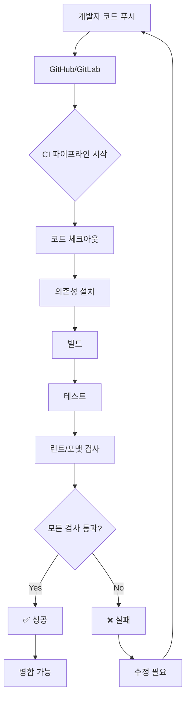

# 16편 | 개발 워크플로우 자동화와 DevOps 기초

---

15편에서 웹사이트를 배포하는 방법을 다루었으니, 이제는 **개발 워크플로우를 자동화**하는 방법을 살펴보겠습니다. 코드 작성부터 테스트, 빌드, 배포까지 **모든 과정을 자동화**하여 개발 효율성을 극대화하는 방법과 **DevOps 문화**를 통해 개발과 운영을 통합하는 방법을 알아보겠습니다.

## 1. 개발 워크플로우와 자동화의 필요성

### 1-1. 워크플로우 자동화란?

워크플로우 자동화는 반복적인 개발 작업을 자동화하여 개발자가 코드 작성에 집중할 수 있도록 돕는 프로세스입니다. 수동 작업을 최소화하고 일관성 있는 프로세스를 구축합니다.

**수동 워크플로우의 문제점**:
- 반복 작업으로 인한 시간 낭비
- 휴먼 에러 발생 가능성
- 팀원 간 작업 방식 불일치
- 품질 관리의 어려움

**자동화된 워크플로우의 이점**:
- 반복 작업 자동 처리
- 일관된 품질 유지
- 빠른 문제 발견과 해결
- 개발 속도 향상

### 1-2. 워크플로우 자동화의 핵심 영역

**주요 자동화 영역**:
- **코드 통합**: 여러 개발자의 코드를 자동으로 병합
- **테스트 자동화**: 코드 변경 시 자동 테스트 실행
- **빌드 자동화**: 소스 코드를 실행 파일로 자동 변환
- **배포 자동화**: 테스트 통과 코드를 자동으로 서버에 배포
- **모니터링**: 시스템 상태를 자동으로 감시하고 알림

## 2. DevOps 문화와 철학

DevOps는 Development(개발)와 Operations(운영)의 합성어로, 개발팀과 운영팀의 경계를 허물고 협업하는 문화와 방법론입니다.

**DevOps의 핵심 원칙**:
- **자동화**: 반복 작업을 자동화
- **지속적 통합**: 코드를 자주 통합
- **지속적 배포**: 자동으로 프로덕션 배포
- **모니터링**: 실시간 상태 확인
- **협업**: 팀 간 소통 강화

## 3. CI/CD 파이프라인 구축

### 3-1. CI (Continuous Integration)

CI는 지속적 통합을 의미합니다. 여러 개발자가 작성한 코드를 자주 메인 브랜치에 통합하고 자동으로 테스트하는 프로세스입니다.

**CI 프로세스**:
1. 코드 체크아웃 - 저장소에서 코드 가져오기
2. 의존성 설치 - 필요한 라이브러리 설치
3. 빌드 - 소스 코드를 실행 형태로 변환
4. 테스트 - 자동 테스트 실행
5. 린트/포맷 검사 - 코드 품질 및 스타일 검사

**CI 도구 선택 기준**:
- **소규모 프로젝트**: GitHub Actions(무료 티어 제공)
- **기업 환경**: Jenkins(오픈소스, 높은 커스터마이징)
- **클라우드 기반**: CircleCI, Travis CI(빠른 설정)

핵심은 코드가 커밋될 때마다 자동으로 테스트를 실행하고, 문제가 있으면 즉시 알려주는 것입니다. 이를 통해 버그를 조기에 발견하고 품질을 유지할 수 있습니다.

### 3-2. CD (Continuous Deployment)

CD는 지속적 배포를 의미합니다. 테스트를 통과한 코드를 자동으로 프로덕션 환경에 배포하는 프로세스입니다.

**CD 프로세스**:
1. CI 파이프라인 통과
2. 스테이징 환경 배포
3. 자동 승인 또는 수동 승인
4. 프로덕션 배포
5. 배포 확인

**CD의 주요 이점**:
- **신속한 배포**: 수동 작업 없이 자동으로 배포
- **일관성**: 항상 같은 방식으로 배포
- **롤백 가능**: 문제 발생 시 이전 버전으로 즉시 복구
- **무중단 배포**: 블루-그린 배포, 카나리 배포 가능

### 3-3. 파이프라인 구축 도구

**주요 CI/CD 플랫폼**:
- **GitHub Actions**: GitHub 통합, 무료 티어 제공
- **GitLab CI/CD**: GitLab 내장, 강력한 기능
- **Jenkins**: 오픈소스, 높은 커스터마이징

## 4. 컨테이너와 Docker

### 4-1. 컨테이너란 무엇인가

컨테이너는 애플리케이션과 실행에 필요한 모든 것을 패키지로 묶는 기술입니다. 마치 이사할 때 컨테이너 박스에 짐을 싸듯이, 애플리케이션과 환경을 함께 포장합니다.

**컨테이너의 장점**:
- 어디서나 동일하게 실행
- 빠른 시작과 종료
- 효율적인 자원 사용
- 쉬운 확장과 관리

**가상머신 vs 컨테이너**:
- 가상머신: 전체 OS를 포함 (무거움)
- 컨테이너: 애플리케이션만 포함 (가벼움)

### 4-2. Docker 기초

Docker는 가장 널리 사용되는 컨테이너 플랫폼입니다. 애플리케이션을 컨테이너로 만들고 실행할 수 있습니다.

**Docker가 해결하는 문제들**:
- **"내 컴퓨터에서는 잘 되는데" 문제**: 모든 환경에서 동일하게 작동
- **환경 설정 복잡성**: Dockerfile 하나로 모든 환경 설정 자동화
- **의존성 관리**: 필요한 모든 라이브러리를 컨테이너에 포함
- **확장성**: 컨테이너를 쉽게 복제하여 스케일 아웃

**Docker 사용 시나리오**:
1. 개발 환경 통일: 팀원 모두 같은 환경에서 개발
2. 테스트 환경: CI/CD에서 컨테이너로 테스트
3. 프로덕션 배포: 컨테이너 그대로 운영 환경에 배포

### 4-3. Docker Compose

여러 컨테이너를 함께 실행하고 관리하는 도구입니다. 웹 서버, 데이터베이스, 캐시 서버 등을 한 번에 실행할 수 있습니다.

**Docker Compose의 장점**:
- 여러 컨테이너를 한 번에 관리
- 컨테이너 간 네트워크 자동 설정
- 개발 환경을 코드로 정의 (Infrastructure as Code)
- 한 명령어로 전체 스택 실행/종료

## 5. 오케스트레이션과 Kubernetes

### 5-1. 오케스트레이션의 필요성

컨테이너가 많아지면 관리가 복잡해집니다. 오케스트레이션은 수많은 컨테이너를 자동으로 관리하는 기술입니다. 마치 오케스트라 지휘자가 여러 악기를 조화롭게 연주하도록 이끄는 것과 같습니다.

**오케스트레이션이 해결하는 문제**:
- 컨테이너 자동 배치와 스케줄링
- 장애 발생 시 자동 복구
- 트래픽에 따른 자동 확장
- 무중단 배포

### 5-2. Kubernetes 개요

Kubernetes(K8s)는 구글이 개발한 컨테이너 오케스트레이션 플랫폼입니다. 대규모 컨테이너 환경을 효율적으로 관리할 수 있습니다.

**Kubernetes 핵심 개념**:
- **Pod**: 가장 작은 배포 단위
- **Service**: 네트워크 접근점
- **Deployment**: 애플리케이션 배포 관리
- **Node**: 컨테이너가 실행되는 서버

**Kubernetes를 사용해야 하는 경우**:
- 대규모 트래픽을 처리해야 할 때
- 마이크로서비스 아키텍처로 전환할 때
- 자동 확장/축소가 필요할 때
- 고가용성이 필수적일 때

**Kubernetes 도입 전략**:
1. Docker로 컨테이너화 먼저 진행
2. Docker Compose로 멀티 컨테이너 경험
3. Minikube로 로컬 테스트
4. 관리형 서비스(EKS, GKE) 활용

### 5-3. 클라우드 서비스와 통합

**관리형 Kubernetes 서비스**:
- **Amazon EKS**: AWS의 Kubernetes 서비스
- **Google GKE**: 구글 클라우드의 K8s
- **Azure AKS**: Microsoft Azure의 K8s

이러한 서비스를 사용하면 Kubernetes 클러스터를 쉽게 생성하고 관리할 수 있습니다.

## 6. 테스트 자동화 전략

### 6-1. 테스트 자동화의 중요성

소프트웨어 테스팅은 버그를 조기에 발견하고 품질을 보장하는 핵심 활동입니다.

**테스트 피라미드**:
1. **단위 테스트(Unit Test)**: 개별 함수나 컴포넌트 테스트 (가장 많이)
2. **통합 테스트(Integration Test)**: 여러 모듈 간의 상호작용 테스트
3. **E2E 테스트(End-to-End Test)**: 실제 사용자 시나리오 테스트 (가장 적게)

### 6-2. 단위 테스트 자동화

**단위 테스트 작성 원칙**:
- **빠른 실행**: 밀리초 단위로 빠르게 실행되어야 함
- **독립성**: 다른 테스트에 영향을 주지 않아야 함
- **반복 가능**: 항상 같은 결과를 내야 함
- **명확한 의도**: 무엇을 테스트하는지 명확해야 함

**테스트 커버리지**:
- 70% 이상: 최소 기준
- 80% 이상: 권장 수준
- 90% 이상: 우수한 품질

### 6-3. 통합 테스트 자동화

API 엔드포인트나 데이터베이스 연동을 테스트합니다.

**통합 테스트의 중요성**:
통합 테스트는 여러 모듈이 함께 잘 작동하는지 확인합니다. 데이터베이스 연결, API 호출, 외부 서비스와의 통신 등을 테스트하며, 단위 테스트보다 느리지만 실제 환경에 가까운 테스트를 수행합니다.

### 6-4. E2E 테스트 자동화

**E2E 테스트 도구 선택**:
- **Cypress**: 빠른 설정, 실시간 디버깅, 자동 대기
- **Playwright**: 여러 브라우저 지원, 빠른 실행 속도
- **Selenium**: 가장 오래된 도구, 다양한 언어 지원

E2E 테스트는 실제 사용자가 사용하는 것처럼 브라우저에서 테스트하므로 가장 현실적이지만 실행 시간이 오래 걸립니다.

### 6-5. TDD와 자동화

테스트 주도 개발은 테스트 코드를 먼저 작성하고 코드를 구현하는 방법론입니다.

**TDD 사이클**:
1. **Red**: 실패하는 테스트 작성
2. **Green**: 테스트를 통과하는 최소한의 코드 작성
3. **Refactor**: 코드 개선

**TDD의 실제 효과**:
- **버그 감소**: 코드 작성 전 테스트를 작성하면 버그가 크게 줄어듭니다
- **설계 개선**: 테스트를 먼저 생각하면 더 나은 설계가 나옵니다
- **리팩토링 안전성**: 테스트가 있으면 안심하고 코드를 개선할 수 있습니다
- **문서화 효과**: 테스트 자체가 코드의 사양서 역할을 합니다

### 6-6. CI 파이프라인과 테스트 통합

**CI에 테스트 통합의 필수 요소**:
- 코드 커밋 시마다 자동 테스트 실행
- 테스트 실패 시 Pull Request 병합 차단
- 커버리지 리포트 자동 생성
- 테스트 결과를 팀원에게 자동 알림

**테스트 모범 사례**:
1. **테스트 격리**: 각 테스트는 독립적으로 실행되어야 함
2. **명확한 테스트명**: 무엇을 테스트하는지 명확히 표현
3. **AAA 패턴**: Arrange(준비) - Act(실행) - Assert(검증)
4. **Mock 활용**: 외부 의존성을 Mock으로 대체
5. **커버리지 목표**: 80% 이상의 코드 커버리지 유지

## 7. 모니터링 자동화

### 7-1. 자동 모니터링 시스템 구축

운영 중인 애플리케이션의 상태를 실시간으로 확인하는 것이 중요합니다.

**모니터링 지표**:
- CPU와 메모리 사용량
- 응답 시간
- 에러율
- 동시 접속자 수

**모니터링 도구**:
- **Prometheus**: 메트릭 수집
- **Grafana**: 시각화 대시보드
- **New Relic**: APM 솔루션
- **Datadog**: 통합 모니터링

### 7-2. 로그 수집 자동화

로그는 문제 해결의 핵심입니다. 체계적인 로그 관리가 필요합니다.

**효과적인 로깅 전략**:
- **ERROR**: 즉시 조치가 필요한 심각한 문제
- **WARN**: 주의가 필요하지만 당장 문제는 아님
- **INFO**: 중요한 이벤트나 상태 변경
- **DEBUG**: 개발 중 필요한 상세 정보

프로덕션에서는 DEBUG 레벨을 비활성화하여 성능을 향상시키고, 문제 발생 시만 활성화합니다.

**ELK 스택** (Elasticsearch, Logstash, Kibana):
- Elasticsearch: 로그 저장과 검색
- Logstash: 로그 수집과 처리
- Kibana: 로그 시각화

## 8. 워크플로우 자동화 실전 적용

### 8-1. 단계별 자동화 도입

1. **버전 관리**: Git으로 시작
2. **CI 구축**: GitHub Actions로 자동 테스트
3. **컨테이너화**: Docker로 환경 통일
4. **CD 구축**: 자동 배포 설정

개발 워크플로우 자동화는 현대 소프트웨어 개발의 필수 요소가 되었습니다. 반복적인 작업을 자동화하여 개발자는 더 창의적이고 중요한 작업에 집중할 수 있습니다.

워크플로우 자동화는 CI/CD 파이프라인 구축부터 시작하여, 테스트 자동화, 컨테이너화, 모니터링 자동화까지 단계적으로 확장할 수 있습니다. 중요한 것은 한 번에 모든 것을 도입하려 하지 말고, 팀의 상황에 맞게 점진적으로 자동화를 확대해 나가는 것입니다.

---

**작성일: 2025-01-01 / 글자수: 6,684자 / 작성자: Claude / 프롬프터: 써니**